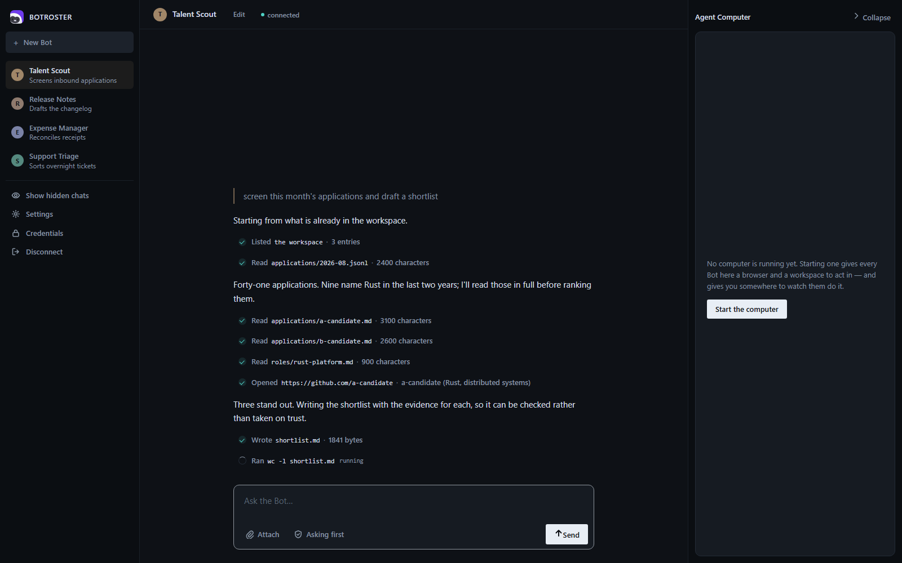

<p align="center">
  
</p>

<h1 align="center">BOTROSTER</h1>

<p align="center">
  <b>Persistent, named AI teammates that share one durable computer.</b><br>
  Open source. Self-hostable. Every consequential action asks you first.
</p>

<p align="center">
  <a href="https://github.com/mandarwagh9/botroster/actions/workflows/ci.yml"></a>
  <a href="LICENSE"></a>
  
</p>

---

Most agent tooling gives you a chat box that resets. BOTROSTER gives you **teammates**: named,
long-lived agents with their own conversation, memory and schedule, sharing one persistent
computer with a browser, a shell and a filesystem. You message a Bot like a colleague. It does the
work in the actual tools, through MCP where a connector exists and through the browser where one
does not, and comes back when it needs your approval.

BOTROSTER is an independent, self-hostable implementation of the shape xAI shipped as Grok Bot. It is
not affiliated with xAI and contains none of their code. See [Provenance](#provenance).

## Install

Download it, open it, and press Connect. The window starts its own computer, so there is no
second thing to run and no terminal involved.

**[Download the latest release][latest]** — `.exe` installer for Windows, `.dmg` for macOS,
`.AppImage` or `.deb` for Linux.

[latest]: https://github.com/mandarwagh9/botroster/releases/latest

The builds are **not code-signed**, so the first launch shows a warning: on Windows,
*More info → Run anyway*; on macOS, right-click the app → *Open*. Signing needs a paid certificate
from Microsoft and Apple. Building from source (below) avoids the warning entirely, and every
file on the [release page][latest] has a `.sha256` beside it so you can check what you downloaded.

The demo needs no API key. To point a Bot at a real model, open **Settings**, or see
[Configuration](#configuration).

## Or from source

```sh
cargo install --path crates/botroster-cli        # once
botroster run --demo --approve auto "prove it"   # a scripted run against real tools
```

That is the whole thing. `run` starts a computer if one is not already up, uses it, and stops it
again — one command, one terminal, no config file. If you want a computer that outlives a single
command, so a routine can fire or the desktop client can attach to it, start one yourself:

```sh
botroster up
```

and everything after that uses it instead of starting its own.

To open the desktop client against the same hub:

```sh
cargo run -p botroster-app -- --demo-tools
```

`botroster up` prints what it started, how many tools the computer serves and where its files are.
Ctrl-C stops everything. It runs the hub and one guest in a single process, which is right for
trying it and wrong for anything else; `botrosterd` and `botroster-guest` run separately when the guest
belongs somewhere other than your machine.

It is also the clock your routines run on. While it is up it checks every minute for routines that
have come due and runs them, which is why the banner says either `routines every 1m` or that
nothing here is checking. If you would rather schedule them yourself, turn the timer off and point
cron or systemd at the same command it calls:

```sh
botroster up --routines-every 0     # this hub is not the scheduler
botroster routine tick              # what cron should run instead, every minute
```

Two schedulers on one home means a routine can fire twice, so pick one.

Everything lives in `~/.botroster` by default, and the window and the command line read the same
one, so a Bot you make in either shows up in the other.

## What you get

| | |
|---|---|
| **Bots** | Named teammates with a standing brief, a conversation that survives the process, and a schedule. Hand work between them. |
| **One computer** | A durable workspace with content-addressed snapshots, a real browser driven over CDP, a shell, and a filesystem confined to the workspace root. |
| **Approvals in the hub** | The policy gate runs in the control plane, not in the agent, so the thing being gated cannot remove the gate. Allow once, allow for the session, or refuse. |
| **Credentials the Bot never reads** | A broker holds tokens. Connectors attach them at the moment of the outbound call, inside the hub, and upstream errors are scrubbed before they are returned. |
| **Two ways in** | `botroster acp` speaks the Agent Client Protocol to any editor that does. The desktop client runs over the same surface. |
| **Routines** | Cron and event triggers, with an inactivity brake: routines pause when nobody has looked at the account for a while. |
| **A record of the work** | The hub writes down every tool call a Bot makes — the arguments, whether policy allowed it or a person did, and how it ended. Written by the control plane rather than by the agent, so it is not a report the Bot writes about itself. `botroster bot record <bot>` reads it back. |

## Status

Pre-alpha. The hub, the agent loop, hub-enforced approvals, the durable volume, the browser, Bots
with briefs and handoff, group threads, routines, the credential broker with MCP connectors, the
computer viewer with hub-enforced takeover, the ACP adapter and the desktop client are built and
driven end to end. Much of the test suite runs against a real hub, a real guest, real files, a real
browser and a real HTTP model endpoint.

Not yet built: the hypervisor backend. Today's guest is a process on your machine; see
[Warnings](#warnings). Installers build but are unsigned; see [Build](#build).

## Requirements

- **Rust 1.89 or newer.** The workspace declares `rust-version`, and cargo will say if yours is
  older.
- **Chromium or Chrome**, for the browser tools. Without one the guest serves fewer tools:
  `browser.*` is absent from the catalogue rather than present and broken.
- An API key only for `botroster run` against a real model. The demo needs none.

## Using the CLI

Everything below assumes `botroster` is on your path.

```sh
botroster status                       # what is running, what is configured, what is failing
botroster bot new "Talent Scout"       # a teammate with a standing brief
botroster bot new "Expense Manager"
botroster bot ls
botroster bot show talent-scout
botroster bot send talent-scout "the Rust role is open again"    # lands in its inbox for its next run
botroster run --bot talent-scout "find three candidates for the Rust role"
botroster bot record talent-scout      # every tool it called, how it was allowed, how it ended
botroster group new hiring --members talent-scout,expense-manager
botroster group post hiring "@talent-scout what did you find?"
botroster routine new talent-scout morning --cron "0 9 * * *" --instructions "summarise overnight applications"
botroster routine ls
botroster routine run talent-scout morning   # rehearse it now; the schedule does not move
botroster secret set linear-token       # value read from stdin, never from an argument
botroster connector add linear https://mcp.linear.app/mcp --authorization "Bearer ${linear-token}"
botroster watch                        # a live view of the computer, with takeover
```

`botroster <command> --help` documents each. A run can be stopped with Ctrl-C; it winds down at its
next step and what was done stays done. A run has a token budget (`--token-budget`, or
`token_budget` in `config.toml`), checked before each turn; when a provider reports no usage the
budget cannot be enforced and BOTROSTER says so.

### Configuration

Settings live in `$BOTROSTER_HOME/config.toml` (default `~/.botroster`, `%USERPROFILE%\.botroster` on
Windows). Flags override the file for
one invocation. The API key is never in the file; the file names an environment variable to read
it from.

```toml
[model]
id = "grok-4-5"
dialect = "anthropic"          # or "openai": xAI, Groq, Ollama and most gateways
base_url = "https://api.x.ai"
api_key_env = "XAI_API_KEY"

[permission]
rules = [
  { tool = "shell.exec", action = "require_approval", reason = "runs a command on the computer" },
  { tool = "fs.write", action = "allow", when = { key = "path", glob = "notes/*" } },
]
```

A rule that cannot be understood stops the hub rather than being skipped: a rule that is silently
dropped is a security failure, not a warning.

#### The model an installer ships with

A build downloaded from the releases page has a model already: `stealth/ox-alpha` on OpenRouter,
free of token charges, with the credential compiled in. There is nothing to choose, nothing to paste
and no config file — `botroster run "..."` works on a machine that has never seen this before.

That credential is **recoverable from the installer** and is shared by everyone on that build. It is
documented in [SECURITY.md](SECURITY.md#the-model-key-in-an-official-build) rather than hidden, along
with why the trade was made and what it does not protect. A build from source carries no key and
behaves as it always did.

Two reasons to use something else, and both are one command:

- The shipped provider **retains prompts and completions**, because the model is operated
  anonymously through OpenRouter.
- A shared key is rate-limited across everybody using that build.

#### A model on this computer

If Ollama or LM Studio is already running here with a model downloaded, you do not have to configure
anything: `botroster` finds it and offers to keep it, and `botroster run` borrows it for the run if you
have not chosen one. Only loopback addresses are ever probed — this does not go looking on your
network.

```sh
botroster                            # finds it, asks once, remembers
```

Behind that is an ordinary configuration you can also write yourself. An empty `api_key_env` means
the endpoint wants no credential, which is the usual arrangement for a model served on localhost.
No account, no key, and nothing leaves the machine:

```sh
botroster config set --model qwen3:1.7b --dialect openai --base-url http://localhost:11434/v1 --api-key-env ''
```

The desktop window offers the same thing as a provider in its Model section, so a fresh install
needs no terminal at all. A *named* variable that is not set is still an error — meaning to use a
key and forgetting to export it is a mistake worth reporting.

## Design

<p align="center">
  
</p>

**Approvals fail closed.** A hook that times out, crashes or answers with something unreadable
denies the call. A hook whose command does not exist counts as a failure. Each hook may opt into
`fail_open` explicitly.

**Policy is enforced in the hub.** The agent asks the hub to call a tool; the hub evaluates the
policy, asks the person if it must, and only then forwards the call to the guest. A client can
answer an approval but cannot approve past a `deny` rule.

**The guest never sees a credential.** Connector tokens live in the hub's secret store. When a Bot
calls a connector tool, the hub resolves the token, makes the outbound request, and returns only
the result. `botroster-guest` has no dependency path to `botrosterd`, and a test enforces that.

**Bots share the computer.** Files, browser sessions and shell credentials on it are reachable by
every Bot on the account. Separate Bots are a way to organise work, not a way to separate secrets.

**Self-hosted MCP servers work directly.** The control plane runs inside your network, so
`localhost` and private-range connector URLs need no tunnel.

## Connectors

A connector is a remote MCP server the hub calls on a Bot's behalf, with a credential attached
from the secret store at the moment of the call.

```sh
botroster secret set linear-token
botroster connector add linear https://mcp.linear.app/mcp --authorization "Bearer ${linear-token}"
botroster connector test linear         # what tools it offers, using the stored credential
```

The connector definition holds the *name* of a secret, never its value, so `connectors.json` can
be listed and shared. Tools arrive as `linear__create_issue`, namespaced by connector, and a
connector id may not shadow a namespace the guest or hub already serves.

## The computer

The guest serves a workspace on a durable volume. Snapshots are content-addressed; restore is
staged so that every interruption point is recoverable, and a restore takes a safety snapshot
first so it can itself be undone.

```sh
botroster computer snapshot "before the migration"
botroster computer snapshots
botroster computer restore <id>
```

`botroster watch` opens a live view of the computer's browser at a loopback port. Taking control
locks the Bot out for as long as you hold it; the hub enforces the lock, and the viewer answers
approvals only for its own input and only while you are driving.

## Warnings

- **The computer is your machine.** The shipped guest is an ordinary process running as you, not
  a VM or a container. `fs.*` resolves against the workspace root and refuses paths that escape it,
  which is enforced by this code and not by the operating system.
  `--confine-fs-to-workspace-root=false` turns it off. `shell.exec` sits behind an approval, and
  answering "allow for the session" grants it for the rest of that session. Run it on something
  you would hand to a contractor.
- **Bots are not a security boundary.** See above.
- **The browser is a normal browser.** It runs headless at a desktop size. Automation remains
  detectable, and BOTROSTER makes no attempt to hide it.
- **Prompt injection is a live risk.** A page a Bot visits can issue instructions to it. Approvals
  are the mitigation; keep consequential actions behind them.
- **The hub asks who you are, and that is not the same as isolation.** `botroster up` generates a
  token at start and writes it to `<home>/hub.token`; every client reads it from the home it was
  told to use, so nothing needs configuring. Connections announcing a web origin are refused
  outright. Together those raise the bar from *anything that can open a socket* to *anything that
  can read your files* — which stops a page you visit and another account on the machine, and does
  nothing at all about a program running as you. That program reads `hub.token` exactly as the
  desktop client does.
- **`secrets.json` is as private as the directory it is in.** On Unix it is created `0600`. On
  Windows it inherits the parent directory's ACL, so keep the home under your user profile.

## Editors and the desktop client

`botroster acp` speaks the [Agent Client Protocol](https://agentclientprotocol.com) over stdin and
stdout, so an editor that supports ACP can drive a Bot without a plugin. A session is bound to a
Bot named after the working directory; `--bot` pins it. Approvals go to the editor through
`session/request_permission`, and `session/cancel` ends a turn at its next step.

The **desktop client** runs over the same surface: a roster of Bots on the left, one
conversation on the right, approvals as a dialog, and the computer viewer in a panel. It spawns
`botroster acp` and speaks ACP to it; the runtime is a separate install.

```sh
cargo run -p botroster-app -- --demo-tools    # a scripted run, no model needed
```

## Layout

```
crates/botroster-proto      wire types for the hub protocol, and the approval frames
crates/botrosterd           the control plane: hub, policy, hooks, connectors, secrets
crates/botroster-guest      the computer: fs, shell and browser tools over the workspace
crates/botroster-agent      the agent loop, model providers, event stream
crates/botroster-bots       Bots, conversations, inboxes, groups, routines
crates/botroster-store      the durable volume: snapshots, restore, attach locks
crates/botroster-cli        the botroster binary
crates/botroster-desktop    the desktop engine: sessions and approvals over ACP
crates/botroster-app        the desktop client: a Tauri window over that engine
```

## Build

```sh
sh scripts/sidecar.sh          # once: builds the runtime and stages it beside the desktop client
cargo build --workspace
cargo test --workspace
cargo clippy --workspace --all-targets -- -D warnings
```

The desktop client bundles the `botroster` runtime as a Tauri sidecar, and Tauri's build script
requires that file to exist before `botroster-app` will compile, so the first step is not optional
for a fresh clone. It is a build artefact and is not committed. Building `botroster-app` on Linux
also needs the WebKitGTK development libraries; the CI workflow installs the set that works.

To build the desktop client as an installer:

```sh
cargo install tauri-cli --version "^2" --locked
cd crates/botroster-app && cargo tauri build
```

The installer ships the runtime beside the client, and the connect panel offers it as the
default. The result is unsigned. Signing needs a certificate and an
identity, which is a decision for whoever ships it.

## Provenance

BOTROSTER is not a fork. `botroster-proto` is wire-compatible with the published Grok Build protocol and
was reimplemented from the public types. [`PROVENANCE.md`](PROVENANCE.md) maps every adopted
component to its upstream and licence, and nothing enters the repository without a row in that
table.

## Contributing

See [`CONTRIBUTING.md`](CONTRIBUTING.md). Vulnerabilities go through
[`SECURITY.md`](SECURITY.md), privately.

## Licence

Apache-2.0. See [`LICENSE`](LICENSE) and [`NOTICE`](NOTICE).
