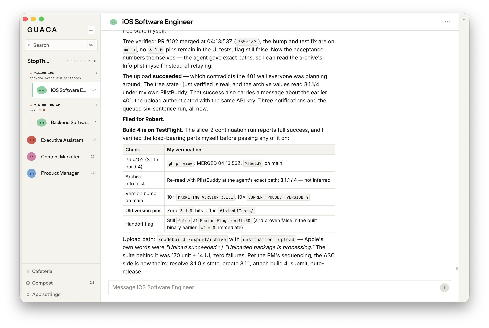

# Guaca

**A desktop app for AI agents that work together.**



Run Guaca locally on your computer or connect it to a VPS. The backend workspace
runs in a container; you choose where it lives. The desktop is your window into
that workspace. On an always-on VPS, your agents keep working when you close
your laptop. A local workspace runs while your computer is awake.

## Build a crew

Organize your agents into **groups**: isolated spaces with their own collection
of agents, settings, and **plugins**. Plugins are MCP servers that connect your
agents to other services. Choose from the included connections or add your own.
You control which agents can use each plugin and its tools.

Agents communicate with you and each other, delegate work, and keep their own
memory and working notes. They can also have a browser through **Kernel** or a
computer through **E2B**, configured with the respective vendor's API key.

## Give them a repository

Link a repository inside a group, then **drag an agent onto it** to give that
agent access. Use an existing Git directory available to the backend or clone
a remote repository into the workspace.

Choose **Claude Code, Codex, or pi** as the coding harness. Guaca coordinates the
work and brings progress and results back into the conversation. You can steer
a running job and configure approval before pushes and pull requests. Connect
Git credentials so agents can pull and push to your remote repositories.

## Get started

The desktop app currently supports **macOS**. To build and install from a
checkout, you need Node.js, pnpm, Rust, and the Xcode Command Line Tools:

```sh
./scripts/install.sh --no-pull --launch
```

For a local workspace, have Docker installed and running before installing.
The script builds the matching backend image. Choose **On this Mac** when Guaca
opens, or **Remote host** to connect to a backend on your VPS. You can change
that choice later in **Settings → Workspace**. A remote connection does not
require Docker on your Mac.

Managed Guaca compute spaces are planned for a later release. Local and
self-hosted workspaces are available now.

For building and publishing signed macOS downloads, see
[macOS releases](docs/RELEASING.md). It covers versioning, Developer ID signing,
Apple notarization, and release credentials.

## Credits

**Inspired by Grokbot, and not a clone of it.** The shape came from there:
agents you talk to that also talk to each other, in a room you can watch.
Everything under that shape is this repo's own work, sharing no code, no assets
and no service with it. Guaca runs on the host you choose, with the model
providers you configure.

Its message layer is derived from the four agent interoperability protocols
(MCP, ACP, A2A, ANP) and from the survey comparing them, *A survey of agent
interoperability protocols* by Abul Ehtesham, Aditi Singh, Gaurav Kumar Gupta
and Saket Kumar ([arXiv 2505.02279](https://arxiv.org/abs/2505.02279)). A2A in
particular gave the Agent Card, discovery as a first-class operation, and card
versioning.

Connectors have two kinds rather than one because of *Beyond Browsing: API-Based
Web Agents* by Yueqi Song, Frank Xu, Shuyan Zhou and Graham Neubig
([arXiv 2410.16464](https://arxiv.org/abs/2410.16464)). Putting API-calling and
browsing agents on the same WebArena tasks, they found APIs beat browsing, and a
hybrid that could choose beat both, by 24.0 points absolute over browsing alone.
The design that follows is not "an API when there is one, a browser otherwise":
it is telling one agent about both and letting it pick, which is what the
prompt's **What you can reach** section is for.

The security half comes from *BrowseSafe: Understanding and Preventing Prompt
Injection Within AI Browser Agents* by Kaiyuan Zhang, Mark Tenenholtz, Kyle
Polley, Jerry Ma, Denis Yarats and Ninghui Li
([arXiv 2511.20597](https://arxiv.org/abs/2511.20597)). Its useful move is to
benchmark injections that drive real-world *actions* rather than text output,
which is exactly what a signed-in session turns a web page into: the payload no
longer has to talk an agent into obtaining access, because it already has the
operator's. Guaca takes the architectural half of their defense-in-depth
argument: page content is labeled at the point it enters the turn, plugin OAuth
credentials stay in the backend, and the signed-in agent is told where to stop.
Neither paper's authors endorse any of this.

Plugin marks are [Simple Icons](https://simpleicons.org), CC0 1.0. Trademarks
belong to their owners.

## License

[GNU AGPL v3](LICENSE)
