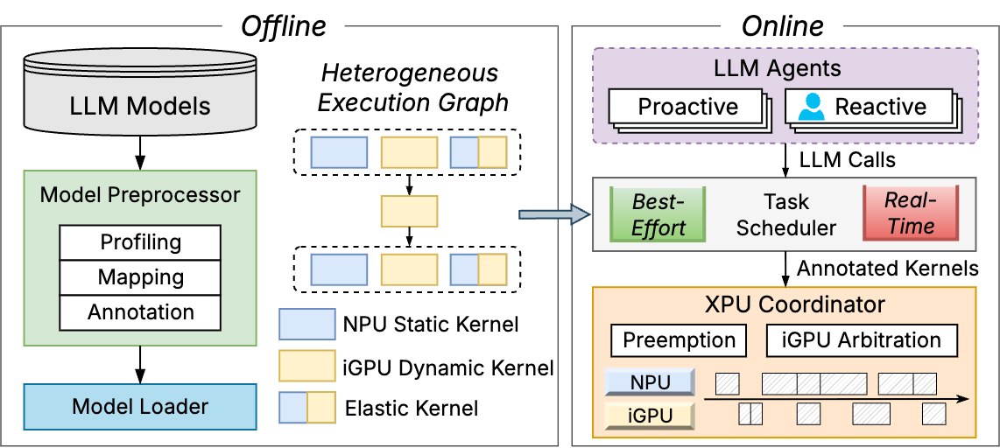

# LLM.xpu

LLM.xpu is an on-device LLM inference engine for Intel heterogeneous SoCs. Its core components are written in C++ for high performace on commodity processors. LLM.xpu focuses on practical local LLM serving features such as NPU/iGPU co-execution, concurrent request processing, batched decode, and priority-aware scheduling. The overview of the framework is shown below:



Here is our roadmap:

- Model supports:
  - [x] Llama2 7B models
  - [x] Llama3.1 8B models
  - [x] Llama3.2 1B/3B models
  - [ ] MoE models
- Inference mode:
  - [x] Text completion
  - [x] Concurrent and agentic LLM calls
- Precision:
  - [x] Full-precision (FP32) on CPU
  - [x] Half-precision (FP16) on NPU, GPU
  - [x] W8A16 RTN quantization
- Hardware supports:
  - [x] CPU with multi-threading (OpenMP) and SIMD (AVX, AVX2, AVX512)
  - [x] Intel NPU (OpenVINO)
  - [x] Intel iGPU (OpenVINO)
- Scheduling
  - [x] Continuous batching
  - [x] NPU-iGPU heterogeneous inference
  - [x] Preemption support

## Prerequisites
For C++ compilation, make sure the following dependencies are satisfied:
- General
  - CMake >= 3.14
  - gcc >= 13
  - Ninja (recommended)
- CPU
  - OpenMP

### Intel Core Ultra Platform
To enable Intel NPU/iGPU support, follow the steps:
- Recommended and tested platform: ASUS NUC 14 Pro+ mini-PC with Intel Core Ultra 5 125H, >= 32 GB DDR5, and Ubuntu 24.04.
- Check if your system has NPU available [here](https://www.intel.com/content/www/us/en/support/articles/000097597/processors.html).
- Install [OpenVINO Runtime](https://docs.openvino.ai/2025/index.html).
  - We recommend installing OpenVINO via extracting the platform-specific archive file for the complete C++ runtime and headers. Follow the archive installation guide for [Linux](https://docs.openvino.ai/2025/get-started/install-openvino/install-openvino-archive-linux.html) and [Windows](https://docs.openvino.ai/2025/get-started/install-openvino/install-openvino-archive-windows.html).
  - Configure the OpenVINO environment variables as instructed in installation guides. Modify `.bashrc` for ease on Linux.
- Install NPU and GPU drivers or plugins.
  - For Windows, these drivers are already bundled through Windows Update and you can skip the step. You should be able to find Intel(R) NPU Accelerator and graphics device in Windows Device Manager.
  - For Linux, please **strictly** follow the [NPU driver installation guide](https://docs.openvino.ai/2025/get-started/install-openvino/configurations/configurations-intel-npu.html) and the [Intel Graphics Compute Runtime Configuration](https://docs.openvino.ai/2025/get-started/install-openvino/configurations/configurations-intel-gpu.html). If the NPU/GPU is not accessible after these steps, check if the user is added to the `render` group.

## Build
The maintained C++ path targets Intel Core Ultra platforms with OpenVINO NPU/iGPU support.

```bash
cmake -S . -B release -DCMAKE_BUILD_TYPE=Release -DBUILD_INTEL=ON -G Ninja
cmake --build release
```

Entrypoint binaries generated from `csrc/entrypoint/run-*.cc` and experiment binaries generated from `csrc/experiments/exp-*.cc` are placed in `release/`.

## Prepare model
Before running the C++ Intel/OpenVINO path, convert a Hugging Face Llama model to the LLM.xpu `.model` format. The current OpenVINO backend expects a Llama 2 or Llama 3 W8A16 model with layer-wise quantization (`--group-size -2`). Instruct models are preferred for interactive inference and benchmark workloads.

```bash
python -m llmxpu.tools.export_model_from_hf \
  --dtype w8a16 \
  --group-size -2 \
  --out ./Llama-3.2-3B-Instruct-w8a16-g-2.model \
  meta-llama/Llama-3.2-3B-Instruct
```

Run `python -m llmxpu.tools.export_model_from_hf -h` to see complete usage.

## Run
`run-ov` is the main C++ entrypoint for single-request inference. It reads a prompt file containing one whitespace-separated line of token IDs and runs the model on `intel-hetero` (NPU+iGPU), `intel-gpu`, or `intel-npu`.

```bash
./release/run-ov \
  --model ./Llama-3.2-3B-Instruct-w8a16-g-2.model \
  --prompt input.prompt \
  --steps 256 \
  --device intel-hetero
```

For low-level experiments, the build also emits `run-single`, `run-batch`, `run-async`, and `run-priority`. These entrypoints submit synthetic token jobs directly to `ContextOV` and are useful for profiling scheduling, batching, and priority behavior.

## Run benchmark
The benchmark-style experiments are the `exp-*` binaries generated from `csrc/experiments`. They replay tokenized workloads from `AGENT_EXP_DIR` and print per-job timing statistics to stderr.

Expected workload layout:

```text
$AGENT_EXP_DIR/
  data/
    timing/
      <freq>_req_per_min.txt
    proactive/
      <benchmark_name>/
        _stats.txt
        0_tokens.txt
        1_tokens.txt
        ...
    mixed/
      proactive/
        _stats.txt
        0_tokens.txt
        ...
      reactive/
        _stats.txt
        0_tokens.txt
        ...
```

Each timing file contains one request arrival timestamp per line. Each `_stats.txt` line is parsed as `index prompt_len max_steps`, and each `*_tokens.txt` file contains one line of token IDs.

```bash
export AGENT_EXP_DIR=/path/to/agent-workloads

# Proposed NPU+iGPU scheduler for a proactive workload.
./release/exp-ours-proact ./Llama-3.2-3B-Instruct-w8a16-g-2.model <benchmark_name> <freq> <max_time_s>

# GPU-only baseline for the same proactive workload.
./release/exp-gpu-proact ./Llama-3.2-3B-Instruct-w8a16-g-2.model <benchmark_name> <freq> <max_time_s>

# Blocking single-device baseline; <device> is gpu or npu.
./release/exp-block-proact ./Llama-3.2-3B-Instruct-w8a16-g-2.model <benchmark_name> <device> <freq> <max_time_s>

# Mixed proactive/reactive workload.
./release/exp-ours-mixed ./Llama-3.2-3B-Instruct-w8a16-g-2.model <proact_freq> <react_freq> <max_time_s>
./release/exp-gpu-mixed ./Llama-3.2-3B-Instruct-w8a16-g-2.model <proact_freq> <react_freq> <max_time_s>
./release/exp-block-mixed ./Llama-3.2-3B-Instruct-w8a16-g-2.model <device> <proact_freq> <react_freq> <max_time_s>
```

For example, `<freq>` value `60` maps to `data/timing/60_req_per_min.txt`.

## Paper
If you use this project in research, please cite:

```bibtex
@article{agentxpu2025,
  title={Agent.xpu: Efficient scheduling of agentic llm workloads on heterogeneous soc},
  author={Wei, Xinming and Zhang, Jiahao and Li, Haoran and Chen, Jiayu and Guan, Haoning and Qu, Rui and Li, Maoliang and Chen, Xiang and Luo, Guojie},
  journal={arXiv preprint arXiv:2506.24045},
  year={2025}
}
```
