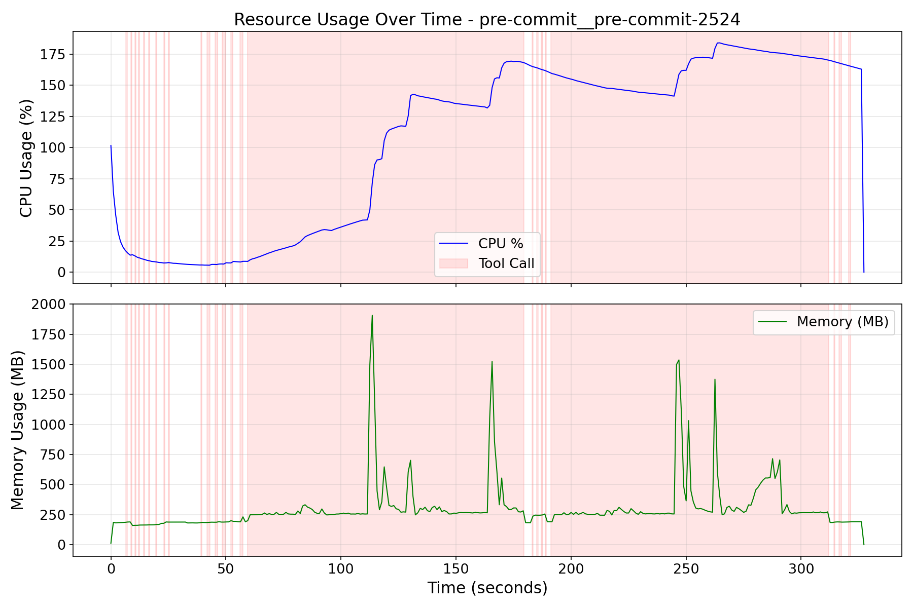
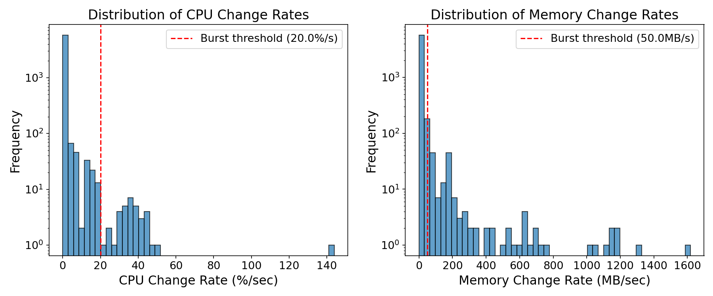
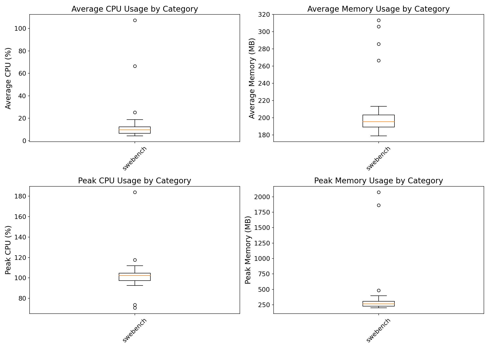
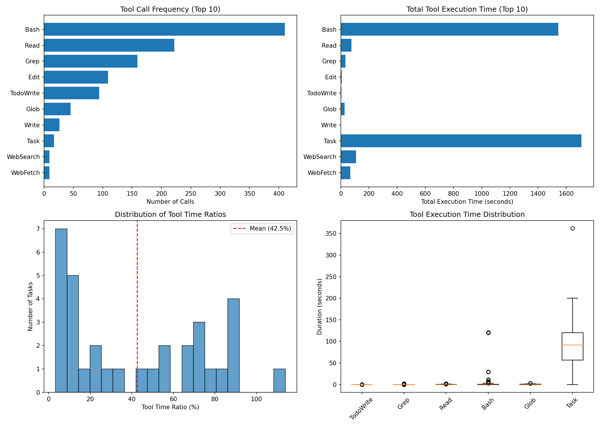
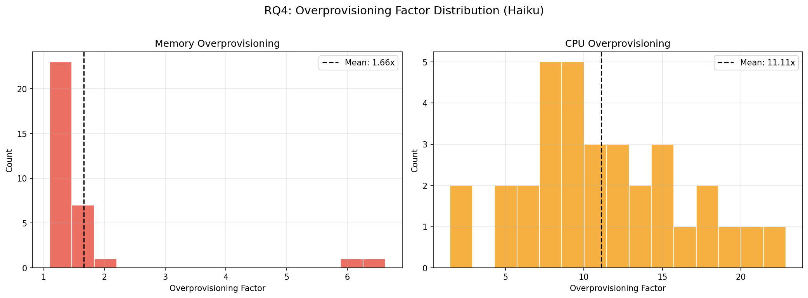

# AgentCgroup SWE-Bench Experiment Analysis Report (haiku)

Generated: 2026-07-22 01:18:48

Data source: `/home/yunwei37/workspace/agentcgroup/experiments/all_images_haiku`

Total tasks analyzed: 33

## Dataset Overview

| Metric | Value |
|--------|-------|
| Total tasks | 33 |
| Successful | 9 (27.3%) |
| Total execution time | 12322.0s (205.4 min) |

## RQ1: Resource Usage Dynamics (Time-scale Mismatch)

**Research Question**: How dynamic are resource changes during AI agent execution?

**Paper Claim**: User-space controllers react in 10-100ms, but resource changes happen at millisecond scale.

### Findings

- **Total burst events detected**: 231
- **Tasks with bursts**: 33 / 33

**CPU Change Rate Statistics (%/sec)**:
- Mean: 0.69
- Max: 143.88
- 95th percentile: 1.71

## RQ2: Resource Usage by Category (Domain Mismatch)

**Research Question**: Do different task categories have significantly different resource needs?

**Paper Claim**: Static resource limits cannot adapt to different workloads.

### Memory Usage by Category

| Category | N | Avg Memory (MB) | Peak Memory (MB) |
|----------|---|-----------------|------------------|
| swebench | 33 | 206.0 | 2076.0 |

## RQ3: Tool Call Patterns

**Research Question**: What is the relationship between tool calls and resource consumption?

### Top Tools by Execution Time

| Tool | Call Count | Total Time (s) | Avg Time (s) |
|------|------------|----------------|--------------|
| Bash | 273 | 1458.79 | 5.34 |
| Task | 17 | 313.94 | 18.47 |
| WebFetch | 2 | 16.20 | 8.10 |
| Read | 102 | 7.07 | 0.07 |
| Edit | 109 | 5.60 | 0.05 |
| TodoWrite | 94 | 3.46 | 0.04 |
| Grep | 64 | 2.98 | 0.05 |
| Write | 23 | 1.12 | 0.05 |
| Glob | 10 | 0.39 | 0.04 |
| BashOutput | 2 | 0.05 | 0.02 |

**Tool Time Ratio**: Mean 19.8%, Median 11.6%

## RQ4: Over-provisioning Analysis

**Research Question**: How much over-provisioning would static limits require?

### Over-provisioning Factors

| Metric | CPU Ratio | Memory Ratio |
|--------|-----------|--------------|
| Mean | 11.11x | 1.66x |
| Median | 10.26x | 1.37x |
| Max | 22.86x | 6.63x |
| 95th Percentile | 19.71x | 3.60x |

## Key Conclusions

1. **Time-scale Mismatch**: Resource usage exhibits significant burstiness that exceeds 
   the reaction time of typical user-space controllers.
2. **Domain Mismatch**: Different task categories show distinct resource profiles, 
   making static limits suboptimal.
3. **Over-provisioning Waste**: Static provisioning at peak levels wastes significant resources,
   as average usage is typically much lower than peak.