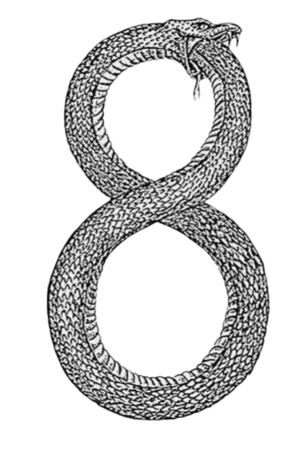

<p align="center">
  
</p>

<h1 align="center">Ouroboros</h1>

<p align="center"><b>Dynamic Weight Generation for Recursive Transformers via Input-Conditioned LoRA Modulation</b></p>

<p align="center">
  
</p>

Ouroboros attaches a compact Controller hypernetwork to a recursive transformer block. The Controller observes the current hidden state and generates a per-step diagonal modulation vector applied to frozen SVD-initialized LoRA bases. Each recurrence step performs a different transformation depending on the input, rather than repeating the same operation.

The system combines four techniques:

- **Gated recurrence** (bias-initialized to 88% retention) for stable deep iteration
- **SVD-initialized LoRA bases** derived from removed layer residuals
- **Per-step LayerNorm** giving each recurrence step unique normalization
- **CompactController** that generates input-conditioned diagonal modulation

## Architecture

```
Input Tokens
    |
[Prelude: 8 frozen layers]        Maps tokens to latent space
    |
[Recurrent Block: 1 layer x N]    Controller generates LoRA per step
    |--- Controller(hidden_state, step) --> diagonal modulation
    |--- SVD LoRA bases (frozen A, B from removed layers)
    |--- Gated recurrence: h = gate * h_new + (1-gate) * h_old
    |--- Per-step LayerNorm
    |
[Coda: 8 frozen layers]           Maps latent space to predictions
    |
LM Head
```

Applied to Qwen2.5-3B (36 layers), we retain 17 layers (8 prelude + 1 recurrent + 8 coda) and add 9.2M trainable parameters (0.6% of the model).

## Results

### Controller vs Static LoRA

The Controller generates modulation vectors from the hidden state. Static LoRA uses fixed learnable vectors per step. Both trained for 300K steps on FineWeb-edu with identical setups.

| Depth | Controller | Static LoRA | Controller wins by |
|-------|-----------|-------------|-------------------|
| 1     | **5.082** | 6.519       | **1.437**         |
| 4     | **5.075** | 5.246       | 0.171             |
| 8     | **5.080** | 5.119       | 0.039             |

The Controller outperforms static LoRA at every tested depth. The advantage is largest at depth 1, where static LoRA has only one learnable vector and cannot differentiate across steps.

### Hyperparameter Robustness

All 8 configurations converge to loss 5.073 to 5.082 (range 0.009), reducing the 17-layer baseline (8.975) by 43.4% and recovering 51.3% of the gap to the full 36-layer model (1.378).

### Gated Recurrence Is Essential

Without the gate, recursive layer application makes the model strictly worse (+0.20 over baseline). With the gate, the same setup improves by 3.49 points. The gate creates a gradient highway across recurrence steps by retaining 88% of the previous hidden state at initialization.

### Limitations

These gains are measured on the training distribution (FineWeb-edu). On held-out text, the Controller does not yet improve over the 17-layer baseline. We attribute this to frozen downstream (coda) layers that cannot adapt to the modified hidden-state distribution. Unfreezing the coda is the most promising fix and is listed as future work.

## Installation

```bash
git clone https://github.com/RightNow-AI/ouroboros.git
cd ouroboros
pip install -e .
```

Requirements: Python 3.10+, PyTorch 2.4+, transformers, einops, rich, pyyaml.

## Quick Start

### Load Ouroboros V2

```python
from ouroboros.ouroboros_v2 import OuroborosV2

model = OuroborosV2(
    n_prelude=8,
    n_coda=8,
    recurrent_layer_idx=18,
    lora_rank=32,
    lora_alpha=16.0,
)
model.load_base_model("Qwen/Qwen2.5-3B")
model = model.cuda()
model.set_phase(2)
```

### Load the Gated Refiner (intact model + SGRC)

```python
from ouroboros.gated_refiner import OuroborosGatedRefiner
from ouroboros.config import OuroborosConfig

config = OuroborosConfig.from_yaml("configs/ouroboros_qwen05.yaml")
refiner = OuroborosGatedRefiner(config, base_model_name="Qwen/Qwen2.5-0.5B")
refiner = refiner.cuda()
refiner.set_phase(2)
```

### Train

```bash
# Single GPU training with V2 on Qwen 3B
CUDA_VISIBLE_DEVICES=0 python scripts/train_v2.py \
    --steps 300000 \
    --lr 3e-4 \
    --depth 8 \
    --lora_rank 32
```

### Compare Controller vs Base Model

```python
# Forward with SGRC refinement
output = model(input_ids, labels=labels)

# Forward without SGRC (base model only)
baseline = model.forward_base_only(input_ids, labels=labels)

print(f"Base: {baseline['loss']:.3f}, +SGRC: {output['loss']:.3f}")
```

## Project Structure

```
ouroboros/
    __init__.py
    config.py              OuroborosConfig dataclass with presets
    ouroboros_v2.py         Prelude/Recurrent/Coda with Controller (561 lines)
    gated_refiner.py        SGRC on intact model (293 lines)
    controller.py           Full Controller hypernetwork (228 lines)
    dynamic_lora.py         Runtime LoRA injection (112 lines)
    core_block.py           Shared transformer block (270 lines)
    halter.py               Adaptive computation time (203 lines)
    model.py                Original OuroborosModel (363 lines)
    convert.py              Pretrained model conversion (275 lines)
    refiner.py              Earlier refiner variant (236 lines)
    utils.py                Utilities

training/
    train.py                DeepSpeed training loop
    train_v2.py             V2 single-GPU training
    data.py                 Streaming dataset pipeline
    distillation.py         Knowledge distillation
    rl_training.py          GRPO reinforcement learning

evaluation/
    evaluate.py             Perplexity and lm-eval benchmarks
    depth_analysis.py       Recursion depth visualization

tests/                      66 passing tests
configs/                    YAML and DeepSpeed configs
scripts/                    Training and benchmark scripts
```

## Key Components

### CompactController (`ouroboros_v2.py`)

Takes the mean-pooled hidden state and a step embedding, produces diagonal scaling vectors for 7 LoRA targets (Q, K, V, O, gate, up, down projections). Zero-initialized so the Controller starts as identity and gradually learns useful modulations.

```
delta_W_k = (alpha / rank) * B_k @ diag(f_theta(h_bar, step)) @ A_k
```

where A_k and B_k are frozen SVD bases and f_theta is the Controller.

### RecurrenceGate (`ouroboros_v2.py`)

```
g = sigmoid(W_g @ [h_new; h_old] + b_g)
h = g * h_new + (1 - g) * h_old
```

With W_g zero-initialized and b_g = -2.0, the gate retains 88% of the previous state at initialization, creating a gradient highway across recurrence steps.

### SVDLoRALinear (`ouroboros_v2.py`)

Wraps a frozen linear layer with SVD-initialized LoRA bases. The A and B matrices are computed from the average weight residual between removed layers and the recurrent layer, then frozen. Only the Controller-generated diagonal modulation is dynamic.

## Tests

```bash
pytest tests/ -v
```

66 tests covering all components: DynamicLoRALinear, CoreBlock, Controller, Halter, ACTManager, full model forward in all 3 phases, config serialization, and weight mapping.

## Hardware

Experiments ran on NVIDIA H100 80GB GPUs with CUDA 13.0 and PyTorch 2.11.0 in BF16 precision. The V2 model uses approximately 21 GB per GPU during training. Inference requires 4 GB.

## Citation

```bibtex
@article{jaber2026ouroboros,
    title={Ouroboros: Dynamic Weight Generation for Recursive Transformers
           via Input-Conditioned LoRA Modulation},
    author={Jaber, Jaber and Jaber, Osama},
    journal={arXiv preprint},
    year={2026}
}
```

## License

Apache 2.0
