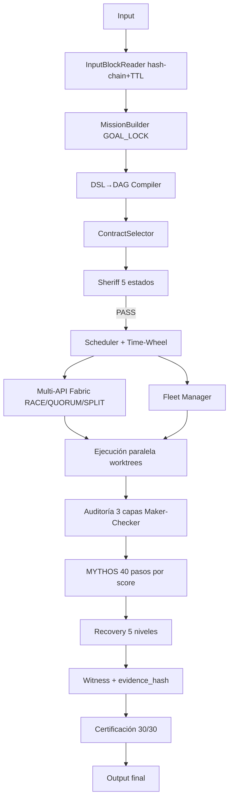

# Arquitectura completa del sistema Fables (MAXBRY TEAM / TEAM SEALS / YAIWES)
**Consolidado a partir de todos los documentos compartidos — EURS, MYTHOS, FABLES, SDPA, Ley Principal, Loops, YAIWES**

## 0. Principio rector (validado externamente)

Anthropic publicó en 2026 su propia arquitectura para agentes de larga duración, llamada **Managed Agents**, y separa dos cosas exactamente como lo hace Fables:

- **Sesión** = el log append-only de todo lo que pasó (equivale a `LISTA_GLOBAL` + `ledger` + `bitacora`)
- **Harness** = el bucle que llama al modelo y enruta sus llamadas a herramientas (equivale al `DeterministicLoopEngine` + `RuntimeBus`)

La razón de separarlos: *"los harnesses codifican suposiciones sobre lo que el modelo no puede hacer solo — y esas suposiciones se vuelven obsoletas según el modelo mejora."* Esto valida directamente la filosofía de Fables (90% código / 10% LLM) y da una razón añadida para mantenerlos desacoplados: **el harness cambiará con el tiempo, la sesión no debe perder datos cuando eso pase.**

Anthropic también documentó 2 fallos que hay que prevenir en el diseño de Fables:
- **"Context anxiety":** el modelo se apresura a terminar cuando siente que se acaba el contexto. Solución de Anthropic: reiniciar el contexto con un resumen estructurado, no dejar que el mismo hilo siga degradándose.
- **"Self-evaluation bias":** un modelo que revisa su propio trabajo casi siempre dice que está bien. Solución: el generador y el evaluador deben ser instancias distintas, con criterios de calificación concretos, nunca "¿es esto bueno?" en abstracto.

Ambos fallos aplican directamente a `CHEF_FINAL` y a `JUDGE` del diseño de Fables — deben ejecutarse en una instancia distinta a la que generó la solución, o el diseño hereda el sesgo de auto-evaluación documentado por Anthropic.

---

## 1. Capa 0 — Filosofía y regla madre

```
90% código determinista, 10% LLM máximo
Núcleo del kernel: 0% LLM
Mismo input → mismo output (reproducibilidad, Ley L15)
```

Componentes deterministas del núcleo (nunca tocan LLM): Scheduler, DSL, DAG, Sheriff, Memory, Workflow Engine, Capability/Plugin/Skill Compiler, Recovery, Trazabilidad.
Cápsulas LLM (aisladas, con 44 gates): Council/consenso, investigación compleja, generación inicial sin plantilla, resolver ambigüedad.

## 2. Capa 1 — Entrada y bloqueo de misión

```
InputBlockReader (hash chain + TTL)
   → MissionBuilder (GOAL_LOCK)
```

`InputBlockReader` es la respuesta al "input en cola mientras procesa" que pediste: cada entrada se encadena por hash (como un mini-blockchain local) con un TTL — permite que lleguen nuevos inputs mientras el sistema sigue trabajando, sin perder ni duplicar ninguno. `GOAL_LOCK` congela el objetivo apenas se acepta la misión, para que no derive a mitad de la ejecución.

## 3. Capa 2 — Compilación DSL → DAG → Contrato → Sheriff

```
DSL→DAG Compiler (autoensamblaje)
   → ContractSelector (Fingerprint→Threat→Rules→Graph→Reverse)
   → Sheriff (5 estados: GREEN/YELLOW/ORANGE/RED/BLACK, 22 checks)
```

El Sheriff nunca es una sugerencia — es una máquina de estados de 5 valores. `ORANGE` exige 3 aprobaciones "shadow" independientes antes de pasar. `BLACK` solo puede desbloquearlo el Director humano. Nada llega al Scheduler sin pasar por aquí.

## 4. Capa 3 — Kernel de ejecución (0% LLM)

```
Scheduler (sharding + Time-Wheel)
   → Multi-API Fabric (SINGLE / RACE / QUORUM / SPLIT)
   → Fleet Manager (Aider, Cline, Codex, Mimo, Hermes)
   → Ejecución paralela (worktrees + sandbox pool)
```

- **Time-Wheel:** la estructura de datos real detrás de tu "loop tipo calendario que se activa cada tanto tiempo" — es el mismo algoritmo O(1) que usa el kernel de Linux y Kafka para manejar millones de temporizadores sin recorrerlos uno a uno.
- **Multi-API Fabric:** tu respuesta a "20-30-50 APIs en vez de una". Tres modos: `SINGLE` (una llamada), `RACE` (dispara varias, usa la primera que responde), `QUORUM` (necesita que varias coincidan antes de aceptar la respuesta), `SPLIT` (divide el input en partes y corre un prompt distinto por cada una, en paralelo).
- **Fleet Manager:** el pool de agentes externos completos (no capacidades sueltas) corriendo en paralelo, cada uno en su propio worktree aislado.

## 5. Capa 4 — Auditoría de 3 capas

```
Auditoría adversarial → Auditoría cruzada → Maker-Checker
```

Esta es la capa que previene el "self-evaluation bias" que documentó Anthropic: quien construye (`Maker`) nunca es quien aprueba (`Checker`).

## 6. Capa 5 — Motor de razonamiento MYTHOS (10% LLM, solo aquí)

```
40 pasos: 14 Deterministas / 16 Probabilísticos / 10 Híbridos
Escalado por score: LOW(9 pasos) → MEDIUM(16) → HIGH(25) → EXTREME(40)
BLOQUE_X (solo EXTREME): Critic → Counter-Critic → Failure Simulator → V1/V2/V3 → Judge
```

`LISTA_GLOBAL` es la memoria estructural que se crea en la Fase 0, se actualiza al final de cada fase, se arrastra siempre, y nunca se reinicia hasta cerrar el ciclo (reglas R1-R4, con verificación estricta de que `pasos(v_n) ⊆ pasos(v_n+1)`).

## 7. Capa 6 — Recuperación (5 niveles)

```
RETRY → ROLLBACK → CHECKPOINT → REPLAN → ESCALATE
```

`REPLANNER_LOOP` tiene un límite explícito: máximo 3 iteraciones. Si la confianza sigue por debajo de 70 tras esas 3, escala al Director — nunca reintenta infinito.

## 8. Capa 7 — Evidencia y certificación

```
Witness (L1-L4 + evidence_hash)
   → Certificación (30/30 checks)
```

Nada se considera "hecho" sin un `evidence_hash` — toda tarea genera evidencia o, según la Ley L11, no existió.

## 9. El "Loop" de nivel de sesión (inspirado en Claude Code / ReAct)

```
loops/claude_loop.py — ReAct de 9 fases
state.loops (nivel_0..10: estado, heartbeat)
sentinela/core.py — auto-mejora aislada
corazon/snapshot.py — snapshot cada N acciones
```

Esto es la capa que da "latido" (heartbeat) al sistema — permite que el kernel siga vivo entre inputs, tome snapshots periódicos, y detecte si algún nivel del loop se quedó colgado.

## 10. Memoria persistente (el sistema de "20 millones de parámetros de contexto")

Niveles reales identificados en tus documentos YAIWES:
```
LEVEL 1: reasoningBank, hierarchicalMemory, learningBridge, hybridSearch, tieredCache
LEVEL 2: memoryGraph, agentMemoryScope, vectorBackend, mutationGuard, gnnService
LEVEL 3: skills, explainableRecall, reflexion, attestationLog, batchOperations, memoryConsolidation
LEVEL 4: causalGraph, nightlyLearner, learningSystem, semanticRouter
LEVEL 5: graphTransformer, sonaTrajectory, contextSynthesizer, rvfOptimizer, mmrDiversityRanker, guardedVectorBackend
```

Esto no es un archivo de "20 millones de parámetros" en el sentido de pesos de un modelo — es un **presupuesto de contexto recuperable** (20M tokens equivalentes acumulados en memoria externa, no en la ventana activa del LLM), organizado en 5 niveles de sofisticación creciente, desde caché simple (Nivel 1) hasta un transformer de grafos sobre las relaciones entre recuerdos (Nivel 5).

## 11. Flujo completo de punta a punta



**Nota crítica de la auditoría forense (documento anterior):** este flujo está completo *en el papel*. La auditoría real encontró que la mayoría de los archivos que deberían conectar estas capas (`sentinel.py`, `council.py`, `supervisor.py`, `watchdog.py`, `capability_brain.py`...) existen solo como nombres importados, no como código. El diseño de arriba es correcto — lo que falta es escribirlo o fusionarlo desde las librerías de la siguiente lista.
