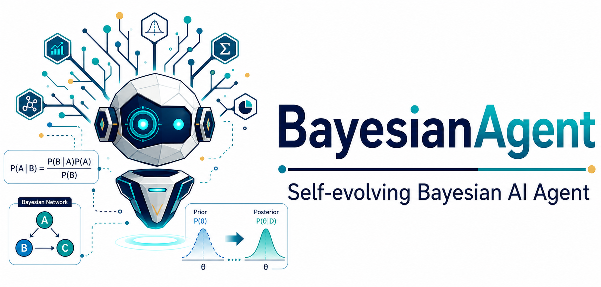
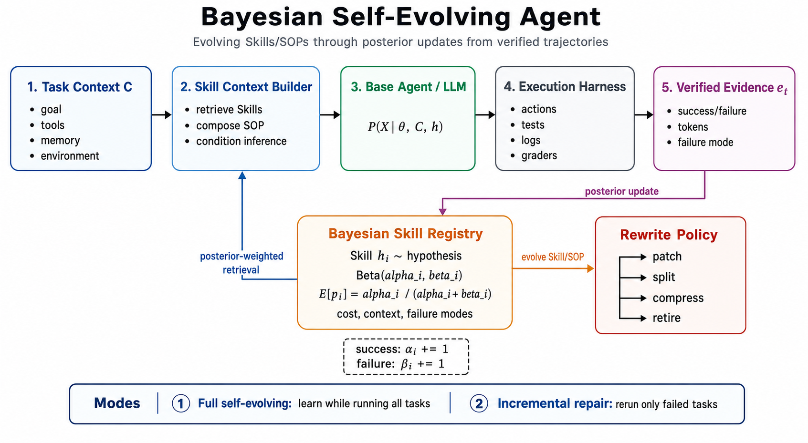
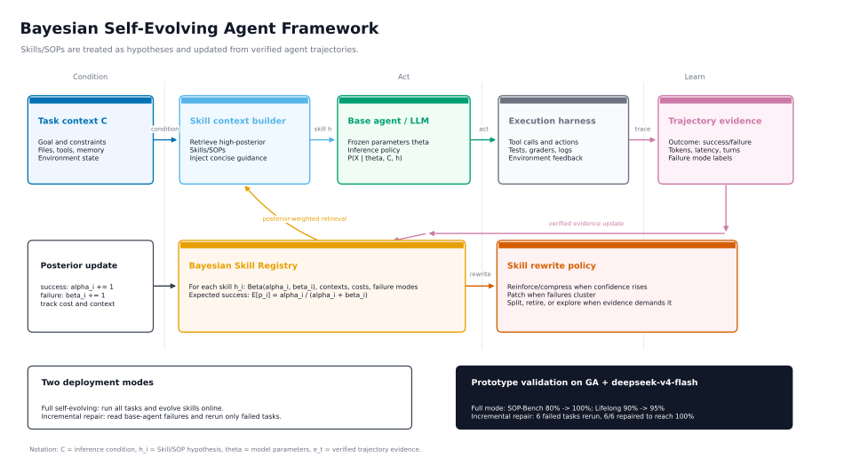

# Bayesian-Agent: A Bayesian Self-Evolving Agent Framework with Cross-Harness Adaptation

<div align="center">
  
</div>

<p align="center">
  🌐 <a href="README.md">English</a> | 🇨🇳 <a href="README_ZH.md">中文</a> |
  📚 <a href="https://dataarctech.github.io/Bayesian-Agent/">Docs</a> |
  🐙 <a href="https://github.com/DataArcTech/Bayesian-Agent">GitHub</a> |
  📄 <a href="http://arxiv.org/abs/2606.08348">arXiv:2606.08348</a>
</p>

Bayesian-Agent is a Bayesian self-evolving layer for turning verified agent trajectories into reusable, evidence-weighted Skills and SOPs across agent frameworks and execution harnesses.

It supports three usage patterns:

- **Run from scratch**: start with no prior traces and evolve Skills during full benchmark or production runs.
- **Repair incrementally**: attach to an existing agent, read its failed trajectories, and rerun only the tasks that need repair.
- **Run native or adapt across harnesses**: use the first-party Bayesian-Agent harness by default, or integrate with GenericAgent, mini-swe-agent, Claude Code, and other runtimes through a portable trajectory schema and adapter boundary.

> v0.5 adds a first-party native harness on top of the Bayesian Skill Evolution core. GenericAgent, mini-swe-agent, and Claude Code are compatibility backends; they are not copied, vendored, or forked.

## 📅 News

- **2026-06-09:** The Bayesian-Agent paper is now available on arXiv: [arXiv:2606.08348](http://arxiv.org/abs/2606.08348).
- **2026-06-05:** Added full-sample native-harness results for SOP-Bench, Lifelong AgentBench, and RealFin-Bench with `deepseek-v4-flash` and `deepseek-v4-pro`; see [Experimental Results](#-experimental-results).
- **2026-06-05:** Added the first-party Bayesian-Agent native harness. It runs its own LLM loop, workspace tools, optional three-layer memory, and trajectory capture; GenericAgent, mini-swe-agent, and Claude Code remain optional compatibility backends. See the [Native Harness design note](docs/native-harness.md).
- **2026-05-31:** Added the Bayesian Evidence Model as the default Skill belief backend, with a categorical likelihood implementation and a legacy Beta-Bernoulli backend for ablations.
- **2026-05-09:** Released Bayesian-Agent as a standalone cross-harness Bayesian Skill Evolution package with schemas, CLI utilities, and experiment artifacts.
- **2026-05-09:** Added the optional GenericAgent adapter boundary without copying or vendoring GenericAgent.
- **2026-05-09:** Published bilingual project documentation and the Bayesian-Agent framework diagram.

## 🌟 Overview

Prompt Engineering improves task instructions. Context Engineering controls what evidence the model sees at inference time. Harness Engineering puts the model inside an observable, executable, recoverable system with tools, files, tests, memory, logs, and failure recovery.

In this setting, **Skills** and **SOPs** become first-class engineering assets. A good Skill is compressed operational knowledge:

- what to inspect first
- which tools to use
- how to verify progress
- which failure modes to avoid
- when to stop, retry, or rewrite the procedure

Bayesian-Agent treats Skills as hypotheses about how to solve tasks. Verified trajectories become evidence for updating, ranking, rewriting, compressing, or retiring those Skills. The same evolution layer can bootstrap Skills from scratch, repair existing agents incrementally, and move across harnesses that emit compatible trajectories.

<div align="center">
  
  <br/>
  <em>Bayesian-Agent turns verified trajectories from any compatible harness into evidence-ranked Skills and executable SOP patches.</em>
</div>

## 🧠 Core Idea

Most LLM engineering interventions fall into two MECE routes:

1. Change the model parameter distribution, such as pretraining, fine-tuning, and reinforcement learning.
2. Change the inference condition, such as prompts, context, RAG, tools, memory, and harnesses.

Bayesian-Agent focuses on the second route.

If a base model samples from:

```text
P(X | theta)
```

then an agent system samples from:

```text
P(X | theta, C)
```

where `C` is the inference environment. Skills, SOPs, tools, memory, retrieved evidence, execution traces, and verifier feedback are all part of `C`.

Bayesian-Agent treats each Skill or SOP as a hypothesis about success:

```text
P(success | theta, C, skill)
```

After each verified trajectory, the framework updates a posterior belief over that Skill. The posterior is used internally for Skill ranking, rewrite decisions, and failure-mode patches; model-facing benchmark prompts receive executable Skill/SOP text instead of raw probability summaries.

### Why Bayesian Instead of Plain Frequency Counting

The surface behavior of Bayesian-Agent may look like failure-driven Skill repair: inspect a trajectory, find what went wrong, and patch the Skill. The Bayesian advantage is that the framework does not only store the patch. It also maintains a posterior belief about when the Skill should be trusted.

Agent runs are expensive: tokens are expensive, latency is high, benchmark cases are limited, and real production failures are even rarer. When samples are scarce, each sample is costly, and we cannot wait for large-sample statistics to stabilize, Bayesian modeling lets Bayesian-Agent combine prior belief, uncertainty, and new verified evidence into more stable decisions.

Bayesian-Agent is most useful for sample-scarce, cost-sensitive, online Skill/SOP evolution. Read the full explanation in [Why Bayesian for Skill Evolution](docs/articles/why-bayesian-for-skill-evolution.md).

### What "Bayesian" Means in v0.5

Current Bayesian-Agent v0.5 defaults to a **Bayesian Evidence Model** for each Skill/SOP. The default implementation is a feature-conditioned categorical likelihood model: it estimates whether a Skill will succeed under observed evidence features such as task context, failure mode, token bucket, turn bucket, latency bucket, and selected metadata.

For a Skill hypothesis `h_k`, evidence `D_k = {(x_i, y_i)}` contains discrete features `x_i` and verified labels `y_i in {success, failure}`:

```text
P(y | h_k) = (N_y + alpha) / (N + alpha * |Y|)
P(x_j = v | y, h_k) = (N_{j,v,y} + alpha) / (N_{j,y} + alpha * |V_j|)
P(y = success | h_k, x) ∝ P(y = success | h_k) * Π_j P(x_j | y = success, h_k)
```

The implementation uses Laplace smoothing with `alpha = 1`. This is Bayesian in the posterior-belief sense: verified experience updates the probability of a Skill succeeding under a particular context and runtime signature. The default backend is exposed as `algorithm="categorical_bayes"`; `algorithm="naive_bayes"` remains accepted as a legacy alias for the same factorized categorical likelihood.

The current likelihood model uses **five fixed categorical evidence terms plus optional short metadata terms**:

| Evidence term | Why it is included |
|---|---|
| `context` | Captures task family, benchmark, or harness context. |
| `failure_mode` | Captures reusable error patterns that can become concrete Skill/SOP patches. |
| `token_bucket` | Captures whether a trajectory succeeded cheaply or only after expensive search. |
| `turn_bucket` | Captures recovery loops and interaction complexity. |
| `latency_bucket` | Captures slow tool, data, or API paths that may require different SOPs. |
| `metadata.*` | Adds harness-specific short scalar diagnostics without baking one harness schema into the core. |

`metadata.*` features are included only when the value is a short scalar (`str`, `int`, `float`, or `bool`, with string length at most 80). Runtime numbers are bucketed before entering the likelihood model so sparse exact values do not dominate early evidence.

For compatibility and ablation, the original **Beta-Bernoulli** posterior is still available via `algorithm="beta_bernoulli"` or `bayesian-agent evolve --algorithm beta_bernoulli`:

```text
p_k | D_k ~ Beta(alpha_0 + s_k, beta_0 + f_k)
E[p_k | D_k] = (alpha_0 + s_k) / (alpha_0 + beta_0 + s_k + f_k)
```

Both backends feed the same Skill ranking, posterior audit rendering, and rewrite actions such as `patch`, `split`, `compress`, `retire`, and `explore`. Full Bayesian model selection over competing Skill hypotheses is planned, but not claimed in v0.5.

## 📋 Core Features

- **Evidence-weighted Skill evolution**: update Skill beliefs from verified success and failure trajectories.
- **Bayesian Skill registry**: maintain Bayesian Evidence Model beliefs, optional Beta-Bernoulli posteriors, failure modes, token cost, latency, turns, and context distribution.
- **Failure-mode-aware repair**: identify recurring errors and generate focused repair plans.
- **Catalog-first Skill evolution by default**: use handwritten benchmark catalogs as high-precision failure taxonomies and patch rules when they are available.
- **Zero-shot automatic failure discovery (opt-in)**: with `--no-use-skill-catalog`, infer generic failure modes from verifier errors, scores, requested artifacts, and trajectory metadata.
- **Trajectory-to-Skill distillation**: in zero-shot mode, convert repeated discovered failure modes into executable patch rules without requiring a benchmark-specific catalog.
- **Overfitting-resistant patch activation**: keep single failures as audit evidence, and promote a failure-mode patch into the benchmark prompt only after at least two verified occurrences.
- **Token-aware context building**: select concise, evidence-backed Skill/SOP text; benchmark prompts receive executable patches and guardrails, while posterior numbers stay in artifacts.
- **First-party native harness**: run an OpenAI-compatible LLM loop, workspace tools, optional three-layer memory, and trajectory logging inside Bayesian-Agent itself. Native memory prompt/state updates are disabled by default and can be enabled with `--native-memory`.
- **Full self-evolution from scratch**: run all tasks, collect evidence online, and evolve Skills without prior traces.
- **Incremental repair for existing agents**: consume failed trajectories from a baseline agent and rerun only the failed tasks.
- **Cross-harness adaptation**: use BA native by default, or integrate with GenericAgent, mini-swe-agent, Claude Code, and other frameworks through adapters instead of vendoring their code.
- **Standard-library-first core**: the core package has no runtime dependency beyond Python.

## 🧬 Self-Evolution Mechanism

<div align="center">
  
  <br/>
  <em>Bayesian Skill Evolution framework.</em>
</div>

```text
[Agent Trajectory]
      |
      v
[Verifier / Benchmark Grader]
      |
      v
[TrajectoryEvidence: success, failure mode, tokens, turns, latency]
      |
      v
[Bayesian Skill Registry: posterior + cost + contexts]
      |
      v
[Rewrite Policy: compress, patch, split, retire, explore]
      |
      v
[Executable Skill Patches / Guardrails]
      |
      v
[Next Agent Run]
```

For each Skill or benchmark SOP, Bayesian-Agent maintains:

- a Bayesian Evidence Model over success and failure conditioned on evidence features
- an optional Beta-Bernoulli posterior over global success probability
- verified success and failure evidence
- failure mode counts
- input, output, and total token statistics
- latency and turn statistics
- context distribution
- rewrite policy recommendations

The default rewrite policy is intentionally small and matches the current implementation:

| Policy action | Current trigger | Why |
|---|---|---|
| `explore` | no observations, or posterior remains uncertain | Avoids rewriting before verified evidence exists. |
| `retire` | `beta >= 4` and `success_probability < 0.45` | Avoids retiring after one or two unlucky failures, but removes clearly harmful Skills. |
| `patch` | one `failure_mode` appears at least twice | Treats repeated failures as actionable evidence while avoiding one-off overfitting. |
| `split` | at least 3 contexts and at least 4 observations | Prevents one broad SOP from covering incompatible task contexts. |
| `compress` | at least 3 observations and `success_probability >= 0.72` | Distills stable Skills to reduce token cost after enough positive evidence. |

These thresholds are conservative v0.5 heuristics, not claims of optimality. The design goal is an inspectable posterior-driven policy that can be swapped out by downstream harnesses.

### Automatic Failure Discovery

Bayesian-Agent is catalog-first by default. The built-in benchmark catalogs remain the high-precision path for SOP-Bench, Lifelong AgentBench, and RealFin-Bench. To test a new benchmark without handwritten failure taxonomy, run with `--no-use-skill-catalog`; this switches the runner into zero-shot automatic failure discovery:

```text
verified trajectory
  -> verifier scores / errors / requested artifacts / output contract
  -> auto failure mode
  -> distilled repair rules
  -> active patch after repeated evidence
```

Examples include `auto_missing_requested_artifact`, `auto_output_contract_violation`, `auto_numeric_parse_error`, `auto_sql_execution_error`, and `auto_expected_output_mismatch`. In the default catalog mode, unknown benchmarks do not silently invent automatic labels. In zero-shot mode, one failure is recorded as audit evidence, and model-facing patch text is activated only after the same discovered failure mode appears at least twice.

### Catalog vs Zero-Shot Modes

Bayesian-Agent supports both modes:

| Mode | Flag | What it means | When to use |
|---|---|---|---|
| Catalog-first | `--use-skill-catalog` / `use_skill_catalog=True` | Use benchmark-specific failure taxonomy, guardrails, and patch catalogs as strong priors. | Best accuracy and efficiency when a catalog exists. |
| Zero-shot discovery | `--no-use-skill-catalog` / `use_skill_catalog=False` | Start without handwritten catalog skills; discover failure modes and distill patches from trajectories. | New benchmarks, new products, or domains where no failure taxonomy exists yet. |

In our `deepseek-v4-flash` native-harness experiments, BA is useful in both modes:

- **Without catalog skills**, BA still improves:
  - SOP-Bench incremental: 70% -> 100%
  - RealFin-Bench full/incremental: 38% -> 45%
- **With catalog skills**, BA performs better:
  - SOP-Bench: up to 100%
  - Lifelong AgentBench: up to 100%
  - RealFin-Bench: up to 72%

This gives a clean story: **Bayesian-Agent works even without a handcrafted Skill catalog, and catalog skills act as stronger priors that further improve reliability and efficiency.**

See the detailed comparison: [Zero-Shot vs Catalog Skill Evolution](docs/experiments/zero-shot-vs-catalog-skill-evolution.md).

## 🚀 Install

```bash
git clone https://github.com/DataArcTech/Bayesian-Agent.git
cd Bayesian-Agent
python -m pip install -e .
```

The package currently requires Python 3.9+ and has no runtime dependencies beyond the Python standard library.

## ⚡ Quick Start

Update a Bayesian Skill registry from existing agent results:

```bash
bayesian-agent evolve \
  --results artifacts/ga_deepseek_baseline/sop_results.json \
  --registry temp/bayesian_skill_beliefs.json \
  --context-out temp/skill_context.md
```

Find failed tasks for incremental repair:

```bash
bayesian-agent repair-plan \
  --baseline artifacts/ga_deepseek_baseline/sop_results.json \
  --out temp/failed_tasks.json
```

Summarize a run:

```bash
bayesian-agent summarize \
  --results artifacts/bayesian_incremental/results.json \
  --out temp/summary.json
```

Run a live benchmark with the first-party Bayesian-Agent harness. Use the same script for SOP-Bench, Lifelong AgentBench, and RealFin-Bench; switch benchmarks with `--bench core`, `--bench sop`, `--bench lifelong`, or `--bench realfin`. Use `--model` to switch between `deepseek-v4-flash` and `deepseek-v4-pro`:

```bash
cd Bayesian-Agent
export DEEPSEEK_API_KEY="sk-..."
export MODEL="deepseek-v4-flash"
python \
  experiments/run_benchmarks.py \
  --harness bayesian-agent \
  --model "$MODEL" \
  --mode all \
  --bench core
```

With `--bench core`, the runner fans out into separate benchmark roots instead of sharing one combined directory: `results/sop_${MODEL//-/_}` and `results/lifelong_${MODEL//-/_}`. If you pass `--out-root temp/core_${MODEL//-/_}`, it is treated as a parent directory and the runs go to `temp/core_${MODEL//-/_}/sop` and `temp/core_${MODEL//-/_}/lifelong`.

Use `--limit 1` for a smoke test before running the full benchmark. For RealFin-Bench, keep the same command shape and set `--bench realfin`; the default root becomes `results/realfin_${MODEL//-/_}`.

External compatibility backends remain available when you want to compare against another harness:

```bash
--harness genericagent
--harness mini-swe-agent
--harness claude-code
```

Run incremental repair against an existing GA baseline by passing its result files. The script reruns only failed tasks:

```bash
"$GENERICAGENT_ROOT/.venv/bin/python" \
  experiments/run_benchmarks.py \
  --harness genericagent \
  --genericagent-root "$GENERICAGENT_ROOT" \
  --model "$MODEL" \
  --mode bayesian-incremental \
  --bench core \
  --baseline-results artifacts/ga_deepseek_baseline/sop_results.json \
  --baseline-results artifacts/ga_deepseek_baseline/lifelong_results.json
```

## 🐍 Python API

```python
from bayesian_agent import BayesianSkillRegistry, SkillContextBuilder, TrajectoryEvidence

registry = BayesianSkillRegistry("temp/beliefs.json")
registry.record(
    TrajectoryEvidence(
        task_id="sop_12",
        skill_id="benchmark/sop_bench",
        context="sop_bench",
        outcome="failure",
        failure_mode="xml_wrapped_answer",
        input_tokens=70123,
        output_tokens=4242,
        total_tokens=74365,
    )
)

skill_context = SkillContextBuilder(registry).render(task_context="sop_bench")
print(skill_context)
```

`SkillContextBuilder` renders a compact posterior audit view. The built-in SOP/Lifelong runners convert recurring posterior-backed failure modes into executable patches and guardrails before adding them to model prompts.

## 📊 Experimental Results

Bayesian-Agent now has its own native harness. The results below are full-sample runs with no `--limit`: SOP-Bench and Lifelong AgentBench use 20 tasks each, and RealFin-Bench uses 40 tasks.

### 🧩 Native Harness Full-Sample Results

| Benchmark | Model | Mode | Score | Total Tokens | Evidence |
|---|---|---|---:|---:|---|
| SOP-Bench | deepseek-v4-flash | baseline | 19/20 (95.0%) | 1.05M | `results/native_harness_deepseek_v4_flash_full/sop` |
| SOP-Bench | deepseek-v4-flash | bayesian_full | 20/20 (100.0%) | 870k | `results/native_harness_deepseek_v4_flash_full/sop` |
| SOP-Bench | deepseek-v4-flash | bayesian_incremental | 20/20 final, 1/1 repaired | 45k incremental | `results/native_harness_deepseek_v4_flash_full/sop` |
| Lifelong AgentBench | deepseek-v4-flash | baseline | 19/20 (95.0%) | 538k | `results/native_harness_deepseek_v4_flash_full/lifelong` |
| Lifelong AgentBench | deepseek-v4-flash | bayesian_full | 20/20 (100.0%) | 514k | `results/native_harness_deepseek_v4_flash_full/lifelong` |
| Lifelong AgentBench | deepseek-v4-flash | bayesian_incremental | 20/20 final, 1/1 repaired | 65k incremental | `results/native_harness_deepseek_v4_flash_full/lifelong` |
| SOP-Bench | deepseek-v4-pro | baseline | 20/20 (100.0%) | 744k | `results/native_harness_deepseek_v4_pro_full/sop` |
| SOP-Bench | deepseek-v4-pro | bayesian_full | 20/20 (100.0%) | 739k | `results/native_harness_deepseek_v4_pro_full/sop` |
| Lifelong AgentBench | deepseek-v4-pro | baseline | 20/20 (100.0%) | 422k | `results/native_harness_deepseek_v4_pro_full/lifelong` |
| Lifelong AgentBench | deepseek-v4-pro | bayesian_full | 20/20 (100.0%) | 437k | `results/native_harness_deepseek_v4_pro_full/lifelong` |

### 📈 Native RealFin Full-Sample Results

| Model | Mode | Score | Total Tokens | Evidence |
|---|---|---:|---:|---|
| deepseek-v4-flash | baseline | 25/40 (62.5%) | 10.29M | `results/native_harness_deepseek_v4_flash_full/realfin` |
| deepseek-v4-flash | bayesian_full | 28/40 (70.0%) | 10.89M | `results/native_harness_deepseek_v4_flash_full/realfin` |
| deepseek-v4-flash | bayesian_incremental | 29/40 final, 4/15 repaired | 3.76M incremental | `results/native_harness_deepseek_v4_flash_full/realfin` |
| deepseek-v4-pro | baseline | 26/40 (65.0%) | 9.54M | `results/native_harness_deepseek_v4_pro_full/realfin_retry` |
| deepseek-v4-pro | bayesian_full | 28/40 (70.0%) | 9.91M | `results/native_harness_deepseek_v4_pro_full/realfin_retry` |
| deepseek-v4-pro | bayesian_incremental | 31/40 final, 5/14 repaired | 4.59M incremental | `results/native_harness_deepseek_v4_pro_full/realfin_retry` |

Compared with earlier GA-backed artifacts, BA native improves the full RealFin final score on `deepseek-v4-pro` from 68% to 77.5%. It spends more tokens because the first-party harness keeps the runtime minimal and lets the model inspect cached market data directly. On SOP/Lifelong, BA native reaches 95-100% full-sample accuracy with lower token use than the historical GA-backed full runs.

### 🧱 Published GA Validation: GenericAgent + deepseek-v4-flash

The earlier published validation used GenericAgent as the execution backend.

| Benchmark | Agent | Model | Accuracy | Input Tokens | Output Tokens | Total Tokens | Efficiency |
|---|---|---|---:|---:|---:|---:|---:|
| SOP-Bench | GA | deepseek-v4-flash | 80% | 1.34M | 57k | 1.39M | 11.47 |
| Lifelong AgentBench | GA | deepseek-v4-flash | 90% | 649k | 42k | 690k | 26.07 |

### 🌱 Full Self-Evolving Run

| Benchmark | Agent | Model | Accuracy | Input Tokens | Output Tokens | Total Tokens | Efficiency |
|---|---|---|---:|---:|---:|---:|---:|
| SOP-Bench | GA+Bayesian | deepseek-v4-flash | 100% | 1.07M | 52k | 1.12M | 17.86 |
| Lifelong AgentBench | GA+Bayesian | deepseek-v4-flash | 95% | 666k | 44k | 710k | 26.77 |

In full mode, Bayesian-Agent improved SOP-Bench from 80% to 100% while reducing token usage from 1.39M to 1.12M. Lifelong AgentBench improved from 90% to 95% with similar token cost.

### 🛠️ Incremental Repair Run

In incremental mode, Bayesian-Agent only reran failed GenericAgent tasks:

- SOP-Bench: 4 failed tasks, all repaired
- Lifelong AgentBench: 2 failed tasks, all repaired

| Benchmark | Agent | Model | Final Accuracy | Incremental Input | Incremental Output | Incremental Total | Incremental Efficiency |
|---|---|---|---:|---:|---:|---:|---:|
| SOP-Bench | GA+BayesianIncremental | deepseek-v4-flash | 100% | 254k | 14k | 268k | 14.93 |
| Lifelong AgentBench | GA+BayesianIncremental | deepseek-v4-flash | 100% | 129k | 10k | 139k | 14.41 |

### 📉 Historical GA-Backed RealFin Run

The earlier RealFin validation used GenericAgent as the execution backend with `deepseek-v4-pro`.

| Benchmark | Agent | Model | Accuracy | Total Tokens | Evidence |
|---|---|---|---:|---:|---|
| RealFin-Bench | GA | deepseek-v4-pro | 60% | 3.72M | `results/realfin_deepseek_v4_pro_20260602` |
| RealFin-Bench | GA+Bayesian | deepseek-v4-pro | 65% | 3.70M | `results/realfin_deepseek_v4_pro_20260602` |
| RealFin-Bench | GA+BayesianIncremental | deepseek-v4-pro | 68% | 1.72M incremental | `results/realfin_deepseek_v4_pro_20260602` |

In incremental mode, Bayesian-Agent uses an existing agent's failed trajectories, updates Skill beliefs, and reruns only the failed tasks. The repair-only token columns report the additional inference cost.

Experiment artifacts are stored under [`artifacts/`](artifacts/) and [`results/`](results/), and the method note is in [`docs/method.md`](docs/method.md). The native harness design note is in [`docs/native-harness.md`](docs/native-harness.md).

To reproduce the same GA-backed experiment shape with another model, change `--model` and run the GenericAgent compatibility backend:

```bash
export MODEL="deepseek-v4-pro"
"$GENERICAGENT_ROOT/.venv/bin/python" \
  experiments/run_benchmarks.py \
  --harness genericagent \
  --genericagent-root "$GENERICAGENT_ROOT" \
  --model "$MODEL" \
  --mode all \
  --bench core
```

The script runs three phases by default: selected-harness baseline, Bayesian full self-evolution, and Bayesian incremental repair using the fresh baseline for the selected model. Each selected benchmark writes its own `summary.md` under its benchmark-specific result root.

## 🔌 Native Harness and Cross-Harness Adaptation

Bayesian-Agent ships a native harness plus adapter boundaries for external agent runtimes. The first prototype was validated inside GenericAgent; v0.5 keeps GenericAgent as an optional compatibility backend.

The open-source structure is:

- `bayesian_agent/core/`: framework-agnostic Bayesian Skill Evolution logic
- `bayesian_agent/harness/`: first-party LLM loop, workspace tools, and trajectory capture
- `bayesian_agent/memory/`: optional three-layer hippocampus / state / cortex memory
- `bayesian_agent/adapters/base.py`: minimal adapter contract for external agents
- `bayesian_agent/adapters/generic_agent.py`: optional GenericAgent boundary
- `bayesian_agent/adapters/mini_swe_agent.py`: optional mini-swe-agent boundary
- `bayesian_agent/adapters/claude_code.py`: optional Claude Code boundary
- `schemas/`: portable trajectory and Skill belief schemas
- `artifacts/` and `results/`: reproducible benchmark result files

The native harness is deliberately small: LLM, tools, optional memory, loop, and trajectory capture. The native memory system is disabled by default; Bayesian Skill evolution and the persistent Skill registry still run without it. More capability improvement is pushed into Bayesian Skill/SOP evolution, so the learning layer stays inspectable and portable.

GenericAgent, mini-swe-agent, and Claude Code remain optional compatibility backends. Users can integrate Bayesian-Agent with their own agent harness by emitting the common trajectory schema and implementing the adapter boundary.

MinimalAgent adapter support is intentionally not included in v0.5.

## 🗂️ Repository Layout

```text
bayesian_agent/
  core/                 # Evidence, beliefs, registry, policy, context, repair
  harness/              # First-party native harness
  memory/               # Three-layer hippocampus / state / cortex memory
  adapters/             # Adapter contract and optional compatibility backends
schemas/                # JSON schemas for trajectories and Skill beliefs
artifacts/              # Baseline, full-mode, and incremental-mode result artifacts
results/                # Live benchmark result artifacts
docs/                   # Method and experiment notes
examples/               # Integration notes
tests/                  # Standard-library unittest suite
```

## 🧭 Roadmap

- [x] Refactor the GenericAgent prototype into a standalone package core.
- [x] Define a common trace schema for agent runs.
- [x] Implement the Bayesian Skill registry.
- [x] Implement full self-evolving primitives.
- [x] Implement incremental repair utilities.
- [x] Add a GenericAgent optional adapter boundary without vendoring GenericAgent.
- [x] Add the first-party Bayesian-Agent native harness.
- [x] Add optional mini-swe-agent and Claude Code backend boundaries.
- [x] Release experiment result artifacts.
- [x] Add English and Chinese project READMEs.
- [x] Add executable benchmark runners for native and external backends.
- [ ] Add richer rewrite policies and adapter examples.
- [ ] Add adapters for more agent harnesses after the current boundaries stabilize.
- [ ] Move beyond the current per-Skill evidence backend toward richer Bayesian reasoning, including Skill hypothesis inference, Bayesian Networks for context/failure structure, uncertainty-aware Skill selection, Bayesian decision policies, and online adaptation.

## 📝 Articles

- [Bayesian Agent (1): 让 Harness 与 Skills 的 Self-Evolving 过程不再黑盒、没有方向，走向贝叶斯信念](https://zhuanlan.zhihu.com/p/2036275199008565089)
- [Bayesian-Agent (2): 不仅是又一个 agent framework，而是可跨 harness 的 Bayesian Evolution Layer](https://zhuanlan.zhihu.com/p/2036315473344714645)
- [Bayesian-Agent (3): 从三门问题到 Bayesian-Agent：Evidence Model、后天学习与 Skill 自进化](https://zhuanlan.zhihu.com/p/2044881314734768900?share_code=10y84pyoZtQ15&utm_psn=2045452102202307791)
- [Bayesian-Agent (4): skill evolving 为什么需要贝叶斯，我直接进化不就行了吗？](https://zhuanlan.zhihu.com/p/2046259943565686690)

## 📈 Star History

[](https://www.star-history.com/#DataArcTech/Bayesian-Agent&Date)

## 📝 Citation

If you use Bayesian-Agent in your research or projects, please cite it as:

```bibtex
@misc{wu2026bayesianagent,
  title = {Bayesian-Agent: Posterior-Guided Skill Evolution Across LLM Agent Harnesses},
  author = {Xiaojun Wu and Cehao Yang and Honghao Liu and Xueyuan Lin and Wenjie Zhang and Zhichao Shi and Xuhui Jiang and Chengjin Xu and Jia Li and Jian Guo},
  year = {2026},
  eprint = {2606.08348},
  archivePrefix = {arXiv},
  primaryClass = {cs.CL},
  url = {https://arxiv.org/abs/2606.08348}
}
```

## 📄 License

MIT License. See [`LICENSE`](LICENSE).
