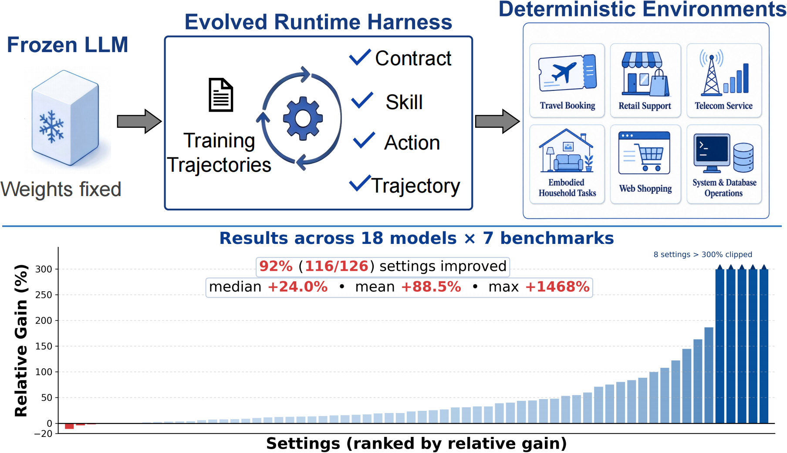
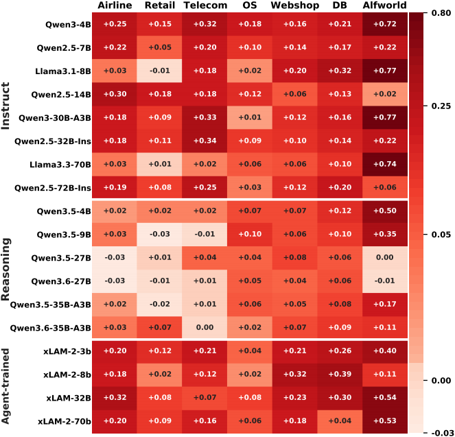
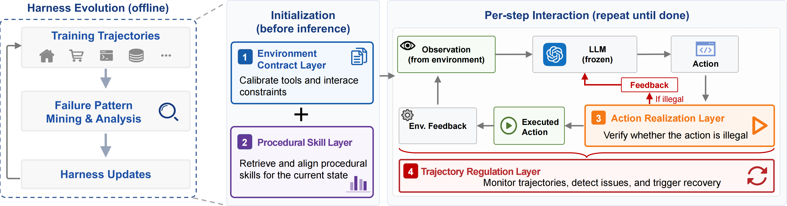

<div align="center">

# Life-Harness

### Adapting the interface, not the model, for deterministic LLM agents

[](https://arxiv.org/abs/2605.22166)
[](#benchmarks)
[](#results)
[](#results)
[](#why-life-harness)

</div>

## News

- **2026/05/24**: Released the paper and codebase. The second version of the
  paper has also been submitted to arXiv, and the code release includes the
  evolution prompts used to build the harness.

<p align="center">
  
</p>

**Life-Harness** is the code release for **"Adapting the Interface, Not the Model:
Runtime Harness Adaptation for Deterministic LLM Agents."** It targets a practical
question: when a frozen LLM agent repeatedly fails in a deterministic environment,
can we improve the runtime harness around the agent instead of retraining the
model or modifying the environment?

The answer is yes. Life-Harness turns recurring failures into reusable runtime
interventions across action realization, environment contracts, trajectory
regulation, and procedural skills. The model remains frozen; the benchmark
environment remains intact; only the harness interface adapts.

| Benchmarks | Model backbones | Settings improved | Avg. relative gain | Training-free |
| ---: | ---: | ---: | ---: | ---: |
| 7 | 18 | 116 / 126 | 88.5% | Yes |

## Why Life-Harness

| What changes? | What stays fixed? | Why it matters |
| --- | --- | --- |
| Runtime harness behavior | LLM weights | No finetuning or model-specific training pipeline |
| Prompted environment interface | Benchmark environment | Keeps deterministic evaluation comparable |

## Results

Across **7 deterministic agent benchmarks** and **18 model backbones**,
Life-Harness improves **116 / 126** model-environment settings, with an
**88.5% average relative improvement** reported in the paper.

<p align="center">
  
</p>

## Method

Life-Harness evolves a small set of runtime layers from observed failures, then
reuses those layers during evaluation.

<p align="center">
  
</p>

| Harness flag | Paper layer | Runtime role |
| --- | --- | --- |
| `h2` | Action Realization Layer | Helps convert model decisions into executable environment actions. |
| `h3` | Environment Contract Layer | Makes task and environment constraints explicit at runtime. |
| `h4` | Trajectory Regulation Layer | Regulates multi-step interaction traces to avoid repeated failure patterns. |
| `h5` | Procedural Skill Layer | Reuses procedural knowledge distilled from recurring successful recoveries. |

When the harness is disabled, these layers are not applied.

## Benchmarks

This repository keeps the two benchmark families in separate folders because
their environments and dependencies are intentionally different.

| Suite | Environments | Start here |
| --- | --- | --- |
| AgentBench-style harness | ALFWorld, DBBench, OS, WebShop | [AgentBench/README.md](AgentBench/README.md) |
| tau-bench-style harness | Airline, Retail, Telecom | [TauBench/README.md](TauBench/README.md) |

```text
Life-harness/
  AgentBench/      # Docker or native AgentBench-style tasks
  TauBench/        # uv-based tau-bench-style tasks
  meta/            # Life and Meta-Harness iteration loops
  assets/          # README figures
```

## Quick Start

Clone the repository, then enter the benchmark suite you want to run:

```bash
cd Life-harness

# tau-bench-style tasks: Airline, Retail, Telecom
cd TauBench

# AgentBench-style tasks: ALFWorld, DBBench, OS, WebShop
cd ../AgentBench
```

Each subfolder README contains its own environment setup, evaluation commands,
and harness switches. API keys and provider URLs should be configured locally
through environment variables or `.env` files; do not commit them.

## Star History

<a href="https://star-history.com/#Tianshi-Xu/Life-Harness&Date">
  <picture>
    <source media="(prefers-color-scheme: dark)" srcset="https://api.star-history.com/svg?repos=Tianshi-Xu/Life-Harness&type=Date&theme=dark" />
    <source media="(prefers-color-scheme: light)" srcset="https://api.star-history.com/svg?repos=Tianshi-Xu/Life-Harness&type=Date" />
    
  </picture>
</a>

## Citation

If you use this repository, please cite the paper:

```bibtex
@article{xu2026adapting,
  title={Adapting the Interface, Not the Model: Runtime Harness Adaptation for Deterministic LLM Agents},
  author={Xu, Tianshi and Wen, Huifeng and Li, Meng},
  journal={arXiv preprint arXiv:2605.22166},
  year={2026}
}
```

## Current Iteration Release (2026-09-14)

The current release keeps the paper's four lifecycle boundaries while using a
reproducible plugin-style evolution loop. H2 realizes and validates actions, H3
describes the environment contract, H4 regulates trajectories, and H5 injects
procedural skills. Accepted changes are frozen as files with hashes; benchmark
tasks, model weights, tool semantics, reward functions, and turn budgets stay
fixed.

All seven environments use the current interface. TauBench Airline, Retail,
and Telecom expose H2/H3/H4 registries, the H5 skill registry, and a
`register()` plugin entry point. AgentBench ALFWorld, DBBench, WebShop, and OS
Interaction execute `Harness.h2/h3/h4/h5` through the shared
`FourHookSession`. Full frozen-response migration replay preserved ALFWorld at
104/109 and DBBench at 190/300 with identical per-task outcomes and normalized
model inputs. See the [migration report](meta/experiments/current_format_migration_20260913/MIGRATION.md)
and its [machine-readable verification](meta/experiments/current_format_migration_20260913/verification.json).

### Configure the iteration tools

Install the TauBench environment, make a local endpoint file, and ensure the
`qoder` proposer CLI is on `PATH`. Keep credentials in the ignored `env.sh`.

```bash
cd Life-Harness
cd TauBench && uv sync && cd ..
cp meta/deploy/env.example.sh meta/deploy/env.sh
# Edit endpoint, key, and model values in meta/deploy/env.sh.
source meta/deploy/env.sh
```

The examples below use a maximum of 50 training tasks, deterministic solver
sampling, and strict full-pool confirmation. Use a new run name when changing
the task pool, model, endpoint, or evaluation settings.

### Run the current Life-Harness iteration

For Airline, Retail, or Telecom, `life_loop.py` starts from the released H2-H5
content and appends only candidates that improve the full configured training
pool. The screen rejects weak candidates cheaply; it never grants final
acceptance in the default `--accept-on full` mode.

```bash
python meta/life_loop.py \
  --run-name life_retail_current --fresh \
  --iterations 3 --domains retail --num-tasks 50 \
  --accept-on full --screen-sentry 8 \
  --agent-llm "$LIFE_AGENT_MODEL" \
  --user-llm "$LIFE_USER_MODEL" \
  --proposer-model DeepSeek-Flash
```

Resume by repeating the command without `--fresh` and, if desired, increasing
`--iterations`. Finalize once on the held-out split by repeating the same
evaluation options with `--test`:

```bash
python meta/life_loop.py \
  --run-name life_retail_current --test \
  --domains retail --num-tasks 50 \
  --agent-llm "$LIFE_AGENT_MODEL" \
  --user-llm "$LIFE_USER_MODEL"
```

ALFWorld and DBBench use a frozen 50-task, train-only source plus bounded public
evidence. Follow [AgentBench native setup](AgentBench/NATIVE_ENVIRONMENT.md)
when Docker is unavailable, then start a new run from the current source:

```bash
# ALFWorld
python meta/agentbench_loop.py \
  --source meta/experiments/current_agentbench_source_20260914 \
  --run-dir meta/runs_agentbench/life_alfworld_current \
  --domain alfworld \
  --baseline meta/experiments/current_agentbench_source_20260914/alfworld/baseline.py \
  --rounds 3 --screen-size 16 --proposer-model DeepSeek-Flash

# DBBench (requires the native MySQL service or the equivalent Docker service)
python meta/agentbench_loop.py \
  --source meta/experiments/current_agentbench_source_20260914 \
  --run-dir meta/runs_agentbench/life_dbbench_current \
  --domain dbbench \
  --baseline meta/experiments/current_agentbench_source_20260914/dbbench/baseline.py \
  --rounds 3 --screen-size 16 --proposer-model DeepSeek-Flash
```

These runs expose a bounded evidence index first, retrieve representative
details on demand, screen on failures plus regression sentries, and accept only
a strict success-count increase on the complete frozen 50-task pool. Provide a
disjoint `--heldout-indices FILE` when creating a run if it will later be
finalized with `--finalize`. WebShop and OS Interaction have the same runtime
hook interface; their full local iteration still requires the original product
index and process-isolated OS environment respectively.

### Run the Meta-Harness baseline

`meta_harness.py` is the free-form TauBench comparison arm. It evaluates the
same frozen model and task pool, lets each candidate be a self-contained Python
plugin, and keeps a score frontier. `--from-scratch` gives both methods the
no-harness starting state for a fair method comparison. Omit that flag to use
the released H2-H5 implementation as an additional anchor.

```bash
python meta/meta_harness.py \
  --run-name meta_retail_from_scratch --fresh --from-scratch \
  --iterations 3 --candidates-per-iter 1 \
  --domains retail --num-tasks 50 \
  --agent-llm "$LIFE_AGENT_MODEL" \
  --user-llm "$LIFE_USER_MODEL" \
  --proposer-model DeepSeek-Flash

python meta/meta_harness.py \
  --run-name meta_retail_from_scratch --test \
  --domains retail --num-tasks 50 \
  --agent-llm "$LIFE_AGENT_MODEL" \
  --user-llm "$LIFE_USER_MODEL"
```

For a paired comparison, keep domains, task count, task split, solver and user
models, trials, concurrency, maximum steps, and proposer budget identical. Use
`--from-scratch` on both `life_loop.py` and `meta_harness.py`; compare held-out
results only after both runs are frozen. More operational detail is in
[`meta/README.md`](meta/README.md).
