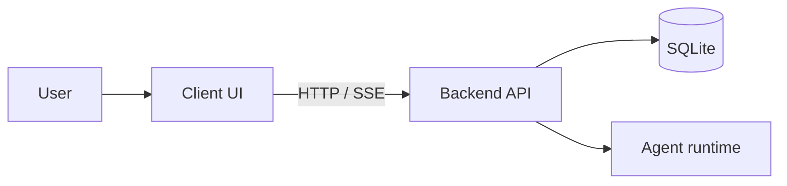

# Architecture diagrams

Use a plain bounded system or runtime view; no formal notation is required.

- **System context:** users, OpenAgentd, external systems, labeled integrations.
- **Runtime architecture:** major runtime parts, responsibilities, protocols,
  stores, and relevant boundaries.
- **Component view:** one bounded subsystem only, when an implementation needs
  more detail.

Use role-oriented names and verb-oriented arrows. Start broad, then zoom in;
do not mix all levels in one diagram. C4 is optional, not a default.

## Example

