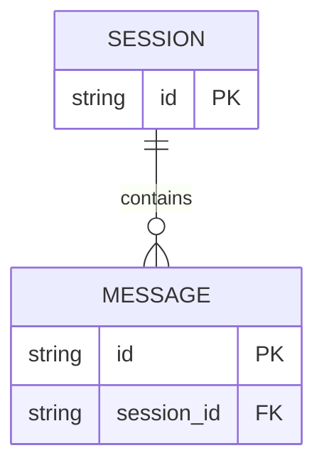

# Data diagrams

Use an ER diagram for persistent records and their relationships.

Show entities, cardinality, important keys, and ownership. Use the storage
schema as the source of truth. Do not add service methods or transient events;
use an architecture or sequence diagram for those.

## Example

