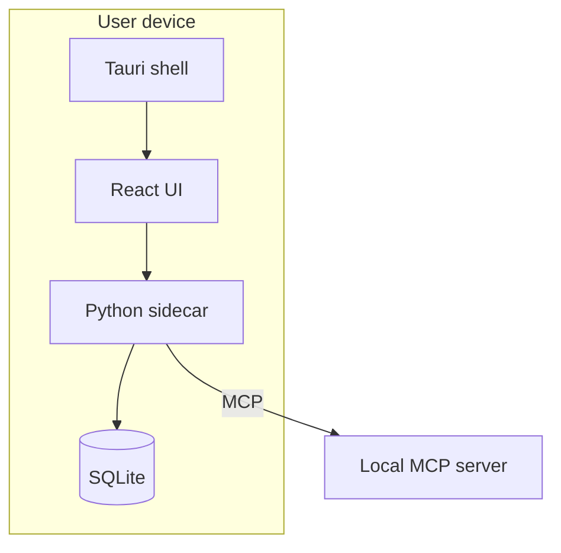

# Deployment diagrams

Use for where software executes and how runtime boundaries connect.

Show device, process, storage, network, and trust boundaries relevant to the
question. Label protocols and persistence. Distinguish browser, Tauri shell,
and Python sidecar when applicable; do not imply a browser-only deployment
passes through Tauri.

## Example

