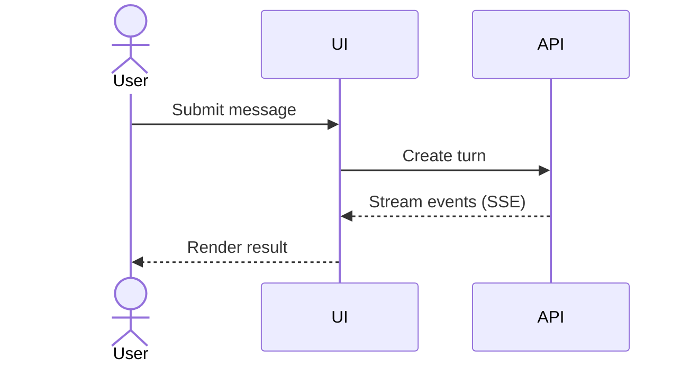

# Sequence diagrams

Use for ordered interactions across people, UI, API, services, agents, tools,
or external systems.

Order messages top-to-bottom. Label calls, responses, events, and protocols;
distinguish synchronous calls from async streams. Use `alt`/`opt` blocks for
verified authorization, failure, cancellation, and retry paths. Omit internal
method calls that do not affect the interaction contract.

## Example

