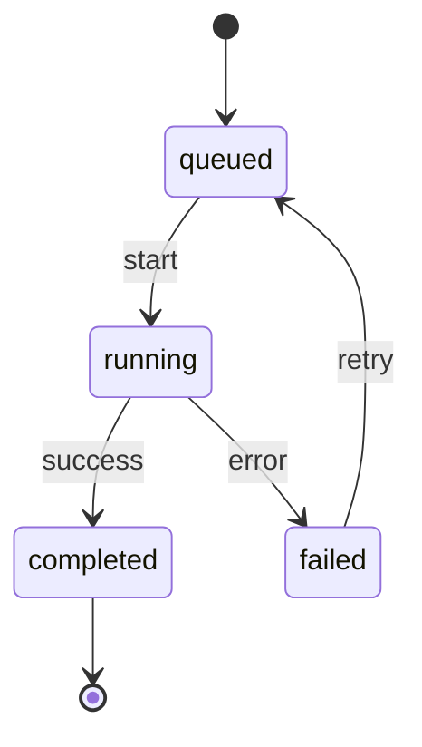

# State diagrams

Use for a lifecycle with valid transitions, not for a linear process.

Show initial and terminal states, transition triggers, and guards. Include
retry, failure, cancellation, and recovery states only when they are real.
Keep state names mutually exclusive and observable; a state is not an action.

## Example

