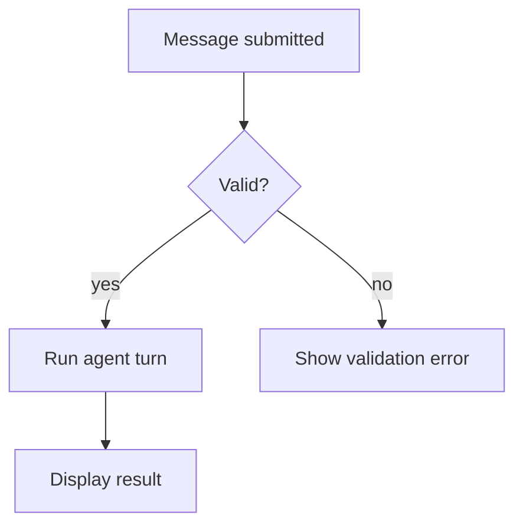

# Workflow diagrams

Use a flowchart for a decision or process; use swimlanes when ownership matters.

Show the trigger, actions, decisions, responsible actor/system, and terminal
outcomes. Label decision branches with their condition. Include an error,
cancel, or retry path only when it changes the outcome. Do not use a workflow
diagram to show message timing; use a sequence diagram instead.

## Example

