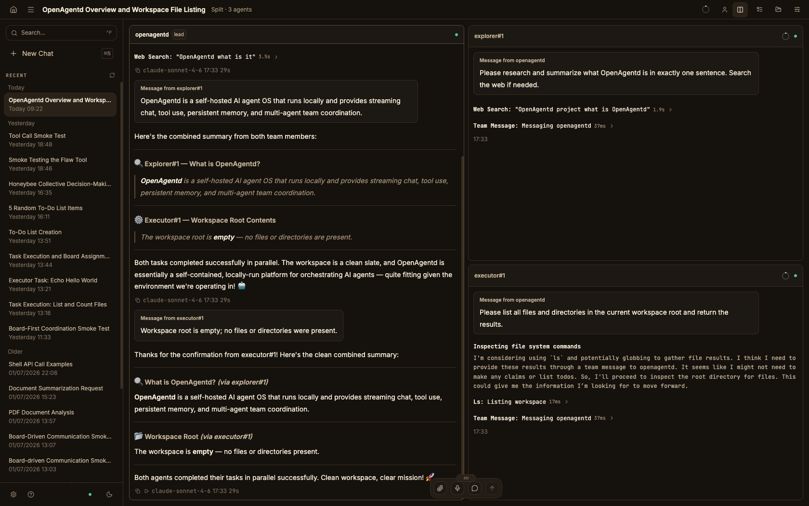
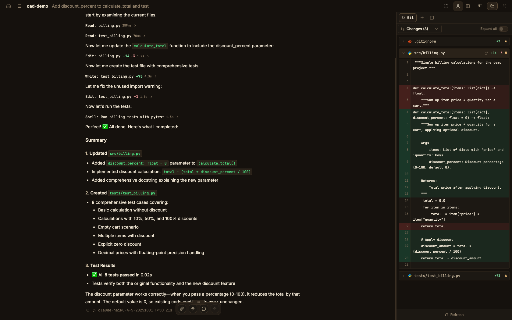
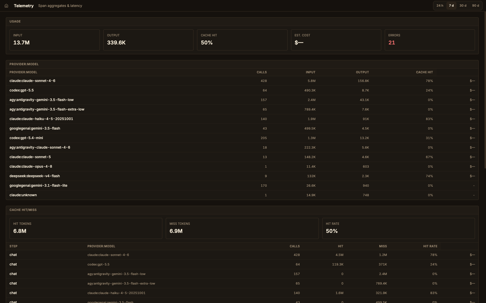

# OpenAgentd

<p align="center">
  
</p>

<p align="center">
  <a href="https://github.com/lthoangg/openagentd/blob/main/LICENSE"></a>
  <a href="https://www.python.org/"></a>
  <a href="https://react.dev/"></a>
  <a href="https://discord.gg/cz6GQHQUMg"></a>
</p>

<p align="center"><strong>A coding-first workspace for a local coding agent.</strong><br>
Run an agent on your machine, see every tool call and diff, and keep your models, coding sessions, workspaces, and telemetry under your control.</p>

<p align="center">
  <a href="#get-started">Get started</a> ·
  <a href="documents/docs/features.md">Features</a> ·
  <a href="https://discord.gg/cz6GQHQUMg">Discord</a> ·
  <a href="https://www.facebook.com/groups/1256361676707935">Facebook Group</a> ·
  <a href="https://github.com/lthoangg/OpenAgentd/issues">Issues</a> ·
  <a href="CONTRIBUTING.md">Contribute</a>
</p>


## Why OpenAgentd

Most coding agents live in a terminal or an editor. OpenAgentd is a coding-first native desktop app and mobile companion where you can run an agent, follow work in real time, inspect what changed, and keep moving without losing context.

- **See the work.** Streamed replies, tool calls, arguments, results, timings, files, diffs, terminal output, and agent status are visible in one interface.
- **Track tasks.** A clean, user-readable taskboard checklist keeps current work and progress visible at a glance.
- **Work in real repositories.** Coding sessions open local folders, support isolated git worktrees, show changes and history, and return language-server diagnostics after edits.
- **Choose your models.** Use your own keys with major cloud and local providers, including Anthropic, OpenAI, Gemini, OpenRouter, Bedrock, Copilot, Codex, Ollama, and more.
- **Stay local-first.** Sessions, telemetry, configuration, and the API server run on your machine. Connect a mobile client or another desktop securely when you need to.

The versioned [feature catalogue](documents/docs/features.md) is the canonical record of shipped capabilities.

## Get started

### Desktop app

Install the current desktop release:

```bash
# macOS / Linux
curl -fsSL https://raw.githubusercontent.com/lthoangg/openagentd/main/install.sh | sh
```

```powershell
# Windows PowerShell
irm https://raw.githubusercontent.com/lthoangg/openagentd/main/install.ps1 | iex
```

Open **OpenAgentd** from your applications folder or Start menu. The desktop app runs its bundled backend automatically, and new installations can start a conversation immediately with the keyless OpenCode Zen default. Add another provider in Settings whenever you want to switch models.

Release artifacts are available for macOS, Windows, and Linux on the [latest release page](https://github.com/lthoangg/openagentd/releases/latest). Unsigned desktop builds may require an explicit operating-system confirmation before first launch.

### CLI server

Install the backend when you want to run it from a terminal, use a browser client, or connect another device:

```bash
uv tool install openagentd
openagentd
```

The server creates its default agents and configuration on first start. Open the
printed local address and add a provider in Settings. For a phone or another
computer on your network:

```bash
openagentd server start --host 0.0.0.0 --key
openagentd server status
openagentd server health
```

`--key` protects non-loopback access. Use `openagentd --help` and `<command> --help` for the current command reference.

Run one agent turn directly against the current project directory when you need
a pipe-friendly terminal response:

```bash
openagentd run --model openai:gpt-5.5 --thinking high --prompt "Summarize this project"
```

The command validates the current directory as a coding workspace, persists a
new session for the turn, and streams the agent's response text to standard
output. Tool-permission events follow the runtime's existing auto-allow policy;
interactive agent questions stop the non-interactive command. It does not
support workspace selection or session resume.

### From source

```bash
git clone https://github.com/lthoangg/openagentd.git
cd openagentd
uv sync
bun install --cwd web
make run
```

For frontend development in a second terminal:

```bash
cd web && bun dev
```

## What it feels like

| A conversation that can act | A workspace that stays in view |
| --- | --- |
|  |  |

| Inspect changes | Keep an eye on local usage |
| --- | --- |
|  |  |

### Built for the whole loop

**Plan and code.** Toggle between Plan mode for read-only exploration and decision-complete plans, and Code mode for surgical implementation—switch mid-session right from the composer or with `Tab`.

**Build and inspect.** Attach files, browse a coding workspace, use `@` mentions, review real-time diffs, and inspect structured tool output without leaving the conversation. Delegate independent sub-tasks across specialists with a unified timeline.

**Operate with confidence.** Manage providers, MCP servers, skills, path denylist permissions, scheduled tasks, todos, and local telemetry from the coding workspace. OpenAgentd supports desktop, browser, and touch-first mobile clients against the same API.

## For users and contributors

- [Features](documents/docs/features.md) — shipped, version-cited capabilities.
- [Releases](https://github.com/lthoangg/openagentd/releases) — download builds and read release notes.
- [Discord](https://discord.gg/cz6GQHQUMg) — join the community server to chat and ask questions.
- [Facebook Group](https://www.facebook.com/groups/1256361676707935) — join the community group to connect and share.
- [Issues](https://github.com/lthoangg/OpenAgentd/issues) — feature requests, bugs, roadmap discussion, and known issues.
- [Security policy](SECURITY.md) — report vulnerabilities privately.
- [Contributing](CONTRIBUTING.md) — set up a development checkout and submit changes.

OpenAgentd is licensed under [Apache 2.0](LICENSE).
