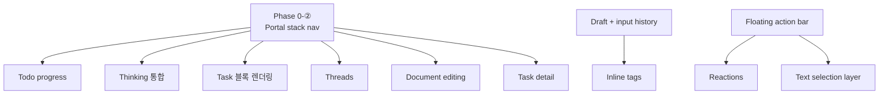

# LobeHub Chat → Oxios Web UI 포팅 설계

> **분석 일자:** 2026-07-24
> **대상 레포:** [lobehub/lobehub](https://github.com/lobehub/lobehub) (이하 LobeHub)
> **타겟:** `web/src` (Oxios Web UI, radix-ui + tailwind 스택)
> **상태:** 진행 중 — Artifact 시스템(2026-07-24), quick-ask, tool render registry 이미 포팅됨

---

## 0. 결론 (Verdict)

> **부분 포팅(Port selectively).** 채팅 UX의 핵심(입력 경험 · 메시지 조작 · 마크다운 렌더링)은 LobeHub 패턴을 그대로 가져오되, **antd 기반 UI와 멀티테넌트/상거래 기능은 포팅하지 않는다.** Oxios는 radix-ui + tailwind 스택을 유지하고, Agent OS 백엔드(Rust kernel, daemon-channel, A2A)에 맞게 매핑한다.

LobeHub는 상용 채팅 제품으로 ~116개 feature, 88개 package, 채팅 입력만 ~65파일이다. 전수 포팅은 불가능하고也无의미하다. **일일 체감 품질에 가장 큰 영향을 주는 20개 기능**을 4개 티어로 나누고, 그중 기반(foundation) 2개를 먼저 깐다.

---

## 1. 아키텍처 비교 — 포팅의 출발점

| 차원 | LobeHub | Oxios (현재) | 결정 |
|---|---|---|---|
| **UI 프레임워크** | antd 6 + antd-style | radix-ui + tailwind v4 | **유지.** antd 도입 ❌. 패턴만移植 |
| **상태 관리** | 맥락별 격리 Zustand (`ConversationProvider`가 `contextKey`마다 고유 store 생성, 6+ slices) | 단일 전역 store (`stores/chat.ts` 1768라인) + `artifact.ts` | **점진적 분할.** chat.ts를 slices로 쪼개되, 전체 격리는 스레드 도입 시점까지 보류 |
| **마크다운 커스텀 태그** | 제네릭 팩토리 `createRemarkCustomTagPlugin(tag)` + `createRemarkSelfClosingTagPlugin(tag)` → 13개 element plugin 일괄 처리 | 개별 ad-hoc 전처리기 3개 (`preprocess-artifacts`, `rehype-thinking`, `rehype-link-card`) | **팩토리 도입.** 이것이 모든 인라인 렌더링의 기반 |
| **우측 패널** | 스택 내비게이션 Portal (`portalStack[]`, 14개 뷰 타입, DraggablePanel 리사이즈) | 단일 artifact 패널 (고정폭 slide-in) | **스택 구조로 전환.** threads/doc/task의 전제조건 |
| **가상화** | `virtua` (TanStack) | 미사용 | **도입 검토** — 긴 세션에서 필수 |
| **메시지 역할** | 12개 (user, assistant, assistantGroup, task, tasks, groupTasks, agentCouncil, compressedGroup, verify, taskCallback, supervisor, tool) | 3개 (user, assistant, tool) | **점진 확장.** compressedGroup, task 우선 |
| **입력 에디터** | Lexical (`@lobehub/editor`) 기반 — mention, slash, ActionTag, LocalFileTag, ReferTopic, AI 자동완성 | Tiptap (StarterKit) — slash 9개, @-mention, 파일 업로드 | **Tiptap 유지.** plugin 패턴만 확장 |
| **스트리밍** | SWR + 맥락별 store | WebSocket (RAF-batched token flush, 14 chunk 타입) | **유지.** Oxios의 WS 구조가 더 단순하고 견고함 |

### 핵심 인사이트

```
LobeHub의 "풍부함"은 두 개의 기반 추상화 위에 서 있다:
  ① createRemarkCustomTagPlugin  →  인라인 콘텐츠 렌더링 (artifact/thinking/task/skill/mention)
  ② Portal stack navigation       →  우측 패널의 멀티뷰 (threads/docs/tasks/preview)
이 두 개를 먼저 깔면 나머지 기능들이 자연스럽게 얹혀진다.
```



---

## 2. 포팅 로드맵

각 항목: **[우선순위]** 기능명 — LobeHub 출처 → Oxios 타겟 → 포팅 접근 → 예상 공수

### Phase 0 — Foundation (모든 것의 전제)

#### 0-①. [HIGH] 통합 커스텀 태그 마크다운 팩토리
- **LobeHub:** `Conversation/Markdown/plugins/remarkPlugins/createRemarkCustomTagPlugin.ts` — `<tag>...</tag>`를 mdast 커스텀 노드로 변환 → React 컴포넌트가 `hName`으로 렌더. `createRemarkSelfClosingTagPlugin`은 `<tag attr="v" />` 처리 (속성 파서 포함).
- **Oxios 현재:** `markdown-plugins/`에 3개 개별 전처리기. 각각 정규식 기반으로 독립 동작 → 태그 추가 시마다 새 전처리기 작성.
- **포팅 설계:**
  1. `lib/markdown/create-remark-tag-plugin.ts`에 두 팩토리를 그대로 포팅 (`unist-util-visit` 의존성 추가).
  2. 기존 `rehype-thinking`, `preprocess-artifacts`를 이 팩토리 기반으로 재작성 → 즉시 동작 검증.
  3. 이후 task/skill/mention/userFeedback 블록은 팩토리 호출 한 줄 + React 렌더러 컴포넌트로 추가.
- **공수:** 0.5일 (팩토리 + 기존 3개 마이그레이션)
- **검증:** 기존 artifact/thinking 렌더링 회귀 없음 + 새 `<task>` 태그 렌더 확인

#### 0-②. [HIGH] Portal 스택 내비게이션 시스템
- **LobeHub:** `Portal/router.tsx` — `portalStack: PortalViewData[]` 배열. 각 뷰는 `PortalImpl { Body, Title, Header?, Wrapper? }` 계약. 공유 Header(ArrowLeft back + X close). `RightPanel`은 `DraggablePanel`(300–600px 리사이즈).
- **Oxios 현재:** `stores/artifact.ts` — 단일 artifact 활성 상태. `artifact-panel.tsx`는 고정폭 `w-[min(640px,50vw)]`.
- **포팅 설계:**
  1. `stores/portal.ts` 신설 — `portalStack: PortalView[]`, `pushView/popView/clearStack`. discriminated union 타입 (`{type:'artifact',...} | {type:'thread',...} | {type:'document',...}`).
  2. `components/portal/portal-panel.tsx` — 스택 top 뷰를 라우팅. 공유 Header(radix 기반).
  3. 리사이즈: `react-resizable-panels` (radix 생태계, tailwind 친화적) 도입.
  4. 기존 `artifact-panel.tsx`를 `PortalImpl` 구현체 하나로 래핑 → artifact는 스택의 한 뷰 타입이 됨.
- **공수:** 1.5일
- **의존성:** 이후 모든 Phase 3 뷰의 전제

---

### Phase 1 — 핵심 채팅 폴리싱 (일일 체감 1순위)

#### 1-①. [HIGH] 입력 드래프트 지속성 + 입력 히스토리
- **LobeHub:** `ChatInput/draftStorage.ts` (세션별 localStorage, 500ms 디바운스, max 50, `useSyncExternalStore`로 reactive key 추적) + `inputHistoryStorage.ts` (agent·user별, max 50, 중복 제거) + `useChatInputHistory.ts` (↑/↓ 터미널식 네비게이션 상태머신) + `InputHistoryPopup.tsx`.
- **Oxios 현재:** 없음. 세션 전환 시 입력 내용 소실.
- **포팅 설계:** 두 storage 모듈은 프레임워크 무관 → 거의 그대로 포팅. 키 네이밍만 `oxios:`로 변경. `useChatInputHistory`를 Tiptap keymap에 바인딩. 사이드바 세션 리스트에 `[draft]` 힌트 표시.
- **공수:** 1일

#### 1-②. [HIGH] 싱글톤 플로팅 메시지 액션바
- **LobeHub:** `Messages/Contexts/MessageActionProvider.tsx` — 하나의 floating 액션바 DOM 요소가 hover된 메시지의 placeholder로 이동. 모든 메시지가 각자 액션바를 렌더하지 않음 (성능 + 일관성).
- **Oxios 현재:** `MessageActionBar.tsx` — 각 메시지가 자체 액션바 렌더 (copy/regenerate/retry/delete).
- **포팅 설계:** `MessageActionProvider` context로 전환. 단일 포털 렌더, hover 시 target 메시지 위치로 `transform`. 기존 액션(copy/regenerate/delete) 유지 + 새 액션(reaction, forward, branch) 슬롯 확보.
- **공수:** 1일

#### 1-③. [MEDIUM] 메시지 리액션 (이모지)
- **LobeHub:** `Conversation/components/Reaction/` — `ReactionDisplay`(이모지 태그 + 카운트 + active) + `ReactionPicker`(선택기). 메시지별 토글.
- **Oxios 현재:** 없음.
- **포팅 설계:** `emoji-picker` (radix 호환) 또는 간단 자주쓰는 이모지 세트. 리액션은 ChatMessage에 `reactions?: Record<string,string[]>` 필드 추가. 백엔드는 별도 persist 없이 프론트 localStorage 우선 (UX 검증 후 백엔드 확장).
- **공수:** 0.5일

#### 1-④. [MEDIUM] 컨텍스트 압축 그룹 (CompressedGroup)
- **LobeHub:** `Messages/CompressedGroup/` — 오래된 메시지를 접어 summary/history 탭으로 표시. 스트리밍 summary 생성 + 취소 + 펼치기/접기.
- **Oxios 현재:** 없음. 긴 세션에서 스크롤 부담.
- **포팅 설계:** 메시지 수 임계치(예: 20개) 초과 시 이전 메시지를 `<CompressedGroup>`으로 래핑. summary는 Oxios 기존 `/compact` 슬래시 명령 로직 재사용. 새 메시지 역할 `compressed` 추가.
- **공수:** 1.5일

#### 1-⑤. [MEDIUM] 액션바 확장: 모델 파라미터 · 메모리 · 토큰 카운터
- **LobeHub:** `ActionBar/Params/` (temperature, top-p, max tokens 팝오버), `ActionBar/Memory/` (on/off + effort 슬라이더), `ActionBar/Token/` (컨텍스트 윈도우 진행 바).
- **Oxios 현재:** `chat-input-action-bar.tsx`에 search/knowledge/upload 3개 토글만.
- **포팅 설계:** params 팝오버 → radix Popover + 슬라이더. Oxios 백엔드는 AgentConfig로 파라미터 수신 가능(`ttsr_engine`/`memory`/`todo` 필드 이미 있음). 토큰 카운터는 입력 텍스트 길이 → 대략 토큰 추정.
- **공수:** 1일

#### 1-⑥. [MEDIUM] 백투바텀 + 자동스크롤 관리
- **LobeHub:** `ChatList/components/BackBottom/` (스크롤 시 플로팅 버튼) + `hooks/useConversationScroll.ts` (주제별 스크롤 위치 저장/복원).
- **Oxios 현재:** 기본 auto-scroll만.
- **포팅 설계:** 백투바텀 버튼 + 스트리밍 중 스크롤 위치 존중(사용자가 올리면 자동 스크롤 일시정지). 세션별 스크롤 위치는 `ui-prefs`에 저장.
- **공수:** 0.5일

---

### Phase 2 — 리치 입력 경험

#### 2-①. [MEDIUM] TypoBar (리치텍스트 포맷 툴바)
- **LobeHub:** `ChatInput/TypoBar/` — bold, italic, underline, strike, list, blockquote, math, code, codeblock + 단축키 툴팁.
- **Oxios 현재:** Tiptap이 포맷을 지원하지만 툴바 없음.
- **포팅 설계:** Tiptap의 `EditorContent` 위에 floating toolbar. radix ToggleGroup + lucide 아이콘. math는 KaTeX (Oxios에 없음 → 선택 추가).
- **공수:** 1일

#### 2-②. [MEDIUM] 인라인 태그 (스킬 · 파일 · 토픽 참조)
- **LobeHub:** `InputEditor/ActionTag/` (스킬 chip — 패널에서 드래그), `LocalFileTag/` (파일 chip), `ReferTopic/` (토픽 참조 노드 — 사이드바에서 드래그). Lexical plugin으로 마크다운 직렬화.
- **Oxios 현재:** @-mention (지식/메모리/마운트/역할)은 있으나 드래그 기반 인라인 태그 없음.
- **포팅 설계:** Tiptap custom Node extension으로 포팅. `@skill:xxx`, `@file:path`, `@topic:id` → chip 렌더. DnD는 HTML5 dragstart/drop (lobehub과 동일 패턴).
- **공수:** 2일

#### 2-③. [LOW] AI 자동완성 (고스트 텍스트)
- **LobeHub:** `InputEditor/` — ReactAutoCompletePlugin (600ms 지연, 서버사이드).
- **Oxios 현재:** 없음.
- **포팅 설계:** `/api/engine/complete` 엔드포인트 + Tiptap ghost-text extension. 우선순위 낮음 (nice-to-have).
- **공수:** 1.5일

#### 2-④. [LOW] 텍스트 선택 액션 레이어
- **LobeHub:** `Messages/components/TextSelectionActionLayer/` — 메시지 내 텍스트 선택 시 인라인 액션바 (copy/quote).
- **포팅 설계:** `Selection` API + floating radix Popover.
- **공수:** 0.5일

---

### Phase 3 — Portal 뷰 (Phase 0-② 전제)

#### 3-①. [HIGH] 스레드 / 서브대화
- **LobeHub:** `Portal/Thread/` — 메시지에서 대화 포크. 신규 스레드 생성 vs 기존 조회. standalone(독립) vs continuation(맥락 포함) 모드. `ConversationProvider`로 스레드별 격리 store.
- **Oxios 현재:** 없음.
- **포팅 설계:** Oxios는 A2A + 멀티세션 백엔드가 있으므로, 스레드 = 부모 세션에 연결된 자식 세션. 백엔드에 `parentSessionId` 필드 추가. Portal의 `thread` 뷰 타입에서 자식 세션 ChatList + ChatInput 렌더.
- **공수:** 3일 (백엔드 포함)

#### 3-②. [MEDIUM] 도큐먼트 편집
- **LobeHub:** `Portal/Document/` — Lexical 기반 WYSIWYG (`@lobehub/editor`), frontmatter 블록, autosave, TodoList, FloatingChatPanel(문서 기반 채팅).
- **Oxios 현재:** 없음. Oxios는 KnowledgeBase(`.md` 파일)가 있음.
- **포팅 설계:** Oxios KnowledgeBase용 마크다운 에디터. Tiptap markdown extension으로 WYSIWYG. autosave는 기존 KB API 재사용. FloatingChatPanel은 문서 컨텍스트를 첨부한 채팅.
- **공수:** 3일

#### 3-③. [MEDIUM] 태스크 디테일 뷰
- **LobeHub:** `Portal/TaskDetail/` — 에이전트 태스크 실행 결과 섹션, TopicChatDrawer, DocumentPreviewModal.
- **Oxios 현재:** `routes/tasks.tsx` 있으나 채팅 내 인라인 태스크 디테일 없음.
- **포팅 설계:** Oxios todo/plan 시스템과 연동. `<task>` 태그 클릭 → Portal taskDetail 뷰.
- **공수:** 2일

#### 3-④. [LOW] 파일 프리뷰 패널
- **LobeHub:** `Portal/FilePreview/` (chunk/file 듀얼 탭) + `LocalFile/` (이미지/텍스트/코드).
- **Oxios 현재:** tool-renders에 FileRead 인라인은 있으나 전용 패널 없음.
- **포팅 설계:** Portal `filePreview` 뷰 타입. 기존 FileRead tool render 재사용.
- **공수:** 1일

#### 3-⑤. [LOW] ChatMiniMap
- **LobeHub:** `features/ChatMiniMap/` — 우측 엣지 hover-reveal 미니맵, 메시지 위치 마커, 클릭 시 점프.
- **포팅 설계:** 메시지 수 임계치(예: 50개) 이상에서만 표시.
- **공수:** 1일

---

### Phase 4 — 에이전트/스킬/공유

#### 4-①. [MEDIUM] 토픽(세션) 매니저
- **LobeHub:** `AgentTopicManager/` — 그리드/리스트 뷰, 필터, 검색, 일괄 삭제, 이동 모달. 세션 리스트에 `[draft]` 힌트.
- **Oxios 현재:** `routes/sessions/` DataTable (삭제 + 읽기전용 상세).
- **포팅 설계:** 그리드 뷰 + 검색 + 일괄 작업 추가. 1-①의 draft 힌트 연동.
- **공수:** 1.5일

#### 4-②. [MEDIUM] 컨텍스트 메뉴 (우클릭)
- **LobeHub:** `hooks/useChatItemContextMenu.tsx` — edit/copy/delete/regenerate/share.
- **Oxios 현재:** 없음 (액션바 hover만).
- **포팅 설계:** radix ContextMenu.
- **공수:** 0.5일

#### 4-③. [MEDIUM] 공유 (이미지/텍스트)
- **LobeHub:** `ShareModal/` — Image(스크린샷), Text, PDF, JSON 4포맷. `SharePopover` (공개 링크).
- **Oxios 현재:** 없음.
- **포팅 설계:** Text/JSON은 즉시 가능. Image는 `html-to-image` 라이브러리. PDF는 낮은 우선순위. 공개 링크는 단일 데스크톱 앱이라 제외.
- **공수:** 1.5일

#### 4-④. [LOW] 사용량 분석
- **LobeHub:** `AgentUsage/` — 통계 카드, 추세 차트, 모델별 분석.
- **Oxios 현재:** `routes/budget.tsx`, `token-maxing.tsx` 있음.
- **포팅 설계:** 기존 budget 시스템 확장. 차트는 recharts(이미 있는지 확인 필요).
- **공수:** 1일

#### 4-⑤. [LOW] 메시지 포워딩
- **LobeHub:** `MessageForward/` — 선택 모드 + 다른 에이전트로 일괄 전달. `TopicForwardModal` (전체 토픽 전달).
- **Oxios 현재:** 없음.
- **포팅 설계:** Oxios A2A 맥락에서 유의미. 선택 푸터 + 에이전트 선택기.
- **공수:** 1일

---

## 3. 포팅하지 않을 것 (명시적 제외)

| 기능 | 제외 사유 |
|---|---|
| **antd / antd-style** | Oxios는 radix-ui + tailwind. 프레임워크 교체는 비용 대비 효과 없음 |
| **멀티테넌트 인증** (`Auth/`) | Oxios는 단일 사용자 데스크톱 앱 |
| **Connectors / Composio** | Oxios는 MCP 클라이언트(`oxios-mcp`)가 이미 있음 |
| **마켓플레이스 스토어 탭** | Oxios `routes/marketplace.tsx` 이미 있음 |
| **Agent graph runtime / self-iteration** | 백엔드 아키텍처 차이. UX가 아닌 커널 영역 |
| **AgentCouncil / group agents** | Oxios A2A 모델이 다름. 스레드(3-①)로 우회 커버 |
| **과금 / Stripe / 상거래** | 해당 없음 |
| **SWR 데이터 페칭** | Oxios는 WebSocket 기반. 맥락이 다름 |

---

## 4. 기술적 결정 사항

### 4.1. 마크다운 파이프라인 통합
```
현재:  raw → sanitize → highlight → [thinking] → [link-card] → [artifact preprocess]
목표:  raw → sanitize → highlight → createRemarkTagPlugin('lobeThinking')
                                       → createRemarkTagPlugin('task')
                                       → createRemarkTagPlugin('skill')
                                       → createRemarkSelfClosingTagPlugin('localFile')
                                       → link-card
```
`createRemarkCustomTagPlugin`은 mdast 단계에서 동작하므로, rehype 단계의 기존 전처리기보다 깔끔하다. React 컴포넌트는 `components={{ [tag]: Renderer }}` 매핑.

### 4.2. Portal 타입 정의 (Oxios 버전)
```typescript
type PortalView =
  | { type: 'artifact'; artifactId: string; language: string }
  | { type: 'thread'; sessionId: string | null; parentId: string }
  | { type: 'document'; path: string }
  | { type: 'taskDetail'; taskId: string }
  | { type: 'filePreview'; path: string }
  | { type: 'messageDetail'; messageId: string }
```

### 4.3. Store 분할 계획
현재 `chat.ts`(1768라인)를 slices로 분해:
- `chat/slices/streaming.ts` — WS, handleChunk, RAF flush
- `chat/slices/messages.ts` — 메시지 배열, CRUD
- `chat/slices/session.ts` — 활성 세션/프로젝트/역할/모델
- `chat/slices/input.ts` — 입력 상태, 드래프트
- `chat/slices/ui.ts` — 메시지 상태(editing/selection/streaming flags)

전체 맥락 격리(ConversationProvider 패턴)는 스레드(3-①) 도입 시점에 재검토.

### 4.4. 의존성 추가 후보
| 패키지 | 용도 | 티어 |
|---|---|---|
| `unist-util-visit` | remark 플러그인 작성 | Phase 0 |
| `react-resizable-panels` | Portal 리사이즈 (radix 생태계) | Phase 0 |
| `virtua` 또는 `@tanstack/react-virtual` | 메시지 가상화 | Phase 1-④ |
| `katex` | 수식 렌더링 | Phase 2-① (선택) |
| `html-to-image` | 공유 이미지 | Phase 4-③ |

---

## 5. 권장 실행 순서

```
Week 1:  Phase 0 (foundation) — 0-① 팩토리, 0-② portal stack
         + 1-① 드래프트/히스토리 (독립적, 바로 착수 가능)
         + 1-② 플로팅 액션바
Week 2:  Phase 1 나머지 — 리액션, 백투바텀, 액션바 확장, 컨텍스트 압축
Week 3:  Phase 2 — TypoBar, 인라인 태그
Week 4+: Phase 3 — 스레드(백엔드 포함), 도큐먼트, 태스크 디테일
이후:    Phase 4 — 토픽 매니저, 공유, 포워딩 (UX 검증 후)
```

**총 예상 공수:** ~30일 (백엔드 포함). Phase 0+1만으로도 일일 채팅 체감이 크게 개선됨.

---

## 부록: 검증 체크리스트 (각 티어 완료 시)

- [ ] 기존 artifact/thinking 렌더링 회귀 없음 (Phase 0-①)
- [ ] Portal 스택 push/pop/back 동작 (Phase 0-②)
- [ ] 세션 전환 시 드래프트 복원 (Phase 1-①)
- [ ] ↑/↓ 입력 히스토리 네비게이션 (Phase 1-①)
- [ ] 호버 시 단일 액션바 이동 (Phase 1-②)
- [ ] `bun run typecheck && bun run lint && bun run build` 통과 (매 티어)
