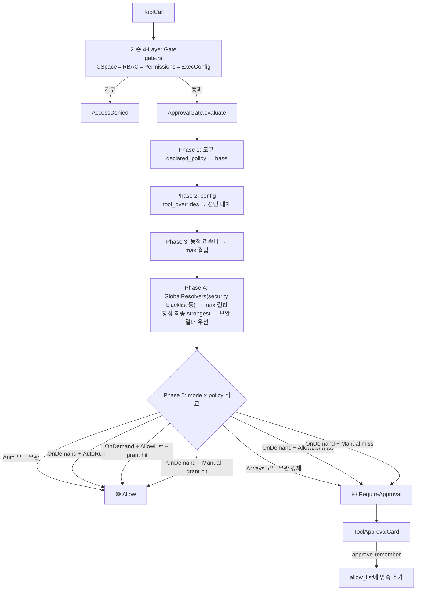

# 도구 승인 모드 시스템 (RFC-035)

**날짜**: 2026-07-27
**상태**: 구현됨 (2026-07-27) — 구현 중 두 곳을 다듬었다(아래 Amendment).
**참고**: [lobehub/lobe-chat](https://github.com/lobehub/lobe-chat) `ApprovalMode` / `InterventionChecker` 분석 기반

> **Amendment (2026-07-27, 구현 반영)**: 구현 중 원 설계에서 두 곳을 다듬었다. 본문
> §4.3·§5·§5.1·§10.2·§11·§12.2는 아래를 반영해 수정했다.
> 1. **Manual 모드도 grant를 존중** — 원 설계는 Manual에서 매번 재승인한다고 했으나, 카드의
>    "이 세션에서 허용" 약속과 모순되어 `(Manual, OnDemand) if has_grant => Allow`를 추가.
>    "다시 묻지 않기" 체크박스·영속 grant도 모든 모드에서 동작한다.
> 2. **승인 대기 중 정책 재평가** — `gated_tool`이 oneshot에 블로킹된 채 모드/grant 변경을
>    놓치는(stranded approval) 문제를 막기 위해 500ms `select!` 폴링으로 동일 gate를 재평가하여
>    새 정책이 `Allow`면 자동 승인한다.

---

## 1. 동기

### 1.1 문제

Web UI에서 "날씨를 물어보기" 같은 일반 작업을 할 때마다 `exec` 도구가 매번 승인을 요구한다.
사용자는 "다 열어둘 각오가 되어있음"에도 불구하고, 매 도구 호출마다 권한 프롬프트에 막혀
작업 흐름이 끊긴다.

### 1.2 근원 원인 (systematic-debugging Phase 1)

두 가지가 합쳐진 증상이다:

1. **세션 승인 캐시 부재** — `exec_tool.rs:598-622`의 shell-mode approval은 매 호출마다
   새 `PendingToolApprovals` oneshot을 등록하고, `pending_tool_approvals.rs`는 호출
   간 메모리를 유지하지 않는다. 한 번 승인해도 다음 호출에 다시 묻는다.
2. **`ExecConfig` 기본값이 빡빡한 경로로 유도** — `allowlist_mode = "enforced"` +
   `allowed_commands`는 structured 바이너리를 허용하지만, 파이프/리다이렉션이 필요한
   호출은 shell mode로 빠지고 shell mode만 승인을 트리거한다. 결과적으로 LLM은
   승인이 필요한 경로로 내몰린다.

### 1.3 목표

- 사용자가 **하나의 드롭다운**으로 "얼마나 열어둘지"를 선택 (lobehub 패러다다).
- 치명 명령(`rm -rf /`, `sudo`, fork bomb 등)은 모드와 무관하게 **항상** 승인.
- 한 번 승인한 도구는 **영속**되어 재묻지 않음 (allow-list 모드).
- 마이그레이션 시 현재 동작을 **실수로 더 빡빡하게** 만들지 않음.
- 기존 4-layer gate(`gate.rs`: CSpace/RBAC/Permissions/ExecConfig)는 구조적 권한
  역할로 보존하고, **런타임 승인 정책**은 별도 계층으로 분리.

---

## 2. 배경: lobehub 모델 분석

lobehub은 3계층 평가로 도구 호출마다 "자동실행 / 승인요청 / 차단"을 결정한다.
이 설계는 그중 구조적으로 우아한 5가지를 이식한다:

| lobehub 구조 | 위치 | 이식 |
|---|---|---|
| **3-tier `HumanInterventionPolicy`** (`never`/`required`/`always`) | `intervention.ts:6` | `ToolPolicy { Auto, OnDemand, Always }` |
| **도구 정책 co-location** (manifest `humanIntervention`) | `buildConnectorManifests.ts:44` | 도구 등록 시 `ToolPolicy` 선언 |
| **Global resolver 체인** (security blacklist 등) | `GeneralChatAgent.ts:172` | `GlobalResolver` trait |
| **`ArgumentMatcher`** (prefix/glob/regex 인자 매칭) | `InterventionChecker.ts:160` | `ArgMatcher` enum |
| **동적 정책 리졸버** (런타임 인자 기반 정책) | `GeneralChatAgent.ts:192` | `ToolPolicyResolver` trait |

그리고 3개의 사용자 모드를 그대로 채택:
- `auto-run` — 모든 도구 자동 실행 (security blacklist `Always`는 제외)
- `allow-list` — `allow_list`에 있는 도구만 자동 실행
- `manual` — 각 도구의 선언 정책을 그대로 적용 (기본값)

---

## 3. 설계 원칙

1. **직교 설계** — 3-tier 도구 정책 × 3-mode 사용자 오버라이드. 9개 조합이 `match` 하나로 정리.
2. **Co-location + Override** — 도구는 자신의 기본 정책을 선언하고, 사용자는 config로 override.
3. **계층적 우선순위** — `Always`는 모드·grant 무관. `OnDemand`는 `auto-run` 모드, 또는 어느 모드에서든 명시적 grant(`allow_list`)로 우회 가능.
4. **확장 가능한 평가** — `GlobalResolver` trait로 보안·감사·rate-limit을 같은 파이프라인에 꽂음.
5. **마이그레이션 동등성** — 동적 리졸버로 structured allowed 바이너리는 현재 동작(Auto) 유지.
6. **안전한 기본** — `approval_mode = manual` 기본값. "다 열기"는 사용자의 명시적 선택.

---

## 4. 데이터 모델

신규 모듈: `crates/oxios-kernel/src/approval/mod.rs` (하위: `policy.rs`, `gate.rs`, `resolver.rs`, `blacklist.rs`).

### 4.1 도구 정책

```rust
//! approval/policy.rs

/// 도구가 선언하는 승인 정책 (lobehub HumanInterventionPolicy와 동형)
#[derive(Debug, Clone, Copy, Default, PartialEq, Eq, Serialize, Deserialize)]
#[serde(rename_all = "lowercase")]
pub enum ToolPolicy {
    /// 자동 실행 — 승인 불필요. (read, ls, grep, structured allowed 바이너리)
    #[default]
    Auto,
    /// 승인 필요 — 단 auto-run / allow-list grant로 우회 가능. (exec, write, web_search)
    OnDemand,
    /// 항상 승인 — 모드·grant 무관 강제. (사용자 지정 위험 도구)
    Always,
}

impl ToolPolicy {
    /// stronger policy 채택 (Always > OnDemand > Auto)
    pub fn max(self, other: Self) -> Self {
        use ToolPolicy::*;
        match (self, other) {
            (Always, _) | (_, Always) => Always,
            (OnDemand, _) | (_, OnDemand) => OnDemand,
            _ => Auto,
        }
    }
}
```

### 4.2 사용자 승인 모드

```rust
//! approval/policy.rs

/// 사용자 전역 승인 모드 (lobehub ApprovalMode와 동형)
#[derive(Debug, Clone, Copy, Default, PartialEq, Eq, Serialize, Deserialize)]
#[serde(rename_all = "kebab-case")]
pub enum ApprovalMode {
    /// 각 도구의 선언 정책 사용 (안전한 기본값)
    #[default]
    Manual,
    /// allow_list에 있는 도구만 자동 실행
    AllowList,
    /// 모든 도구 자동 실행 (Always 정책은 제외)
    AutoRun,
}
```

### 4.3 사용자 승인 설정 (영속)

```rust
//! approval/policy.rs

/// config.toml [security.approval] 단위. 영속화 대상.
#[derive(Debug, Clone, Default, Serialize, Deserialize)]
pub struct ApprovalConfig {
    /// 현재 승인 모드
    #[serde(default)]
    pub mode: ApprovalMode,
    /// 허용된 도구 키 목록 ("read", "exec:curl", "web_search" ...)
    #[serde(default)]
    pub allow_list: Vec<String>,
    /// 도구별 정책 override (도구 이름 → ToolPolicy)
    #[serde(default)]
    pub tool_overrides: HashMap<String, ToolPolicy>,
}
```

**영속화 위치**: `config.toml [security.approval]`. `mode`와 `allow_list`가 한 단위로
응집. Web UI 드롭다운이 이 섹션을 read/write.

> **설계 결정 (grants 영속화)**: lobehub처럼 `allow_list`를 config에 영속화한다.
> grant는 **모든 모드**에서 존중된다 — Manual에서도 "다시 묻지 않기"로 추가한 grant가
> 재묻지 않게 한다(이것이 카드의 "이 세션에서 허용" 약속을 이행한다). Manual과 AllowList의
> 차이는 시작점만: Manual은 모든 도구에 최소 한 번은 묻지만, AllowList는 미리 채운 목록은
> 묻지 않고 자동 실행한다. "재시작 = 안전 기본 회귀"는 `mode = manual` 기본값으로 유지.

### 4.4 도구 호출 컨텍스트

```rust
//! approval/gate.rs

/// 승인 평가에 필요한 도구 호출 정보
pub struct ToolCall<'a> {
    /// 도구 이름 ("exec", "read", "web_search" ...)
    pub tool: &'a str,
    /// exec의 경우 바이너리 ("curl", "git" ...) 또는 "shell"
    pub binary: Option<&'a str>,
    /// 원시 호출 인자 (동적 리졸버/블랙리스트 매칭용)
    pub args: &'a Value,
}

impl ToolCall<'_> {
    /// grant 단위 키. 하이브리드: 도구 + (exec의 경우 binary)
    pub fn grant_key(&self) -> String {
        match self.tool {
            "exec" => format!("exec:{}", self.binary.unwrap_or("shell")),
            other => other.to_string(),
        }
    }
}
```

---

## 5. 평가 파이프라인



> **phase 순서가 보안을 결정한다**: config `tool_overrides`가 도구 선언을
> 대체할 수 있지만(Phase 2), 동적 리졸버(Phase 3)와 global resolvers(Phase 4)는
> 항상 `max` 결합으로 stronger policy만 채택한다. 따라서 security blacklist가
> 준 `Always`는 사용자 override나 auto-run 모드로 **절대** 우회되지 않는다.

### 5.1 ApprovalGate 의사결정 (핵심)

```rust
//! approval/gate.rs

pub enum ApprovalDecision {
    /// 즉시 실행
    Allow,
    /// 승인 카드 필요
    RequireApproval { reason: String },
}

impl ApprovalGate {
    pub fn evaluate(&self, call: &ToolCall) -> ApprovalDecision {
        // Phase 1: 도구 선언 기본 정책 (ApprovalGate가 DEFAULT_TOOL_POLICIES
        // 기반 tool_policies 맵을 보유하고 tool name으로 조회)
        let mut policy = self.tool_policies.get(call.tool).copied()
            .unwrap_or(ToolPolicy::OnDemand);

        // Phase 2: config tool_overrides — 사용자 명시 override (선언을 대체)
        if let Some(&override_p) = self.config.tool_overrides.get(call.tool) {
            policy = override_p;
        }

        // Phase 3: 동적 리졸버 — 인자 기반 stronger policy max 결합
        if let Some(resolver) = self.dynamic_resolvers.get(call.tool) {
            if let Some(p) = resolver.resolve(call.args) {
                policy = policy.max(p);
            }
        }

        // Phase 4: global resolvers (security blacklist 등) — 항상 최종 strongest.
        // max 결합이므로 security Always는 사용자 override / auto-run으로 절대 우회 불가.
        for resolver in &self.global_resolvers {
            if let Some(p) = resolver.resolve(call) {
                policy = policy.max(p);
            }
        }

        // Phase 5: 사용자 모드 × 최종 policy 직교 평가
        use (ToolPolicy::*, ApprovalMode::*);
        match (self.config.mode, policy) {
            (_, Auto) => ApprovalDecision::Allow,                  // Auto는 모드 무관
            (_, Always) => require(call, "always-policy tool"),    // Always는 모드 무관 강제
            let has_grant = self.config.allow_list.iter().any(|k| k == &call.grant_key());
            (AutoRun, OnDemand) => ApprovalDecision::Allow,        // 모드가 우회
            (AllowList, OnDemand) if has_grant => Allow,
            // 명시 grant("다시 묻지 않기")는 manual에서도 존중 — 카드의 "이 세션에서
            // 허용" 약속 이행. grant가 없으면 아래 catch-all이 RequireApproval.
            (Manual, OnDemand) if has_grant => Allow,
            (_, OnDemand) => require(call, "approval required"),
        }
    }

    fn has_grant(&self, call: &ToolCall) -> bool {
        self.config.allow_list.iter().any(|k| k == &call.grant_key())
    }
}

fn require(call: &ToolCall, why: &str) -> ApprovalDecision {
    ApprovalDecision::RequireApproval {
        reason: format!("{}: {}", call.tool, why),
    }
}
```

**우아함의 핵심**: 9개 조합(3 mode × 3 policy)이 `match` 하나로. `Auto`와 `Always`는
`_` 와일드카드로 모드 무관 즉시 결정. 복잡한 if-else 체인 없음.

---

## 6. 도구 정책 Co-location

### 6.1 등록 계층 (AGENTS.md 준수)

Oxios 도구 등록은 3단계 위임 구조다. policy는 실제 `registry.register()`가
일어나는 각 지점에 전달한다:

```
kernel_bridge.rs::OxiosKernelBridge::register_tools()   (SDK 진입점, SdkKernelToolProvider)
  ├─ registration.rs::register_always_on()              (always-on: read/write/edit/grep/find/ls/web_search)
  ├─ builtin/mod.rs::register_all_kernel_tools()        (커널 도메인: exec/memory/project/agent/a2a)
  └─ registration.rs::register_tools_from_cspace_gated() (CSpace 기반 게이트된 등록)
```

> **AGENTS.md 명명**: "모든 커널 도구 → `tools/kernel_bridge.rs::register_all_kernel_tools()`".
> 실제 함수는 `tools/builtin/mod.rs:57::register_all_kernel_tools`에 정의되고
> `kernel_bridge.rs:86`에서 호출된다. 본 설계는 AGENTS.md 명명을 따르되, 구현 시
> `register_all_kernel_tools` 정의(`builtin/mod.rs`)와 세 tier 헬퍼(`registration.rs`)에
> `ToolPolicy` 인자를 추가한다.

### 6.2 Policy 부여 지점

```rust
//! builtin/mod.rs::register_all_kernel_tools (변경)
pub fn register_all_kernel_tools(
    registry: &ToolRegistry,
    kernel: &KernelHandle,
    _agent_id: &str,
    policies: &PolicyMap,   // ← 신규: 도구 이름 → ToolPolicy
) {
    registry.register_with_policy(
        ExecTool::from_kernel(kernel),
        policies.get("exec").copied().unwrap_or(ToolPolicy::OnDemand),
    );
    // ...
}
```

기본 policy 맵 (컴파일 타임 상수):

```rust
//! approval/policy.rs
pub const DEFAULT_TOOL_POLICIES: &[(&str, ToolPolicy)] = &[
    // always-on 파일 도구 — Auto
    ("read",          ToolPolicy::Auto),
    ("ls",            ToolPolicy::Auto),
    ("grep",          ToolPolicy::Auto),
    ("find",          ToolPolicy::Auto),
    ("get_search_results", ToolPolicy::Auto),
    // 쓰기/실행 — OnDemand
    ("write",         ToolPolicy::OnDemand),
    ("edit",          ToolPolicy::OnDemand),
    ("exec",          ToolPolicy::OnDemand),
    ("web_search",    ToolPolicy::OnDemand),
    ("browser",       ToolPolicy::OnDemand),
    // MCP/A2A — OnDemand (커넥터 permission으로 세분화)
    ("mcp",           ToolPolicy::OnDemand),
    ("a2a_delegate",  ToolPolicy::OnDemand),
    // ...
];
```

---

## 7. 동적 정책 리졸버 (마이그레이션 동등성)

### 7.1 문제 (advisory가 짚은 버그)

현재 동작:
- structured_exec + `allowed_commands` 안의 바이너리(curl, ls, cat ...) → **승인 없이** 실행
- shell mode → 승인

순진한 구현은 `exec` 전체를 `OnDemand`로 두어 structured `curl`도 승인을 요구하게
만든다 — **마이그레이션이 더 빡빡해지는 실수**. 사용자 불만이 과도한 제한인데
업그레이드로 더 제한되면 최악.

### 7.2 해결: `ToolPolicyResolver` trait

도구가 런타임에 **인자 기반으로** 정책을 결정. lobehub `resolveDynamicPolicy` 이식.

```rust
//! approval/resolver.rs

/// 런타임 인자 기반 정책 결정. None이면 declared_policy 사용.
pub trait ToolPolicyResolver: Send + Sync {
    fn resolve(&self, args: &Value) -> Option<ToolPolicy>;
}

/// ExecTool 동적 정책 — 현재 동작 보존
pub struct ExecPolicyResolver {
    allowed_commands: Arc<RwLock<Vec<String>>>,
}

impl ToolPolicyResolver for ExecPolicyResolver {
    fn resolve(&self, args: &Value) -> Option<ToolPolicy> {
        let mode = args.get("mode")?.as_str()?;
        let command = args
            .get("command").and_then(|v| v.as_str())
            .or_else(|| args.get("binary").and_then(|v| v.as_str()))?;
        let allowed = self.allowed_commands.read();
        match mode {
            // structured + allowed_commands 안 → Auto (현재 동작 유지)
            "structured" if allowed.iter().any(|c| c == command) => Some(ToolPolicy::Auto),
            // shell / unknown 바이너리 → OnDemand (현재 동작 유지)
            _ => Some(ToolPolicy::OnDemand),
        }
    }
}
```

### 7.3 결과 (마이그레이션 동등성 검증)

| 시나리오 | 현재 동작 | 새 시스템 (manual 기본) | 동등? |
|---|---|---|---|
| structured `curl`(allowed) | 즉시 실행 | 동적 리졸버 → `Auto` → Allow | ✅ |
| shell mode | 승인 | 동적 리졸버 → `OnDemand` → RequireApproval | ✅ |
| structured 알 수 없는 바이너리 | Enforced라 거부 | 동적 리졸버 → `OnDemand` → RequireApproval | ⚠️ 더 관대함 (거부→승인) |
| `rm -rf /` | shell이라 승인 | security blacklist → `Always` → RequireApproval | ✅ |
| auto-run 모드 + structured `curl` | (불가) | `Auto` → Allow | 새 기능 |
| auto-run 모드 + shell | (매번 승인) | `OnDemand`이나 auto-run → Allow | ✅ 사용자 불만 해결 |

⚠️ 행: structured unknown 바이너리가 현재는 Enforced 모드에서 즉시 거부인데, 새 시스템은
승인 카드로 바뀐다. 이는 **의도된 완화** — 사용자가 승인하면 실행 가능. 단 `ExecConfig`
기본 `allowlist_mode`를 유지해 structured unknown 바이너리는 gate.rs Phase 4(ExecConfig)에서
여전히 거부되도록, ApprovalGate 평가 전에 gate가 선제 필터한다. 즉 ApprovalGate에
도달하기 전에 이미 allowed 바이너리만 남는다.

---

## 8. GlobalResolver 확장 (Security Blacklist)

### 8.1 trait

```rust
//! approval/resolver.rs

/// 파이프라인 Phase 1 평가자. stronger policy를 반환하면 채택.
pub trait GlobalResolver: Send + Sync {
    fn resolve(&self, call: &ToolCall) -> Option<ToolPolicy>;
}
```

### 8.2 SecurityBlacklist (기본 구현)

```rust
//! approval/blacklist.rs

/// 인자 매칭 패턴 (lobehub ArgumentMatcher 이식)
#[derive(Debug, Clone)]
pub enum ArgMatcher {
    /// 접두사 매칭: "git push --force:"
    Prefix(String),
    /// glob: "rm -rf *", "sudo *"
    Glob(glob::Pattern),
    /// 정규식 (정밀 제어)
    Regex(regex::Regex),
}

impl ArgMatcher {
    pub fn matches(&self, value: &str) -> bool {
        match self {
            Self::Prefix(p) => value.starts_with(p.trim_end_matches(':')),
            Self::Glob(p) => p.matches(value),
            Self::Regex(r) => r.is_match(value),
        }
    }
}

pub struct BlacklistRule {
    pub description: String,
    /// 매칭할 인자 키 → matcher (예: {"command": Prefix("rm -rf /")})
    pub matchers: HashMap<String, ArgMatcher>,
}

pub struct SecurityBlacklist {
    rules: Vec<BlacklistRule>,
}

impl GlobalResolver for SecurityBlacklist {
    fn resolve(&self, call: &ToolCall) -> Option<ToolPolicy> {
        let cmd = call.args.get("command").and_then(|v| v.as_str())
            .or_else(|| call.args.get("binary").and_then(|v| v.as_str()))?;
        self.rules.iter()
            .find(|r| r.matchers.iter().any(|(_, m)| m.matches(cmd)))
            .map(|_| ToolPolicy::Always)   // 블랙리스트 = 항상 Always
    }
}
```

### 8.3 기본 블랙리스트 (상수)

```rust
pub const DEFAULT_BLACKLIST_RULES: fn() -> Vec<BlacklistRule> = || vec![
    rule("rm -rf system",    "command", Prefix("rm -rf /")),
    rule("rm -rf home",      "command", Prefix("rm -rf ~")),
    rule("sudo escalation",  "command", Glob("sudo *")),
    rule("fork bomb",        "command", Exact(":(){ :|:& };:")),
    rule("disk format",      "command", Glob("mkfs*")),
    rule("raw disk write",   "command", Glob("dd *of=/dev/*")),
    rule("force push",       "command", Prefix("git push --force")),
    rule("chmod 777 system", "command", Prefix("chmod -R 777 /")),
];
```

config에서 확장 가능:

```toml
[[security.approval.blacklist]]
description = "no kubectl delete namespace"
command = "kubectl delete namespace *"
```

---

## 9. config 스키마

### 9.1 SecurityConfig 확장

```rust
//! config.rs

pub struct SecurityConfig {
    // ... 기존 필드 (allowed_tools, network_access, ...) ...

    /// 도구 승인 모드 시스템 설정
    #[serde(default)]
    pub approval: ApprovalConfig,
}
```

### 9.2 default-config.toml

```toml
[security]
# 기존 필드 ...
allowed_tools = ["read", "write", "edit", "bash", "grep", "find", "exec"]
network_access = false

[security.approval]
# 도구 승인 모드: "manual" (기본, 각 도구 정책 사용) | "allow-list" | "auto-run"
mode = "manual"
# allow-list 모드에서 자동 실행할 도구 키 (approve-remember로 자동 추가)
# 형식: 도구 이름 또는 "exec:<binary>"
# allow_list = ["read", "exec:curl", "web_search"]
allow_list = []

# 도구별 정책 override (선택). 선언 기본 정책을 대체.
# [security.approval.tool_overrides]
# exec = "always"          # exec를 항상 승인으로 승격
# web_search = "auto"      # web_search를 자동 실행으로 완화

# 블랙리스트 확장 (기본 규칙은 항상 적용)
# [[security.approval.blacklist]]
# description = "no kubectl delete namespace"
# command = "kubectl delete namespace *"
```

---

## 10. Web UI

### 10.1 승인 모드 드롭다운 (신규)

`web/src/components/chat/approval-mode-selector.tsx` (lobehub `ApprovalMode.tsx`와 동일 위치):

- 채팅 입력 컨트롤바 배치
- 3 모드 + 현재 모드 표시 (수동 승인 / 허용 목록 / 자동 실행)
- 변경 시 `PATCH /api/security/approval` → `[security.approval].mode` 갱신
- 아이콘: Hand(Manual) / ListChecks(AllowList) / Zap(AutoRun)

### 10.2 승인 카드 확장 (기존 `tool-approval-card.tsx`)

기존 카드에 "다음부터 안 묻기" 체크박스 추가:
- manual + allow-list 모드에서 노출 (auto-run은 카드가 애초에 안 뜨므로 제외; 그 외 모드에서 "다시 묻지 않기"가 의미 있음)
- 체크 시 `remember=true`로 `POST /api/chat/tool-approval/{id}/respond`
- 백엔드가 `[security.approval].allow_list`에 `grant_key` 추가 → 영속

### 10.3 설정 페이지 (기존 `/settings/security`)

- `mode` 드롭다운 (드롭다운과 동기화)
- `allow_list` 관리 UI (목록 보기/삭제 — stale grant 방지)
- `tool_overrides` 고급 편집 (도구별 policy 승격/완화)
- `blacklist` 확장 규칙 편집

### 10.4 API 엔드포인트

| Method | Path | 용도 |
|---|---|---|
| `GET` | `/api/security/approval` | 현재 ApprovalConfig 조회 |
| `PATCH` | `/api/security/approval` | mode/allow_list/tool_overrides 갱신 |
| `POST` | `/api/security/approval/allow-list` | grant 추가 (approve-remember) |
| `DELETE` | `/api/security/approval/allow-list/{key}` | grant 제거 |

기존 `/api/chat/tool-approval/{id}/respond`는 `remember: bool` 파라미터 추가.

---

## 11. 기존 코드 통합

| 기존 코드 | 변경 |
|---|---|
| `gate.rs` (4-layer AccessGate) | **역할 재정의**: 구조적 권한(CSpace/RBAC/Permissions/ExecConfig)만 담당. 런타임 승인 정책은 ApprovalGate로 이관. gate 통과 후 ApprovalGate.evaluate 호출. |
| `exec_tool.rs:598-622` (shell approval) | **제거**. ApprovalGate가 exec 호출을 `OnDemand`로 평가 → 자동 승인 흐름 트리거. shell/structured 구분은 동적 리졸버가 담당. advisory 원인 #1 해결. |
| `PendingToolApprovals` | **유지**. ApprovalGate가 `RequireApproval` 결정 시 사용. |
| `KernelEvent::ApprovalRequested` | **유지**. grant 영속화(`POST .../respond`의 `remember`)는 모든 모드에서 동작한다. |
| `gated_tool.rs` (GatedTool) | gate 통과 후 ApprovalGate 호출 지점. 승인 대기 중엔 500ms마다 동일 gate를 `select!` 폴링으로 재평가하여, 대기 도중 모드/grant가 바뀌면 자동 승인(정책 변경을 oneshot이 놓치는 stranded-approval 문제 방지). |
| `SecurityConfig` | `approval: ApprovalConfig` 필드 추가. |
| `kernel_bridge.rs::OxiosKernelBridge::register_tools` | ApprovalGate 인스턴스를 받아 각 tool 호출 시 evaluate. |
| `builtin/mod.rs::register_all_kernel_tools` + `registration.rs` tier 헬퍼 | `registry.register_with_policy(tool, policy)`로 policy 부여. |

---

## 12. 마이그레이션과 기본값

### 12.1 기본값

- `approval_mode = manual` — lobehub와 동일, 안전한 기본값.
- `allow_list = []` (빈).
- `tool_overrides = {}` (비움, 도구 선언 정책 존중).
- 기본 블랙리스트 = `DEFAULT_BLACKLIST_RULES` 상수.

### 12.2 하위호환

- 기존 config.toml은 `[security.approval]` 누락 → `ApprovalConfig::default()` (Manual) 적용.
- 마이그레이션 후 현재 동작과 **동등**:
  - structured allowed 바이너리 → 즉시 실행 (동적 리졸버 Auto)
  - shell mode → 승인 (동적 리졸버 OnDemand + Manual)
  - advisory 원인 #1(매번 재승인)은 Manual에서도 해결된다 — Manual 모드가 명시적 grant를
    존중하므로, 첫 승인 시 "다시 묻지 않기"를 체크하면 auto-run/allow-list로 갈 필요 없이 영속됨.

### 12.3 `network_access` / `allow_shell_mode` 필드

- 유지하되 `approval_mode = auto-run`이면 자동 완화:
  - `network_access` → auto-run이면 true로 해석 (날씨 API 호출 문제 해결)
  - `allow_shell_mode = false` → auto-run이면 true로 해석 (구조적/쉘 모두 허용)
- 별도 토글은 향후 deprecation 가능하나, 본 설계 범위에서는 유지.

---

## 13. 검증 시나리오

### 13.1 핵심 사용자 시나리오

**"날씨 물어보기" (사용자 불만 사례)**:
1. 사용자가 드롭다운 → `auto-run` (1회 설정)
2. agent가 `curl wttr.in/Seoul` 호출 (structured, allowed 바이너리)
3. 동적 리졸버 → `Auto` → manual이어도 Allow이지만, auto-run이면 더 확실
4. 더 이상 매번 승인 안 뜸 ✅

**"실수로 위험 명령"**:
1. auto-run 모드라도 agent가 `rm -rf /` 제안
2. security blacklist → `Always` → 무조건 승인 카드 ✅
3. 사용자가 확인 후 거부

**"allow-list로 균형"**:
1. 드롭다운 → `allow-list`
2. `exec curl` 첫 호출 → 승인 카드 + "다음부터 안 묻기" 체크 → `allow_list = ["exec:curl"]` 영속
3. 이후 `curl` 호출 → 자동 실행. `git`은 처음이라 계속 묻다가, 체크하면 영속 ✅

### 13.2 단위 테스트

- `policy.rs`: `ToolPolicy::max` 결합 법칙, 9개 mode×policy 조합 테이블
- `gate.rs`: 각 phase 독립 테스트 (global override, 동적 리졸버, 선언 기본, config override)
- `resolver.rs`: `ExecPolicyResolver` structured/shell/unknown 매트릭스
- `blacklist.rs`: ArgMatcher 3종 매칭, DEFAULT_BLACKLIST_RULES 커버리지
- 마이그레이션 동등성 통합 테스트: 현재 동작 ↔ 새 시스템 매트릭스

---

## 14. 미해결 / 향후

- **Telegram/CLI 채널**: 본 설계는 Web UI 드롭다운에 집중. Telegram/CLI는 config
  기본값만 따름. 향후 채널별 runtime override 지원 검토.
- **headless 모드**: lobehub의 4번째 모드(백엔드 async용). oxios cron 작업에
  유용하나, 본 설계 범위에서는 제외. 향후 `ApprovalMode::Headless` 추가.
- **grant 만료**: 현재 `allow_list`는 무기한 영속. 향후 TTL 또는 사용 빈도 기반
  정리 (lobehub는 관리 UI만 제공).
- **per-agent policy**: 현재는 전역. 향후 에이전트 persona별 policy override.

---

## 15. 참고

- lobehub 분석 아티팩트: `/tmp/lobehub-analysis` (재부팅 시 삭제)
- lobehub 핵심 파일:
  - `src/features/ChatInput/ControlBar/ApprovalMode.tsx` (드롭다운)
  - `packages/agent-runtime/src/agents/GeneralChatAgent.ts:135` (`checkInterventionNeeded`)
  - `packages/agent-runtime/src/core/InterventionChecker.ts` (평가 엔진)
  - `packages/types/src/tool/intervention.ts` (데이터 모델)
- oxios 현재 시스템:
  - `crates/oxios-kernel/src/tools/exec_tool.rs:598` (shell approval — 제거 대상)
  - `crates/oxios-kernel/src/tools/pending_tool_approvals.rs` (유지)
  - `crates/oxios-kernel/src/access_manager/gate.rs` (역할 재정의)
  - `web/src/components/chat/tool-approval-card.tsx` (확장)
  - `web/src/stores/chat.ts:1595` (`tool_approval` chunk 핸들러)
