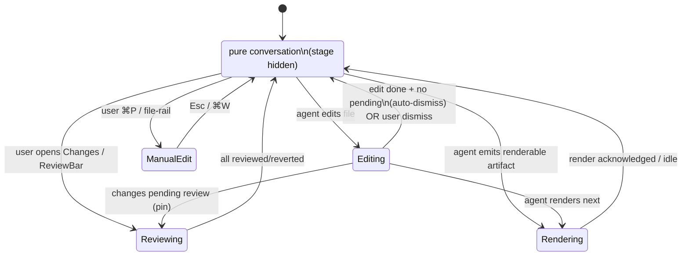

# Code Workspace — Conversation-First Redesign

> **Date:** 2026-08-04
> **Status:** Draft (autonomous design — user review pending)
> **Revises:** UX/interaction layer of [`2026-08-03-code-workspace-design.md`](./2026-08-03-code-workspace-design.md)
> **Scope:** Frontend surface only. Flips the `/code` workspace from *IDE-with-a-chat-sidebar* to *conversation-spine-with-emergent-GUI*.

---

## 1. Motivation

The 2026-08-03 design delivered a browser IDE (file explorer · editor+terminal · agent panel). It
opened with the principle *"Not a chat with code capabilities. A real IDE."* The product has since
shifted: **agent-driven development** is the north star, and the conversation — not the editor — is
where the work actually happens. The IDE shell now fights that reality: the editor is usually empty
or stale, the file tree is rarely touched, and the agent's reasoning is crammed into a 28% sidebar.

This redesign inverts the hierarchy:

| | 2026-08-03 (current) | 2026-08-04 (this design) |
|---|---|---|
| **Primary surface** | Code editor / canvas | **Conversation** |
| **Chat** | Right sidebar, 28%, collapsible | Full-width **spine** |
| **File editing** | Always-on editor pane | **Modal overlay** (⌘P / file-rail only) |
| **File tree** | Persistent left panel | Hidden; **slide-over + ⌘P** |
| **Terminal** | Persistent bottom panel | **Summoned drawer** / stage tab |
| **Diffs / renders** | Editor tabs | **Emergent stage** + inline cards |

The default experience is *terminal-agent*: you talk, the agent works. GUI leverage (inline diffs,
live previews, the project graph, reviewable hunks) appears **exactly when the agent's action
benefits from it, and recedes when it doesn't.** The surface morphs around the agent.

## 2. Relationship to the 2026-08-03 design

**Backend — unchanged, reused as-is.** Everything the 08-03 design specified below the HTTP/WS
boundary is sound and is *not* touched by this redesign:

- `CodeApi` facade, `CodeSessionManager`, `CheckpointManager`, `ChangeTracker`, `PtyManager`,
  `CodeAgentRunner`
- The `code` persona and `coder` CSpace template (`capability/template.rs`)
- All REST (`/api/code/*`) and WS (`/api/code/session/:id/stream`, `/api/code/terminal/:id`)
  contracts and event types (`phase`, `tool_call`, `usage`, `token`, `diff`, `done`, …)
- In-process execution model, host-native FS access, checkpoint/review data model

**Frontend — fully restructured.** The React surface (the `web/src/components/code/**` tree and the
layout store) is replaced per this document. The agent *capabilities* are identical; only how they
are *presented* changes.

> If the 08-03 doc is later promoted from Draft, its backend sections stand; its frontend/layout
> sections are superseded by this document.

## 3. Design principles

1. **Conversation is the spine.** Always present, always primary, always widest. Nothing competes
   with it for attention by default.
2. **GUI is emergent, not persistent.** Editor, preview, canvas, and terminal are *summoned* by the
   agent's current action or by an explicit user command — never on by default. They appear when
   they add value and recede when they don't.
3. **Command-first.** `⌘K` command bar, `⌘P` file access, `/` slash commands. Everything is
   reachable, nothing is forced. The surface is keyboard-driveable like a terminal agent.
4. **Review in flow.** Pending changes are reviewed *where the work happens* — in the stage beside
   the conversation, hunk-by-hunk, without leaving the chat.
5. **One action, two expressions.** Every significant agent action appears both as a compact card in
   the stream (provenance/scrollback) *and* elevated in the stage (focus) when it is the current
   focal artifact. They are the same data, two fidelities.

## 4. The Adaptive Workbench — component architecture

```
┌──────────────────────────────────────────────────────────────────┐
│ WorkspaceBar   ◉ Oxios · project/breadcrumb · model · ⌘K         │
├────┬──────────────────────────────────────┬──────────────────────┤
│ A  │                                      │                      │
│ c  │  ConversationStage                   │  StagePanel          │
│ t  │  (promoted: ConversationView +       │  (emergent, tabbed)  │
│ i  │   AgentInput + ReviewBar)            │   Diff │ Preview │   │
│ v  │                                      │   Canvas │ Terminal  │
│ i  │  …inline ArtifactCards…              │                      │
│ t  │                                      │  ● agent editing     │
│ y  │                                      │  [✓ approve] [reject]│
│    ├──────────────────────────────────────┤                      │
│ R  │  Composer (AgentInput, promoted)     │                      │
│ a  │  model · approval mode · attachments │                      │
│ i  │                                      │                      │
│ l  │                                      │                      │
└────┴──────────────────────────────────────┴──────────────────────┘
   ↑ FileEditorModal (overlay, ⌘P)        ↑ TerminalDrawer (summon)
   ↑ CommandBar (⌘K)                       ↑ FileSlideOver (rail → Files)
```

### 4.1 `WorkbenchShell` (replaces `CodeWorkspace`)

The outer frame. Renders `WorkspaceBar` + `ActivityRail` + a single flex row containing
`ConversationStage` and (conditionally) `StagePanel`. Owns the stage state machine (§5). No
`react-resizable-panels` three-way split — the conversation is not a "panel", it is the canvas;
only the stage is a resizable adjunct when present.

### 4.2 `WorkspaceBar` (slimmed `WorkspaceHeader`)

Project breadcrumb (`oxios / web / src`), model chip with live status dot, and a global `⌘K`
affordance. Drops the editor-centric toolbar (tabs, run button) — those concerns move into the
modal/stage where they belong. Keeps the status essentials (branch, pending-count, agent phase)
as a compact chip group rather than a full status bar; the full `WorkspaceStatusBar` is folded
into a hover/expand detail.

### 4.3 `ActivityRail` (replaces the always-on `FileExplorer` panel)

A 44–48px vertical icon rail, VS-Code-activity-bar style but minimal. Each icon **summons** a
surface rather than hosting a persistent pane:

| Icon | Action |
|---|---|
| Conversation (default active) | Focus the spine |
| Files | Open `FileSlideOver` (ephemeral tree) + jump to ⌘P |
| Terminal | Summon `TerminalDrawer` |
| Changes | Open stage on the *Diff* tab (pending review) |
| Canvas | Open stage on the *Canvas* tab (project graph) |

A small orange badge on Files/Changes signals pending work the agent touched.

### 4.4 `ConversationStage` (promoted `AgentPanel`)

Today `AgentPanel` is a 28% sidebar. It is promoted to the **main column** and widened. It composes
the existing, lightly-retitled pieces:

- `ConversationView` — unchanged renderer; now gets the room it deserves.
- `ReviewBar` — stays, but its "open review" action now opens the stage on the Diff tab instead of a
  side panel.
- `AgentInput` (→ `Composer`) — promoted to a full-width rich composer.

New inline renderer: **`ArtifactCard`** (§4.6) for stream-level provenance of agent actions.

### 4.5 `StagePanel` (the signature: emergent, task-driven)

The single GUI surface that replaces the editor pane, the canvas, and the terminal panel. It is
**not always visible**. It appears when the agent (or user) produces a *focal visual artifact* and
presents it as one of four tabs, chosen by what the artifact is:

| Tab | Shown when | Renders |
|---|---|---|
| **Diff** | Agent edits a file (or user opens Changes) | Hunk view + per-hunk ✓/✗ review |
| **Preview** | Agent produces a renderable artifact (HTML/component/image/design) | Live render (iframe / img / component) |
| **Canvas** | User opens Canvas, or agent maps structure | Existing `ProjectCanvas` (React Flow) |
| **Terminal** | User summons, or agent runs a long-lived command | Existing `TerminalPanel` (xterm) |

A left edge glow + "● agent editing / rendering / running" pulse header makes its *emergent* nature
legible. It is resizable (one separator, conversation-side) and collapsible to icon.

### 4.6 `ArtifactCard` (inline provenance)

A compact card rendered inline in the conversation beneath the assistant message that produced it:
`kind` (edit / read / run / render / search), target path or command, and a one-line summary. For
edits, a 2–3 line diff teaser. Clicking "→ open in stage" elevates the card's artifact into the
`StagePanel`. This guarantees every action has a home in the scrollback even when the stage is
dismissed — satisfying the *terminal-agent* mental model where the transcript is the record.

### 4.7 `FileEditorModal` (the only manual-editing surface)

A full-featured CodeMirror 6 editor presented as a centered modal overlay (not a pane). Entered via
`⌘P` quick-open or `FileSlideOver`. `⌘S` writes back through the existing file-write API; `Esc` /
`⌘W` closes and returns focus to the conversation. Supports the existing editor features (syntax,
tabs within the modal, find). This is the user's escape hatch for hands-on editing — opt-in, never
the default screen.

### 4.8 `CommandBar` (⌘K) and `QuickOpen` (⌘P)

`QuickOpen` is reused (already exists). A new `CommandBar` (⌘K) is the unified entry point: file
open, run terminal, toggle stage tab, switch model, approval mode, slash skills. It is the
keyboard-first surface that lets the whole workbench be driven without the rail.

## 5. Surface states & transitions

The workbench is a small state machine driven by `stage.mode`:



`StageState` (new slice in the layout store, §9):

```ts
type StageMode = 'diff' | 'preview' | 'canvas' | 'terminal' | null
interface StageState {
  mode: StageMode          // null ⇒ stage hidden (pure chat)
  artifactId: string | null // current focal artifact (FileChange / render / canvas / terminal id)
  pinned: boolean          // user pinned; won't auto-dismiss
  source: 'agent' | 'user' // who triggered it (affects auto-dismiss)
}
```

## 6. Stage emergence rules  *(Decision #1 — default; overridable at review)*

**When the stage appears** — only on a *focal visual* action by the agent:

- ✅ file **edit** → Diff tab (the edited file's hunks)
- ✅ **renderable** artifact produced (HTML / component / image / SVG / diagram / design) → Preview
- ✅ **canvas** explicitly opened (structure mapping is user-initiated; not auto)
- ✅ **terminal** explicitly summoned, or agent runs a long-lived/interactive command

**When it does NOT appear** — non-visual agent actions stay as inline `ArtifactCard`s only and never
elevate: file *reads*, `grep`/search results, short one-shot command output, reasoning text, token
usage. The stage is for things you *look at*, not things you *read*.

**Lifecycle / auto-dismiss:**

- While the agent is actively working the focal artifact: stage stays, header pulses.
- On completion: if **no pending changes** ⇒ auto-dismiss after ~5s (or instant on next pure-chat
  turn), returning to full-width conversation. If **changes pending review** ⇒ stage *pins* on Diff
  with the review bar until the user resolves (✓ all / revert).
- User can pin/dismiss manually at any time (`pin` toggles `pinned`; dismiss sets `mode=null`).
- A subsequent agent action with a different artifact swaps the tab/focus; the prior artifact
  remains reachable via its inline `ArtifactCard` ("→ open in stage").

**Rationale:** satisfies "default is just chat" (stage is absent for all non-visual work) while
delivering "GUI leverage for results/renders" precisely when it matters.

## 7. Manual editing model  *(Decision #2 — default; overridable at review)*

- The only path to hands-on editing is `FileEditorModal`: ⌘P quick-open, or Files rail →
  `FileSlideOver` → select. There is no always-visible editor pane.
- Full CodeMirror 6 capabilities inside the modal; multi-tab within the modal is supported.
- `⌘S` persists via the existing file-write contract; unsaved changes warn on close.
- Closing (`Esc` / `⌘W` / overlay click) returns focus to the composer.
- The agent and the user never edit "the same pane": if the agent edits a file the user has open in
  the modal, the modal shows a refreshed/merge-prompt state (reuse checkpoint diff logic).

## 8. Mode structure  *(Decision #3 — default; overridable at review)*

**Keep `/code` as a distinct project-scoped workspace** (`/code/$sessionId`). Do **not** merge with
the general `/chat` mode in this redesign. Rationale: the code workspace carries project context
(working dir, host FS, PTY, checkpoints, diff review, the `coder` CSpace) that general chat does
not, and merging is a larger product decision outside this scope.

**However**, align the conversation component so both modes share one `ConversationView`-based
spine — making a future unification a refactor, not a rewrite. (See §13 Open Questions.)

## 9. Store / state changes

`useCodeLayoutStore` ( persisted) today holds panel booleans (`showExplorer/showCanvas/
showTerminal/showAgent`). Replace the three-way panel model:

```ts
// before
showExplorer, showCanvas, showTerminal, showAgent, toggle*

// after
interface CodeLayoutState {
  stage: StageState                       // §5  (replaces showCanvas/showTerminal center split)
  railExpanded: boolean                   // activity rail icon-rail vs expanded
  fileSlideOverOpen: boolean              // summoned tree
  terminalDrawerOpen: boolean             // summoned terminal
  editorModal: { open: boolean; path: string | null; tabs: EditorTab[] }  // ⌘P modal
  // legacy toggles removed; their callers migrate per §10
}
```

`useCodeSessionStore` is unchanged in shape (messages, pendingChanges, checkpoints, todos,
terminalIds, agentPhase, …). The stage's `artifactId` references existing `pendingChanges` /
render / terminal entries — no new backend types.

## 10. Component migration table

| Current | New | Change |
|---|---|---|
| `CodeWorkspace` (3-panel `Group`) | `WorkbenchShell` | Rewrite layout: rail + conversation + conditional stage |
| `WorkspaceHeader` | `WorkspaceBar` | Slim; drop editor toolbar; add ⌘K |
| `WorkspaceStatusBar` | folded into `WorkspaceBar` chip group | Detail on hover/expand |
| `FileExplorer` (persistent panel) | `ActivityRail` + `FileSlideOver` | Tree becomes summoned slide-over |
| `CodeEditor` (pane) | `FileEditorModal` | Wrap in modal overlay; ⌘P entry only |
| `editor-tabs.tsx` | modal-internal tabs | Move inside `FileEditorModal` |
| `ProjectCanvas` | `StagePanel` Canvas tab | Rehosted; no logic change |
| `TerminalPanel` | `StagePanel` Terminal tab / `TerminalDrawer` | Rehosted; no logic change |
| `AgentPanel` (sidebar) | `ConversationStage` (main) | Promote; widen |
| `ConversationView` | (same) | Unchanged renderer, more width |
| `AgentInput` | `Composer` | Promote to full-width |
| `ReviewBar` | (same, retargeted) | "open review" → stage Diff tab |
| `QuickOpen` | (same) | Reused; opens `FileEditorModal` |
| — (new) | `StagePanel`, `ArtifactCard`, `ActivityRail`, `FileSlideOver`, `CommandBar` | New components |

## 11. Keyboard model

| Key | Action |
|---|---|
| `⌘K` | Command bar |
| `⌘P` | Quick-open file → `FileEditorModal` |
| `⌘\`` | Summon terminal drawer |
| `⌘B` | (was toggle explorer) → toggle `FileSlideOver` |
| `⌘⇧A` | (was toggle agent) → focus composer / toggle stage |
| `⌘1..4` | Stage tabs: Diff / Preview / Canvas / Terminal |
| `Esc` | Dismiss stage (if not pinned) or close modal |
| `⌘S` (in modal) | Save |
| `/` (in composer) | Slash skills/commands |

## 12. Responsive / mobile

On narrow viewports the stage becomes a **full-screen sheet** over the conversation (bottom sheet on
mobile), the activity rail collapses to a bottom nav, and `FileEditorModal` is full-screen. The
"pure chat" default maps cleanly to mobile.

## 13. Scope & non-goals

**In scope:** the `/code` frontend surface redesign; stage state machine; modal editing; command
bar; migration of existing components; layout-store refactor.

**Non-goals (explicit):**
- Any backend change (CodeApi, persona, CSpace, WS/REST contracts, checkpoint model).
- Merging `/chat` and `/code` modes (tracked as a future consideration only).
- New agent capabilities — the agent does exactly what it does today; we only change presentation.
- Persisting per-file editor view state beyond the modal session (deferred).

**Open questions for review:**
- **Q1** Confirm stage auto-dismiss timing (~5s) and the "pin while pending" rule (§6).
- **Q2** Confirm modal-only manual editing (§7) — no optional persistent editor pane.
- **Q3** Confirm keeping `/code` distinct vs merging into `/chat` (§8).
- **Q4** Should an agent *read* of a file the user likely wants to see auto-elevate to stage, or
  stay strictly non-visual? (Current default: strictly non-visual — reads are inline cards only.)

## 14. Rollout (phased)

1. **Scaffold:** `WorkbenchShell` + `ActivityRail` + promoted `ConversationStage`, stage hidden.
   Verify pure-chat parity with today's agent panel (send/stream/tools/review all work).
2. **Stage — Diff:** `StagePanel` Diff tab wired to `pendingChanges` + per-hunk review; `ReviewBar`
   retargeted. Remove the editor pane from the default layout.
3. **Modal editing:** `FileEditorModal` + ⌘P/`FileSlideOver`; delete the persistent editor path.
4. **Stage — Preview/Canvas/Terminal:** rehost the three existing components as stage tabs.
5. **Command bar + polish:** ⌘K, keyboard model, mobile sheets, animations, edge-glow affordances.
6. **Cleanup:** remove dead `react-resizable-panels` three-way wiring and legacy toggles.

Each phase leaves the app fully usable (chat works throughout); the IDE shell is progressively
dismantled rather than big-banged.
