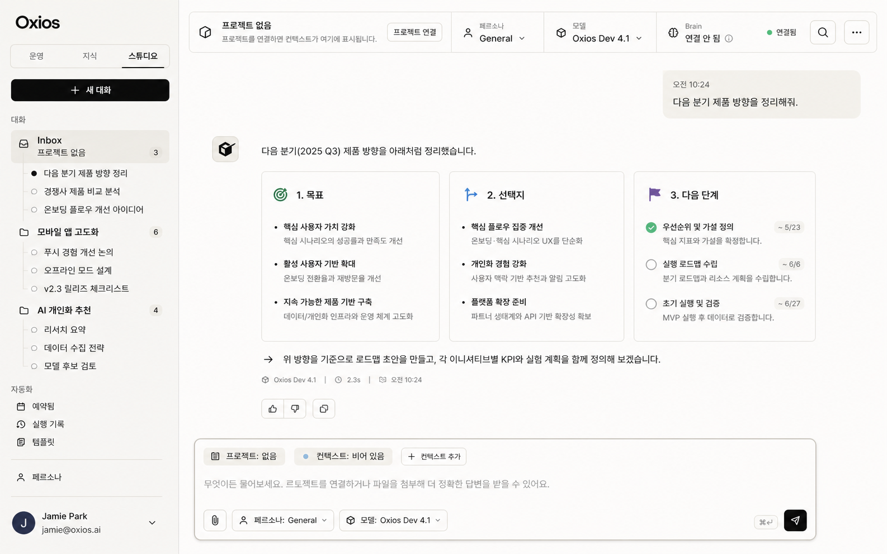
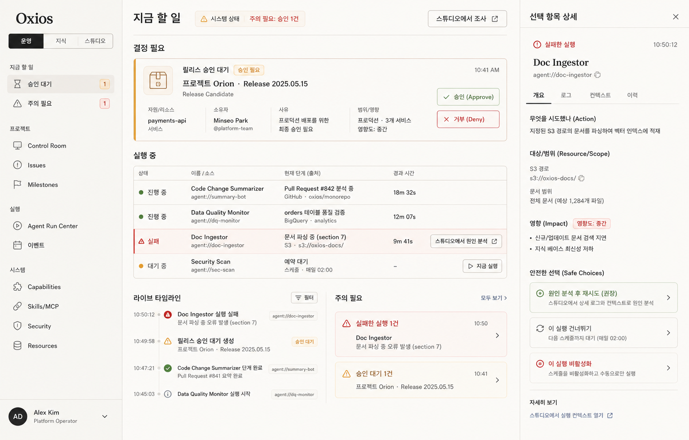
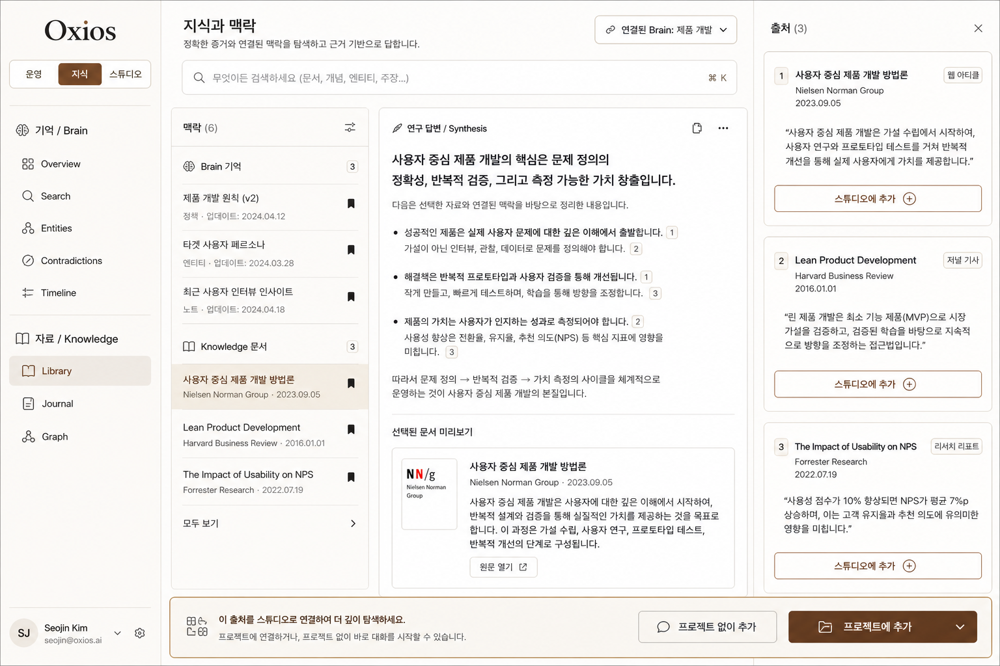
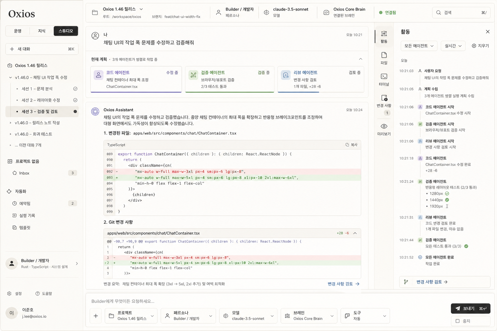

# Oxios Web Information Architecture — Operate, Knowledge, Studio

> **Status:** Proposed — major-version product redesign; implementation deferred
>
> **Date:** 2026-08-31
>
> **Scope:** Shared React web UI, public web route/API vocabulary, and the small
> runtime projections needed to support truthful presentation
> **Language:** English for product and tool surfaces; Korean/English i18n for the UI

## 1. Decision

Oxios moves from technology-named surfaces — **Console**, **Brain**, and
**Chat** — to three user-intent surfaces:

1. **Operate** — decide, supervise, and safely intervene in running work.
2. **Knowledge** — find, inspect, and reuse memory, documents, sources, and
   durable context.
3. **Studio** — start conversations, create work with a persona, bind a
   project when needed, and define recurring prompt automations.

The global surface switcher remains in the existing left sidebar, directly
below the Oxios identity. It is never duplicated in a top header. Switching a
surface replaces the sidebar's navigation tree and its main canvas, while
retaining the same application shell, command palette, toast system, theme,
and responsive navigation model.

This is a clean major-version break. The old route hierarchy, stored sidebar
mode names, client persistence keys, and product-facing `Task` vocabulary are
removed rather than supported through aliases. Durable data is reset or
explicitly re-created as part of the major release; no compatibility shim is
required.

The key product rule is:

> A project is **optional context**, never a prerequisite for Studio.

An unbound Studio conversation is a fully capable first-class state for
general chat, writing, research, planning, and any persona that does not need
local filesystem affordances. Binding a project changes future turns only and
unlocks only the already-authorized project-scoped workbench affordances.

## 2. Why this change

The current shared shell already has useful primitives:

- `ModeTabs` is a three-way sidebar switcher, but exposes implementation terms
  (`Console`, `Brain`, `Chat`).
- `ChatSessionNav` already models the most important Studio navigation: project
  folders, nested conversations, unfiled conversations, and quick actions.
- `BrainNav` correctly keeps agent memory and user knowledge distinct, but the
  split is difficult to understand because both the top-level route and a
  nested pseudo-mode are named `brain`.
- `WorkbenchShell` already proves that a coding profile can add contextual
  surfaces without remounting or replacing the chat transcript.
- `Task` has an instruction, manual/scheduled/heartbeat trigger, and creates
  a `TaskRun` that starts an agent conversation. Product-wise it is an
  automation definition, not a generic project-management ticket.

The current problem is not a missing dashboard or a missing chat feature. It
is that users have to infer the relationship between a conversation, a project,
a scheduled prompt, a resulting agent run, a source document, and an approval
from separate subsystem pages.

The new information architecture uses one continuous loop:

```text
Knowledge — discover context and evidence
      │ add to Studio
      ▼
Studio — converse, create, execute, and schedule an automation
      │ produced run, approval, failure, deliverable
      ▼
Operate — decide and intervene when attention is required
      │ investigate / continue
      └──────────────────────────────────────────────► Studio
```

The loop does not merge the underlying domains. Brain memory remains distinct
from the Knowledge library; Agent lifecycle remains distinct from Automations;
projects remain distinct from sessions. The UI joins them only when a verified
relationship exists.

## 3. Design references

### 3.1 Reference mockups

The following mockups are visual references for hierarchy, density, and shell
composition. They are not literal requirements for copy, data values, or
individual icon choice.

#### Studio — projectless conversation



#### Operate — attention-first command center



#### Knowledge — memory and library evidence workspace



#### Studio — project-bound Builder workbench



### 3.2 Existing designs and ownership

| Design | This document's relationship |
|---|---|
| `DESIGN.md` | Remains the visual-system authority: Oxi semantic tokens, typography, density, dark mode, and accessibility rules apply unchanged. |
| `2026-08-29-project-roots-persona-workbench-design.md` | Retains authority over project roots, execution scope, persona tool profiles, and coding-stage emergence. This document changes its web navigation and visual composition only. |
| `2026-08-29-brain-chat-binding-design.md` | Retains authority over the per-session brain binding and the unbound degradation contract. |
| `2026-08-31-persona-adaptive-chat-surface-design.md` | Its shared transcript, lens, inspector, and content-lane principles become the Studio design in this document. |
| `2026-08-31-operational-surfaces-design.md` | Its Project Control Room, Capability Hub, Run Center, and Readiness concepts move under Operate. Its claim that the global mode set remains Console/Brain/Chat is superseded. |
| `2026-08-31-command-center-dashboard-redesign.md` | Its decision-first command-center rules become the Operate home. |
| `rfc-043-task-management.md` | Runtime scheduling/verification semantics remain useful; its user-facing `Task` navigation and naming are superseded by Automations. Issues and milestones remain project planning records. |

## 4. Product model

### 4.1 Surface, context, and execution are separate

These terms must not be conflated in UI state, URL structure, or runtime
authorization.

| Concept | Meaning | Examples | Grants authority? |
|---|---|---|---|
| Surface | User's current intent and navigation tree | Operate, Knowledge, Studio | No |
| Project | Optional local-work context with zero or more roots | `oxios`, `marketing-site`, no project | Never by itself |
| Studio session | A durable conversation | projectless research chat, project-bound Builder chat | No |
| Persona | Prompt behavior plus resolved tool profile | General, Builder, Researcher, Writer | No; profile only expresses exposed tools |
| Automation | Saved instruction and trigger that launches a run | weekly release brief, daily test report | No; each run passes normal gates |
| Run | One execution of an automation or agent workflow | manual execution, cron execution, heartbeat execution | No; it inherits normal policy |
| Knowledge reference | A source-backed context item | Brain memory, markdown note, citation, artifact | No |

The runtime still resolves permissions from the effective profile, selected
project roots, RBAC, approvals, and tool gates. Presentation surfaces and
cross-surface links are never an authority path.

### 4.2 New user-facing vocabulary

| Retired product word | New product word | Reason |
|---|---|---|
| Console | Operate | Describes the user's decision and supervision task, not an internal control plane. |
| Brain | Knowledge | The top-level goal is finding context and evidence. Brain remains a clearly named subdomain. |
| Chat | Studio | A conversation is the medium for creating and executing work, not the product boundary. |
| Task | Automation | The object is an executable instruction with a trigger, not a generic backlog item. |
| Task run | Automation run | Keeps definition and execution legible together. |
| Unfiled session | No-project conversation | “Unfiled” is an implementation-era filing metaphor; absence of a project is intentional and valid. |

`Issue` and `Milestone` keep their names. They are project planning records,
not scheduled prompt runs.

## 5. Global application shell

### 5.1 Desktop structure

```text
┌──────────────────── left sidebar ────────────────────┬──────── main canvas ────────┐
│ Oxios                                                 │ surface header / content      │
│ [ Operate ] [ Knowledge ] [ Studio ]                 │                               │
│ ──────────────────────────────────────────────────── │                               │
│ selected surface navigation tree                      │ optional inspector / stage    │
│                                                       │ appears only with real focus  │
│                                                       │                               │
│ account · preferences · help                          │                               │
└───────────────────────────────────────────────────────┴──────────────────────────────┘
```

- Sidebar width, collapse behavior, footer, and Oxi sidebar primitives remain
  shared. The expanded mode switcher is a horizontal 3-tab control; the
  collapsed sidebar uses the existing vertical icon activity-bar treatment.
- The selected surface owns the navigation tree below the switcher. There is
  no generic console navigation shown while Studio is active.
- Surface headers show local context and actions only. They never repeat the
  global Operate/Knowledge/Studio switcher.
- Optional inspectors consume no width until a selected item or explicit user
  action makes them relevant. At smaller widths they become accessible sheets.
- The current `PortalPanel` remains the host for global search and knowledge
  browse flows. A surface inspector is not a second global navigation stack.

### 5.2 Mobile structure

Mobile preserves the same surface model:

- `BottomNav` uses Operate, Knowledge, and Studio rather than the legacy names.
- The sidebar drawer contains only the selected surface's local tree.
- Studio composer remains above the bottom navigation without overlap.
- Inspectors and coding stages become full-height sheets with an explicit close
  control and focus return to their triggering row.
- No surface receives a special mobile-only information architecture; lists and
  panes reflow but maintain the same ownership.

### 5.3 Global command palette

`⌘K`/`Ctrl+K` is the fast cross-surface entry point.

| Scope | Primary verb | Examples |
|---|---|---|
| Operate | Open / Inspect | open approval, inspect failed run, open a project Control Room |
| Knowledge | Find | search memory, open a note, add a source to Studio |
| Studio | Start / Run | new conversation, open automation, run now, switch persona |

Plain text entered while Studio is active starts a new projectless conversation
when no existing editor has focus, preserving the current chat-primary shortcut
behavior. It never silently creates a project.

## 6. Operate

### 6.1 Purpose

Operate answers: **“What requires my decision or intervention now?”** It is an
exception-first command center, not an equal-weight collection of telemetry
cards and not the canonical editor for every system object.

### 6.2 Sidebar tree

```text
Operate
├── Now
│   ├── Attention
│   └── Recent activity
├── Projects
│   ├── All projects
│   ├── Control Rooms
│   ├── Issues
│   └── Milestones
├── Runs
│   ├── Run Center
│   └── Events
└── System
    ├── Capabilities
    ├── Connections
    ├── Skills and MCP
    ├── Security
    ├── Resources and cost
    └── Settings
```

`Attention` is the Operate landing route. It contains only source-backed
pending approvals, explicit failures, waiting input, quota/budget blocks, and
defined long-running states. Healthy work belongs lower in the scan order; an
empty success panel is not rendered just to fill space.

### 6.3 Primary views

| View | User question | Main composition | Canonical deep detail |
|---|---|---|---|
| Attention | What needs me now? | pending decisions, exceptional runs, concise event context | approval, run trace, automation definition |
| Project Control Room | What is blocking this one project? | outcome, source-backed checkpoints, active runs, changes, deliverables | project settings, issue, milestone, Git |
| Run Center | Which executions need intervention? | attention queue, active/recent runs, bounded inspector | agent detail and trace |
| Capability Hub | What can Oxios use and why? | source-labelled capability rows, policy/usage/impact inspector | MCP, connection, skill, security settings |
| Readiness | Is a project ready for meaningful work? | root, model, profile, skill, connection, policy checks | owning configuration pages |

The Run Center displays automation runs as executions, but a row deep-links to
its Automation definition in Studio. It does not edit trigger schedules or
instructions inline.

### 6.4 Operate inspector contract

Every decision inspector follows this order:

1. what action or state needs attention;
2. owner and originating project/session/automation, when recorded;
3. resource and exact scope;
4. rationale and impact;
5. safe reversible choice(s);
6. a link to the canonical deep-detail route; and
7. when investigation is appropriate, `Investigate in Studio` with a
   structured launch intent.

Missing provenance is omitted. The UI must never infer a project from a run
name, a current browser route, or a user-visible label.

## 7. Knowledge

### 7.1 Purpose

Knowledge answers: **“What do we know, what supports it, and how can I reuse
it?”** It is a context-and-evidence workspace, not a merged database.

### 7.2 Sidebar tree

```text
Knowledge
├── Memory / Brain
│   ├── Overview
│   ├── Search
│   ├── Entities
│   ├── Contradictions
│   └── Timeline
└── Library / Knowledge
    ├── Library
    ├── Journal
    ├── Graph
    └── Assets
```

Memory contains the external oxibrain-backed agent memory surface. Library
contains user-facing KnowledgeBase documents. The labels, icons, source
badges, and empty states must make the difference explicit:

- a memory item may be recalled or linked to a Brain space;
- a library document has a path, authoring/editing affordance, and backlinks;
- neither is silently copied into the other.

### 7.3 Knowledge workspace

The default Knowledge home has three responsive panes:

1. **Context list** — grouped Brain memories and Knowledge documents, with
   explicit source type badges and a common query result ordering.
2. **Reader/synthesis canvas** — the selected document or an evidence-backed
   synthesis with inline source markers.
3. **Source inspector** — source title, publisher/domain, date, excerpt,
   backing type, and the allowed next action.

The key action is `Add to Studio`. It opens a launch sheet offering:

- **Start without a project** — creates/reuses a projectless Studio session and
  attaches the selected context reference;
- **Add to current Studio conversation** — available when a Studio session is
  active in browser state;
- **Choose project and conversation** — explicit project/session selection.

Knowledge never constructs a fake confidence score. Coverage, disagreement,
retrieval scores, and dates render only when a source contract supplies them.

## 8. Studio

### 8.1 Purpose

Studio answers: **“What should we make or execute together now?”** It is the
primary creation surface and contains:

- one-off projectless conversations;
- project-bound conversation-first workbenches;
- persona selection and management;
- Automations: reusable/scheduled prompt execution definitions and their run
  records;
- turn-generated artifacts and exports.

Studio never requires a project just to open a conversation. It also never
turns into a permanent IDE or hides conversation when a code profile is active.

### 8.2 Sidebar tree

```text
Studio
├── + New conversation
├── Conversations
│   ├── No project
│   │   └── projectless conversation rows
│   └── Projects
│       └── project folder → nested conversation rows
├── Automations
│   ├── Scheduled
│   ├── Run history
│   ├── Templates
│   └── New automation
├── Personas
└── Artifacts
```

The Studio tree uses the existing `ChatSessionNav` project grouping as the
starting point. “No project” replaces “Unfiled,” appears above project folders,
and is an intentional destination rather than a fallback bucket.

### 8.3 Projectless Studio conversation

Projectless is a complete happy path.

```text
Context bar: [ No project ] [ General / selected persona ] [ model ] [ Brain optional ]
Transcript:  normal user intent → agent activity → structured response
Composer:    add source · attach a project · persona · model · send
```

- Default persona is General; the user may select Writer, Researcher, Planner,
  or any other persona allowed by the server.
- The project chip says `No project` and provides `Attach project`. It never
  displays a warning merely because roots are absent.
- File picker, terminal, diff, worktree fan-out, and Git controls are absent
  unless the effective profile and an explicit project root authorize them.
- Brain may be bound or unbound. An unbound Brain shows a neutral `Not
  connected` state and retains the existing no-recall/no-write contract.
- A user can attach a project later. The binding affects future turns only;
  the old transcript is not reinterpreted or moved.

### 8.4 Project-bound Studio conversation

The `WorkbenchShell` pattern remains the implementation foundation. A
project-bound session with a code/review/terminal affordance renders:

```text
Studio context bar: project · root summary · branch/status · persona · model · brain
Activity rail:      Conversation | Files | Terminal | Changes | Preview
Main canvas:        shared transcript and composer — always present and widest
Emergent stage:     diff | preview | terminal — only when a real artifact or action needs it
Inspector:          Activity | Review | Sources | Context, on demand
```

The coding persona is not “chatless.” Its user intent, agent progress, code
blocks, terminal/tool output, review request, and final answer are all ordered
in the same transcript. Code, tables, tool output, diffs, and artifacts may
use a work-width lane; explanatory prose remains at a readable line length.

### 8.5 Persona presentation lenses

Extend the already server-derived `EffectiveProfile` with an explicitly
presentation-only field:

```ts
type PresentationLens = 'general' | 'code' | 'research' | 'operations' | 'writing'

interface EffectiveProfile {
  persona_id: string
  tool_profile: 'base' | 'code' | 'minimal' | 'control'
  affordances: Affordance[]
  presentation_lens: PresentationLens
}
```

The server resolves this from the effective persona/profile and sends it with
the existing session and completion snapshots. The client defaults a missing
field to `general` during rollout. It must never infer the visual lens from a
persona display name or category.

| Lens | Main emphasis | Inspector/focus rule |
|---|---|---|
| General | calm projectless or light-context conversation | Context on explicit open only |
| Code | tool activity, code, diffs, review | Activity during a live run; Review when changes await action |
| Research | synthesis, claims, citations, coverage when supplied | Sources only when the selected turn has references |
| Operations | approval, action history, safe intervention | Activity when real state exists |
| Writing | draft, outline, revision intent | Outline only when a real structured outline exists |

Lenses change hierarchy and affordances presentation; they do not change
permissions, project scope, model access, or approval policy.

### 8.6 Studio turn anatomy

Every substantive turn uses the same ordered anatomy:

1. user intent, attachments, and turn-command label;
2. one truthful active-turn activity state;
3. assistant result header with visible model/outcome/duration provenance;
4. ordered reasoning, tools, source, display, and artifact blocks;
5. review/citations/error/follow-up outcome; and
6. optional inspector focus request based only on present data.

System command notices remain compact centered rows. Completed message actions
remain hover/focus revealed. Older turns never animate.

### 8.7 Automations

Automations are the renamed user-facing Task domain. An Automation is a saved
instruction with a manual, scheduled, or heartbeat trigger that creates an
Automation Run and an associated agent conversation.

#### Automation definition

```rust
pub struct Automation {
    pub id: AutomationId,
    pub name: String,
    pub instruction: String,
    pub description: Option<String>,
    pub trigger: AutomationTrigger,       // manual | cron | heartbeat
    pub cron_pattern: Option<String>,
    pub timezone: Option<String>,
    pub heartbeat_interval_secs: Option<u64>,
    pub max_executions: Option<u32>,
    pub persona_id: Option<String>,
    pub project_id: Option<ProjectId>,    // optional, never ambient
    pub brain_space: Option<String>,      // optional
    pub approval_mode: ApprovalMode,
    pub verify: AutomationVerifyConfig,
    pub status: AutomationStatus,         // active | paused | exhausted | failed
    pub next_run_at: Option<DateTime<Utc>>,
    pub last_run_at: Option<DateTime<Utc>>,
}
```

`AutomationRun` carries the trigger, immutable context snapshot, linked Studio
session, lifecycle status, summary, error, token/cost data, and timestamps.
The run never reads mutable project/persona state midway through execution.

#### Automation Studio views

| View | Main content | Primary actions |
|---|---|---|
| Scheduled | active/paused definitions, next run, last outcome, project/persona context | pause, run now, open definition |
| Run history | chronological runs with truthful status and linked Studio session | inspect, open in Operate, retry where allowed |
| Templates | reusable starting instructions | preview, use template |
| Definition editor | instruction, trigger, context, verification, notifications, preview of consequences | save, test run, schedule/pause |

The definition editor must show `No project` as an intentional target. A
projectless scheduled research or writing automation is valid. Selecting a
project only requests context; every later tool call remains gated normally.

Automation runs appear in Operate only when they are exceptional or selected
for supervision. Normal definition management stays in Studio.

## 9. Cross-surface handoffs

Cross-surface navigation uses a typed launch intent, not text pasted into a
prompt and not a guessed current-browser context.

```ts
interface StudioLaunchIntent {
  source: 'operate' | 'knowledge' | 'automation' | 'project'
  projectId?: string
  automationId?: string
  runId?: string
  sessionId?: string
  contextRefs?: Array<
    | { kind: 'brain-memory'; id: string }
    | { kind: 'knowledge-document'; path: string }
    | { kind: 'citation'; turnId: string; citationId: string }
    | { kind: 'artifact'; id: string }
  >
  initialPrompt?: string
}
```

The receiving Studio route validates each referenced object, resolves only
objects the user can access, and shows a visible context strip before sending a
turn. Invalid/stale references become removable unavailable chips; they never
silently bind a different project or source.

| Origin | Link/action | Result |
|---|---|---|
| Operate approval/run | Investigate in Studio | opens existing linked session or a new session with the recorded project/run context |
| Knowledge source | Add to Studio | explicit projectless/current/choose-project destination sheet |
| Studio run/result | Open in Operate | opens the relevant attention/run/project view, preserving source ID |
| Studio deliverable | Save to Knowledge | opens a metadata confirmation before writing/linking into the library |
| Project Control Room | Start in Studio | new session with that project, no implicit persona override |

## 10. Route and navigation contract

### 10.1 New route tree

```text
/operate
/operate/projects
/operate/projects/:projectId
/operate/projects/:projectId/issues
/operate/projects/:projectId/milestones
/operate/runs
/operate/events
/operate/capabilities
/operate/readiness/:projectId
/operate/system/connections
/operate/system/skills
/operate/system/mcp
/operate/system/security
/operate/system/resources
/operate/system/settings

/knowledge
/knowledge/memory
/knowledge/memory/search
/knowledge/memory/entities
/knowledge/memory/contradictions
/knowledge/memory/timeline
/knowledge/library
/knowledge/library/journal
/knowledge/library/graph
/knowledge/library/assets

/studio
/studio/sessions/:sessionId
/studio/automations
/studio/automations/:automationId
/studio/automations/templates
/studio/personas
/studio/artifacts
```

`/studio` resolves to the last open Studio session when one exists, otherwise
to a fresh projectless conversation. A new conversation receives no implicit
project binding.

### 10.2 Destructive route removal

The following public routes are removed in the major release. No redirect or
compatibility alias is shipped; browser history may 404 after upgrade.

| Removed route family | Replacement |
|---|---|
| `/` | `/operate` |
| `/agents`, `/agents/:id`, `/agents/:id/trace` | `/operate/runs` and selected Run inspector/deep detail |
| `/projects`, `/projects/:id` | `/operate/projects` and Control Room |
| `/tasks` | `/studio/automations` |
| `/chat`, `/sessions` | `/studio` and `/studio/sessions/:id` |
| `/brain/*`, `/knowledge/*` | `/knowledge/memory/*` and `/knowledge/library/*` |
| `/personas` | `/studio/personas` |
| `/mcp`, `/skills`, `/security`, `/resources`, `/budget`, `/settings`, `/email`, `/marketplace` | matching `/operate/system/*` route |
| `/git`, `/workspace` | project-scoped Operate/Studio affordance; no global workspace mode |

Routes that only differ in visual ownership must reuse the existing data API
until the public API vocabulary is deliberately renamed. Route removal is a UI
and browser contract break; it is not permission to delete user data during an
ordinary navigation request.

## 11. Data and API changes

### 11.1 Surface-level API changes

The web client exposes no `console`, `brain`, `chat`, or `task` terms in new
user-facing API shapes.

| Old endpoint/domain | New endpoint/domain | Decision |
|---|---|---|
| `/api/tasks` | `/api/automations` | Rename handlers, web hooks, response types, tool/API copy, and kernel facade in the same major release. |
| `/api/tasks/:id/runs` | `/api/automations/:id/runs` | Rename with immutable run snapshots. |
| task tool | automation tool | Rename registered user-facing tool name and capability descriptor together. |
| effective profile | effective profile + `presentation_lens` | Additive field; defaults to `general` only while the release is being assembled. |
| dashboard projections | `/api/operate/*` projections | Read-only, source-labelled views for attention/runs/control rooms/capabilities. |
| Studio launch | `POST /api/studio/launch` or typed client-side intent resolver | Must validate IDs and preserve explicit origin; no free-text inferred binding. |

The desired kernel rename is deliberate: `TaskStore`, `TaskRunner`,
`TaskTool`, `TaskRun`, `TaskStatus`, and related module/file names become
`AutomationStore`, `AutomationRunner`, `AutomationTool`, `AutomationRun`, and
`AutomationStatus`. `Issue` is not renamed. `Task` aliases are prohibited in
the new codebase after the major cutover.

### 11.2 Required projections

Do not build client-side N+1 joins or invent relationships. Add focused
read-only projections only where existing APIs cannot produce a truthful view.

| Projection | Required fields | Constraints |
|---|---|---|
| `GET /api/operate/attention` | reason kind, source ID, state, timestamp, owner/origin when known, safe actions | no heuristic “stalled” state before a backend contract |
| `GET /api/operate/runs` | agent/run identity, lifecycle, current source-backed step, elapsed time, linked automation/project/session | redact raw command arguments and unauthorised paths |
| `GET /api/operate/projects/:id/context` | roots/Git summary, linked blockers, runs, deliverables, approvals | omit unrecorded links; project roots remain authoritative |
| `GET /api/operate/capabilities` | source family, readiness, scope/policy, verified usage links, canonical deep route | never leak OAuth tokens, secrets, or redacted audit data |
| `GET /api/knowledge/context` | source kind, title/path, date, excerpt, relation metadata | keep Brain and library source types distinct |

All projections belong to `src/api/routes/` and draw from existing
`KernelHandle` APIs/stores. They create no second event bus, scheduler,
lifecycle manager, structured tool result channel, or source of authority.

### 11.3 Persistence reset rules

Because this is a major clean break:

- Delete persisted browser keys for `oxios-sidebar`, legacy mode state, old
  chat drafts, selected portal panels, and legacy route restore state.
- Do not create `console`/`brain`/`chat` route redirects or state translators.
- The release process explicitly chooses either a fresh Oxios application
  state directory or a one-time export/import of only durable records that
  match the new schema. No transparent migration is promised.
- Never delete arbitrary user project roots, library documents, or credentials
  as part of a UI reset. Any destructive release/reset command must name and
  confirm its exact Oxios-managed target separately.

## 12. Frontend architecture

### 12.1 Replace the legacy mode switch

| Current file/component | New responsibility |
|---|---|
| `web/src/stores/sidebar.ts` | Replace `SidebarMode = console | brain | knowledge | chat` with `SurfaceId = operate | knowledge | studio`; remove the `knowledge` pseudo-mode. Derive surface from the new route tree. |
| `web/src/components/layout/mode-tabs.tsx` | Rename to `surface-switcher.tsx`; render Operate/Knowledge/Studio labels and canonical new hrefs. |
| `web/src/components/layout/bottom-nav.tsx` | Reuse `SURFACES`; maintain the same mobile behavior and no duplicate drawer switcher. |
| `web/src/components/layout/sidebar.tsx` | Replace inline `ConsoleNav`/`BrainNav`/`ChatSessionNav` branching with a `SurfaceSidebar` composition boundary. |
| `web/src/components/layout/app-layout.tsx` | Keep the one shared shell/outlet; make route-local headers responsible for context, not global mode tabs. |

Target composition:

```tsx
<AppLayout>
  <Sidebar>
    <SurfaceSwitcher active={surface} />
    <SurfaceSidebar surface={surface} />
  </Sidebar>
  <SurfaceOutlet />
  <BottomNav surfaces={SURFACES} />
</AppLayout>
```

### 12.2 New frontend boundaries

| Boundary | Responsibility | Existing building blocks |
|---|---|---|
| `OperateSidebar` | Operate navigation groups and badges | console nav groups, sidebar primitives |
| `KnowledgeSidebar` | explicit Memory/Library separation | BrainNav, KnowledgeNav, file tree |
| `StudioSidebar` | conversation tree, no-project section, automations/personas/artifacts entry points | ChatSessionNav, project/session queries |
| `StudioShell` | stable context bar, transcript viewport, inspector, composer | ChatPage, WorkbenchShell, PortalPanel |
| `StudioContextBar` | project/persona/model/brain/connection state and local actions | project/persona/model/brain hooks |
| `StudioInspector` | Context/Sources/Activity/Outline/Review tabs from actual turn data | Portal view primitives, BlockStream metadata |
| `AutomationCenter` | definition list, detail, schedule, templates, run history | current tasks route/hooks/components, schedule editor |
| `OperateAttention` | action-first home | dashboard approval/agent/event hooks |
| `ProjectControlRoom` | project-scoped work and decision view | project, Git, issue, milestone, run, approval hooks |
| `KnowledgeWorkspace` | source list, reader, source inspector, Studio handoff | Brain and Knowledge hooks |
| `StudioLaunchSheet` | explicit projectless/current/choose-project target selection | session/project selectors, context attachments |

### 12.3 Studio transcript refactor

`web/src/routes/chat.tsx` is replaced by a Studio route but retains the
existing critical behavior:

- same session ID is the streaming sink, turn registry, persistence, and
  execution identity;
- session switching anchors once and preserves scroll behavior;
- cancellation stops the real server-side turn and renders partial output as
  interrupted;
- block ordering remains reasoning → tools → sources → display → artifacts;
- loading skeleton, error/retry, compression, interview, approvals, and path
  access remain transcript-order blocks;
- `WorkbenchShell` preserves the transcript DOM node as profile chrome changes.

Refactor display composition into `StudioShell`, `StudioTranscriptViewport`,
`TurnFrame`, `TurnResultHeader`, and `StudioComposer`. Do not create a second
message store or persona-specific renderer tree.

### 12.4 Width and density rules

The current uniform `max-w-3xl` route wrapper is replaced by content lanes:

| Lane | Target desktop measure | Uses |
|---|---:|---|
| Reading lane | 680–760px | user intent, prose response, writing draft, short research synthesis |
| Work lane | 1080–1240px, bounded by active stage/inspector | code, tables, tool output, diffs, images, artifacts, source comparisons |

The block chooses its lane. A persona does not force all content wide. Rich
output never remains narrow only because it is inside chat bubble chrome.

### 12.5 i18n and accessibility

- Rename the i18n namespaces and keys in the same cutover; no English source
  fallback is acceptable for primary surface labels.
- Tool/API errors remain English at their source. Surrounding UI explanation,
  button labels, empty states, and recovery copy remain bilingual.
- Status always combines text, icon, and Oxi semantic color. Use the existing
  APCA-safe `-on-surface` tokens for status text on neutral surfaces.
- `role=log`, concise `aria-live` turn status, keyboard-visible selection,
  focus return from inspector sheets, and reduced-motion behavior remain
  mandatory.
- Components use semantic Tailwind utilities; no raw color literals or
  component-level `dark:` classes.

## 13. State, error, and security rules

### 13.1 Truthful no-data states

| Situation | Required UI |
|---|---|
| No project Studio conversation | neutral `No project`; attach action; no missing-setup warning |
| Project with zero roots | folderless project context; no filesystem/Git controls |
| Unbound Brain | `Not connected`; no false recall/search or implicit fallback space |
| No automation runs | quiet empty state plus create/test automation action |
| No attention items | omit attention queue; retain readable system state |
| Missing source relationship | omit the relation; do not infer from name/path/route |
| Missing optional projection field | `Unavailable`/omitted row; never invented owner/progress/health |
| Partial API failure | fail only affected panel; leave other source-backed panels usable |

### 13.2 Security invariants

- Project binding does not grant a filesystem root. Runtime authorization keeps
  intersecting project roots with RBAC and approval policy.
- Persona/lens selection does not grant a tool. UI visibility follows the
  server-derived profile; direct tool calls remain gated.
- Studio handoffs validate every reference and never turn a source document
  into ambient project access.
- Capability Hub and Operate inspect/explain policy; their mutations reuse
  canonical Security/MCP/connection endpoints and audit records.
- Automation runs snapshot context at start. Editing an Automation changes only
  later runs; it cannot alter an in-flight agent's scope.
- Inspectors and projections redact secrets, credentials, sensitive arguments,
  and inaccessible paths.

## 14. Implementation order

This ordering is designed for a clean major branch/worktree. Do not mix it
with a compatibility migration.

1. **Freeze contracts.** Add new route types, `SurfaceId`, `PresentationLens`,
   explicit Studio launch intent, and Automation domain/API naming. Remove old
   public aliases in the same commit range.
2. **Rename automation domain.** Rename kernel modules, tool descriptor and
   registration names, API handlers, web types/hooks/components/tests, i18n,
   and user documentation from Task to Automation. Preserve Issue/Milestone.
3. **Build shared surface shell.** Replace ModeTabs/sidebar mode derivation,
   bottom navigation, command palette surface verbs, and route tree. Add
   independent `OperateSidebar`, `KnowledgeSidebar`, and `StudioSidebar`.
4. **Ship Studio first.** Port chat route/state into Studio, make no-project
   conversation the default, retain workbench profile gates, then add the
   context bar, lanes, inspector, and explicit project attach flow.
5. **Add Automation Center.** Convert the existing task list/detail/editor/run
   history into Studio Automations, then connect its runs to Studio sessions
   and Operate exception links.
6. **Build Knowledge workspace.** Compose Brain and library source panes,
   reader/inspector, and validated Add-to-Studio handoff.
7. **Build Operate.** Implement Attention, Project Control Room, Run Center,
   Capability Hub, and Readiness using existing APIs first; add only the
   source-labelled projections in §11.2 that are proved necessary.
8. **Remove legacy.** Delete old routes, old mode components, old persisted
   browser keys, old i18n, and old tests. Confirm repository-wide absence of
   `console`, `brain` as a top-level surface, `chat` as a top-level surface,
   and user-facing `task` terminology.
9. **Release cleanly.** Cut a major version, publish explicit reset/export
   instructions, perform first-boot smoke tests, and verify no state reset can
   target arbitrary user folders or credentials.

## 15. Verification matrix

### Contract and backend

- Automation create/list/update/pause/schedule/heartbeat/run/verify paths;
  an Automation Run snapshots persona/project/brain/approval context.
- No-project Automation run and project-bound Automation run both obey normal
  profile/RBAC/root gates.
- `PresentationLens` arrives through session load and turn completion; absent
  value safely displays as General.
- Operate projections omit unknown relationships and redact sensitive data.
- Studio launch intent validates deleted projects, stale sources, removed Brain
  spaces, and inaccessible artifacts without fallback binding.
- No legacy public task tool, task route, or top-level mode API remains.

### Web unit/component

- Surface derivation and mobile/desktop switchers select only
  `operate | knowledge | studio`.
- Each sidebar renders the correct tree, keyboard order, collapsed tooltips,
  and correct active route.
- Projectless Studio omits filesystem controls but supports persona/model/Brain
  state and source attachments.
- Project attachment changes only future turn context and does not remount the
  transcript or lose scroll position.
- Work-width blocks expand code/table/tool/diff content while prose stays on
  the reading lane.
- Studio inspector honors explicit user close and shows only real sources,
  activity, outline, or review data.
- Automation lists and detail states distinguish definition state from run
  state; an inactive schedule is never rendered as a healthy run.
- Knowledge source cards correctly expose projectless/current/choose-project
  handoffs.
- Operate attention ordering and action failures are tested against absent,
  failed, approval, and running source records.

### Browser smoke tests

1. Cold start opens Studio with a projectless conversation; send a General
   turn, then attach a project and confirm only the next turn receives it.
2. Switch General → Builder in an existing project session; transcript remains
   mounted, coding workbench appears only with server-derived affordances.
3. Create a projectless research Automation, test-run it, schedule it, inspect
   its run session, and then open an exceptional run in Operate.
4. From Knowledge, add a library source to a projectless Studio session; repeat
   with a chosen project; verify each visible context chip matches the source.
5. Resolve/deny an approval in Operate, inspect its exact scope/impact, and
   launch an investigation in Studio without inventing a project link.
6. Test no roots, no Brain, no attention items, no sources, missing
   projections, SSE disconnect, tool error, cancellation, and retry.
7. Repeat essential flows at desktop, tablet, and mobile widths in light and
   dark themes, with keyboard-only navigation and reduced motion enabled.

### Release gates

Run the complete repository gates from `AGENTS.md` after implementation:

```text
cargo fmt --all -- --check
cargo clippy --workspace --all-features -- -D warnings
cargo check --workspace --all-features
cargo nextest run --workspace --no-fail-fast
cargo test --workspace --doc

cd web
bun install --frozen-lockfile
bun run typecheck
bun run test
bun run lint
bun run build
```

Run `cargo audit` and `cargo deny check` as the final Rust dependency gate.

## 16. Acceptance criteria

1. The sidebar presents Operate, Knowledge, and Studio in one stable position
   on desktop and mobile; no duplicate top-level navigation remains.
2. A user can start and complete a useful projectless Studio conversation
   without a warning, pseudo-project, hidden workspace, or lost capability.
3. Binding a project remains explicit and changes only future turn scope;
   unbound and folderless states never surface false local-tool controls.
4. Studio is conversation-first for every persona, including Builder; rich
   outputs are structured and readable rather than crammed into bubbles.
5. Automations are visibly defined as scheduled/heartbeat/manual prompt
   executions in Studio; Operate shows their exceptional runs, not a duplicate
   schedule editor.
6. Knowledge makes Brain memory and the document library distinct while making
   their reuse in Studio obvious and safe.
7. Operate places human decisions and exceptional execution before passive
   metrics, with exact source, owner, scope, and canonical deep-detail links.
8. All cross-surface transitions preserve typed provenance and never infer
   authority, project membership, source trust, or lifecycle state.
9. The major release contains no legacy mode route, compatibility alias, or
   user-facing `Task` terminology.
