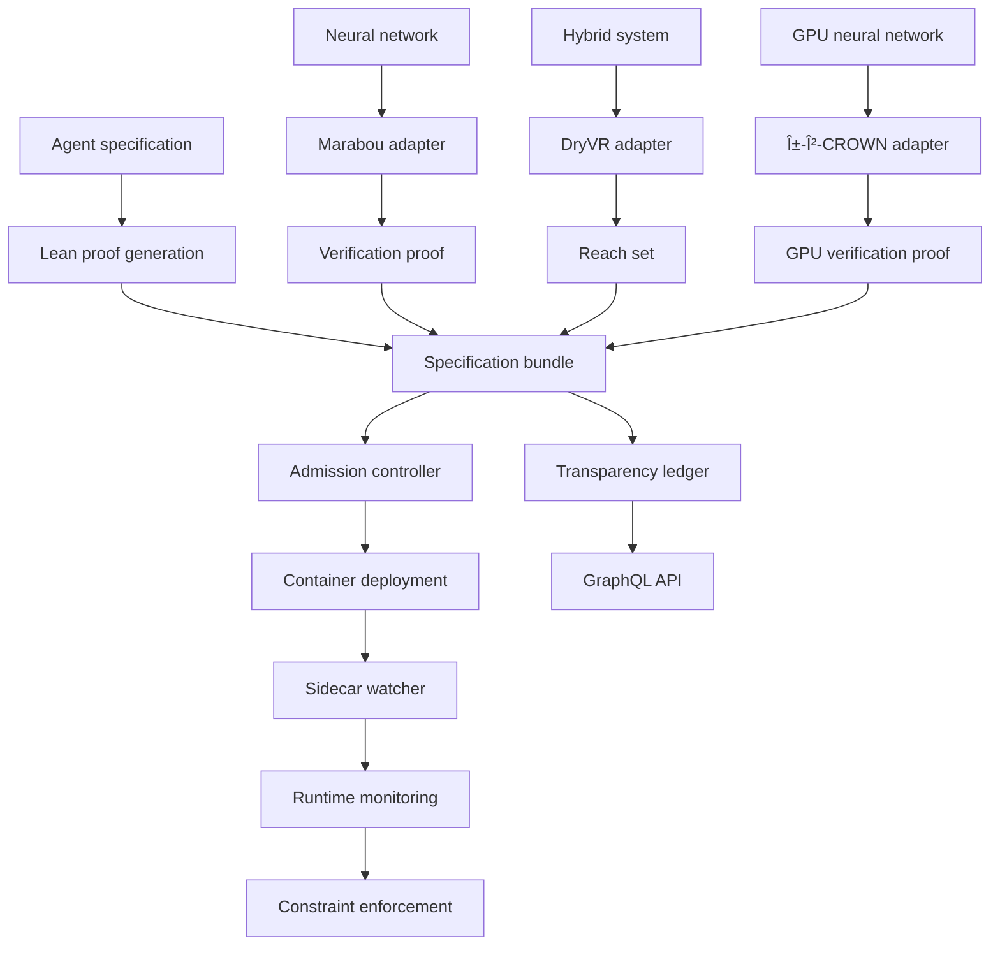

<div align="center">

<!-- readme-banner: Provability Fabric spine (94 cols; regen: .github/assets/_build_banner.py) -->
<pre>
##############################################################################################
#                                                                                            #
#              ___                  _    _ _ _ _          ___     _        _                 #
#             | _ \_ _ _____ ____ _| |__(_) (_) |_ _  _  | __|_ _| |__ _ _(_)__              #
#             |  _/ '_/ _ \ V / _` | '_ \ | | |  _| || | | _/ _` | '_ \ '_| / _|             #
#             |_| |_| \___/\_/\__,_|_.__/_|_|_|\__|\_, | |_|\__,_|_.__/_| |_\__|             #
#                                                   |__/                                     #
#                                                                                            #
##############################################################################################
</pre>

# Provability Fabric

**Formal specs, runtime policy, and evidence trails** — Lean specifications and proofs where present, fail-closed crypto by default, and auditable evidence in one open stack.

<sub>Guarantees are conditional on configured trust roots and deployment policy. Lean in-repo does not mean every production path is proven end-to-end. See [Evidence non-claims](docs/roadmap/evidence-v0.2-status.md#explicit-non-claims) and [deployment trust](docs/guides/deployment-guide.md#production-trust-chain-environment-f01--f02).</sub>

<br/>

[](LICENSE)
[](https://provability-fabric.org)
[](https://github.com/SentinelOps-CI/provability-fabric)
[](.github/workflows/lean-morph.yml)
[](#)

<br/>


<br/>

[Documentation](https://provability-fabric.org) · [Contributing](CONTRIBUTING.md) · [Security](SECURITY.md) · [CI reference](docs/reference/ci-reference.md)

</div>

---

## Why this project

Provability Fabric ties **specifications and proofs** to **what actually runs**. You get Lean-backed bundles, sidecars and admission control that enforce policy, and trails you can replay and verify as structured evidence instead of informal logging alone.

| Pillar | What it gives you |
| :--- | :--- |
| **Prove** | Specifications and Lean proofs live next to agent bundles so claims stay checkable against formal artifacts. |
| **Enforce** | Rust and Go runtimes, WASM sandboxing, and tooling brokers limit what agents can do at execution time. |
| **Audit** | Evidence formats, ledgers, and replay-oriented workflows support end-to-end accountability. |

---

## Repository layout

Intentional top-level surface (everything else is product code under these trees):

| Path | Why it stays |
|------|----------------|
| [`core/`](core/) | CLI, SDKs, Lean libs, policy kernel |
| [`runtime/`](runtime/) | Sidecar, ledger, brokers, admission |
| [`adapters/`](adapters/) | Framework / protocol adapters |
| [`services/`](services/), [`console/`](console/) | **Platform** — Compose-backed Go APIs (default profile) and admin console (`--profile full`) |

| [`proofs/`](proofs/), [`spec-templates/`](spec-templates/), [`bundles/`](bundles/) | Lean policy proofs and agent bundles |
| [`schemas/`](schemas/), [`config/`](config/), [`api/`](api/), [`specs/`](specs/) | Schemas, protos, evidence specs |
| [`cmd/`](cmd/), [`releaser/`](releaser/) | Specdoc CLI; Nix supply-chain reproducibility helper |
| [`artifact/`](artifact/) | Checked-in DFA export outputs and golden cases |
| [`charts/`](charts/), [`ops/`](ops/) | Helm (`charts/pf-enforce`); Compose Grafana/Prometheus + retention under `ops/` |
| [`external/`](external/) | CERT-V1 / TRACE-REPLAY-KIT submodules |
| [`bench/`](bench/), [`experiments/`](experiments/), [`benchmarks/`](benchmarks/) | SWE-bench / eval / PCS admission |
| [`examples/`](examples/), [`demos/`](demos/), [`testbed/`](testbed/) | CI-backed evidence walkthroughs (`evidence-*`, `forensic-*`, `runtime-*`) and MCP fraud demo |
| [`tests/`](tests/), [`tools/`](tools/), [`scripts/`](scripts/), [`docs/`](docs/) | Verification, tooling, docs |
| [`CLA/`](CLA/), [`.github/`](.github/) | CLA config; CI workflows and shared actions |

Root config stays thin: `README`, `CONTRIBUTING`, `LICENSE`, `Makefile`, `justfile`, `Cargo.toml`, `package.json`, `go.work.example`, `docker-compose.yml`, `mkdocs.yml`, Lean toolchain files.

<details>
<summary><strong>Compact tree</strong> (click to expand)</summary>

```
provability-fabric/
├── core/              # CLI, SDKs, Lean libs
├── runtime/           # Rust / Go / Node services
├── adapters/          # Integration adapters
├── services/ console/   # Platform APIs + admin UI
├── proofs/            # Canonical Policy.lean package
├── charts/            # Helm (pf-enforce)
├── ops/               # Observability + retention only
├── schemas/ config/ api/ specs/
├── cmd/ releaser/ artifact/
├── examples/ demos/ testbed/
├── bench/ experiments/ benchmarks/
├── tests/ tools/ scripts/ docs/
├── CLA/
├── Cargo.toml
├── Makefile
└── lean-toolchain
```

</details>

### Rust workspace

Toolchain: [`rust-toolchain.toml`](rust-toolchain.toml) (stable, clippy, rustfmt).

```bash
cargo build
cargo test --workspace
cargo clippy --workspace -- -D warnings
```

**Members include:** `runtime/attestor`, `runtime/kms-proxy`, `runtime/tool-broker`, `runtime/sidecar-watcher`, `runtime/labeler`, `runtime/wasm-sandbox`, `adapters/http-get`, `adapters/file-read`. Optional or standalone crates (Hyperscan, protoc, fuzz, etc.) are documented in the root [`Cargo.toml`](Cargo.toml) and per-crate READMEs.

### How pieces fit together

- **Minimal (CLI + bundles):** [`core/cli/pf`](core/cli/pf), [`bundles/`](bundles/), [`config/`](config/). See [Reuse and extend](docs/guides/reuse-and-extend.md).
- **Full platform:** Go services under `services/`, admin console, ledger, gateway — use Docker Compose (`make platform-up` / `make full-up`). See [local workflows](docs/dev/local-workflows.md).
- **CLI-only forks:** Can omit `services/`, `console/`, `bench/`, `experiments/`, and `demos/`.

---

## Ecosystem standards

Adopt shared schemas, replay tooling, and CI patterns alongside this repo:

- [CERT-V1](https://github.com/verifiable-ai-ci/CERT-V1) — schema and verifiers  
- [TRACE-REPLAY-KIT](https://github.com/verifiable-ai-ci/TRACE-REPLAY-KIT) — runner and oracles  
- [morph-lean-ci](https://github.com/SentinelOps-CI/morph-lean-ci) — sharded Lean CI  
- [morph-replay-runner](https://github.com/SentinelOps-CI/morph-replay-runner) — branch replays  
- [mcp-sidecar-demo](https://github.com/SentinelOps-CI/mcp-sidecar-demo) — permissions, epochs, IFC  

In-repo: [`docs/specs/standards.md`](docs/specs/standards.md), [`docs/evidence/overview.md`](docs/evidence/overview.md), [`docs/evidence/replay.md`](docs/evidence/replay.md).

### Proof-Carrying Science (PCS)

Verify lab and computation workflows with the `pf` CLI and frozen release fixtures.

```bash
git clone https://github.com/SentinelOps-CI/pcs-core ../pcs-core
export PCS_CORE_PATH=../pcs-core
make demo-pcs
make test-pcs-full    # full local gate; see docs/pcs/release-checklist.md
```

Full PCS documentation lives at [docs/pcs/README.md](docs/pcs/README.md).

---

## Quick start

**Canonical path (3 clicks):** [Getting started (15 min)](docs/getting-started.md) → [Local workflows](docs/dev/local-workflows.md) → [Deployment guide](docs/guides/deployment-guide.md) when you need production trust-chain env.

Prefer Make / Compose targets from those docs over ad-hoc scripts. Longer product concepts: [guides/getting-started.md](docs/guides/getting-started.md).

### Option 1 — Install script

```bash
git clone --recurse-submodules https://github.com/SentinelOps-CI/provability-fabric
cd provability-fabric
make dev-standards   # optional: verify CERT-V1 + TRACE-REPLAY-KIT pins

# Linux / macOS
./scripts/install.sh
./scripts/test-new-user.sh

# Windows (Command Prompt is recommended for install scripts)
scripts\install.bat
scripts\test-new-user.bat
```

Git Bash on Windows can mis-handle paths and execution; prefer **cmd** or **PowerShell** for `install.bat` / `test-new-user.bat`. For Git Bash issues: `bash scripts/windows-troubleshoot.sh`.

### Option 2 — Compose (Make wrappers)

```bash
make install-dev
make platform-up          # or: make ledger-up / make full-up
make compose-smoke
```

See [local-workflows.md](docs/dev/local-workflows.md) for the launch matrix, ports, and console (`make full-up` / `--profile full`). Docs: `make docs-serve` (port `8002`).

### Option 3 — Build the CLI from source

```bash
git clone --recurse-submodules https://github.com/SentinelOps-CI/provability-fabric
cd provability-fabric
make dev-standards   # optional: verify CERT-V1 + TRACE-REPLAY-KIT pins

cd core/cli/pf
go build -o pf .    # Windows: pf.exe
export PATH="$PATH:$(pwd)"          # Linux / macOS
# Windows (cmd):  set PATH=%PATH%;%CD%
# Windows (PS):   $env:PATH += ";$PWD"

cd ../../..
./pf init my-agent                  # Windows: pf.exe init my-agent

cd spec-templates/v1/proofs
lake build                          # requires Lean 4
cd ../../..

python tests/trust_fire_orchestrator.py
```

**Kubernetes:** use Helm charts under [`charts/`](charts/) and [`runtime/admission-controller/deploy/`](runtime/admission-controller/deploy/) with values suited to your cluster.

---

## Prerequisites

| Profile | You need |
|---------|-----------|
| **Minimal** | [Go 1.23+](https://go.dev/dl/) (`core/cli/pf/go.mod`). Lean optional for proofs. No Docker/Node/Rust required for bare CLI. |
| **CLI + Rust runtime** | Go + [Rust](https://rustup.rs/) (see `rust-toolchain.toml`). Docker/Node optional. |
| **Full stack** | Go, Python 3.8+, Node 18+, Rust, Docker; Lean and kubectl optional. |

**Data retention manager (if used):** PostgreSQL, S3, BigQuery, and Python deps (`psycopg2-binary`, `boto3`, `google-cloud-bigquery`, `pandas`, `pyarrow`, `pyyaml`) as required by your deployment.

---

## Architecture

High-level flow: specifications and external verifiers feed **bundles**; admission and sidecars enforce policy at runtime; the ledger and APIs expose state for operators and integrators.



**Major surfaces:** specification bundles (YAML + proofs), runtime guards (sidecars), solver adapters (e.g. Marabou, DryVR, α-β-CROWN), platform APIs + admin console, WebSocket updates, and JWT-based auth where enabled.

---

## Contributing

Contributions are welcome. Start with [CONTRIBUTING.md](CONTRIBUTING.md) and [Community governance](docs/community/governance.md).

**Typical dev loop:**

```bash
git clone --recurse-submodules https://github.com/SentinelOps-CI/provability-fabric
cd provability-fabric
make dev-standards   # optional: verify CERT-V1 + TRACE-REPLAY-KIT pins

cd core/cli/pf && go build -o pf . && cd ../..
# Optional: cmd/specdoc and other Go tools as needed

# Python test deps (install where requirements.txt exists), for example:
#   pip install -r tests/integration/requirements.txt
#   pip install -r tests/proof-fuzz/requirements.txt
#   pip install -r tools/compliance/requirements.txt
#   pip install -r tools/insure/requirements.txt
#   pip install -r tools/proofbot/requirements.txt

cd console && npm install && npm start   # optional UI at http://localhost:3000
cd ..

python tests/trust_fire_orchestrator.py
```

---

## Troubleshooting

| Symptom | What to check |
|--------|----------------|
| `pf` not found | Build `core/cli/pf` and add it to `PATH` (`pf.exe` on Windows). |
| `lake build` fails | Run from the correct `proofs` directory; install [Lean 4](https://leanprover.github.io/lean4/doc/quickstart.html). |
| Python errors | Run scripts from the **repository root** unless a doc says otherwise. |
| K8s YAML / Helm | Many deployables are Helm templates, not raw `kubectl apply` files. |
| Windows paths | Prefer **forward slashes** in Git Bash; use **cmd** for `.bat` installers. |
| “Device or resource busy” | Close editors/explorers holding files; retry. |
| UI / Heroicons | Match icon names to your `package.json` / TypeScript setup (see `console/tsconfig.json`). |

**Windows:** Use `pf.exe` and Command Prompt for install scripts when Git Bash misbehaves. More detail: `bash scripts/windows-troubleshoot.sh`.

---

## Security

Report vulnerabilities per [SECURITY.md](SECURITY.md).

The default branch is protected by workflows including dependency review (PRs), **cargo-deny** ([`deny.toml`](deny.toml)), **actionlint**, SBOM jobs, and OpenSSF Scorecard. Enable the [dependency graph](https://docs.github.com/en/code-security/supply-chain-security/understanding-your-software-supply-chain/about-the-dependency-graph) where GitHub features require it. Overview: [CONTRIBUTING.md](CONTRIBUTING.md), [.github/WORKFLOWS.md](.github/WORKFLOWS.md), [docs/reference/ci-reference.md](docs/reference/ci-reference.md).

---

## License

Apache License 2.0 — see [LICENSE](LICENSE).

---

## Acknowledgments

- [Lean 4](https://leanprover.github.io/) — interactive theorem proving  
- [Marabou](https://github.com/NeuralNetworkVerification/Marabou) — neural network verification  
- [DryVR](https://github.com/verivital/dryvr) — hybrid systems  
- [α-β-CROWN](https://github.com/Verified-Intelligence/alpha-beta-CROWN) — GPU-accelerated NN verification  
- [Sigstore](https://sigstore.dev/) — signing and transparency  
- [Memurai](https://docs.memurai.com/) — Redis-compatible server for Windows  

---

<div align="center">

<sub>Provability Fabric — specifications, enforcement, and evidence for trustworthy agents.</sub>

</div>
