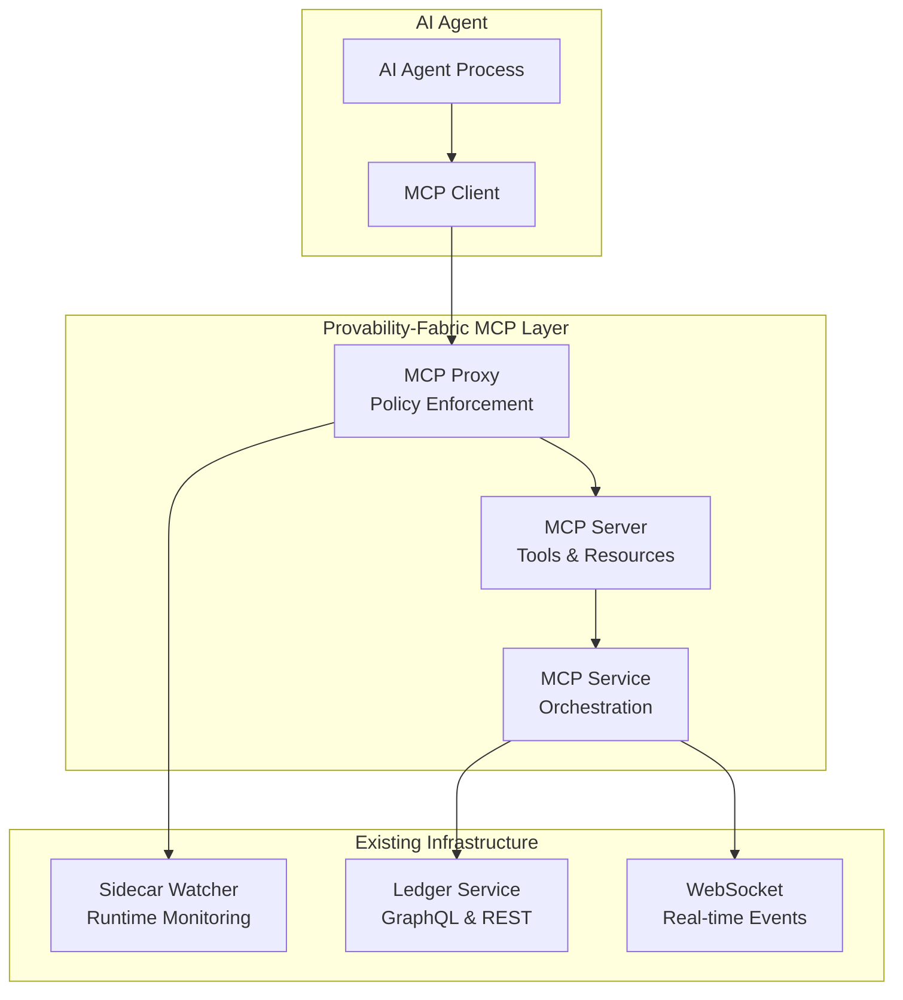

# Model Context Protocol (MCP) Integration

**Provability-Fabric MCP Integration Documentation**  

## Overview

Provability-Fabric now includes comprehensive Model Context Protocol (MCP) integration that enables AI agents to interact with external tools and data sources while maintaining strict behavioral constraints and formal verification guarantees. This integration provides a standardized, secure, and monitored interface for AI agent interactions.

## Table of Contents

1. [Architecture Overview](#architecture-overview)
2. [Security & Constraints](#security-constraints)
3. [API Reference](#api-reference)
4. [Usage Examples](#usage-examples)
5. [Configuration](#configuration)
6. [Monitoring & Compliance](#monitoring-compliance)
7. [Development Guide](#development-guide)
8. [Troubleshooting](#troubleshooting)

## Architecture Overview

### Core Components

The MCP integration consists of three main components that work together to provide secure, constrained AI agent interactions:



### Component Details

#### 1. MCP Proxy (`runtime/ledger/src/mcp/mcp-proxy.ts`)
- **Purpose**: Security gateway and policy enforcement
- **Features**: 
  - Rate limiting per method type
  - Tenant isolation and access control
  - Parameter validation and sanitization
  - Integration with existing sidecar monitoring
  - Comprehensive audit logging

#### 2. MCP Server (`runtime/ledger/src/mcp/mcp-server.ts`)
- **Purpose**: Core MCP protocol implementation
- **Features**:
  - JSON-RPC 2.0 compliant server
  - Standardized tools and resources
  - Multi-tenant data isolation
  - Formal verification integration
  - Error handling and logging

#### 3. MCP Service (`runtime/ledger/src/mcp/mcp-service.ts`)
- **Purpose**: Service orchestration and lifecycle management
- **Features**:
  - Multi-tenant MCP server management
  - WebSocket real-time communication
  - Express router integration
  - Graceful shutdown handling
  - Health monitoring and statistics

## Security & Constraints

### Behavioral Constraint Enforcement

The MCP integration enforces multiple layers of behavioral constraints to ensure AI agents operate within defined boundaries:

#### 1. Query Limits
```typescript
// Prevents bulk data extraction
if (toolArgs?.limit && toolArgs.limit > 1000) {
  return {
    allowed: false,
    reason: 'Query limit too high',
    violatedConstraints: ['max_query_limit']
  };
}
```

#### 2. Resource Access Control
```typescript
// Restricts accessible resource patterns
const allowedUriPatterns = [
  /^provability:\/\/capsules\/.+$/,
  /^provability:\/\/proofs\/.+$/,
  /^provability:\/\/audit\/.+$/
];
```

#### 3. Tenant Isolation
```typescript
// Ensures agents can only access their tenant's data
const whereClause: any = {};
if (this.tenantId) {
  whereClause.tenantId = this.tenantId;
}
```

#### 4. Rate Limiting
```typescript
// Method-specific rate limits
const rateLimits: Record<string, { requests: number; window: number }> = {
  'tools/call': { requests: 100, window: 60 },
  'tools/list': { requests: 10, window: 60 },
  'resources/read': { requests: 50, window: 60 }
};
```

### Integration with Existing Constraint Systems

The MCP integration leverages Provability-Fabric's existing behavioral constraint mechanisms:

- **Sidecar Integration**: All MCP requests are validated through the existing `runtime/sidecar-watcher`
- **Assumption Monitoring**: Uses `AssumptionMonitor` for runtime verification
- **Privacy Guards**: Integrates with epsilon-differential privacy system
- **Formal Verification**: MCP tools can trigger Lean proof verification

## API Reference

### Base URL
```
http://localhost:4000/api/mcp
```

### Endpoints

#### Health Check
```http
GET /api/mcp/health
```

**Response:**
```json
{
  "status": "healthy",
  "servers": 1,
  "timestamp": "2025-01-27T10:30:00Z",
  "version": "1.0.0"
}
```

#### Server Discovery
```http
GET /api/mcp/servers
```

**Response:**
```json
{
  "servers": [
    {
      "id": "provability-fabric-mcp",
      "name": "provability-fabric-mcp",
      "version": "1.0.0",
      "description": "Model Context Protocol integration for Provability-Fabric",
      "capabilities": ["tools", "resources"]
    }
  ]
}
```

#### JSON-RPC Endpoint
```http
POST /api/mcp/jsonrpc
Authorization: Bearer <JWT_TOKEN>
Content-Type: application/json
```

### Available Tools

#### 1. Query Capsules
Query agent capsules with behavioral guarantees.

**Request:**
```json
{
  "jsonrpc": "2.0",
  "method": "tools/call",
  "params": {
    "name": "query_capsules",
    "arguments": {
      "filter": {
        "tenantId": "tenant-123"
      },
      "limit": 10
    }
  },
  "id": 1
}
```

**Response:**
```json
{
  "jsonrpc": "2.0",
  "result": {
    "content": [
      {
        "type": "text",
        "text": "{\"capsules\": [...], \"total\": 5, \"tenantId\": \"tenant-123\"}"
      }
    ]
  },
  "id": 1
}
```

#### 2. Verify Behavior Guarantee
Verify formal behavioral guarantees for an agent.

**Request:**
```json
{
  "jsonrpc": "2.0",
  "method": "tools/call",
  "params": {
    "name": "verify_behavior_guarantee",
    "arguments": {
      "capsuleId": "capsule-123",
      "behaviorSpec": "privacy_budget <= 1.0 AND output_rate <= 10req/sec",
      "proofType": "lean"
    }
  },
  "id": 2
}
```

**Response:**
```json
{
  "jsonrpc": "2.0",
  "result": {
    "content": [
      {
        "type": "text",
        "text": "{\"verified\": true, \"proofHash\": \"proof_abc123\", \"constraints\": [...]}"
      }
    ]
  },
  "id": 2
}
```

#### 3. Log Audit Event
Record audit events for compliance and transparency.

**Request:**
```json
{
  "jsonrpc": "2.0",
  "method": "tools/call",
  "params": {
    "name": "log_audit_event",
    "arguments": {
      "eventType": "agent_interaction",
      "agentId": "agent-456",
      "details": {
        "action": "data_query",
        "timestamp": "2025-01-27T10:30:00Z"
      },
      "severity": "info"
    }
  },
  "id": 3
}
```

### Available Resources

#### 1. Active Capsules
```
URI: provability://capsules/active
```
Returns currently active agent capsules with behavioral guarantees.

#### 2. Lean Proofs
```
URI: provability://proofs/lean
```
Returns formal verification proofs in Lean 4 format.

#### 3. Audit Trail
```
URI: provability://audit/events
```
Returns comprehensive audit events for compliance tracking.

### WebSocket Real-time Events

Connect to: `ws://localhost:4000/mcp/ws`

#### Subscribe to Events
```json
{
  "type": "subscribe",
  "tenantId": "tenant-123",
  "eventTypes": ["constraint_violations", "policy_enforcement", "audit_events"]
}
```

#### Real-time Event Format
```json
{
  "type": "mcp_event",
  "event": {
    "type": "constraint_violation",
    "agentId": "agent-456",
    "violation": "Query limit exceeded",
    "action": "REQUEST_BLOCKED",
    "timestamp": "2025-01-27T10:30:00Z"
  }
}
```

## Usage Examples

### Basic Agent Query
```typescript
import { McpClient } from '@modelcontextprotocol/sdk/client';

const client = new McpClient();

// Query available capsules
const response = await client.request({
  method: 'tools/call',
  params: {
    name: 'query_capsules',
    arguments: { limit: 5 }
  }
});

console.log('Available capsules:', response.result);
```

### Behavioral Verification
```typescript
// Verify agent behavior against formal specification
const verification = await client.request({
  method: 'tools/call',
  params: {
    name: 'verify_behavior_guarantee',
    arguments: {
      capsuleId: 'my-agent-capsule',
      behaviorSpec: 'privacy_budget <= 1.0',
      proofType: 'lean'
    }
  }
});

if (verification.result.verified) {
  console.log('Agent behavior verified:', verification.result.proofHash);
} else {
  console.log('Verification failed:', verification.result.reason);
}
```

### Real-time Monitoring
```typescript
import WebSocket from 'ws';

const ws = new WebSocket('ws://localhost:4000/mcp/ws');

ws.on('open', () => {
  // Subscribe to constraint violations
  ws.send(JSON.stringify({
    type: 'subscribe',
    tenantId: 'my-tenant',
    eventTypes: ['constraint_violations']
  }));
});

ws.on('message', (data) => {
  const event = JSON.parse(data.toString());
  if (event.type === 'mcp_event' && event.event.type === 'constraint_violation') {
    console.log('Constraint violation detected:', event.event);
    // Take corrective action
  }
});
```

## Configuration

### Environment Variables

```bash
# MCP Service Configuration
SIDECAR_URL=http://localhost:8081
MCP_ENABLE_WEBSOCKET=true
MCP_ENABLE_MULTI_TENANT=true

# Rate Limiting Configuration  
MCP_TOOLS_CALL_LIMIT=100
MCP_TOOLS_LIST_LIMIT=10
MCP_RESOURCES_READ_LIMIT=50

# Security Configuration
MCP_MAX_QUERY_LIMIT=1000
MCP_ALLOWED_URI_PATTERNS=provability://.*
```

### Service Configuration
```typescript
// In runtime/ledger/src/index.ts
const mcpService = new McpService({
  name: 'provability-fabric-mcp',
  version: '1.0.0',
  description: 'Model Context Protocol integration for Provability-Fabric',
  enableWebSocket: true,
  sidecarUrl: process.env.SIDECAR_URL || 'http://localhost:8081',
  enableMultiTenant: true
}, prisma, logger);
```

## Monitoring & Compliance

### Metrics Collection

The MCP integration provides comprehensive metrics for monitoring:

```http
GET /api/mcp/stats
```

**Response:**
```json
{
  "totalRequests": 1247,
  "blockedRequests": 23,
  "averageResponseTime": 45,
  "tenantId": "tenant-123",
  "timestamp": "2025-01-27T10:30:00Z"
}
```

### Audit Logging

All MCP interactions are automatically logged for compliance:

```json
{
  "timestamp": "2025-01-27T10:30:00Z",
  "eventType": "mcp_request",
  "method": "tools/call",
  "tenantId": "tenant-123",
  "userId": "user-456", 
  "params": {...},
  "result": "allowed",
  "responseTime": 45
}
```

### Constraint Violation Alerts

Real-time alerts are generated for constraint violations:

```json
{
  "type": "constraint_violation",
  "timestamp": "2025-01-27T10:30:00Z",
  "violation": {
    "type": "query_limit_exceeded",
    "agentId": "agent-789",
    "requestedLimit": 50000,
    "allowedLimit": 1000,
    "action": "REQUEST_BLOCKED"
  }
}
```

## Development Guide

### Setting Up Development Environment

1. **Install Dependencies:**
   ```bash
   cd runtime/ledger
   npm install @modelcontextprotocol/sdk ws @types/ws
   ```

2. **Configure Environment:**
   ```bash
   export SIDECAR_URL=http://localhost:8081
   export MCP_ENABLE_WEBSOCKET=true
   ```

3. **Start Development Server:**
   ```bash
   npm run dev
   ```

### Adding New MCP Tools

1. **Define Tool Schema:**
   ```typescript
   // In mcp-server.ts
   {
     name: 'my_custom_tool',
     description: 'Description of what the tool does',
     inputSchema: {
       type: 'object',
       properties: {
         param1: { type: 'string' },
         param2: { type: 'number' }
       },
       required: ['param1']
     }
   }
   ```

2. **Implement Tool Handler:**
   ```typescript
   case 'my_custom_tool':
     return await this.handleMyCustomTool(args);
   ```

3. **Add Policy Enforcement:**
   ```typescript
   // In mcp-proxy.ts
   case 'my_custom_tool':
     return this.enforceMyCustomToolPolicy(params);
   ```

### Testing

Run the comprehensive test suite:

```bash
cd runtime/ledger
node test-mcp-comprehensive.js
```

Expected output:
```
🧪 COMPREHENSIVE MCP INTEGRATION TEST REPORT
============================================
✅ Passed: 15
❌ Failed: 0
⏭️ Skipped: 0
🏆 Success Rate: 100.0%
```

## Troubleshooting

### Common Issues

#### 1. Connection Refused
**Problem:** Cannot connect to MCP endpoints
**Solution:** Ensure the ledger service is running:
```bash
cd runtime/ledger
npm run dev
```

#### 2. Authentication Failed
**Problem:** 403 Unauthorized responses
**Solution:** Include valid JWT token in Authorization header:
```http
Authorization: Bearer <your-jwt-token>
```

#### 3. Constraint Violations
**Problem:** Requests being blocked unexpectedly
**Solution:** Check logs for specific constraint violations:
```bash
tail -f runtime/ledger/mcp-service.log
```

#### 4. WebSocket Connection Issues
**Problem:** WebSocket events not received
**Solution:** Verify WebSocket endpoint and subscription:
```javascript
// Correct WebSocket URL
const ws = new WebSocket('ws://localhost:4000/mcp/ws');
```

### Debug Mode

Enable debug logging:
```bash
export LOG_LEVEL=debug
npm run dev
```

### Health Checks

Verify service health:
```bash
curl http://localhost:4000/api/mcp/health
```

Expected response:
```json
{
  "status": "healthy",
  "servers": 1,
  "timestamp": "2025-01-27T10:30:00Z",
  "version": "1.0.0"
}
```

## Security Considerations

### Best Practices

1. **Always Use Authentication:**
   - Include JWT tokens for all requests
   - Implement proper token validation
   - Use tenant-scoped permissions

2. **Validate Input Parameters:**
   - Check parameter types and ranges
   - Sanitize string inputs
   - Enforce business logic constraints

3. **Monitor Rate Limits:**
   - Implement client-side rate limiting
   - Handle 429 responses gracefully
   - Use exponential backoff for retries

4. **Audit All Interactions:**
   - Log all MCP requests and responses
   - Monitor for suspicious patterns
   - Implement alerting for violations

### Security Headers

The MCP service includes comprehensive security headers:

```typescript
// Security headers are automatically applied
{
  'X-Content-Type-Options': 'nosniff',
  'X-Frame-Options': 'DENY',
  'X-XSS-Protection': '1; mode=block',
  'Strict-Transport-Security': 'max-age=31536000'
}
```

## Performance Optimization

### Caching Strategy

Implement caching for frequently accessed resources:

```typescript
// Cache verification results
const verificationCache = new Map();
const cacheKey = `${capsuleId}:${behaviorSpec}`;
if (verificationCache.has(cacheKey)) {
  return verificationCache.get(cacheKey);
}
```

### Connection Pooling

Use connection pooling for database operations:

```typescript
// Prisma automatically handles connection pooling
const capsules = await this.prisma.capsule.findMany({
  where: whereClause,
  take: limit
});
```

### Response Compression

Enable gzip compression for large responses:

```typescript
// Automatically handled by Express compression middleware
app.use(compression());
```

## Migration Guide

### From Direct API Calls to MCP

**Before (Direct API):**
```typescript
const response = await fetch('/tenant/123/capsules');
const capsules = await response.json();
```

**After (MCP):**
```typescript
const response = await mcpClient.request({
  method: 'tools/call',
  params: {
    name: 'query_capsules',
    arguments: { filter: { tenantId: '123' } }
  }
});
const capsules = JSON.parse(response.result.content[0].text);
```

### Integration Checklist

- [ ] Update authentication to use JWT tokens
- [ ] Migrate API calls to MCP tools
- [ ] Implement error handling for constraint violations
- [ ] Add real-time monitoring via WebSocket
- [ ] Test constraint enforcement scenarios
- [ ] Update documentation and training materials
