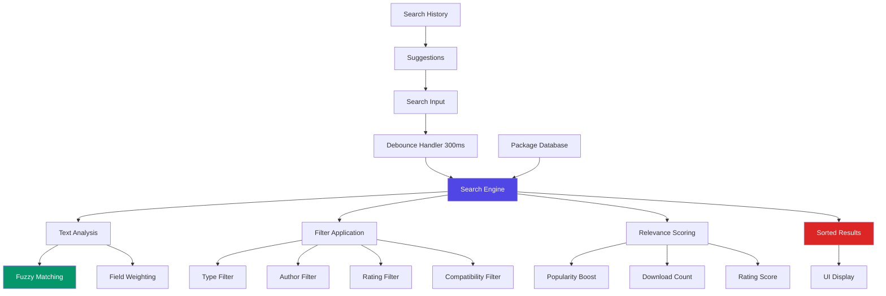

# Advanced Search System

> **Historical marketing document.** Kept for audit trail. Marketplace advanced-search UI was removed; prefer [WebSocket API](../../reference/api/websocket-api.md) for live real-time docs.

Provability-Fabric includes a powerful advanced search system that provides intelligent package discovery with fuzzy matching, multi-criteria filtering, and real-time search capabilities.

## Overview

The advanced search system transforms the marketplace experience by providing:

- **Fuzzy text search** across package names, descriptions, and authors
- **Multi-criteria filtering** with boolean logic combinations
- **Real-time search results** with debounced input processing
- **Relevance-based ranking** using sophisticated scoring algorithms
- **Search history and suggestions** for improved user experience
- **Performance metrics** and search analytics

## Architecture



## Getting Started

### Basic Search

The search system is automatically available in the marketplace UI at `http://localhost:3000/search`:

```typescript
import { AdvancedSearch } from '../components/AdvancedSearch';
import { searchEngine } from '../utils/searchEngine';

function SearchPage() {
  const [results, setResults] = useState([]);
  
  const handleSearch = (filters) => {
    const searchResult = searchEngine.search(filters);
    setResults(searchResult.packages);
  };

  return (
    <AdvancedSearch
      onSearch={handleSearch}
      isLoading={false}
      resultsCount={results.length}
    />
  );
}
```

### Search Filters

The system supports comprehensive filtering options:

```typescript
interface SearchFilters {
  query: string;           // Text search query
  type: string;           // Package type filter
  author: string;         // Author name filter
  minRating: number;      // Minimum rating (0-5)
  compatibility: string;  // Compatibility version
  sortBy: 'relevance' | 'downloads' | 'rating' | 'updated' | 'name';
  sortOrder: 'asc' | 'desc';
}
```

## Search Features

### Fuzzy Text Search

The search engine implements sophisticated fuzzy matching:

```typescript
// Example searches that work:
"marab"        → finds "Marabou Adapter"
"neural net"   → finds "Neural Network Verification"
"stanf"        → finds packages by "Stanford"
"proof pack"   → finds "Privacy Proof Pack"
```

#### Relevance Scoring

Search results are ranked using a multi-factor scoring system:

- **Exact matches**: Highest priority (10 points for name, 5 for description)
- **Partial matches**: Medium priority (7 points for author, 6 for type)
- **Fuzzy matches**: Lower priority (3 points for name, 2 for description)
- **Popularity boost**: Download count and rating influence final score

```typescript
// Scoring algorithm example
function calculateRelevanceScore(pkg: Package, searchTerms: string[]): number {
  let score = 0;
  
  for (const term of searchTerms) {
    // Exact matches get highest score
    if (pkg.name.toLowerCase().includes(term)) score += 10;
    if (pkg.description.toLowerCase().includes(term)) score += 5;
    if (pkg.author.toLowerCase().includes(term)) score += 7;
    if (pkg.type.toLowerCase().includes(term)) score += 6;
    
    // Add fuzzy matching bonus
    score += fuzzyMatch(pkg.name, term) * 3;
    score += fuzzyMatch(pkg.description, term) * 2;
  }
  
  // Boost popular packages
  score += Math.log(pkg.downloads + 1) * 0.1;
  score += pkg.rating * 0.5;
  
  return score;
}
```

### Multi-Criteria Filtering

#### Package Type Filter

```typescript
const packageTypes = [
  { value: '', label: 'All Types' },
  { value: 'adapter', label: 'Adapters' },
  { value: 'spec', label: 'Specifications' },
  { value: 'proofpack', label: 'Proof Packs' },
  { value: 'tool', label: 'Tools' }
];
```

#### Author Filter

```typescript
// Case-insensitive partial matching
filters.author = "stanf";  // Matches "Stanford", "Stanford University", etc.
```

#### Rating Filter

```typescript
// Minimum rating thresholds
const ratingOptions = [
  { value: 0, label: 'Any Rating' },
  { value: 4.5, label: '4.5+ Stars' },
  { value: 4.0, label: '4.0+ Stars' },
  { value: 3.5, label: '3.5+ Stars' },
  { value: 3.0, label: '3.0+ Stars' }
];
```

#### Compatibility Filter

```typescript
// Search in compatibility metadata
filters.compatibility = "fabric-version";
// Matches packages with fabric-version in compatibility object
```

### Advanced Sorting

The system provides multiple sorting options:

```typescript
const sortOptions = [
  { value: 'relevance', label: 'Relevance' },     // Default for text search
  { value: 'downloads', label: 'Downloads' },     // Most/least downloaded
  { value: 'rating', label: 'Rating' },           // Highest/lowest rated
  { value: 'updated', label: 'Last Updated' },    // Most/least recent
  { value: 'name', label: 'Name' }                // Alphabetical
];
```

### Search History and Suggestions

The system maintains search history in localStorage:

```typescript
// Save search history
const saveSearchHistory = (query: string) => {
  const history = JSON.parse(localStorage.getItem('searchHistory') || '[]');
  const newHistory = [query, ...history.slice(0, 9)]; // Keep last 10
  localStorage.setItem('searchHistory', JSON.stringify(newHistory));
};

// Show search suggestions
const SearchSuggestions = ({ onSelect }) => {
  const [history] = useState(() => 
    JSON.parse(localStorage.getItem('searchHistory') || '[]')
  );

  return (
    <div className="suggestions-dropdown">
      {history.map(query => (
        <button key={query} onClick={() => onSelect(query)}>
          <MagnifyingGlassIcon /> {query}
        </button>
      ))}
    </div>
  );
};
```

## Performance Optimization

### Debounced Search

Search requests are debounced to prevent excessive API calls:

```typescript
import { useDebounce } from '../hooks/useDebounce';

const debouncedQuery = useDebounce(searchQuery, 300); // 300ms delay

useEffect(() => {
  if (debouncedQuery) {
    performSearch(debouncedQuery);
  }
}, [debouncedQuery]);
```

### In-Memory Search Engine

The search engine operates on in-memory data for maximum performance:

```typescript
class SearchEngine {
  private packages: Package[] = [];
  
  search(filters: SearchFilters): SearchResult {
    const startTime = performance.now();
    
    let results = this.performTextSearch(this.packages, filters.query);
    results = this.applyFilters(results, filters);
    results = this.sortResults(results, filters);
    
    const executionTime = performance.now() - startTime;
    
    return {
      packages: results,
      total: results.length,
      query: filters.query,
      executionTime
    };
  }
}
```

### Caching Strategy

Search results are cached to improve performance:

```typescript
const searchCache = new Map();
const CACHE_TTL = 5 * 60 * 1000; // 5 minutes

const getCachedResult = (key: string) => {
  const cached = searchCache.get(key);
  if (cached && Date.now() - cached.timestamp < CACHE_TTL) {
    return cached.data;
  }
  return null;
};
```

## Real-Time Integration

### WebSocket Updates

Search results are updated in real-time when new packages are published:

```typescript
const { lastMessage } = useWebSocket({
  onMessage: (message) => {
    if (message.type === 'new_package') {
      // Add new package to search index
      searchEngine.updatePackages([message.package, ...packages]);
      
      // Refresh current search if applicable
      if (currentFilters.query) {
        performSearch(currentFilters);
      }
    }
  }
});
```

### Live Status Indicators

```tsx
const SearchHeader = () => {
  const { isConnected } = useWebSocket();
  
  return (
    <div className="search-header">
      <h1>Package Search</h1>
      {isConnected && (
        <span className="live-indicator">
          🟢 Live updates enabled
        </span>
      )}
    </div>
  );
};
```

## UI Components

### Advanced Search Component

The main search interface provides a comprehensive search experience:

```tsx
<AdvancedSearch
  onSearch={(filters) => performSearch(filters)}
  onClearFilters={() => clearAllFilters()}
  isLoading={loading}
  resultsCount={results.length}
/>
```

#### Features:
- **Expandable filters**: Click the funnel icon to show advanced options
- **Filter badges**: Active filters are displayed as colored badges
- **Search metrics**: Execution time and result count shown
- **Responsive design**: Mobile-friendly layout

### Search Results Display

Results are displayed in a modern card-based layout:

```tsx
<div className="search-results">
  <div className="grid grid-cols-1 lg:grid-cols-2 xl:grid-cols-3 gap-6">
    {results.map(pkg => (
      <PackageCard
        key={pkg.id}
        package={pkg}
        onInstall={handleInstall}
        highlighted={searchTerms}
      />
    ))}
  </div>
</div>
```

## API Integration

### Backend Search Endpoints

While the frontend uses in-memory search for performance, the backend provides search endpoints:

```bash
# Basic package search
GET /packages?type=adapter&author=Stanford

# Advanced search with query
GET /search?q=neural+network&type=adapter&minRating=4.0

# Package suggestions
GET /packages/suggestions?q=partial_query
```

### Search Analytics

Track search performance and usage:

```typescript
const searchAnalytics = {
  recordSearch: (query: string, resultCount: number, executionTime: number) => {
    console.log(`Search: "${query}" → ${resultCount} results in ${executionTime}ms`);
  },
  
  getPopularTerms: () => {
    return searchEngine.getPopularTerms(10);
  },
  
  getSearchMetrics: () => {
    return searchEngine.getSearchMetrics();
  }
};
```

## Examples

### Basic Text Search

```tsx
const BasicSearch = () => {
  const [query, setQuery] = useState('');
  const [results, setResults] = useState([]);
  
  const handleSearch = (searchFilters) => {
    const searchResult = searchEngine.search(searchFilters);
    setResults(searchResult.packages);
  };
  
  return (
    <div>
      <input
        value={query}
        onChange={(e) => setQuery(e.target.value)}
        placeholder="Search packages..."
      />
      <SearchResults results={results} />
    </div>
  );
};
```

### Filtered Search

```tsx
const FilteredSearch = () => {
  const [filters, setFilters] = useState({
    query: '',
    type: 'adapter',
    minRating: 4.0,
    sortBy: 'downloads'
  });
  
  const results = useMemo(() => {
    return searchEngine.search(filters);
  }, [filters]);
  
  return (
    <div>
      <SearchFilters filters={filters} onChange={setFilters} />
      <SearchResults results={results.packages} />
    </div>
  );
};
```

### Search with History

```tsx
const SearchWithHistory = () => {
  const [query, setQuery] = useState('');
  const [history, setHistory] = useState([]);
  
  const performSearch = (searchQuery) => {
    // Add to history
    if (searchQuery && !history.includes(searchQuery)) {
      const newHistory = [searchQuery, ...history.slice(0, 9)];
      setHistory(newHistory);
      localStorage.setItem('searchHistory', JSON.stringify(newHistory));
    }
    
    // Perform search
    const results = searchEngine.search({ query: searchQuery });
    displayResults(results);
  };
  
  return (
    <div>
      <SearchInput
        value={query}
        onChange={setQuery}
        onSearch={performSearch}
        suggestions={history}
      />
    </div>
  );
};
```

## Troubleshooting

### Common Issues

1. **Slow Search Performance**
   - Check if package data is loaded in memory
   - Verify debounce settings (300ms recommended)
   - Monitor search execution time in console

2. **No Search Results**
   - Verify package data is available
   - Check filter combinations (too restrictive)
   - Try broader search terms

3. **Filters Not Working**
   - Ensure filter values match data structure
   - Check for case sensitivity issues
   - Verify filter logic implementation

### Debug Mode

Enable search debugging:

```typescript
const searchEngine = new SearchEngine(packages);
searchEngine.enableDebug(true);

// This will log detailed search information
const results = searchEngine.search(filters);
```

### Performance Monitoring

Monitor search performance:

```typescript
const performanceMonitor = {
  logSearch: (filters, results, executionTime) => {
    if (executionTime > 100) { // Log slow searches
      console.warn(`Slow search: ${executionTime}ms for "${filters.query}"`);
    }
  }
};
```

## Configuration

### Search Engine Settings

```typescript
const searchConfig = {
  debounceDelay: 300,        // Input debounce delay (ms)
  maxSuggestions: 5,         // Max search suggestions
  historyLimit: 10,          // Max history items
  fuzzyThreshold: 0.6,       // Fuzzy match threshold
  cacheTimeout: 300000       // Cache TTL (ms)
};
```

### UI Customization

```typescript
const searchUIConfig = {
  showAdvancedByDefault: false,
  enableSearchHistory: true,
  showExecutionTime: true,
  resultsPerPage: 20,
  enableInfiniteScroll: false
};
```

## Future Enhancements

- **Elasticsearch Integration**: For large-scale deployments
- **AI-Powered Suggestions**: Machine learning based recommendations
- **Saved Searches**: Bookmark frequently used filter combinations
- **Search Analytics Dashboard**: Detailed search usage statistics
- **Voice Search**: Speech-to-text search capability
