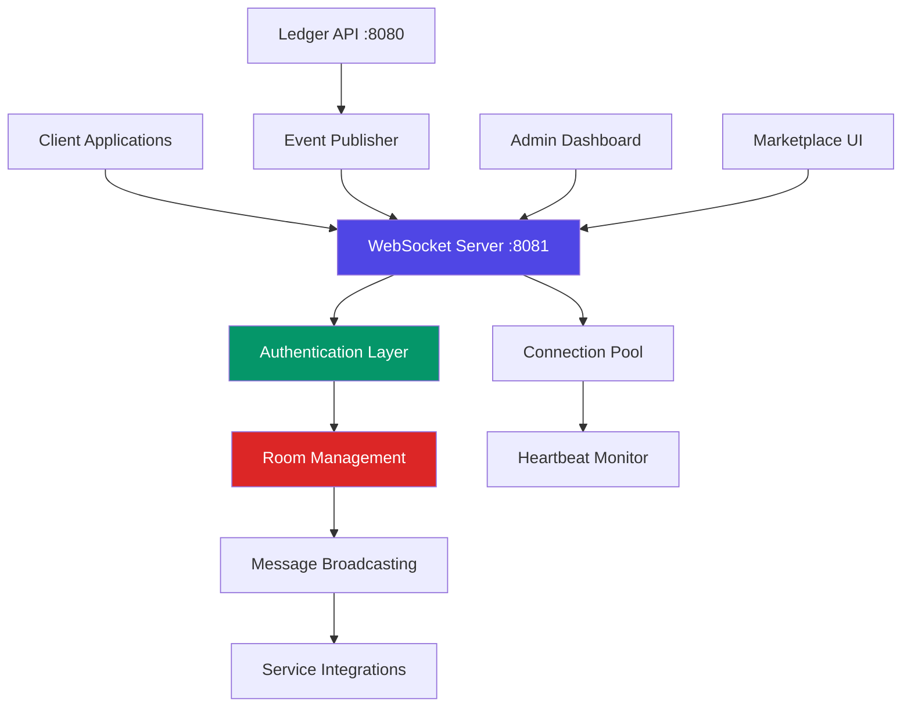

# Real-Time Communication with WebSockets

> **Historical marketing document.** Kept for audit trail. Marketplace real-time marketing page was removed; prefer [WebSocket API](../../reference/api/websocket-api.md).

Provability-Fabric includes a comprehensive WebSocket-based real-time communication system that provides live updates, notifications, and monitoring capabilities across the entire platform.

## Overview

The WebSocket system enables bidirectional, real-time communication between the backend services and frontend applications, providing:

- **Live service monitoring** and health status updates
- **Real-time notifications** for system events and user activities
- **Instant data synchronization** across multiple clients
- **Performance metrics** and system analytics in real-time
- **Secure authentication** with JWT token validation

## Architecture



## Getting Started

### Server Configuration

The WebSocket server runs on port 8081 and is automatically initialized when you start the ledger service:

```bash
cd runtime/ledger
node minimal-server.js
```

The server will show:
```
🚀 Provability-Fabric Ledger running on port 8080
🔗 WebSocket server running on port 8081
🔐 Authentication: JWT-based
📊 Metrics endpoint: ws://localhost:8081/metrics
```

### Client Connection

#### JavaScript/TypeScript (React)

Use the provided React hook for seamless WebSocket integration:

```typescript
import { useWebSocket } from '../hooks/useWebSocket';
import { useAuth } from '../components/AuthProvider';

function MyComponent() {
  const { user } = useAuth();
  const { 
    isConnected, 
    isConnecting, 
    sendMessage, 
    joinRoom,
    lastMessage 
  } = useWebSocket({
    onMessage: (message) => {
      console.log('Received:', message);
    },
    onConnect: () => {
      console.log('Connected to WebSocket');
    }
  });

  // Join a specific room for targeted notifications
  useEffect(() => {
    if (isConnected && user?.role) {
      joinRoom(user.role); // Join role-based room
      joinRoom('marketplace'); // Join marketplace updates
    }
  }, [isConnected, user, joinRoom]);

  return (
    <div>
      <div>Status: {isConnected ? 'Connected' : 'Disconnected'}</div>
      {lastMessage && (
        <div>Last message: {lastMessage.type}</div>
      )}
    </div>
  );
}
```

#### Direct WebSocket Connection

```javascript
// Connect with JWT authentication
const token = localStorage.getItem('authToken');
const ws = new WebSocket(`ws://localhost:8081?token=${token}`);

ws.onopen = () => {
  console.log('Connected to Provability-Fabric WebSocket');
  
  // Join a room
  ws.send(JSON.stringify({
    type: 'join_room',
    room: 'marketplace'
  }));
};

ws.onmessage = (event) => {
  const message = JSON.parse(event.data);
  console.log('Received:', message);
};
```

## Authentication

All WebSocket connections require JWT authentication:

1. **Obtain JWT Token**: Login through the `/auth/login` endpoint
2. **Connect with Token**: Pass token as query parameter: `ws://localhost:8081?token=<jwt-token>`
3. **Token Validation**: Server validates token and extracts user information
4. **Connection Authorized**: Client joins default room based on user role

### Example Authentication Flow

```javascript
// 1. Login to get JWT token
const loginResponse = await fetch('http://localhost:8080/auth/login', {
  method: 'POST',
  headers: { 'Content-Type': 'application/json' },
  body: JSON.stringify({ email, password })
});

const { token, user, websocketUrl } = await loginResponse.json();

// 2. Connect to WebSocket with token
const ws = new WebSocket(websocketUrl);
```

## Room-Based Messaging

The WebSocket system organizes clients into rooms for targeted message broadcasting:

### Default Rooms

- **`general`**: All authenticated users
- **`admin`**: Users with admin role
- **`marketplace`**: Users interested in marketplace updates
- **`monitoring`**: Users receiving system monitoring data

### Room Operations

```javascript
// Join a room
ws.send(JSON.stringify({
  type: 'join_room',
  room: 'marketplace'
}));

// Leave a room
ws.send(JSON.stringify({
  type: 'leave_room',
  room: 'marketplace'
}));

// Broadcast to a room (admin/moderator only)
ws.send(JSON.stringify({
  type: 'broadcast',
  room: 'general',
  content: 'System maintenance in 10 minutes'
}));
```

## Message Types

### Client → Server Messages

| Type | Description | Required Fields | Permission |
|------|-------------|-----------------|------------|
| `ping` | Heartbeat check | - | All |
| `subscribe` | Subscribe to channel | `channel` | All |
| `unsubscribe` | Unsubscribe from channel | `channel` | All |
| `join_room` | Join a room | `room` | All |
| `leave_room` | Leave a room | `room` | All |
| `broadcast` | Broadcast message | `room`, `content` | Admin/Moderator |
| `get_metrics` | Request metrics | - | Admin |

### Server → Client Messages

| Type | Description | Fields |
|------|-------------|--------|
| `connection` | Connection confirmed | `clientId`, `status`, `timestamp` |
| `pong` | Heartbeat response | `timestamp` |
| `system_status` | Service health update | `services`, `timestamp` |
| `service_status_update` | Individual service status | `service`, `status`, `timestamp` |
| `new_package` | New marketplace package | `package`, `timestamp` |
| `package_installation` | Package installation event | `packageId`, `status`, `userId` |
| `system_alert` | System-wide alert | `level`, `message`, `timestamp` |
| `metrics` | System metrics | `data`, `timestamp` |
| `error` | Error message | `message` |

## Real-Time Features

### Service Monitoring

```javascript
// Receive real-time service status updates
ws.onmessage = (event) => {
  const message = JSON.parse(event.data);
  
  if (message.type === 'service_status_update') {
    updateServiceStatus(message.service, message.status);
  }
};
```

### Package Management

```javascript
// Get notified of new package installations
ws.onmessage = (event) => {
  const message = JSON.parse(event.data);
  
  if (message.type === 'package_installation') {
    showNotification(`Package ${message.packageId} installation ${message.status}`);
  }
  
  if (message.type === 'new_package') {
    addPackageToList(message.package);
  }
};
```

### System Alerts

```javascript
// Receive system-wide alerts
ws.onmessage = (event) => {
  const message = JSON.parse(event.data);
  
  if (message.type === 'system_alert') {
    const alertClass = `alert-${message.level}`; // alert-info, alert-warn, alert-error
    showAlert(message.message, alertClass);
  }
};
```

## Performance and Reliability

### Connection Management

- **Automatic Reconnection**: Clients automatically reconnect on disconnection
- **Heartbeat Monitoring**: 30-second ping/pong to detect dead connections
- **Connection Timeout**: 60-second timeout for unresponsive clients
- **Graceful Shutdown**: Proper cleanup on server shutdown

### Scalability Features

- **Memory Efficient**: Connection metadata stored in memory maps
- **Room Optimization**: Empty rooms are automatically cleaned up
- **Message Broadcasting**: Efficient bulk message delivery
- **Metrics Collection**: Real-time connection and message statistics

### Error Handling

```javascript
ws.onerror = (error) => {
  console.error('WebSocket error:', error);
};

ws.onclose = (event) => {
  if (event.code !== 1000) { // Not a normal closure
    console.log('Connection lost, attempting reconnection...');
    setTimeout(connectWebSocket, 3000); // Reconnect after 3 seconds
  }
};
```

## Integration Examples

### React Component with Real-Time Updates

```tsx
import React, { useEffect, useState } from 'react';
import { useWebSocket } from '../hooks/useWebSocket';

export const ServiceMonitor: React.FC = () => {
  const [services, setServices] = useState<Record<string, string>>({});
  
  const { isConnected, lastMessage } = useWebSocket({
    onMessage: (message) => {
      if (message.type === 'service_status_update') {
        setServices(prev => ({
          ...prev,
          [message.service]: message.status
        }));
      }
    }
  });

  return (
    <div className="service-monitor">
      <h3>Service Status {isConnected ? '🟢' : '🔴'}</h3>
      {Object.entries(services).map(([service, status]) => (
        <div key={service} className="service-item">
          <span>{service}</span>
          <span className={`status ${status}`}>{status}</span>
        </div>
      ))}
    </div>
  );
};
```

### Admin Dashboard Integration

```javascript
// Request system metrics (admin only)
function requestMetrics() {
  if (userRole === 'admin') {
    ws.send(JSON.stringify({ type: 'get_metrics' }));
  }
}

// Handle metrics response
ws.onmessage = (event) => {
  const message = JSON.parse(event.data);
  
  if (message.type === 'metrics') {
    updateDashboard({
      activeConnections: message.data.activeConnections,
      totalMessages: message.data.messagesTotal,
      uptime: message.data.uptime,
      memoryUsage: message.data.memory
    });
  }
};
```

## Troubleshooting

### Common Issues

1. **Connection Refused**
   - Ensure WebSocket server is running on port 8081
   - Check if port is blocked by firewall

2. **Authentication Failed**
   - Verify JWT token is valid and not expired
   - Check token format in connection URL

3. **Message Not Received**
   - Verify you're connected to the correct room
   - Check message type and format

4. **Frequent Disconnections**
   - Check network stability
   - Verify heartbeat responses are being sent

### Debug Mode

Enable debug logging for WebSocket connections:

```javascript
const ws = new WebSocket(`ws://localhost:8081?token=${token}&debug=true`);
```

### Health Check

Test WebSocket connectivity:

```bash
# Use wscat to test connection
npm install -g wscat
wscat -c "ws://localhost:8081?token=<your-jwt-token>"
```

## Security Considerations

- **JWT Validation**: All connections require valid JWT tokens
- **Rate Limiting**: Basic rate limiting headers included
- **Room Permissions**: Admin-only broadcasting capabilities
- **Input Validation**: All messages are validated before processing
- **Connection Limits**: Monitor connection counts to prevent abuse

## API Reference

For complete API documentation, see [WebSocket API Reference](../../reference/api/websocket-api.md).
