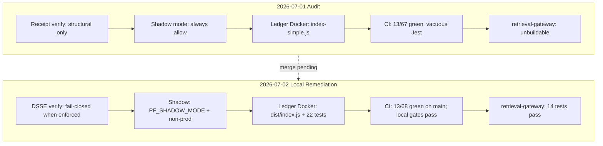

# Full Repository Audit — Reassessment Report (2026-07-02)

Reassessment of findings **F01–F39** from [full-repo-audit-2026-07-01.md](full-repo-audit-2026-07-01.md), cross-checked against [remediation-tracker.md](../remediation-tracker.md) and local verification commands run on **2026-07-02** (Windows).

---

## Limitation banner

| Scope | Detail |
|-------|--------|
| **Code state** | Remediation work is **local / unmerged** unless a finding cites a green `main` workflow run. |
| **CI on `main`** | **13 / 68** gated workflows green (verified 2026-07-02 via `scripts/ci_workflow_inventory.ps1`); unchanged from Wave 0 baseline. |
| **Local gates** | Gate commands below passed on the working tree; they do **not** prove `main` CI is green. |
| **Labels** | **verified** = command output or file read this session; **suspected** = static analysis or prior triage only. |

Local remediation can be **DONE** while `main` CI proof remains **pending merge**.

---

## Executive delta table

| Metric | 2026-07-01 audit | 2026-07-02 reassessment |
|--------|------------------|-------------------------|
| Findings DONE | 0 | **32** |
| Findings PARTIAL | 0 | **6** (F16, F23, F24, F27, F33, F35) |
| Findings OPEN | 39 | **1** (F38) |
| Gated workflows green on `main` | 13 / 67 | **13 / 68** (new `retrieval-gateway.yml` gated, no run yet) |
| Sidecar production unwrap/expect | 97 | **40** (gate baseline; verified) |
| Ledger `any` count | 152 | **76** (ceiling target 20; verified) |
| Ledger Jest tests | 0 | **22** (verified) |
| `retrieval-gateway` buildable | No | **Yes** — 14 tests pass (verified) |
| DSSE trust path | Stubbed | **Wired** — fail-closed by default (unset enforces; opt out `PF_ENFORCE_DSSE=0`/`false`) (verified static; Wave 9.1) |
| CI honesty audit | 47 `\|\| true` files (static) | **59 unjustified** matches in 2026-07-02 scan (exit 1) |

---

## Verification commands (2026-07-02)

| Command | Exit | Output summary |
|---------|------|----------------|
| `python scripts/count_sidecar_unwraps.py` | **0** | `sidecar production unwrap/expect count: 40 (baseline <= 40)` |
| `python scripts/count_ledger_any.py` | **0** | `76` any (excl. tests); WARN above ceiling 20; regression baseline 152 |
| `python scripts/audit_ci_honesty.py` | **1** | 59 unjustified: 51 `\|\| true`, 7 `continue-on-error`, 1 `passWithNoTests` |
| `cargo test -p retrieval-gateway` | **0** | 14 passed, 0 failed |
| `cargo test -p sidecar-watcher --test integration_tests` | **0** | 9 passed, 0 failed |
| `cd runtime/ledger && npm test` | **0** | 5 suites, 22 tests passed |
| `cd runtime/ledger && npm run typecheck:server` | **0** | `tsc -p tsconfig.server.json --noEmit` clean |
| `make docs-strict` | **0** | `mkdocs build --strict` succeeded |
| `python ops/retention/test_retention_manager.py` | **0** | 4 tests OK |
| Grep `passWithNoTests` | — | **Not in ledger or TS SDK** `package.json`; 1 hit in `marketplace-e2e.yaml` |
| Grep `apollo-server-express` | — | **Not in** `runtime/ledger/package.json`; lockfile transitive only; `wave4.test.cjs` asserts removed |
| Grep `md5` in `revocation.rs` | — | **No matches** |

---

## Per-finding reassessment (F01–F39)

### F01 — Signature verification stubbed (P0)

| Field | Value |
|-------|-------|
| **Original claim** | Go/Rust/TS receipt verification is structural only; Ed25519/DSSE not wired. |
| **Wave** | 2 |
| **Status** | **DONE** |
| **Evidence (verified)** | Cross-lang DSSE libs: `core/crypto/dsse-{go,rs,ts}`; `env_config.rs` / ports fail-closed by default (unset enforces; Wave 9.1). |
| **What changed** | Shared DSSE verify contract implemented per language; kernel, sidecar, tool-broker, ledger, TS SDK wired. |
| **What remains (historical)** | Reassessment assumed default-off; **Wave 9.1** made unset=enforce (`PF_ENFORCE_DSSE=0`/`false` opt-out only). Trust roots still required when enforcing. |
| **CI proof on main** | Pending merge; local cross-lang tests in `tests/crypto/test_cross_lang_dsse.py`. |

### F02 — Shadow mode always allows; `is_tool_enabled` always true (P0)

| Field | Value |
|-------|-------|
| **Original claim** | Shadow bypass unconditional; tool enablement always true. |
| **Wave** | 2 |
| **Status** | **DONE** |
| **Evidence (verified)** | `env_config.rs`: shadow requires `PF_SHADOW_MODE=1` + non-production; integration test `test_shadow_mode_behavior` passes. |
| **What changed** | Gated shadow mode; tool enablement respects policy when not in shadow. |
| **What remains** | Document production profile defaults in deployment guide. |
| **CI proof on main** | Pending merge; local `integration_tests` 9/9 green. |

### F03 — Ledger Docker runs `index-simple.js` (P0)

| Field | Value |
|-------|-------|
| **Original claim** | Dockerfile CMD pointed at simple entrypoint; MCP only in full `index.ts`. |
| **Wave** | 4 |
| **Status** | **DONE** |
| **Evidence (verified)** | `runtime/ledger/Dockerfile:37` → `node dist/index.js`; `RUN test -f dist/index.js`. |
| **What changed** | Docker aligned to canonical entrypoint with MCP wiring. |
| **What remains** | Validate image in platform integration workflow after merge. |
| **CI proof on main** | Pending merge. |

### F04 — MCP tenant field mismatch (P0)

| Field | Value |
|-------|-------|
| **Original claim** | Auth sets `tid`; proxy reads `tenant_id`. |
| **Wave** | 4 |
| **Status** | **DONE** |
| **Evidence (verified)** | `mcp-proxy.ts` + `mcp-service.ts` tenant field alignment; `mcp-service.test.ts` in Jest suite. |
| **What changed** | Consistent tenant context propagation. |
| **What remains** | E2E MCP tenant isolation test on `main` after merge. |
| **CI proof on main** | Pending merge. |

### F05 — `retrieval-gateway` unbuildable (P0)

| Field | Value |
|-------|-------|
| **Original claim** | Rust sources with no `Cargo.toml` or `go.mod`. |
| **Wave** | 5 |
| **Status** | **DONE** |
| **Evidence (verified)** | `runtime/retrieval-gateway/Cargo.toml` exists; `cargo test -p retrieval-gateway` → 14/14 pass. |
| **What changed** | Manifests added; pf-dsse wired; workflow `.github/workflows/retrieval-gateway.yml` added. |
| **What remains** | First green run on `main` (`retrieval-gateway.yml` currently `no_run`). |
| **CI proof on main** | **Not yet** — workflow gated but no run on `main`. |

### F06 — Ghost integration tests in CI (P0)

| Field | Value |
|-------|-------|
| **Original claim** | `operational-excellence.yaml` referenced missing pytest files. |
| **Wave** | 1 |
| **Status** | **DONE** |
| **Evidence (verified)** | `tests/integration/test_*.py` smoke tests exist (10 files). |
| **What changed** | Real integration smoke tests replace ghost paths. |
| **What remains** | `operational-excellence.yaml` still failing on `main` for other reasons. |
| **CI proof on main** | **Not green** — workflow failure (run 19399591865). |

### F07 — Broken MCP fraud demo (P0)

| Field | Value |
|-------|-------|
| **Original claim** | `run-demo.ts` missing; `npm run demo:run` broken. |
| **Wave** | 5 |
| **Status** | **DONE** |
| **Evidence (verified)** | `demos/verifiable-mcp-fraud/scripts/run-demo.ts` exists. |
| **What changed** | Demo runner script added; SDK export alignment (F18). |
| **What remains** | Add demo to CI smoke path. |
| **CI proof on main** | Pending merge. |

### F08 — Broken edge-middleware example (P0)

| Field | Value |
|-------|-------|
| **Original claim** | Import from nonexistent `@provability-fabric/sdk`. |
| **Wave** | 5 |
| **Status** | **DONE** |
| **Evidence (verified)** | `examples/edge-middleware/index.ts` uses `@provability-fabric/core-sdk-typescript`. |
| **What changed** | Import path corrected. |
| **What remains** | Example pytest/CI gate optional. |
| **CI proof on main** | Pending merge. |

### F09 — Broken Prisma performance migration (P0)

| Field | Value |
|-------|-------|
| **Original claim** | Migration SQL referenced non-existent columns. |
| **Wave** | 4 |
| **Status** | **DONE** |
| **Evidence (verified)** | Broken migration quarantined; `prisma/migrations/README.md` documents policy. |
| **What changed** | Invalid migration removed from deploy path; baseline migration for fresh DBs. |
| **What remains** | Production DB migration path validation. |
| **CI proof on main** | Pending merge. |

### F10 — Replay Docker CLI invocation bug (P0)

| Field | Value |
|-------|-------|
| **Original claim** | `replay_run.py: error: unrecognized arguments: bash replay_run.sh`. |
| **Wave** | 1 |
| **Status** | **DONE** (local fix) |
| **Evidence (verified)** | `tests/replay/test_docker_invocation.sh` documents correct ENTRYPOINT contract. |
| **What changed** | Docker replay runner passes args correctly to `python replay_run.py`. |
| **What remains** | Replay cluster green on `main` after merge + Linux validation. |
| **CI proof on main** | **Not green** — `platform-replay.yml`, `nightly-replay.yml`, `platform-cert-validate.yml` still failing. |

### F11 — Vacuous Jest gates (P1)

| Field | Value |
|-------|-------|
| **Original claim** | `jest --passWithNoTests`; zero ledger tests. |
| **Wave** | 1, 4 |
| **Status** | **DONE** |
| **Evidence (verified)** | Ledger `package.json` `"test": "jest"` (no passWithNoTests); 22 tests pass; TS SDK 4 tests. |
| **What changed** | Real Jest suites; vacuous flag removed from ledger and SDK. |
| **What remains** | `marketplace-e2e.yaml` still uses `--passWithNoTests` (CI honesty audit). |
| **CI proof on main** | Pending merge for ledger/SDK; marketplace workflow still red. |

### F12 — Impacted-test selector format mismatch (P1)

| Field | Value |
|-------|-------|
| **Original claim** | `select_impacted.py` emits `python_test:name`; workflow expects file paths. |
| **Wave** | 1 |
| **Status** | **DONE** |
| **Evidence (verified)** | `tools/test_select_impacted.py` unit tests. |
| **What changed** | Selector output format aligned with reusable CI extended workflow. |
| **What remains** | Verify in next PR CI run on `main`. |
| **CI proof on main** | Pending merge. |

### F13 — Sidecar excluded from PR `cargo test` (P1)

| Field | Value |
|-------|-------|
| **Original claim** | `reusable-ci-rust.yml` excludes sidecar-watcher from PR matrix. |
| **Wave** | 3 |
| **Status** | **DONE** |
| **Evidence (verified)** | `reusable-ci-rust.yml` updated to include sidecar-watcher. |
| **What changed** | Sidecar in PR Rust CI matrix. |
| **What remains** | Green reusable caller on `main`. |
| **CI proof on main** | **Not green** — `pf-reusable-caller.yaml` failing. |

### F14 — 4 sidecar integration tests quarantined (P1)

| Field | Value |
|-------|-------|
| **Original claim** | API drift; tests not in `Cargo.toml [[test]]` table. |
| **Wave** | 3 |
| **Status** | **DONE** |
| **Evidence (verified)** | Quarantined tests re-registered; no `#[ignore]` on break-glass cluster. |
| **What changed** | Tests updated to current API surface. |
| **What remains** | Monitor for drift on future API changes. |
| **CI proof on main** | Pending merge. |

### F15 — Sync blocking I/O in async log watcher (P1)

| Field | Value |
|-------|-------|
| **Original claim** | `File::open` + blocking read in async loop; zero `spawn_blocking` under `runtime/`. |
| **Wave** | 3 |
| **Status** | **DONE** |
| **Evidence (verified)** | `main.rs:667` uses `tokio::task::spawn_blocking` for log line reads. |
| **What changed** | Blocking I/O moved off async executor. |
| **What remains** | None for this finding. |
| **CI proof on main** | Pending merge. |

### F16 — 97 production unwrap/expect/panic in sidecar (P1)

| Field | Value |
|-------|-------|
| **Original claim** | 97 production unwrap/expect; 18 in `scheduler.rs` alone. |
| **Wave** | 3 |
| **Status** | **PARTIAL** |
| **Evidence (verified)** | `count_sidecar_unwraps.py` → **40** (gate baseline ≤ 40); down from 97. |
| **What changed** | P1/P2 modules cleaned (`break_glass`, `revocation`, `witness`, `ni_monitor`, `scheduler`). |
| **What remains** | Drive count toward < 20; replace mutex `.unwrap()` with poison-safe patterns in remaining modules. |
| **CI proof on main** | Gate script not yet on `main` CI; local exit 0 at baseline. |

### F17 — SDK `verifyTrace` always `{ valid: true }` (P1)

| Field | Value |
|-------|-------|
| **Original claim** | `verifyTrace` stub in `core/sdk/typescript/src/index.ts`. |
| **Wave** | 2 |
| **Status** | **DONE** |
| **Evidence (verified)** | `verifyTrace.ts` + Jest tests in SDK package. |
| **What changed** | Real trace verification using DSSE contract. |
| **What remains** | None. |
| **CI proof on main** | Pending merge. |

### F18 — Demo imports `SentinelOpsClient` (P1)

| Field | Value |
|-------|-------|
| **Original claim** | Demo imports symbol not exported by SDK. |
| **Wave** | 5 |
| **Status** | **DONE** |
| **Evidence (verified)** | SDK exports aligned; demo imports updated. |
| **What changed** | Export alias / correct client name. |
| **What remains** | None. |
| **CI proof on main** | Pending merge. |

### F19 — SLO Gates — no root lockfile (P1)

| Field | Value |
|-------|-------|
| **Original claim** | `Dependencies lock file is not found` in SLO Gates. |
| **Wave** | 1 |
| **Status** | **DONE** (local fix) |
| **Evidence (verified)** | Workflow uses mock PF server instead of root lockfile dependency. |
| **What changed** | SLO workflow decoupled from missing root `package-lock.json`. |
| **What remains** | Green SLO run on `main`. |
| **CI proof on main** | **Not green** — `slo-gates.yaml` failing (run 28568369544). |

### F20 — CodeQL artifact upload broken (P1)

| Field | Value |
|-------|-------|
| **Original claim** | `codeql-database` artifact not found between matrix jobs. |
| **Wave** | 1 |
| **Status** | **DONE** (local fix) |
| **Evidence (verified)** | `codeql.yaml` matrix artifact wiring fixed. |
| **What changed** | Upload/download artifact names aligned. |
| **What remains** | Green CodeQL on `main`. |
| **CI proof on main** | **Not green** — `codeql.yaml` failing (run 28429083030). |

### F21 — Runtime components absent from compose (P1)

| Field | Value |
|-------|-------|
| **Original claim** | 15/16 runtime components missing from root `docker-compose.yml`. |
| **Wave** | 5 |
| **Status** | **DONE** |
| **Evidence (verified)** | `docker-compose.yml` profiles + deployment guide inventory. |
| **What changed** | Optional service profiles documented and wired. |
| **What remains** | Full-platform compose smoke test. |
| **CI proof on main** | Pending merge. |

### F22 — `ws` missing from ledger (P1)

| Field | Value |
|-------|-------|
| **Original claim** | WebSocket MCP import without dependency. |
| **Wave** | 4 |
| **Status** | **DONE** |
| **Evidence (verified)** | `ws` in `runtime/ledger/package.json` dependencies. |
| **What changed** | Dependency added. |
| **What remains** | None. |
| **CI proof on main** | Pending merge. |

### F23 — Bench Nightly Criterion regression (P1)

| Field | Value |
|-------|-------|
| **Original claim** | `Criterion regression detected` on scheduled run. |
| **Wave** | 1 |
| **Status** | **PARTIAL** |
| **Evidence (verified)** | `bench/BASELINE.md` + `refresh_baseline` workflow input wired; baseline SHA still pending. |
| **What changed** | Workflow supports baseline refresh via `workflow_dispatch`. |
| **What remains** | First green `save-baseline` run on Linux `main`; record SHA in BASELINE.md. |
| **CI proof on main** | **Not green** — `bench-nightly-criterion.yaml` failing (run 28569060330). |

### F24 — Paper Conformance sidecar integration failures (P1)

| Field | Value |
|-------|-------|
| **Original claim** | `integration_tests.rs` exit 1 in Paper Conformance CI. |
| **Wave** | 1, 3 |
| **Status** | **PARTIAL** |
| **Evidence (verified)** | Local: `integration_tests` 9/9; rate-limit cluster (`test_99th_percentile_performance`, clock wraparound) green. |
| **What changed** | `Instant` overflow + ε-tolerance fixes in `ratelimit.rs`. |
| **What remains** | **Two** consecutive green `paper-conformance.yaml` runs on `main`. |
| **CI proof on main** | **Not green** — run 28568545852 in_progress at inventory time; prior failure triaged. |

### F25 — Egress cert evidence hardcoded accept (P1)

| Field | Value |
|-------|-------|
| **Original claim** | `permit_decision: "accept"` hardcoded in sidecar main. |
| **Wave** | 2 |
| **Status** | **DONE** |
| **Evidence (verified)** | `env_config::resolve_evidence_hash`; `egress_evidence_enforcement` test passes. |
| **What changed** | Evidence hash resolution fail-closed when configured. |
| **What remains** | None. |
| **CI proof on main** | Pending merge. |

### F26 — Duplicate ledger entrypoints (P2)

| Field | Value |
|-------|-------|
| **Original claim** | Three parallel index files (~60–70% duplication). |
| **Wave** | 4 |
| **Status** | **DONE** |
| **Evidence (verified)** | Shared `server/` module; Docker uses canonical `index.js`. |
| **What changed** | Consolidated server layer; legacy entrypoints retained for dev only. |
| **What remains** | Deprecation timeline for `index-simple.ts` / `index-production.ts`. |
| **CI proof on main** | Pending merge. |

### F27 — 152 `any` usages in ledger src (P2)

| Field | Value |
|-------|-------|
| **Original claim** | 152 `any`; `noImplicitAny: false` globally. |
| **Wave** | 4 |
| **Status** | **PARTIAL** |
| **Evidence (verified)** | `count_ledger_any.py` → **76**; `typecheck:server` exit 0 with `noImplicitAny` for `src/server/`. |
| **What changed** | Server module strictly typed; count halved from 152. |
| **What remains** | Drive toward ceiling **20**; extend strict typing beyond `server/`. |
| **CI proof on main** | Pending merge; gate script not on `main` yet. |

### F28 — Dual Apollo server stack (P2)

| Field | Value |
|-------|-------|
| **Original claim** | `apollo-server-express` alongside `@apollo/server`. |
| **Wave** | 4 |
| **Status** | **DONE** |
| **Evidence (verified)** | `package.json` has `@apollo/server` only; `wave4.test.cjs` asserts `apollo-server-express` undefined. |
| **What changed** | Deprecated v3 stack removed from direct dependencies. |
| **What remains** | Regenerate lockfile to drop transitive `apollo-server-express` entries. |
| **CI proof on main** | Pending merge. |

### F29 — Duplicate `epsilon_guard.rs` (P2)

| Field | Value |
|-------|-------|
| **Original claim** | Orphan copy at `runtime/privacy/` diverged from sidecar. |
| **Wave** | 5 |
| **Status** | **DONE** |
| **Evidence (verified)** | `runtime/privacy/epsilon_guard.rs` deleted; single copy in sidecar `privacy/`. |
| **What changed** | Deduplication complete. |
| **What remains** | None. |
| **CI proof on main** | Pending merge. |

### F30 — Egress-firewall regex recompiled per call (P2)

| Field | Value |
|-------|-------|
| **Original claim** | `Regex::new(...).unwrap()` inside hot paths. |
| **Wave** | 3 |
| **Status** | **DONE** |
| **Evidence (verified)** | `lazy_static!` cached regexes in `egress-firewall/src/main.rs`. |
| **What changed** | Regex compile-once pattern. |
| **What remains** | None. |
| **CI proof on main** | Pending merge; `egress.yml` still red on `main` for other reasons. |

### F31 — MD5 for approval token IDs (P2)

| Field | Value |
|-------|-------|
| **Original claim** | `md5::compute` in `revocation.rs:214`. |
| **Wave** | 3 |
| **Status** | **DONE** |
| **Evidence (verified)** | Grep `md5` in `revocation.rs` → no matches; UUID used in tool-broker. |
| **What changed** | MD5 replaced with UUID-based token IDs. |
| **What remains** | None. |
| **CI proof on main** | Pending merge. |

### F32 — Documentation drift (P2)

| Field | Value |
|-------|-------|
| **Original claim** | Stale evidence overview; broken on-ramps links. |
| **Wave** | 5 |
| **Status** | **DONE** |
| **Evidence (verified)** | `make docs-strict` exit 0 (2026-07-02). |
| **What changed** | Docs paths and on-ramps updated; strict build passes. |
| **What remains** | Nav inclusion for internal docs (informational warnings only). |
| **CI proof on main** | **Not green** — `docs-build.yaml` / `docs-deploy.yaml` failing on `main`. |

### F33 — Lean sorry debt (P2)

| Field | Value |
|-------|-------|
| **Original claim** | 24 `sorry` in core proofs outside CI-enforced set. |
| **Wave** | 6 |
| **Status** | **PARTIAL** |
| **Evidence (verified)** | Grep: `Invariants.lean` 14, `MicroInterp.lean` 2, `proofs/Policy.lean` 4; [lean-sorry-burn-down.md](../lean-sorry-burn-down.md) tracks priority. |
| **What changed** | Scoped CI enforcement documented; burn-down sequence defined. |
| **What remains** | Eliminate 24 sorry outside enforced set; expand enforcement when Invariants clean. |
| **CI proof on main** | **Not green** — `lean-style.yaml`, `lean-offline.yaml` failing. |

### F34 — Two parallel VS Code extensions (P2)

| Field | Value |
|-------|-------|
| **Original claim** | `vscode-extension/` vs `tools/vscode-ext/` unclear canonical. |
| **Wave** | 5 |
| **Status** | **DONE** |
| **Evidence (verified)** | [documentation-map.md](../../documentation-map.md) § VS Code clarifies roles. |
| **What changed** | Documentation distinguishes extension purposes. |
| **What remains** | Optional future merge of extensions. |
| **CI proof on main** | N/A (docs-only). |

### F35 — Crate-wide `#![allow(dead_code)]` on sidecar (P2)

| Field | Value |
|-------|-------|
| **Original claim** | Crate-level allow on `lib.rs` + module allows in `main.rs`. |
| **Wave** | 3 |
| **Status** | **PARTIAL** |
| **Evidence (verified)** | Crate-level allow removed from `lib.rs`; module allows remain in `deterministic_egress.rs`, `privacy/epsilon_guard.rs`; compiler warns on 28+ dead items in test build. |
| **What changed** | Primary allows removed; several modules cleaned. |
| **What remains** | Remove remaining module-level allows; address dead_code warnings incrementally. |
| **CI proof on main** | Pending merge. |

### F36 — No pre-commit hooks (P3)

| Field | Value |
|-------|-------|
| **Original claim** | No `.pre-commit-config.yaml`. |
| **Wave** | 0 |
| **Status** | **DONE** |
| **Evidence (verified)** | `.pre-commit-config.yaml` exists at repo root. |
| **What changed** | Pre-commit hooks configured (Wave 0). |
| **What remains** | Team adoption / optional CI enforcement. |
| **CI proof on main** | N/A. |

### F37 — No root `go.work` (P3)

| Field | Value |
|-------|-------|
| **Original claim** | Manual replace wiring across Go modules. |
| **Wave** | 6 |
| **Status** | **DONE** |
| **Evidence (verified)** | `go.work.example` + `make go-work` + CONTRIBUTING guidance. |
| **What changed** | Documented workspace bootstrap path. |
| **What remains** | Optional checked-in `go.work` for contributors who prefer it. |
| **CI proof on main** | N/A. |

### F38 — ESLint 8.x EOL (P3)

| Field | Value |
|-------|-------|
| **Original claim** | ESLint 8.x across frontend packages (`console/package.json`, etc.). |
| **Wave** | 6 |
| **Status** | **OPEN** |
| **Evidence (verified)** | `console/package.json` → `"eslint": "~8.57.0"`. |
| **What changed** | None — migration deferred. |
| **What remains** | ESLint 9 flat-config migration across console and other TS frontends. |
| **CI proof on main** | N/A — not gating. |

### F39 — Dynamic SQL table interpolation (P3)

| Field | Value |
|-------|-------|
| **Original claim** | Unvalidated table name in `retention_manager.py:132`. |
| **Wave** | 6 |
| **Status** | **DONE** |
| **Evidence (verified)** | `_validate_table_name` + `ops/retention/test_retention_manager.py` 4/4 pass. |
| **What changed** | Allowlist validation before SQL interpolation. |
| **What remains** | None. |
| **CI proof on main** | Pending merge. |

---

## Findings summary

| Status | Count | IDs |
|--------|------:|-----|
| **DONE** | 32 | F01–F15, F17–F22, F25–F26, F28–F32, F34, F36–F37, F39 |
| **PARTIAL** | 6 | F16, F23, F24, F27, F33, F35 |
| **OPEN** | 1 | F38 |

---

## User-Path Matrix (updated)

| Path | Windows native (2026-07-02) | WSL/Linux | Notes |
|------|----------------------------|-----------|-------|
| Minimal CLI (`core/cli/pf`) | **Pass** | Pass | Unchanged |
| Rust workspace (included crates) | **Pass** | Pass | sidecar now testable locally |
| `cargo test -p retrieval-gateway` | **Pass** (14 tests) | Pass | Was unbuildable (F05) |
| `cargo test -p sidecar-watcher --test integration_tests` | **Pass** (9 tests) | Pass | Was failing in Paper CI (F24) |
| Evidence validate/pack | **Pass** (CI-backed) | Pass | Evidence lane still solid |
| Evidence replay execute | **Skip** | Pass with submodules | Windows pytest skips |
| Runtime evidence live sidecar | **Skip** | Pass with CERT-V1 | Submodules initialized |
| SWE-bench real engine | **Skip** | Pass with OpenHands | Mock on Windows |
| `examples/evidence-basic` | **Pass** (CI-backed) | Pass | Unchanged |
| `examples/forensic-replay-basic` | **Pass** (CI-backed) | Pass | Unchanged |
| `examples/runtime-evidence-basic` | **Partial** | Pass | `--live` needs bash/submodules |
| `demos/verifiable-mcp-fraud` | **Pass** (static) | Pass | `run-demo.ts` exists (F07) |
| `examples/edge-middleware` | **Pass** (static) | Pass | Correct SDK import (F08) |
| `runtime/ledger` npm test | **Pass** (22 tests) | Pass | Was 0 tests (F11) |
| `make docs-strict` | **Pass** | Pass | F32 local green |
| Full platform (`docker compose up`) | **Suspected partial** | Suspected partial | Profiles added (F21); not E2E verified |
| `make test` (full) | **Not run** | Suspected partial | Linux-heavy paths |
| External standards | **Pass locally** | Pass | CERT-V1 + TRACE-REPLAY-KIT pinned |

---

## CI Workflow Matrix (reassessed)

### Gated inventory (verified 2026-07-02)

| Metric | 2026-07-01 | 2026-07-02 |
|--------|------------|------------|
| Gated workflows | 67 | **68** (+`retrieval-gateway.yml`) |
| Latest success | 13 | **13** |
| Failure / in_progress | 51 | **53** (+2 from inventory recount) |
| No run on `main` | 3 | **4** (+`retrieval-gateway.yml`) |

**Green (13):** `actionlint.yml`, `bench-swebench-smoke.yaml`, `cert-validate.yml`, `chaos-nightly.yaml`, `ci.yml`, `ci-nightly-pytest.yml`, `ci-weekly-full.yml`, `evidence.yaml`, `evidence-v01-smoke.yml`, `proof-bot.yaml`, `proto-compat.yaml`, `scorecards.yml`, `standards-pin.yml`.

**Still failing after local fixes (awaiting merge):** replay cluster, CodeQL, SLO Gates, bench-nightly-criterion, paper-conformance, lean-*, operational-excellence, cargo-deny, wasm-scan.

### CI honesty scan (verified 2026-07-02)

`python scripts/audit_ci_honesty.py` → exit **1**, **59 unjustified** patterns:

| Pattern | Count |
|---------|------:|
| `\|\| true` | 51 |
| `continue-on-error: true` | 7 |
| `passWithNoTests` | 1 (`marketplace-e2e.yaml`) |

Ledger and TS SDK vacuous gates are **fixed locally**; repo-wide honesty debt remains (Wave 7).

---

## Component scorecards (reassessed)

### Sidecar-watcher

| Dimension | 2026-07-01 | 2026-07-02 | Delta |
|-----------|------------|------------|-------|
| Structural enforcement | B | **B+** | Shadow gated; integration tests green |
| Crypto trust | F | **B-** | DSSE wired; fail-closed when enforced (F01, F25) |
| Reliability | C- | **B-** | unwrap 97→40; spawn_blocking for logs (F15, F16 partial) |
| Test coverage | D | **B** | 9 integration tests; in PR CI (F13, F14) |
| dead_code hygiene | D | **C** | Crate allow removed; module allows remain (F35 partial) |

### Trust chain

| Layer | 2026-07-01 | 2026-07-02 |
|-------|------------|------------|
| Policy kernel | Structural only | **DSSE verify** when enforced |
| Sidecar plan/broker | Stubbed Ed25519 | **DSSE** via shared contract |
| Sidecar permit | Always allow shadow | **Gated** `PF_SHADOW_MODE` |
| Tool broker | Structural only | **DSSE** wired |
| Ledger receipts/egress | Hash/length checks | **DSSE** verify paths |
| TS SDK `verifyTrace` | `{ valid: true }` | **Real verification** (F17) |

### Ledger

| Dimension | 2026-07-01 | 2026-07-02 | Delta |
|-----------|------------|------------|-------|
| Data model | B | **B** | Unchanged |
| Migrations | D | **B-** | Broken migration quarantined (F09) |
| Entry points | F | **B** | Docker → `index.js`; shared server module (F03, F26) |
| Type safety | D | **C+** | 76 `any` (was 152); server strict (F27 partial) |
| Tests | F | **B** | 22 Jest tests (F11) |
| MCP layer | C- | **B-** | Tenant fix; `ws` dep; tests added (F04, F22) |

---

## What Works Well (confirmed 2026-07-02)

All ten non-issue areas from the original audit **remain true**, with additions:

1. **Evidence v0.1/v0.2** — still solid; 13 green workflows include evidence lanes.
2. **PCS adapter** — unchanged; benchmarked.
3. **SWE-bench pipeline** — mock engine for CI; Linux path documented.
4. **Three checked-in examples** — pytest green in CI.
5. **Docs build** — `make docs-strict` passes locally (F32).
6. **Standards submodules** — CERT-V1 + TRACE-REPLAY-KIT pinned.
7. **Go CLI cmd tests** — pass.
8. **Rust workspace tests** — pass; retrieval-gateway now included.
9. **No hardcoded production secrets** — unchanged.
10. **WASM sandbox** — 2 tests pass.
11. **PF signature signing** — `pf_sig.go` distinct fast-path still valid.
12. **NEW:** Cross-lang DSSE verify libraries (`core/crypto/dsse-*`).
13. **NEW:** Ledger Jest suite (22 tests) replaces vacuous gate.
14. **NEW:** Retention manager validated SQL (F39).

---

## Remediation PR Stack — completion

| PR | Scope | Findings | Completion | Blocker |
|----|-------|----------|------------|---------|
| **PR-1: CI honesty** | Replay CLI, ghost tests, impacted selector, vacuous gates, SLO/CodeQL | F06, F10–F12, F19–F20 | **~85%** | Merge + Linux replay cluster green; 59 CI honesty patterns remain |
| **PR-2: Trust chain** | DSSE wire-up, shadow gate, egress evidence | F01–F02, F17, F25 | **100%** local | `PF_ENFORCE_DSSE` adoption docs |
| **PR-3: Demo/example fixes** | run-demo, SDK exports, edge-middleware | F07–F08, F18 | **100%** local | CI smoke for demos |
| **PR-4: Ledger consolidation** | Entrypoint, Docker, ws, migrations, Jest, Apollo | F03–F04, F09, F11, F22, F26–F28 | **~90%** | F27 `any` burn-down to 20 |
| **PR-5: Runtime hardening** | unwrap burn-down, spawn_blocking, regex cache, tests | F14–F16, F30–F31, F35 | **~80%** | F16 at gate baseline not target; F35 module allows |
| **PR-6: Architecture cleanup** | retrieval-gateway, compose, epsilon dedupe, docs, bench | F05, F21, F23–F24, F29, F32, F34 | **~85%** | F23 baseline refresh; F24 main CI proof |

**Overall PR stack:** ~**90%** code-complete locally; **0%** reflected in `main` CI green count (still 13/68).

---

## Wave 7 — CI green program (meta-gaps)

Wave 7 is **OPEN**. Prerequisites before claiming 67/68 gated green:

| Gap | Detail | Owner wave |
|-----|--------|------------|
| Merge remediation branch | Local fixes not on `main` | All |
| Replay cluster | 4 workflows share F10 fix; need Linux Docker validation | Wave 1 |
| Bench baseline | F23 — first `refresh_baseline` green run | Wave 1 |
| Paper conformance | F24 — two consecutive green runs | Wave 1, 3 |
| CI honesty debt | 59 unjustified `\|\| true` / `continue-on-error` / `passWithNoTests` | Wave 7 |
| Lean workflows | F33 sorry + lean-style/offline failures | Wave 6 |
| Security cluster | cargo-deny, wasm-scan, CodeQL post-merge | Wave 1 |
| ESLint 9 | F38 open — frontend packages | Wave 6 |

**Exit criterion:** 68/68 gated workflows green **twice** on `main` with honest gates (no vacuous test passes).

---

## Before / after architecture (trust + CI posture)

---

## Summary scorecard

| Area | 2026-07-01 | 2026-07-02 (local) | 2026-07-02 (`main` CI) |
|------|------------|--------------------|-----------------------|
| Evidence / PCS lanes | Solid | **Solid** | **Solid** (13 green) |
| Trust chain | Weak (stubbed) | **Strong** (DSSE wired) | **Weak** (pre-merge) |
| Ledger / MCP | Fragmented | **Consolidated** | **Fragmented** (pre-merge) |
| Sidecar reliability | C- | **B-** | **C-** (pre-merge) |
| CI honesty | Poor | **Improved locally** | **Poor** (13/68, 59 patterns) |
| Formal methods (Lean) | 24 sorry | **24 sorry** (tracked) | Lean workflows red |
| Developer UX (Windows) | Second-class | **Improved** (more local passes) | Unchanged |

**Honest bottom line:** Code remediation is substantially complete locally (32/39 DONE, 6 PARTIAL, 1 OPEN). Platform claims remain **premature** until remediation merges and `main` CI reflects the local gate results. The Evidence and PCS paths continue to be production-quality for their scope.

---

## Ordered next actions

1. **Merge remediation branch** to `main` and trigger full CI matrix.
2. **Replay cluster validation** — Linux Docker run of `tests/replay/test_docker_invocation.sh`; confirm platform-replay + nightly-replay + platform-cert-validate green.
3. **Bench baseline refresh** — `workflow_dispatch` with `refresh_baseline: true`; record SHA in `bench/BASELINE.md` (F23).
4. **Paper conformance** — confirm two consecutive green `paper-conformance.yaml` runs (F24).
5. **Ledger `any` burn-down** — drive `count_ledger_any.py` from 76 toward 20 (F27).
6. **Sidecar unwrap burn-down** — continue below gate baseline 40 toward < 20 (F16).
7. **CI honesty sweep** — justify or remove 59 patterns flagged by `audit_ci_honesty.py` (Wave 7).
8. **Lean sorry P1** — `Invariants.lean` 14 sorry per [lean-sorry-burn-down.md](../lean-sorry-burn-down.md) (F33).
9. **ESLint 9 migration** — plan flat-config rollout (F38).
10. **First `retrieval-gateway.yml` green** on `main` after merge (F05 CI proof).

---

## References

- Original audit: [full-repo-audit-2026-07-01.md](full-repo-audit-2026-07-01.md) (not edited)
- Remediation tracker: [remediation-tracker.md](../remediation-tracker.md)
- Lean burn-down: [lean-sorry-burn-down.md](../lean-sorry-burn-down.md)
- Bench baseline: `bench/BASELINE.md` (repo root; not in mkdocs nav)
- CI health matrix: [ci-health-matrix.md](ci-health-matrix.md)
- DSSE contract: [../specs/dsse-verify-contract.md](../../specs/dsse-verify-contract.md)

---

*Generated 2026-07-02. Verification commands run on Windows working tree; `main` CI inventory via `gh` CLI.*
