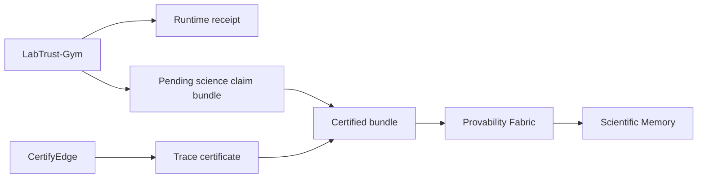

# PCS quickstart

This walkthrough verifies and signs a LabTrust conformance bundle. You need only this repository and, when you want schema checks against pcs-core, an optional sibling checkout of [pcs-core](https://github.com/SentinelOps-CI/pcs-core).

## One-command demo

From the repository root, run the following command.

```bash
make demo-pcs
```

The demo runs `pf verify science-claim` on the certified bundle, `pf sign science-claim` to a demo signed output, `pf inspect science-claim --strict` on the signed bundle, and `pf inspect science-claim --reverify` on the LabTrust-export signed fixture.

## Manual commands

```bash
./pf verify science-claim tests/pcs/fixtures/labtrust/science_claim_bundle.certified.json
./pf sign science-claim tests/pcs/fixtures/labtrust/science_claim_bundle.certified.json \
  --out tests/pcs/signed_science_claim_bundle.demo.json
./pf inspect science-claim tests/pcs/signed_science_claim_bundle.demo.json --strict
```

You can also invoke the CLI with Go directly.

```bash
go -C core/cli/pf run . verify science-claim \
  tests/pcs/fixtures/labtrust/science_claim_bundle.certified.json
```

## End-to-end flow (overview)



LabTrust runs a demo and exports trace, runtime receipt, and a pending bundle. CertifyEdge emits a trace certificate. LabTrust attaches the certificate to produce `science_claim_bundle.certified.json`. Provability Fabric verifies consistency and signs an importable result. Scientific Memory imports the signed bundle.

Provability Fabric focuses on internal consistency, provenance, certificate status, and trace-hash alignment. LabTrust simulation and temporal checking happen in the upstream repositories.

## Release-mode smoke test

Frozen release fixtures live under `tests/pcs/fixtures/labtrust-release/`.

```bash
make demo-pcs-release
```

For strict release admission with handoff, registry, admission profile, and formal artifacts, see [Verification](verification.md).

## Next steps

- [Verification](verification.md) — release mode, 17 checks, explain commands
- [Clean checkout chain](clean-checkout-chain.md) — full cross-repo release
- [Admission benchmarks](admission-benchmarks.md) — measure admission controller quality
- [Fixtures](fixtures.md) — regenerate frozen release evidence
