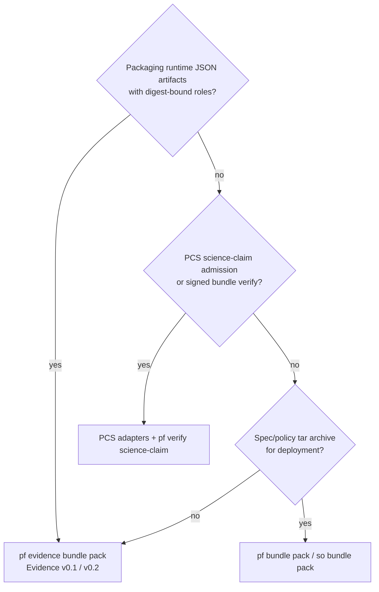

# Evidence compatibility matrix

Evidence v0.1/v0.2 JSON bundles are a distinct lane from PCS science-claim bundles and `so bundle pack` tar archives. Use this matrix to pick the right API and avoid accidental conflation.

## Which bundle API do I use?

| Need | Use | Do not use |
|------|-----|------------|
| Digest-bound claim/proof/trace bundle | `pf evidence bundle pack` | PCS `EvidenceBundle.v0` JSON |
| Science claim admission | PCS verify/sign/inspect | `pf evidence validate` |
| Spec tar deployment archive | `pf bundle pack` | Evidence bundle schema |
| Deep deterministic replay | `pf evidence replay --execute` + KIT submodule | PCS handoff manifests |

## Anti-patterns

- Packing a `.tar.gz` spec archive as an Evidence `artifacts[]` entry and expecting `pf evidence validate --strict` to treat it as a spec bundle.
- Passing PCS `claim_refs` / `artifact_hashes` shaped JSON to `pf evidence validate`.
- Feeding PCS bundle references into `pf evidence replay` without converting lanes (no conversion tooling in v0.2).
- Assuming `so trace run` replaces `pf evidence replay`; they operate on different inputs (raw KIT trace vs Evidence bundle).

## Runtime CERT-V1

| Platform artifact | v0.1/v0.2 mapping | Notes |
|-------------------|-------------------|-------|
| `evidence/certs/<session>/<seq>.cert.json` | Attestation-compatible ref (`application/vnd.cert-v1+json`) | External CERT-V1 schema via submodule |
| `evidence/logs/sidecar.jsonl` | Source for binding events | **Always** emits `evidence_v01_binding` on emit path; optional `evidence_bundle_ref` when `EVIDENCE_BUNDLE_REF` is set |

## TRACE-REPLAY-KIT

| Platform artifact | v0.1/v0.2 mapping | Notes |
|-------------------|-------------------|-------|
| KIT `trace.json` (steps or events) | Import via `pf evidence trace import --kit-trace … --out execution-trace.json` | Produces v0.1 `execution-trace` artifact |
| v0.2 `replay_context` | `kit_trace_path`, `fixtures_path`, `low_view_oracle` | Validated in strict mode when present |
| `pf evidence replay --execute` | Runs `external/TRACE-REPLAY-KIT/runner/replay_run.py` | Requires `make submodules` |
| `so trace run` | Unchanged platform command | Evidence replay wraps bundle checks + optional execute |

## SWE-bench runs

| Run artifact | v0.1/v0.2 mapping | Notes |
|--------------|-------------------|-------|
| `metadata.json` | Optional bundle metadata sidecar | Document-only |
| `predictions.pfmeta.jsonl` | Cross-links hashes | Related, not identical to Evidence bundle |
| `replay_bundle.json` | May inform execution-trace refs | No automatic conversion |

## PCS EvidenceBundle.v0

| PCS artifact | Relationship | Gap |
|--------------|--------------|-----|
| Science claim bundles | Related domain | Different schema, admission, and CLI (`pcs` adapters) |
| Signed science claim bundles | Not interchangeable | Use PCS verification docs |
| `config/schemas/pcs/EvidenceBundle.v0.schema.json` | Separate lane | Negative tests in `tests/evidence_schema/test_lane_separation.py` |

## Spec bundles (`so bundle pack`)

| Artifact | Relationship |
|----------|--------------|
| tar.gz spec archives | Out of scope — not Evidence JSON bundles |

See also [Evidence lane guide](evidence-lane-guide.md).

## Platform gaps (honest)

| Gap | Mitigation |
|-----|------------|
| Windows bash testbed | CI runs on `ubuntu-latest`; local Windows may skip live sidecar |
| Missing submodules | `make dev-standards`; CI fails closed on Evidence smoke |
| KIT tag `v1.0.0` pending upstream | Commit pins in `tools/standards/versions.json` + `standards-pin-check` |
| Morph / PCS / CERT sig verification | Documented non-guarantees in [replay guide](../guides/replay-guarantees.md) and [attestation signatures](evidence-attestation-signatures.md) |
| Proof semantic checking (Lean) | Structural + digest-bound only — see [Proof artifact semantics](#proof-artifact-semantics) |

## Proof artifact semantics

Evidence bundles may include **proof** role artifacts (`proof.schema.json`). In `--strict` mode, `pf evidence validate`:

- Validates proof JSON against the proof schema
- Verifies the proof artifact digest matches the bundle manifest entry
- Ensures digest-bound cross-references (for example from attestation `signed_claim_ref`) are internally consistent

Evidence validation does **not**:

- Invoke Lean or any semantic proof checker
- Establish theorem soundness, policy correctness, or admission verdicts
- Replace PCS or Morph proof obligations

### Recommended acceptance wording

> The Evidence lane validates proof artifacts **structurally and digest-bound**. It does **not** perform Lean semantic proof checking. Proof soundness remains an external obligation of the producing system and its verification toolchain.

See also [Evidence attestation signatures](evidence-attestation-signatures.md) for signature delegation.

## pf check-trace caveat

`pf check-trace` only verifies that a `bundles/` directory exists in the working tree. It is **not** an Evidence bundle validator, traceability checker, substitute for `pf evidence validate --strict`, or substitute for the Evidence replay lane (`pf evidence replay` / TRACE-REPLAY-KIT execute).
