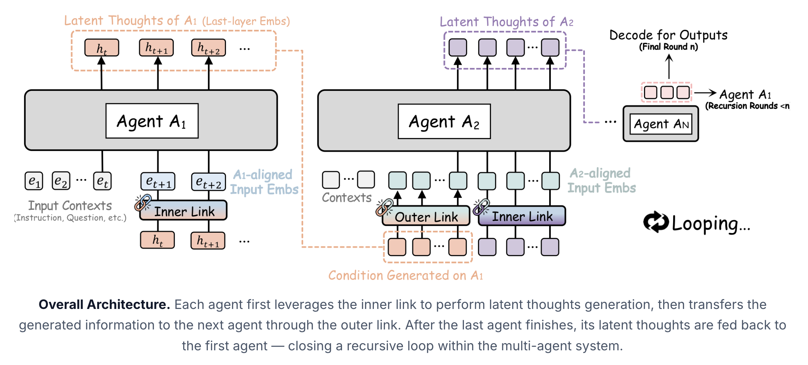
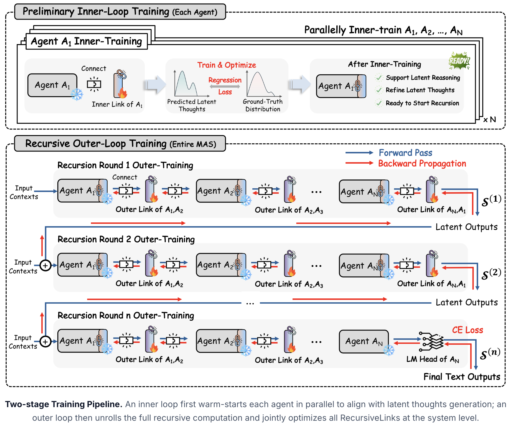
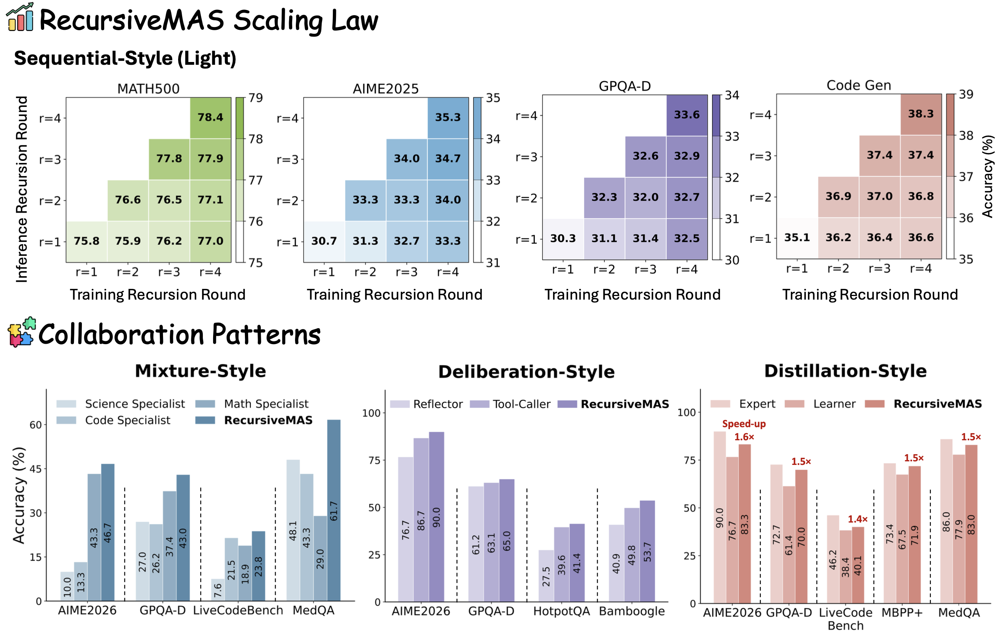

<p align="center">
  <picture>
    <source media="(prefers-color-scheme: dark)" srcset="assets/logo.png">
    
  </picture>
</p>

<h3 align="center">
Scaling agent collaboration through latent-space recursion.
</h3>

<p align="center">
    <a href="https://arxiv.org/abs/2604.25917"></a>
    <a href="https://vishalmysore.github.io/recursiveMASDemo/"></a>
    <a href="https://recursivemas.github.io/"></a>
    <a href="https://huggingface.co/papers/2604.25917"></a>
    <a href="https://huggingface.co/RecursiveMAS/collections"></a>
    <a href="https://huggingface.co/RecursiveMAS/models"></a>
    <a href="https://huggingface.co/RecursiveMAS/datasets"></a>
    <a href="https://www.linkedin.com/posts/jiaruzou_recursivemas-recurisvelearning-multiagentsystems-ugcPost-7455645681341493248-ioLJ/?utm_source=share&utm_medium=member_desktop&rcm=ACoAADc5TzgBN_tNOuzpi7kE7n6dZ0y13EkxZOs"></a>
    <a href="https://x.com/Jiaru_Zou/status/2049551828296389118"></a>
    <a href="https://venturebeat.com/ai/how-recursivemas-speeds-up-multi-agent-inference-by-2-4x-and-reduces-token-usage-by-75"></a>
    <a href="https://www.youtube.com/watch?v=dUmT0OIGoqE"></a>
</p>

<p align="center">
  <video src="https://github.com/user-attachments/assets/9c09261a-c9e7-4851-8462-eeda69989b4e" controls width="300"></video>
</p>

## 💡 News

**[2026.06.28]** Complete **training implementations & data** ([🤗 HF Datasets](https://huggingface.co/RecursiveMAS/datasets)), and **inference & evaluation pipelines** for RecursiveMAS are now available! Also checkout our [**updated project website**](https://recursivemas.github.io/)!

**[2026.06.25]** Try it out! RecursiveMAS now has a [**🧩YouTube tutorial**](https://www.youtube.com/watch?v=dUmT0OIGoqE) and an [**🎮interactive playground demo**](https://vishalmysore.github.io/recursiveMASDemo/)! Special thanks to [@TwoMinutePapers](https://www.youtube.com/@TwoMinutePapers) and [@vishalmysore](https://github.com/vishalmysore)!

**[2026.05.24]** Check out the [VentureBeat article](https://t.co/KSQwBwpC4W) featuring our research on RecursiveMAS!

**[2026.05.01]** Ours paper is featured as [🤗 HuggingFace 1st Paper of the Week/Day](https://huggingface.co/papers/2604.25917)!

**[2026.04.28]** All [collaboration styles](https://huggingface.co/RecursiveMAS/collections) and [model checkpoints](https://huggingface.co/RecursiveMAS/models), with [examplified downstream inference](https://github.com/RecursiveMAS/RecursiveMAS) are now available. Stay tuned for the complete training/inference pipeline and additional features!

**[2026.04.28]** We have released the [RecursiveMAS paper](https://huggingface.co/papers/2604.25917)! 

## 🌟 Overview

**RecursiveMAS** is a multi-agent framework that scales agent collaboration through **latent-space recursion**. Rather than treating each LLM agent as an isolated module, RecursiveMAS casts the whole multi-agent system as a unified recursive computation. 

<p align="center">
  
</p>

Heterogeneous agents are connected by lightweight **RecursiveLink** modules that let them exchange, refine, and evolve latent states across recursion rounds.

<p align="center">
  
</p>

Correspondingly, we design an **Inner-Outer Loop training** paradigm for progressive
co-optimization. The inner loop provides a preliminary model-level warm start for each agent. The outer loop then
trains the outer RecursiveLink across agents at the system-level.

<p align="center">
  
</p>

Across **9 benchmarks** spanning mathematics, science, medicine, search, and code generation, RecursiveMAS improves multi-agent coordination by recursively refining shared latent states, delivering stronger performance across **sequential**, **mixture**, **distillation**, and **deliberation** MAS systems.

## 📋 Supported Features

✅ Release All Collaboration Patterns (Sequential, Mixture, Deliberation, Distillation).

✅ Release Demo Code for Inference (Commands Provided Below).

✅ Release Complete Inference Pipeline Across All Downstreams.

✅ Release All Training Data & Pipeline Implementation.

☑️ Add Additional Supported Model Family & MAS Collaboration Patterns.

## 🧩 Repository Roadmap

```text
RecursiveMAS/
├── README.md
├── requirements.txt
├── inference/              # inference pipeline and downstream tasks evaluation
│   ├── run.py
│   ├── README.md
│   ├── dataset/
│   └── inference_utils/
└── train/                  # inner-outer loop training pipeline
    ├── train_inner.py
    ├── train_outer.py
    ├── README.md
    ├── data/
    └── outer/
```

## 🛠️ Environment Setup

Create a clean Python environment and install all project requirements from the repository root:

```bash
conda create -n recursivemas python=3.10 -y
conda activate recursivemas
```

Install the required packages:

```bash
pip install -r requirements.txt
```

For Deliberation-style runs on the search datasets (`bamboogle`, `hotpotqa`), the Tool-Caller agent queries a real web-search API (e.g., Tavily). Please put your Search API key in a plain-text file and pass it with `--tavily_keys_file`:

```bash
# e.g., keys.txt
tvly-xxxxxxxxxxxxxxxxxxxxxxxx
```

To enable open-ended questions grading by an LLM judge (e.g., OpenAI-compatible API). Configure the LLM judge through the following environment variables:

```bash
export API_KEY=...          # bearer token for the judge endpoint
export API_BASE_URL=...     # OpenAI-compatible base or chat-completions URL
export API_MODEL=...        # judge model id
```

## 🚀 Quick Start

### 🤗 Plug-and-Play Reference Checkpoints

To play around with RecursiveMAS, you can download our reference checkpoints under the [RecursiveMAS Hugging Face organization](https://huggingface.co/RecursiveMAS/models).

>📌 **Kind Note**: The released Hugging Face checkpoints are provided for quick, plug-and-play exploration and as reference systems, but **NOT** a single replacement for the task-specific training setups used across the paper.
>
>The paper covers different collaboration styles and task-specific data settings; To repduce full paper results, please follow the training and inference pipeline below for complete downstream tasks evaluation.

The checkpoints are organized by MAS collaboration styles. Each collection contains (i) the individual role-specific agent, and (ii) their (inner/outer) RecursiveLink modules:

#### [1. Sequential-Style (Light) RecursiveMAS Collection](https://huggingface.co/collections/RecursiveMAS/sequential-style-recursivemas)

| **Agent Organization** | **Download** |
| ---------------------- | ------------ |
| Sequential-Light-Planner-Qwen3-1.7B | [🤗 HuggingFace](https://huggingface.co/RecursiveMAS/Sequential-Light-Planner-Qwen3-1.7B) |
| Sequential-Light-Critic-Llama3.2-1B | [🤗 HuggingFace](https://huggingface.co/RecursiveMAS/Sequential-Light-Critic-Llama3.2-1B) |
| Sequential-Light-Solver-Qwen2.5-Math-1.5B | [🤗 HuggingFace](https://huggingface.co/RecursiveMAS/Sequential-Light-Solver-Qwen2.5-Math-1.5B) |
| Sequential-Light-Outerlinks | [🤗 HuggingFace](https://huggingface.co/RecursiveMAS/Sequential-Light-Outerlinks) |

#### [2. Sequential-Style (Scaled) RecursiveMAS Collection](https://huggingface.co/collections/RecursiveMAS/sequential-style-recursivemas)

| **Agent Organization** | **Download** |
| ---------------------- | ------------ |
| Sequential-Scaled-Planner-Gemma3-4B | [🤗 HuggingFace](https://huggingface.co/RecursiveMAS/Sequential-Scaled-Planner-Gemma3-4B) |
| Sequential-Scaled-Critic-Llama3.2-3B | [🤗 HuggingFace](https://huggingface.co/RecursiveMAS/Sequential-Scaled-Critic-Llama3.2-3B) |
| Sequential-Scaled-Solver-Qwen3.5-4B | [🤗 HuggingFace](https://huggingface.co/RecursiveMAS/Sequential-Scaled-Solver-Qwen3.5-4B) |
| Sequential-Scaled-Outerlinks | [🤗 HuggingFace](https://huggingface.co/RecursiveMAS/Sequential-Scaled-Outerlinks) |

#### [3. Mixture-Style RecursiveMAS Collection](https://huggingface.co/collections/RecursiveMAS/mixture-style-recursivemas)

| **Agent Organization** | **Download** |
| ---------------------- | ------------ |
| Mixture-Math-DeepSeek-R1-Distill-Qwen-1.5B | [🤗 HuggingFace](https://huggingface.co/RecursiveMAS/Mixture-Math-DeepSeek-R1-Distill-Qwen-1.5B) |
| Mixture-Code-Qwen2.5-Coder-3B | [🤗 HuggingFace](https://huggingface.co/RecursiveMAS/Mixture-Code-Qwen2.5-Coder-3B) |
| Mixture-Science-BioMistral-7B | [🤗 HuggingFace](https://huggingface.co/RecursiveMAS/Mixture-Science-BioMistral-7B) |
| Mixture-Summarizer-Qwen3.5-2B | [🤗 HuggingFace](https://huggingface.co/RecursiveMAS/Mixture-Summarizer-Qwen3.5-2B) |
| Mixture-Outerlinks | [🤗 HuggingFace](https://huggingface.co/RecursiveMAS/Mixture-Outerlinks) |

#### [4. Distillation-Style RecursiveMAS Collection](https://huggingface.co/collections/RecursiveMAS/distillation-style-recursivemas)

| **Agent Organization** | **Download** |
| ---------------------- | ------------ |
| Distillation-Expert-Qwen3.5-9B | [🤗 HuggingFace](https://huggingface.co/RecursiveMAS/Distillation-Expert-Qwen3.5-9B) |
| Distillation-Learner-Qwen3.5-4B | [🤗 HuggingFace](https://huggingface.co/RecursiveMAS/Distillation-Learner-Qwen3.5-4B) |
| Distillation-Outerlinks | [🤗 HuggingFace](https://huggingface.co/RecursiveMAS/Distillation-Outerlinks) |

#### [5. Deliberation-Style RecursiveMAS Collection](https://huggingface.co/collections/RecursiveMAS/deliberation-style-recursivemas)

| **Agent Organization** | **Download** |
| ---------------------- | ------------ |
| Deliberation-Reflector-Qwen3.5-4B | [🤗 HuggingFace](https://huggingface.co/RecursiveMAS/Deliberation-Reflector-Qwen3.5-4B) |
| Deliberation-Toolcaller-Qwen3.5-4B | [🤗 HuggingFace](https://huggingface.co/RecursiveMAS/Deliberation-Toolcaller-Qwen3.5-4B) |
| Deliberation-Outerlinks | [🤗 HuggingFace](https://huggingface.co/RecursiveMAS/Deliberation-Outerlinks) |

Here is an example of how to load the RecursiveMAS pipeline:

```python
from system_loader import load_mas_system

mas = load_mas_system(
    style="sequential_light",
    device="cuda",
    trust_remote_code=True,
)

planner = mas.agents["planner"].model
critic = mas.agents["critic"].model
solver = mas.agents["solver"].model
```

To play around, you can run any collaboration styles by passing `--style` and `--dataset`. For example,

```bash
python inference/run.py \
  --style sequential_scaled \
  --dataset math500 \
  --device cuda
```

## 🧪 RecursiveMAS Training 

To reproduce our experiments with task-specific configurations, please train the inner and outer RecursiveLink modules with the matching collaboration style and training data. The overall training includes two phases:
1. **Inner-Loop Training (`train/train_inner.py`)**: train each agent role-specific *inner* RecursiveLink (frozen base model + a small
  `ln_res_adapter`).
2. **Outer-Loop Training (`train/train_outer.py`)**: Connect all agents together and train the *outer* RecursiveLink between agents through recursion.

An example of the complete training pipeline is:

```bash
# Inner-Loop Training
python train/train_inner.py \
  --model_name_or_path Qwen/Qwen3-1.7B \
  --mas_design sequential \
  --mas_role planner \
  --mas_task math \
  --dataset_name RecursiveMAS/Sequential-Math \
  --save_dir train/ckpts/seq_light/planner_math

# Outer-Loop Training
python train/train_outer.py \
  --style sequential_light \
  --agent1_model_name_or_path Qwen/Qwen3-1.7B \
  --agent2_model_name_or_path meta-llama/Llama-3.2-1B-Instruct \
  --agent3_model_name_or_path Qwen/Qwen2.5-Math-1.5B-Instruct \
  --agent1_inner_aligner_path train/ckpts/seq_light/planner_math \
  --agent2_inner_aligner_path train/ckpts/seq_light/refiner_math \
  --agent3_inner_aligner_path train/ckpts/seq_light/solver_math \
  --mas_task math \
  --dataset_name RecursiveMAS/Sequential-Math \
  --save_dir train/ckpts/seq_light/outer_math
```

**Additional detailed per-style commands are provided in [our training guide (train/README.md)](train/README.md).**

### 🗂️ Training Data

We store all training data through [Hugging Face datasets](https://huggingface.co/RecursiveMAS/datasets). Below is a concise overview of each training set, along with its corresponding description.

| Dataset | Used by |
| --- | --- |
| [🤗 RecursiveMAS/Sequential-Math](https://huggingface.co/datasets/RecursiveMAS/Sequential-Math) | Sequential inner & outer loop training |
| [🤗 RecursiveMAS/Sequential-Code](https://huggingface.co/datasets/RecursiveMAS/Sequential-Code) | Sequential inner & outer loop training |
| [🤗 RecursiveMAS/Distillation-Math](https://huggingface.co/datasets/RecursiveMAS/Distillation-Math) | Distillation inner & outer loop training |
| [🤗 RecursiveMAS/Distillation-Code](https://huggingface.co/datasets/RecursiveMAS/Distillation-Code) | Distillation inner & outer loop training |
| [🤗 RecursiveMAS/Mixture-Math](https://huggingface.co/datasets/RecursiveMAS/Mixture-Math) | Mixture math expert inner loop training |
| [🤗 RecursiveMAS/Mixture-Code](https://huggingface.co/datasets/RecursiveMAS/Mixture-Code) | Mixture code expert inner loop training |
| [🤗 RecursiveMAS/Mixture-Science](https://huggingface.co/datasets/RecursiveMAS/Mixture-Science) | Mixture science expert inner loop training |
| [🤗 RecursiveMAS/Mixture-Summarizer](https://huggingface.co/datasets/RecursiveMAS/Mixture-Summarizer) | Mixture summarizer inner loop training |
| [🤗 RecursiveMAS/Mixture-Outer](https://huggingface.co/datasets/RecursiveMAS/Mixture-Outer) | Mixture outer loop training |
| [🤗 RecursiveMAS/Deliberation](https://huggingface.co/datasets/RecursiveMAS/Deliberation) | Deliberation inner & outer loop training |

**For complete details, please kindly refer to [our training data guide (train/data/README.md)](train/data/README.md).**

## 🔎 Inference and Evaluation

Use `inference/run.py` to evaluate a released reference system or a locally trained, task-specific configuration.

For example,

```bash
# Evaluate Sequential Light Style RecursiveMAS on Math500
python inference/run.py \
  --style sequential_light \
  --dataset math500 \
  --device cuda \
  --ckpt_override planner=train/ckpts/seq_light/planner_math \
  --ckpt_override critic=train/ckpts/seq_light/refiner_math \
  --ckpt_override solver=train/ckpts/seq_light/solver_math \
  --ckpt_override outer=train/ckpts/seq_light/outer_math
```

### 🧪 Supported Downstream Tasks

| Benchmark | Task | Metric |
| --- | --- | --- |
| `math500` | math reasoning | accuracy |
| `gpqa` | graduate-level science | accuracy |
| `medqa` | medical QA | accuracy |
| `mbppplus` | code generation | test pass rate |
| `aime25`, `aime26` | competition math | pass@10 |
| `livecodebench` | code generation | pass@1 |
| `bamboogle`, `hotpotqa` | open-domain search QA | EM/LLM-as-Judge |

**For complete influence and evaluation details, please kindly refer to [our inference guide (inference/README.md)](inference/README.md).**

## 📊 Experiment Results


To reproduce the paper’s results, train the corresponding collaboration style and data configuration, then run the provided inference pipeline using the resulting checkpoints.

In the following tables, we provide one single-run results across different RecursiveMAS collaboration styles and downstream tasks as references. 

### Sequential-Scaled

| math500 | gpqa | medqa | aime25 | aime26 | livecodebench |
| --- | --- | --- | --- | --- | --- |
| 88.5 | 65.7 | 82.7 | 86.7 | 90.0 | 42.1 |

### Sequential-Light

| math500 | gpqa | medqa | mbppplus | aime25 | aime26 |
| --- | --- | --- | --- | --- | --- |
| 78.0 | 32.3 | 32.0 | 37.3 | 33.3 | 20.0 |

### Distillation

| gpqa | medqa | mbppplus | aime26 | livecodebench |
| --- | --- | --- | --- | --- |
| 68.7 | 82.7 | 72.6 | 86.7 | 43.0 |

### Mixture

| gpqa | medqa | aime26 | livecodebench |
| --- | --- | --- | --- |
| 42.7 | 61.3 | 46.7 | 22.8 |

### Deliberation

| gpqa | aime26 | bamboogle | hotpotqa |
| --- | --- | --- | --- |
| 65.3 | 90.0 | 54.4 | 43.6 |


## 🙏 Acknowledgements

This project is built upon the excellent open-source community, including [vLLM](https://github.com/vllm-project/vllm), [ARPO](https://github.com/RUC-NLPIR/ARPO), and [TextGrad](https://github.com/zou-group/textgrad).


We welcome discussions and contributions to RecursiveMAS! If you would like to suggest improvements, please feel free to send a pull request or contact us through [email](mailto:jiaru@stanford.edu)!


## 📚 Citation
```bibtex
@misc{recursivemas,
      title={Recursive Multi-Agent Systems},
      author={Xiyuan Yang and Jiaru Zou and Rui Pan and Ruizhong Qiu and Pan Lu and Shizhe Diao and Jindong Jiang and Hanghang Tong and Tong Zhang and Markus J. Buehler and Jingrui He and James Zou},
      year={2026},
      eprint={2604.25917},
      archivePrefix={arXiv},
      primaryClass={cs.AI},
      url={https://arxiv.org/abs/2604.25917},
}
```
 

## 🌟 Star History
Please kindly give us a GitHub Star ⭐️ if you find our project is helpful!

<a href="https://www.star-history.com/?repos=RecursiveMAS%2FRecursiveMAS&type=date&legend=top-left">
 <picture>
   <source media="(prefers-color-scheme: dark)" srcset="https://api.star-history.com/chart?repos=RecursiveMAS/RecursiveMAS&type=date&theme=dark&legend=top-left" />
   <source media="(prefers-color-scheme: light)" srcset="https://api.star-history.com/chart?repos=RecursiveMAS/RecursiveMAS&type=date&legend=top-left" />
   
 </picture>
</a>

Thanks a lot for your interest in our project! 😊