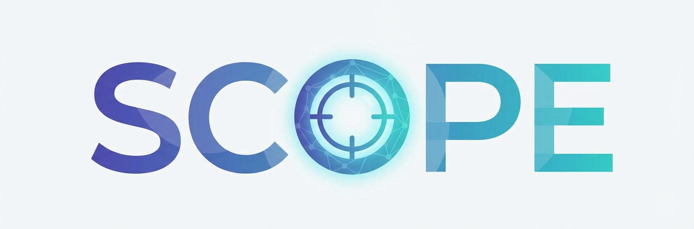

<p align="center">
  
</p>

<p align="center">
  <strong>Self-evolving Context Optimization via Prompt Evolution</strong>
</p>

<p align="center">
  A framework for automatic prompt optimization that learns from agent execution traces
</p>

<p align="center">
  <a href="#installation">Installation</a> •
  <a href="#quick-start">Quick Start</a> •
  <a href="#how-it-works">How It Works</a> •
  <a href="#api-reference">API</a> •
  <a href="#configuration">Configuration</a>
</p>

<p align="center">
  <a href="https://arxiv.org/abs/2512.15374"></a>
  <a href="https://pypi.org/project/scope-optimizer/"></a>
  
  <a href="https://github.com/JarvisPei/SCOPE/actions"></a>
  
  <a href="CONTRIBUTING.md"></a>
</p>

<p align="center">
  <strong>English</strong> | <a href="assets/README_zh.md">中文</a>
</p>

---

## News

- **[2026/03]** **v0.1.3** — Added `custom_prompts` and `custom_domains` API: override built-in prompt templates and domain categories to tailor SCOPE for any use case (e.g., personal assistant, coding agent) without modifying core code.
- **[2026/03]** [EvolveClaw](https://github.com/JarvisPei/EvolveClaw) — Evolve [OpenClaw](https://github.com/openclaw/openclaw)'s system prompt using SCOPE. Zero-modification plugin integration that makes the agent improve the more you use it.
- **[2026/02]** We support agent workflows like [EvoFabric](https://github.com/huawei-noah/noah-research/tree/master/EvoFabric) with SCOPE, start equipping your agent with SCOPE now!


## Overview

**SCOPE** transforms static agent prompts into self-evolving systems that learn from their own execution. Instead of manually crafting prompts, SCOPE automatically synthesizes guidelines from execution traces and continuously improves agent performance.

📄 **Paper:** [SCOPE: Prompt Evolution for Enhancing Agent Effectiveness](https://arxiv.org/abs/2512.15374)

**Key Features:**
- 🔄 **Automatic Learning** — Synthesizes guidelines from errors and successful patterns
- 📊 **Dual-Stream Memory** — Tactical (task-specific) + Strategic (cross-task) learning
- 🎯 **Best-of-N Selection** — Generates multiple candidates and selects the best
- 🧠 **Memory Optimization** — Automatically consolidates and deduplicates rules
- 🔌 **Universal Model Support** — Works with OpenAI, Anthropic, and 100+ providers via LiteLLM

## Installation

```bash
pip install scope-optimizer
```

**From source:**

```bash
git clone https://github.com/JarvisPei/SCOPE.git
cd SCOPE
pip install -e .
```

## Quick Start

```python
import asyncio
from dotenv import load_dotenv
from scope import SCOPEOptimizer
from scope.models import create_openai_model

load_dotenv()  # Load API keys from .env

async def main():
    model = create_openai_model("gpt-4o-mini")
    optimizer = SCOPEOptimizer(
        synthesizer_model=model,
        exp_path="./scope_data",  # Strategic rules persist here
    )
    
    # Initialize prompt with previously learned strategic rules
    base_prompt = "You are a helpful assistant."
    strategic_rules = optimizer.get_strategic_rules_for_agent("my_agent")
    current_prompt = base_prompt + strategic_rules  # Applies cross-task knowledge
    
    while not task_complete:
        # ... your agent logic ...
        
        # Call SCOPE after each step
        result = await optimizer.on_step_complete(
            agent_name="my_agent",
            agent_role="AI Assistant", 
            task="Answer user questions",
            model_output="...",
            error=error_if_any,  # Pass errors when they occur
            current_system_prompt=current_prompt,
            task_id="task_001",
        )
        
        # Apply generated guideline
        if result:
            guideline, guideline_type = result  # guideline_type: "tactical" or "strategic"
            current_prompt += f"\n\n## Learned Guideline:\n{guideline}"

asyncio.run(main())
```

## How It Works

SCOPE operates through four key mechanisms:

### 1. Guideline Synthesis (π_φ, π_σ)

When errors occur or quality issues are detected, SCOPE **generates** multiple candidate guidelines using the Generator (π_φ) and **selects** the best candidate using the Selector (π_σ).

### 2. Dual-Stream Routing (π_γ)

Guidelines are classified and routed to appropriate memory:

| Stream | Scope | Persistence | Example |
|--------|-------|-------------|---------|
| **Tactical** | Task-specific | In-memory only | "This API has rate limit of 10/min" |
| **Strategic** | Cross-task | Saved to disk | "Always validate JSON before parsing" |

### 3. Memory Optimization (π_ω)

Strategic memory is automatically optimized via conflict resolution, subsumption pruning, and consolidation.

### 4. Prompt Evolution

```
θ_new = θ_base ⊕ M_strategic ⊕ M_tactical
```


## API Reference

### SCOPEOptimizer

```python
optimizer = SCOPEOptimizer(
    # Required parameters
    synthesizer_model,              # Model instance for guideline synthesis (e.g., gpt-4o-mini)
    exp_path="./scope_data",        # Path for storing strategic rules and history
    
    # Analysis settings
    enable_quality_analysis=True,   # Whether to analyze successful steps for improvements (default: True)
    quality_analysis_frequency=1,   # Analyze quality every N successful steps (default: 1)
    auto_accept_threshold="medium", # Confidence threshold: "all", "low", "medium", "high" (default: "medium")
    
    # Memory settings
    max_rules_per_task=20,          # Max tactical rules to apply per task (default: 20)
    strategic_confidence_threshold=0.85,  # Min confidence for strategic promotion (default: 0.85)
    max_strategic_rules_per_domain=10,    # Max strategic rules per domain per agent (default: 10)
    
    # Synthesis settings
    synthesis_mode="thoroughness",  # "efficiency" (fast) or "thoroughness" (comprehensive, default)
    use_best_of_n=False,            # Enable Best-of-N candidate selection (default: False)
    candidate_models=None,          # Additional models for Best-of-N (default: None)
    
    # Advanced settings
    optimizer_model=None,           # Separate model for rule optimization (default: synthesizer_model)
    enable_rule_optimization=True,  # Auto-optimize strategic memory when full (default: True)
    store_history=False,            # Store guideline generation history to disk (default: False)
    
    # Customization (v0.1.3+)
    custom_prompts=None,            # Dict to override built-in prompt templates (default: None)
    custom_domains=None,            # List of domain strings to override ALLOWED_DOMAINS (default: None)
)
```

#### Prompt & Domain Customization

Override built-in prompts and domains to tailor SCOPE for your use case (e.g., personal assistant, coding agent):

```python
optimizer = SCOPEOptimizer(
    synthesizer_model=model,
    exp_path="./data",
    custom_prompts={
        "error_reflection": "...",                  # Error analysis prompt
        "quality_reflection_efficiency": "...",     # Lightweight quality analysis
        "quality_reflection_thoroughness": "...",   # Comprehensive quality analysis
        "selector": "...",                          # Best-of-N candidate selector
        "classification": "...",                    # Guideline classifier
        "rule_analysis": "...",                     # Memory optimization: rule analysis
        "rule_merge": "...",                        # Memory optimization: rule merging
        "subsumption_verify": "...",                # Memory optimization: subsumption check
        "conflict_resolve": "...",                  # Memory optimization: conflict resolution
    },
    custom_domains=["code_quality", "communication", "user_preferences", "general"],
)
```

All keys are optional — unset keys fall back to the built-in defaults. Custom prompt templates must use the same `{placeholder}` format strings as the originals in `scope/prompts.py`.

### on_step_complete

```python
# Call after each agent step
result = await optimizer.on_step_complete(
    # Required parameters
    agent_name="my_agent",          # Unique identifier for the agent
    agent_role="AI Assistant",      # Role/description of the agent
    task="Complete user request",   # Current task description
    
    # Step context (at least one of error/model_output/observations required)
    model_output="Agent's response...",  # Model's output text (default: None)
    tool_calls="[{...}]",           # Tool calls attempted as string (default: None)
    observations="Tool results...", # Observations/tool results received (default: None)
    error=exception_if_any,         # Exception if step failed (default: None)
    
    # Prompt context
    current_system_prompt=prompt,   # Current system prompt including strategic rules
    
    # Optional settings
    task_id="task_001",             # Task identifier for tracking (default: None)
    truncate_context=True,          # Truncate long context for efficiency (default: True)
)

# Returns: Tuple[str, str] or None
# - On success: (guideline_text, guideline_type) where guideline_type is "tactical" or "strategic"
# - On skip/failure: None
```

### Loading Strategic Rules

```python
# Load strategic rules at agent initialization (critical for cross-task learning!)
strategic_rules = optimizer.get_strategic_rules_for_agent("my_agent")
initial_prompt = base_prompt + strategic_rules  # Apply learned knowledge
```

Strategic rules are stored in `{exp_path}/strategic_memory/global_rules.json` and automatically loaded when you call `get_strategic_rules_for_agent()`.


### Model Adapters

```python
from scope.models import create_openai_model, create_anthropic_model, create_litellm_model

# OpenAI
model = create_openai_model("gpt-4o-mini")

# Anthropic
model = create_anthropic_model("claude-3-5-sonnet-20241022")

# LiteLLM (100+ providers)
model = create_litellm_model("gpt-4o-mini")           # OpenAI
model = create_litellm_model("gemini/gemini-1.5-pro") # Google
model = create_litellm_model("ollama/llama2")         # Local
```

### Custom Model Adapter

```python
# Async adapter (default)
from scope.models import BaseModelAdapter, Message, ModelResponse

class MyAsyncAdapter(BaseModelAdapter):
    async def generate(self, messages: List[Message]) -> ModelResponse:
        result = await my_api_call(messages)
        return ModelResponse(content=result)  # Return raw text

# Sync adapter (for non-async code)
from scope.models import SyncModelAdapter

class MySyncAdapter(SyncModelAdapter):
    def generate_sync(self, messages: List[Message]) -> ModelResponse:
        result = requests.post(api_url, json={"messages": ...})
        return ModelResponse(content=result.json()["text"])

# Or wrap any function (sync or async)
from scope.models import CallableModelAdapter

def my_model(messages):
    return "response"

model = CallableModelAdapter(my_model)
```

> **Note:** Your adapter just returns the raw model output. SCOPE's prompts ask the model to return JSON, and SCOPE handles parsing internally.

## Configuration

### Environment Variables

Set API keys via environment variables or `.env` file:

```bash
# Copy template and edit
cp .env.template .env
```

```python
from dotenv import load_dotenv
load_dotenv()  # API keys automatically loaded
```

See [`.env.template`](.env.template) for all supported providers.

### Confidence Thresholds

| Threshold | Accepts | Use Case |
|-----------|---------|----------|
| `"all"` | Everything | Aggressive learning |
| `"low"` | Low + Medium + High | Balanced |
| `"medium"` | Medium + High | Conservative (default) |
| `"high"` | High only | Very conservative |

### Synthesis Modes

| Mode | Description |
|------|-------------|
| `"thoroughness"` | Comprehensive 7-dimension analysis (default) |
| `"efficiency"` | Lightweight, faster analysis |

### Logging

```python
import logging

logging.getLogger("scope").setLevel(logging.INFO)
logging.getLogger("scope").addHandler(logging.StreamHandler())
```

## Testing

Verify your setup with the included test scripts:

```bash
# Quick connectivity test
python examples/test_simple.py

# Deep functionality test
python examples/test_scope_deep.py

# With custom model/provider
python examples/test_simple.py --model gpt-4o --provider openai
python examples/test_scope_deep.py --model claude-3-5-sonnet-20241022 --provider anthropic
```

Run `--help` for all options.

## Development

```bash
# Install with dev dependencies
pip install -e ".[dev]"

# Run tests
pytest tests/

# Format code
black scope/
ruff check scope/
```

## Citation

If you find SCOPE useful for your research, please cite our paper:

```bibtex
@article{pei2025scope,
  title={SCOPE: Prompt Evolution for Enhancing Agent Effectiveness},
  author={Pei, Zehua and Zhen, Hui-Ling and Kai, Shixiong and Pan, Sinno Jialin and Wang, Yunhe and Yuan, Mingxuan and Yu, Bei},
  journal={arXiv preprint arXiv:2512.15374},
  year={2025}
}
```

## License

MIT License - see [LICENSE](LICENSE) for details.
