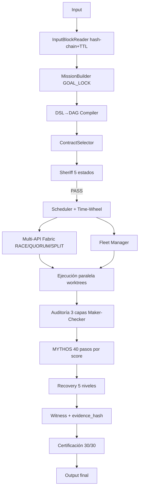

# Readme arquitectura Yaiwes

**Repositorio:** `maxbry123-commits/agentes`  
**Rama:** `main`  
**Corte forense:** 2026-09-02  
**Documento relacionado, no fusionado:** [Readme arquitectura Wordflow Code](https://github.com/maxbry123-commits/nct-core/blob/main/Readme%20arquitectura%20wordflow%20code.md)

Este archivo contiene exclusivamente la arquitectura del agente YAIWES, TEAM Kernel, SDPA y sus capas de gobierno. La arquitectura del motor Wordflow Code vive separada en NCT Core.


## Índice navegable

- [1. Fuentes utilizadas](#1-fuentes-utilizadas)
- [2. Ubicación del código fuente del kernel](#2-ubicacion-del-codigo-fuente-del-kernel)
- [3. Arquitectura YAIWES separada](#3-arquitectura-yaiwes-separada)
- [4. Regla de las tres preguntas](#4-regla-de-las-tres-preguntas)
- [5. Responsabilidades de extension-kernel](#5-responsabilidades-de-extension-kernel)
- [6. Selección determinista de workflows](#6-seleccion-determinista-de-workflows)
- [7. Mythos/EURS/DRE](#7-mythoseursdre)
- [8. Método de poda para componentes externos](#8-metodo-de-poda-para-componentes-externos)
- [9. Grok Build: qué corresponde a YAIWES](#9-grok-build-que-corresponde-a-yaiwes)
- [10. Auditoría X-Ray actual](#10-auditoria-x-ray-actual)
- [11. GAPS prioritarios](#11-gaps-prioritarios)
- [12. Huella forense reproducible del árbol real](#12-huella-forense-reproducible-del-arbol-real)
- [13. Método común para reciclar código open source sin copiar otro cerebro](#13-metodo-comun-para-reciclar-codigo-open-source-sin-copiar-otro-cerebro)
- [14. Veredicto](#14-veredicto)

## 1. Fuentes utilizadas

### Arquitectura del repositorio

- [PLAN_100 — estructura definitiva](https://github.com/maxbry123-commits/agentes/blob/main/agente-yaiwes/PLAN_100_ESTRUCTURA_DEFINITIVA.md)
- [STRUCTURE — árbol materializado](https://github.com/maxbry123-commits/agentes/blob/main/agente-yaiwes/STRUCTURE.md)
- [TEAM Kernel v3](https://github.com/maxbry123-commits/agentes/blob/main/PIPELINE/03_TEAM_KERNEL_PARTE1.md)
- [Perfil TEAM SEALS](https://github.com/maxbry123-commits/agentes/blob/main/PIPELINE/06_PERFIL_MAESTRO_TEAM_SEALS.md)
- [Kernel Thought Protocol](https://github.com/maxbry123-commits/agentes/blob/main/PIPELINE/10_KERNEL_THOUGHT_PROTOCOL.md)
- [Arquitectura Wordflow Kernel](https://github.com/maxbry123-commits/agentes/blob/main/PIPELINE/ARQUITECTURA_02_KERNEL.md)
- [Auditoría raíz R5 — TEAM/Kernel](https://github.com/maxbry123-commits/agentes/blob/main/AUDITORIA-RAIZ-R5-YAIWES-TEAM-KERNEL-XRAY-2026-09-01.md)

### Crazy Wall aportados

- [Crazy Wall v2](https://github.com/maxbry123-commits/agentes/blob/main/FUENTE-GROK-YAIWES-CRAZY-WALL-v2.html)
- [Crazy Wall v3](https://github.com/maxbry123-commits/agentes/blob/main/FUENTE-GROK-YAIWES-CRAZY-WALL-v3.html)
- [Crazy Wall v4](https://github.com/maxbry123-commits/agentes/blob/main/FUENTE-GROK-YAIWES-CRAZY-WALL-v4.html)

### SDPA aportado

- [Arquitectura SDPA](https://github.com/maxbry123-commits/agentes/blob/main/Documentos%20proyectos%20Yaiwes/Documentos%20proyectos%20Yaiwes%201/Arquitectura%20SDPA/SDPA_Architecture_Document.md)
- [Resumen SDPA](https://github.com/maxbry123-commits/agentes/blob/main/Documentos%20proyectos%20Yaiwes/Documentos%20proyectos%20Yaiwes%201/Arquitectura%20SDPA/RESUMEN-PROPUESTA-SDPA.md)

## 2. Ubicación del código fuente del kernel

No existe una sola carpeta ejecutable llamada `Agente TEAM`. El código fuente real está distribuido.

### Kernel de control operativo

- [extensions/wordflow_kernel](https://github.com/maxbry123-commits/agentes/tree/main/extensions/wordflow_kernel)
- [workflow.py](https://github.com/maxbry123-commits/agentes/blob/main/extensions/wordflow_kernel/workflow.py)
- [runtime.py](https://github.com/maxbry123-commits/agentes/blob/main/extensions/wordflow_kernel/runtime.py)
- [fail_closed.py](https://github.com/maxbry123-commits/agentes/blob/main/extensions/wordflow_kernel/fail_closed.py)
- [preflight.py](https://github.com/maxbry123-commits/agentes/blob/main/extensions/wordflow_kernel/preflight.py)
- [instance.py](https://github.com/maxbry123-commits/agentes/blob/main/extensions/wordflow_kernel/instance.py)
- [instance_store.py](https://github.com/maxbry123-commits/agentes/blob/main/extensions/wordflow_kernel/instance_store.py)
- [ledger.py](https://github.com/maxbry123-commits/agentes/blob/main/extensions/wordflow_kernel/ledger.py)
- [checkpoint.py](https://github.com/maxbry123-commits/agentes/blob/main/extensions/wordflow_kernel/checkpoint.py)
- [engine_registry.py](https://github.com/maxbry123-commits/agentes/blob/main/extensions/wordflow_kernel/engine_registry.py)
- [gateway/intelligence.py](https://github.com/maxbry123-commits/agentes/blob/main/extensions/wordflow_kernel/gateway/intelligence.py)
- [gateway/router_http.py](https://github.com/maxbry123-commits/agentes/blob/main/extensions/wordflow_kernel/gateway/router_http.py)

### Nueva estructura del kernel YAIWES

- [agente-yaiwes/kernel-principal](https://github.com/maxbry123-commits/agentes/tree/main/agente-yaiwes/kernel-principal)
- [extension-kernel](https://github.com/maxbry123-commits/agentes/tree/main/agente-yaiwes/kernel-principal/extension-kernel)
- [reasoning-kernel](https://github.com/maxbry123-commits/agentes/tree/main/agente-yaiwes/kernel-principal/reasoning-kernel)
- [resource-governance](https://github.com/maxbry123-commits/agentes/tree/main/agente-yaiwes/kernel-principal/resource-governance)

Los archivos `runtime.py` y `workflow.py` de `kernel-principal` tienen el mismo blob SHA que sus equivalentes en `extensions/wordflow_kernel`. Son un espejo parcial, no un segundo kernel independiente.

## 3. Arquitectura YAIWES separada

```text
main/
└── agente-yaiwes/
    ├── kernel-principal/
    │   ├── extension-kernel/
    │   │   ├── capability-registry/
    │   │   ├── capability-passport/
    │   │   ├── abi-mount/
    │   │   ├── mount-guard/
    │   │   └── native-learning/
    │   ├── reasoning-kernel/
    │   │   ├── decision-on-demand/
    │   │   ├── expert-panel-router/
    │   │   ├── consensus-trigger/
    │   │   ├── goal-dual-driver/
    │   │   └── workflow-capacity/
    │   ├── resource-governance/
    │   │   ├── resource-broker-gate/
    │   │   ├── circuit-breaker/
    │   │   ├── retry-policy/
    │   │   ├── lease-management/
    │   │   └── watchdog/
    │   ├── internal-bus/
    │   ├── kernel-router/
    │   ├── stages/
    │   ├── workflow.py
    │   └── runtime.py
    ├── input-layer/
    │   ├── cli-entry/
    │   ├── route-entry/
    │   ├── reception/
    │   └── cross-tool-session-import/
    ├── definition-registry/
    │   ├── workflow-definition/
    │   ├── task-definition/
    │   ├── tool-definition/
    │   ├── skill-definition/
    │   ├── schema-contracts/
    │   └── authorization-model/
    ├── control-governance/
    │   ├── sheriff-sentinel-council/
    │   ├── forensic-core/
    │   ├── verdict-authority/
    │   ├── llm-control-deny/
    │   └── gap-registry/
    ├── multi-workflow-engine/
    │   ├── shared-services/
    │   └── instances/workflow-N/
    ├── execution-orchestration/
    │   ├── state-machine-executor/
    │   ├── dag-executor/
    │   ├── task-generation/
    │   ├── classifier-scheduler/
    │   └── deterministic-execution/
    ├── execution-engine-pool/
    │   ├── adapter-layer/
    │   ├── capability-matching/
    │   ├── worktree-isolation/
    │   ├── result-normalization/
    │   └── auxiliary-role-agents/
    └── observability/
        └── trace-history/
```

# Arquitectura completa del sistema Fables (MAXBRY TEAM / TEAM SEALS / YAIWES)
**Consolidado a partir de todos los documentos compartidos — EURS, MYTHOS, FABLES, SDPA, Ley Principal, Loops, YAIWES**

## 0. Principio rector (validado externamente)

Anthropic publicó en 2026 su propia arquitectura para agentes de larga duración, llamada **Managed Agents**, y separa dos cosas exactamente como lo hace Fables:

- **Sesión** = el log append-only de todo lo que pasó (equivale a `LISTA_GLOBAL` + `ledger` + `bitacora`)
- **Harness** = el bucle que llama al modelo y enruta sus llamadas a herramientas (equivale al `DeterministicLoopEngine` + `RuntimeBus`)

La razón de separarlos: *"los harnesses codifican suposiciones sobre lo que el modelo no puede hacer solo — y esas suposiciones se vuelven obsoletas según el modelo mejora."* Esto valida directamente la filosofía de Fables (90% código / 10% LLM) y da una razón añadida para mantenerlos desacoplados: **el harness cambiará con el tiempo, la sesión no debe perder datos cuando eso pase.**

Anthropic también documentó 2 fallos que hay que prevenir en el diseño de Fables:
- **"Context anxiety":** el modelo se apresura a terminar cuando siente que se acaba el contexto. Solución de Anthropic: reiniciar el contexto con un resumen estructurado, no dejar que el mismo hilo siga degradándose.
- **"Self-evaluation bias":** un modelo que revisa su propio trabajo casi siempre dice que está bien. Solución: el generador y el evaluador deben ser instancias distintas, con criterios de calificación concretos, nunca "¿es esto bueno?" en abstracto.

Ambos fallos aplican directamente a `CHEF_FINAL` y a `JUDGE` del diseño de Fables — deben ejecutarse en una instancia distinta a la que generó la solución, o el diseño hereda el sesgo de auto-evaluación documentado por Anthropic.

---

## 1. Capa 0 — Filosofía y regla madre

```
90% código determinista, 10% LLM máximo
Núcleo del kernel: 0% LLM
Mismo input → mismo output (reproducibilidad, Ley L15)
```

Componentes deterministas del núcleo (nunca tocan LLM): Scheduler, DSL, DAG, Sheriff, Memory, Workflow Engine, Capability/Plugin/Skill Compiler, Recovery, Trazabilidad.
Cápsulas LLM (aisladas, con 44 gates): Council/consenso, investigación compleja, generación inicial sin plantilla, resolver ambigüedad.

## 2. Capa 1 — Entrada y bloqueo de misión

```
InputBlockReader (hash chain + TTL)
   → MissionBuilder (GOAL_LOCK)
```

`InputBlockReader` es la respuesta al "input en cola mientras procesa" que pediste: cada entrada se encadena por hash (como un mini-blockchain local) con un TTL — permite que lleguen nuevos inputs mientras el sistema sigue trabajando, sin perder ni duplicar ninguno. `GOAL_LOCK` congela el objetivo apenas se acepta la misión, para que no derive a mitad de la ejecución.

## 3. Capa 2 — Compilación DSL → DAG → Contrato → Sheriff

```
DSL→DAG Compiler (autoensamblaje)
   → ContractSelector (Fingerprint→Threat→Rules→Graph→Reverse)
   → Sheriff (5 estados: GREEN/YELLOW/ORANGE/RED/BLACK, 22 checks)
```

El Sheriff nunca es una sugerencia — es una máquina de estados de 5 valores. `ORANGE` exige 3 aprobaciones "shadow" independientes antes de pasar. `BLACK` solo puede desbloquearlo el Director humano. Nada llega al Scheduler sin pasar por aquí.

## 4. Capa 3 — Kernel de ejecución (0% LLM)

```
Scheduler (sharding + Time-Wheel)
   → Multi-API Fabric (SINGLE / RACE / QUORUM / SPLIT)
   → Fleet Manager (Aider, Cline, Codex, Mimo, Hermes)
   → Ejecución paralela (worktrees + sandbox pool)
```

- **Time-Wheel:** la estructura de datos real detrás de tu "loop tipo calendario que se activa cada tanto tiempo" — es el mismo algoritmo O(1) que usa el kernel de Linux y Kafka para manejar millones de temporizadores sin recorrerlos uno a uno.
- **Multi-API Fabric:** tu respuesta a "20-30-50 APIs en vez de una". Tres modos: `SINGLE` (una llamada), `RACE` (dispara varias, usa la primera que responde), `QUORUM` (necesita que varias coincidan antes de aceptar la respuesta), `SPLIT` (divide el input en partes y corre un prompt distinto por cada una, en paralelo).
- **Fleet Manager:** el pool de agentes externos completos (no capacidades sueltas) corriendo en paralelo, cada uno en su propio worktree aislado.

## 5. Capa 4 — Auditoría de 3 capas

```
Auditoría adversarial → Auditoría cruzada → Maker-Checker
```

Esta es la capa que previene el "self-evaluation bias" que documentó Anthropic: quien construye (`Maker`) nunca es quien aprueba (`Checker`).

## 6. Capa 5 — Motor de razonamiento MYTHOS (10% LLM, solo aquí)

```
40 pasos: 14 Deterministas / 16 Probabilísticos / 10 Híbridos
Escalado por score: LOW(9 pasos) → MEDIUM(16) → HIGH(25) → EXTREME(40)
BLOQUE_X (solo EXTREME): Critic → Counter-Critic → Failure Simulator → V1/V2/V3 → Judge
```

`LISTA_GLOBAL` es la memoria estructural que se crea en la Fase 0, se actualiza al final de cada fase, se arrastra siempre, y nunca se reinicia hasta cerrar el ciclo (reglas R1-R4, con verificación estricta de que `pasos(v_n) ⊆ pasos(v_n+1)`).

## 7. Capa 6 — Recuperación (5 niveles)

```
RETRY → ROLLBACK → CHECKPOINT → REPLAN → ESCALATE
```

`REPLANNER_LOOP` tiene un límite explícito: máximo 3 iteraciones. Si la confianza sigue por debajo de 70 tras esas 3, escala al Director — nunca reintenta infinito.

## 8. Capa 7 — Evidencia y certificación

```
Witness (L1-L4 + evidence_hash)
   → Certificación (30/30 checks)
```

Nada se considera "hecho" sin un `evidence_hash` — toda tarea genera evidencia o, según la Ley L11, no existió.

## 9. El "Loop" de nivel de sesión (inspirado en Claude Code / ReAct)

```
loops/claude_loop.py — ReAct de 9 fases
state.loops (nivel_0..10: estado, heartbeat)
sentinela/core.py — auto-mejora aislada
corazon/snapshot.py — snapshot cada N acciones
```

Esto es la capa que da "latido" (heartbeat) al sistema — permite que el kernel siga vivo entre inputs, tome snapshots periódicos, y detecte si algún nivel del loop se quedó colgado.

## 10. Memoria persistente (el sistema de "20 millones de parámetros de contexto")

Niveles reales identificados en tus documentos YAIWES:
```
LEVEL 1: reasoningBank, hierarchicalMemory, learningBridge, hybridSearch, tieredCache
LEVEL 2: memoryGraph, agentMemoryScope, vectorBackend, mutationGuard, gnnService
LEVEL 3: skills, explainableRecall, reflexion, attestationLog, batchOperations, memoryConsolidation
LEVEL 4: causalGraph, nightlyLearner, learningSystem, semanticRouter
LEVEL 5: graphTransformer, sonaTrajectory, contextSynthesizer, rvfOptimizer, mmrDiversityRanker, guardedVectorBackend
```

Esto no es un archivo de "20 millones de parámetros" en el sentido de pesos de un modelo — es un **presupuesto de contexto recuperable** (20M tokens equivalentes acumulados en memoria externa, no en la ventana activa del LLM), organizado en 5 niveles de sofisticación creciente, desde caché simple (Nivel 1) hasta un transformer de grafos sobre las relaciones entre recuerdos (Nivel 5).

## 11. Flujo completo de punta a punta



**Nota crítica de la auditoría forense (documento anterior):** este flujo está completo *en el papel*. La auditoría real encontró que la mayoría de los archivos que deberían conectar estas capas (`sentinel.py`, `council.py`, `supervisor.py`, `watchdog.py`, `capability_brain.py`...) existen solo como nombres importados, no como código. El diseño de arriba es correcto — lo que falta es escribirlo o fusionarlo desde las librerías de la siguiente lista.


# Componentes open source a integrar — investigación completa

## 1. Arquitectura de sesión/harness (recomendación directa de Anthropic, 2026)

- **Patrón a copiar:** "Managed Agents" — sesión (log append-only) separada del harness (bucle+router). No es un paquete que se instale; es un patrón que debes aplicar a `state-events-durability/` (sesión) vs `kernel-principal/` (harness).
- **Para implementar la sesión persistente:** **Temporal** (event history nativo) o **LangGraph** con checkpointer (más ligero).
- **Para el harness de 3 agentes (Planificador → Generador → Evaluador) que Anthropic documentó para tareas largas:** este es el patrón exacto de **Mixture-of-Agents** ya identificado, o puedes implementarlo directo con **DSPy** (3 módulos encadenados con roles distintos).

## 2. Multi-API Fabric — RACE / QUORUM / SPLIT (tu pedido de "20-30-50 APIs")

- **LiteLLM Router** — el más directo: registras N proveedores/API keys como una lista de "deployments" y el Router hace fallback, balanceo de carga y reintentos entre todos ellos de forma nativa. Cubre `SINGLE` y parcialmente `RACE`.
- **`asyncio.wait(..., return_when=FIRST_COMPLETED)`** (nativo de Python) — la primitiva exacta para implementar `RACE` puro: lanzas la misma pregunta a varios proveedores y usas el primero que responde.
- **Mixture-of-Agents (Together AI)** — implementa `QUORUM` de forma nativa: varios proponentes, un agregador que exige coincidencia.
- **`asyncio.gather` + LiteLLM Router** — para `SPLIT`: divides el input en partes, cada parte va a un proveedor distinto en paralelo, se combinan los resultados al final.

## 3. Time-Wheel (tu "loop tipo calendario/agenda")

- **Netty `HashedWheelTimer`** (Java) — la implementación de referencia del algoritmo O(1), si quieres portarlo.
- **`APScheduler`** (Python) — no es O(1) puro pero cubre el 95% del caso de uso real: tareas recurrentes por hora/cron/intervalo, con persistencia de jobs.
- **Celery Beat** — si ya vas a usar colas de tareas (recomendado más abajo), Beat te da el scheduler periódico integrado gratis.
- **`croniter`** — para traducir "cada tanto tiempo" en lenguaje natural/cron a triggers reales (esto es lo que usa MiniMax Agent para sus "Scheduled Tasks con lenguaje natural").

## 4. Input Block Reader — cola de entrada con hash-chain + TTL (tu pedido "input en cola como Grok")

- **NATS JetStream** — deduplicación nativa por hash de mensaje + políticas de retención por TTL, exactamente el patrón que describes.
- **Redis Streams** — alternativa más simple si ya usas Redis, con consumer groups y expiración.
- Cualquiera de las dos te da "el sistema sigue procesando mientras llegan más inputs" sin escribir tu propio hash-chain desde cero.

## 5. Fleet Manager — pool de agentes externos completos

- **Ray** (actors) — ya identificado antes, sigue siendo la mejor opción para correr Aider/Cline/Codex/Hermes como workers paralelos reales.
- **Grok Build** (`xai-org/grok-build`, Apache-2.0) — worktrees aislados ya listos para extraer (visto en la auditoría anterior).

## 6. Sistema de memoria — el "archivo de 20 millones de parámetros" (contexto persistente)

- **Letta (MemGPT)** — bloques de memoria por agente + memoria archival vectorial; cubre Nivel 1-2 de tu esquema (`reasoningBank`, `hierarchicalMemory`, `vectorBackend`).
- **Mem0** — alternativa más ligera para `tieredCache` y `hybridSearch`.
- **Graphiti** — grafo de conocimiento temporal; cubre Nivel 2 y 4 (`memoryGraph`, `causalGraph`, `gnnService`).
- **LlamaIndex** (Property Graph Index) — alternativa a Graphiti si prefieres algo más maduro para `contextSynthesizer` y `mmrDiversityRanker` (MMR — Maximal Marginal Relevance — ya viene implementado nativo en LlamaIndex y en LangChain retrievers).
- **DVC (Data Version Control)** — para `attestationLog` y `memoryConsolidation`, ya que DVC versiona y da fingerprint a artefactos de forma nativa.

## 7. Sistema de chat / multi-canal

- **OpenClaw 2.0** (`2026.8.1`, agosto 2026) — reescribió su app de navegador, agregó sesiones multiplayer compartidas en la nube y movió el almacenamiento de sesión; es hoy la referencia más completa de "gateway multicanal" (933 contribuidores activos).
- **Hermes Agent v0.20.6** (27 agosto 2026) — agregó navegación con perfil real con consentimiento, un motor de actualización remota por SSH, un "fleet profile rail" (várias instancias gestionadas como flota) y un catálogo de 50+ servidores MCP verificados — el "fleet profile rail" es directamente aplicable a tu Fleet Manager.
- **n8n** — sigue siendo la opción más simple si prefieres montar el gateway multicanal tú mismo con nodos visuales en vez de adoptar OpenClaw completo.

## 8. Elicitación estructurada — "rutas por listas previas" (lo que Claude usa para preguntarte antes de iniciar)

- **JSON Schema con `enum`** + **PydanticAI** — la forma más simple: cada pregunta de ruta es un campo con opciones fijas, nunca texto libre.
- **Rasa Open Source** — si quieres un framework dedicado de "slot-filling" conversacional con formularios de varios pasos, es la referencia más madura en open source para exactamente este patrón.

## 9. System prompt / documentos de memoria (recomendación del creador de Claude Code)

- **Convención `CLAUDE.md`** (memoria de proyecto, ya cubierta) + **`AGENTS.md`** (estándar más nuevo, multi-agente, adoptado por varios harnesses en 2026).
- **Claude Agent SDK** — su función de "compactación automática" de contexto es la referencia oficial más reciente para manejar contexto largo sin el patrón antiguo de "reinicio manual" — vale la pena revisar su documentación de compactación antes de escribir la tuya propia.
- Patrón de harness recomendado por Anthropic en 2026 (3 principios): usar lo que el modelo ya sabe hacer bien (no scaffolding innecesario), preguntarte qué scaffolding puedes **quitar** con cada mejora de modelo, y fijar los límites del harness con el entorno (permisos) con mucho cuidado — los tres aplican directo a decidir cuándo un paso de tus 40 debe seguir siendo código y cuándo ya puede confiarse al LLM sin cápsula.

## 10. Comparación de veredicto: qué mantener vs qué reemplazar de OpenClaw/Hermes

| Aspecto | OpenClaw 2.0 | Hermes v0.20.6 | Recomendación para YAIWES |
|---|---|---|---|
| Arquitectura | Gateway separado de los agentes | Todo en una sola clase de agente | Copiar el patrón de OpenClaw (ya alineado con tu `kernel-router`) |
| Escalamiento multi-usuario | Sesiones multiplayer en la nube (nuevo) | No es su fuerte | Adoptar si YAIWES tendrá más de un usuario |
| Memoria/auto-mejora | Más débil en este punto | Memoria procedural que convierte workflows exitosos en skills reutilizables | Adoptar el patrón de Hermes para tu `native-learning/` |
| Flota de instancias | No nativo | "Fleet profile rail" (nuevo, agosto 2026) | Estudiar su código directamente para tu `agent-fleet-parallelism/` |
| Catálogo de herramientas | Amplio (plugins) | 50+ servidores MCP verificados (nuevo) | Cualquiera sirve como fuente para tu `capability-registry/` |


# 📂 MAPA DE RUTA — Integración de Loops, Multi-API, Memoria 20M y Chat
**Depende de:** cierre de los Bloques 1-4 anteriores (kernel base ya delegando correctamente)
**Objetivo:** cerrar el diseño de Fables (Time-Wheel, Multi-API Fabric, Input Block, Fleet Manager, Memoria de 5 niveles, gateway de chat) con librerías reales, no desde cero.

## TABLA DE TAREAS

| # | Tarea | Mini-prompt para la IA | Ubicación final | OSS/Recurso | IA sugerida |
|---|---|---|---|---|---|
| 71 | Implementar Time-Wheel scheduler | "Implementa un scheduler periódico usando APScheduler que dispare triggers según config declarativa (cron o intervalo), sustituyendo el `timewheel.py` sin código." | `parallel/timewheel.py` | APScheduler + `croniter` | Codex |
| 72 | Implementar Multi-API Fabric — modo SINGLE/RACE | "Configura LiteLLM Router con al menos 3 proveedores registrados, y añade un modo RACE con `asyncio.wait(FIRST_COMPLETED)` sobre esos proveedores." | `llmnet/fanout.py` | LiteLLM Router | Codex |
| 73 | Implementar Multi-API Fabric — modo QUORUM | "Implementa el patrón Mixture-of-Agents: N proveedores responden en paralelo, un agregador exige coincidencia mínima antes de aceptar." | `llmnet/fanout.py` | Mixture-of-Agents | Grok |
| 74 | Implementar Multi-API Fabric — modo SPLIT | "Divide el input en N partes lógicas y despacha cada una a un proveedor distinto vía LiteLLM Router, combinando resultados al final." | `llmnet/fanout.py` | LiteLLM Router + `asyncio.gather` | Codex |
| 75 | Implementar Input Block Reader (cola con hash-chain+TTL) | "Configura NATS JetStream (o Redis Streams) con deduplicación por hash de mensaje y TTL de retención, para que el sistema siga aceptando input mientras procesa." | `inputblock/store.py` | NATS JetStream | Claude Code |
| 76 | Implementar Fleet Manager real | "Implementa un pool de Ray Actors, uno por cada agente externo (Aider, Codex, Hermes), cada uno en su propio worktree aislado." | `fleet/manager.py` | Ray + Grok Build (worktrees) | Grok |
| 77 | Extraer patrón "fleet profile rail" de Hermes v0.20.6 | "Revisa el release v0.20.6 de NousResearch/hermes-agent y adapta el mecanismo de fleet profile rail a `agent-fleet-parallelism/`, descartando su lógica de decisión propia." | `agent-fleet-parallelism/` | Hermes Agent v0.20.6 (solo esa pieza) | Grok |
| 78 | Implementar memoria Nivel 1 (cache/búsqueda) | "Integra Letta para reasoningBank + hierarchicalMemory + vectorBackend." | `tools-models-memory-knowledge/memory/nivel1/` | Letta (MemGPT) | GPT |
| 79 | Implementar memoria Nivel 2 (grafo) | "Integra Graphiti para memoryGraph + causalGraph + gnnService." | `tools-models-memory-knowledge/memory/nivel2/` | Graphiti | GPT |
| 80 | Implementar memoria Nivel 3 (skills/reflexión) | "Implementa explainableRecall y reflexion usando el patrón Reflexion ya identificado, conectado al registro de skills." | `tools-models-memory-knowledge/memory/nivel3/` | Reflexion | Codex |
| 81 | Implementar memoria Nivel 4-5 (síntesis avanzada) | "Integra LlamaIndex Property Graph Index para contextSynthesizer y mmrDiversityRanker (MMR nativo)." | `tools-models-memory-knowledge/memory/nivel4-5/` | LlamaIndex | GPT |
| 82 | Adoptar patrón sesión/harness de Anthropic | "Separa explícitamente el log de sesión (append-only) del bucle harness siguiendo el patrón Managed Agents de Anthropic; documenta cuál archivo es cuál." | `state-events-durability/` (sesión) vs `kernel-principal/` (harness) | — (patrón, no librería) | GPT |
| 83 | Separar Generador de Evaluador (anti self-evaluation bias) | "Verifica que CHEF_FINAL y JUDGE nunca corran en la misma instancia/contexto que generó la solución que están evaluando." | `chef_final/`, `control-governance/verdict-authority/` | — | Claude Code |
| 84 | Implementar contexto reset estructurado (anti context-anxiety) | "Cuando el score de complejidad indique tarea larga, implementa reinicio de contexto con resumen estructurado en vez de dejar crecer el mismo hilo." | `reasoning-kernel/decision-on-demand/` | Claude Agent SDK (compactación) como referencia | GPT |
| 85 | Elicitación estructurada por listas (rutas previas) | "Implementa un schema Pydantic con campos `enum` para cada decisión de ruta que hoy se pregunta como texto libre." | `input-layer/reception/` | PydanticAI (o Rasa si se quiere framework dedicado) | Codex |
| 86 | Adoptar gateway multicanal de OpenClaw 2.0 | "Estudia el Gateway de OpenClaw 2.0 (separación daemon/agentes) y adapta el patrón a `input-layer/route-entry/`, sin copiar su bucle decisor." | `input-layer/route-entry/` | OpenClaw 2.0 (solo el Gateway) | Grok |
| 87 | Registrar catálogo MCP de Hermes | "Registra en `capability-registry/` los servidores MCP verificados que Hermes v0.20.6 ya cataloga, con su passport correspondiente." | `extension-kernel/capability-passport/` | Hermes MCP catalog | MiniMax |
| 88 | Test de integración Multi-API Fabric | "Prueba los 4 modos (SINGLE/RACE/QUORUM/SPLIT) contra al menos 3 proveedores reales, verificando que cada modo produce el comportamiento esperado." | `llmnet/tests/` | `pytest` | Codex |
| 89 | Test de integración Input Block bajo carga | "Simula input concurrente llegando mientras el sistema procesa una tarea larga, verifica que no se pierde ni duplica ningún mensaje." | `inputblock/tests/` | `pytest` + NATS test harness | Codex |
| 90 | Auditoría final de esta capa | "Actualiza el gap-registry marcando qué tareas 71-89 quedaron resueltas, y qué parte del diseño Fables (Time-Wheel, Multi-API, Input Block, Fleet, Memoria 5 niveles) ya tiene código real vs solo diseño." | `control-governance/gap-registry/` | — | MiniMax |

## CHECKPOINTS

📝 Checkpoint tarea 71 — Quién: ___ | IA: ___ | Fecha/hora: ___ | 100% pass: ☐ Sí ☐ No | Evidencia: ___
📝 Checkpoint tarea 72 — Quién: ___ | IA: ___ | Fecha/hora: ___ | 100% pass: ☐ Sí ☐ No | Evidencia: ___
📝 Checkpoint tarea 73 — Quién: ___ | IA: ___ | Fecha/hora: ___ | 100% pass: ☐ Sí ☐ No | Evidencia: ___
📝 Checkpoint tarea 74 — Quién: ___ | IA: ___ | Fecha/hora: ___ | 100% pass: ☐ Sí ☐ No | Evidencia: ___
📝 Checkpoint tarea 75 — Quién: ___ | IA: ___ | Fecha/hora: ___ | 100% pass: ☐ Sí ☐ No | Evidencia: ___

🔍 Auditoría tareas 71-75 — Quién audita: ___ | Fecha: ___ | Veredicto: ___

📝 Checkpoint tarea 76 — Quién: ___ | IA: ___ | Fecha/hora: ___ | 100% pass: ☐ Sí ☐ No | Evidencia: ___
📝 Checkpoint tarea 77 — Quién: ___ | IA: ___ | Fecha/hora: ___ | 100% pass: ☐ Sí ☐ No | Evidencia: ___
📝 Checkpoint tarea 78 — Quién: ___ | IA: ___ | Fecha/hora: ___ | 100% pass: ☐ Sí ☐ No | Evidencia: ___
📝 Checkpoint tarea 79 — Quién: ___ | IA: ___ | Fecha/hora: ___ | 100% pass: ☐ Sí ☐ No | Evidencia: ___
📝 Checkpoint tarea 80 — Quién: ___ | IA: ___ | Fecha/hora: ___ | 100% pass: ☐ Sí ☐ No | Evidencia: ___

🔍 Auditoría tareas 76-80 — Quién audita: ___ | Fecha: ___ | Veredicto: ___

📝 Checkpoint tarea 81 — Quién: ___ | IA: ___ | Fecha/hora: ___ | 100% pass: ☐ Sí ☐ No | Evidencia: ___
📝 Checkpoint tarea 82 — Quién: ___ | IA: ___ | Fecha/hora: ___ | 100% pass: ☐ Sí ☐ No | Evidencia: ___
📝 Checkpoint tarea 83 — Quién: ___ | IA: ___ | Fecha/hora: ___ | 100% pass: ☐ Sí ☐ No | Evidencia: ___
📝 Checkpoint tarea 84 — Quién: ___ | IA: ___ | Fecha/hora: ___ | 100% pass: ☐ Sí ☐ No | Evidencia: ___
📝 Checkpoint tarea 85 — Quién: ___ | IA: ___ | Fecha/hora: ___ | 100% pass: ☐ Sí ☐ No | Evidencia: ___

🔍 Auditoría tareas 81-85 — Quién audita: ___ | Fecha: ___ | Veredicto: ___

📝 Checkpoint tarea 86 — Quién: ___ | IA: ___ | Fecha/hora: ___ | 100% pass: ☐ Sí ☐ No | Evidencia: ___
📝 Checkpoint tarea 87 — Quién: ___ | IA: ___ | Fecha/hora: ___ | 100% pass: ☐ Sí ☐ No | Evidencia: ___
📝 Checkpoint tarea 88 — Quién: ___ | IA: ___ | Fecha/hora: ___ | 100% pass: ☐ Sí ☐ No | Evidencia: ___
📝 Checkpoint tarea 89 — Quién: ___ | IA: ___ | Fecha/hora: ___ | 100% pass: ☐ Sí ☐ No | Evidencia: ___
📝 Checkpoint tarea 90 — Quién: ___ | IA: ___ | Fecha/hora: ___ | 100% pass: ☐ Sí ☐ No | Evidencia: ___

🔍 Auditoría tareas 86-90 (cierre de esta capa) — Quién audita: ___ | Fecha: ___ | Veredicto: ___


## 4. Regla de las tres preguntas

Para cada pieza nueva:

1. Si ofrece el mismo resultado con el mismo input y no requiere juicio, es una **capacidad** y se registra en `extension-kernel/capability-registry/`.
2. Si es una secuencia fija que combina capacidades, es un **workflow** y vive en `multi-workflow-engine/instances/workflow-N/`.
3. Si razona, mantiene memoria propia o no puede desmontarse sin perder valor, es un **agente de pool** y se conecta mediante `execution-engine-pool/` y `agent-fleet-parallelism/`.

### Ubicación de objetivos y tareas

```text
objetivo primario/secundarios
→ kernel-principal/reasoning-kernel/goal-dual-driver/

entrada cruda
→ input-layer/reception/
→ definition-registry/task-definition/
→ execution-orchestration/task-generation/
```

## 5. Responsabilidades de extension-kernel

| Subraíz | Responsabilidad | Estado detectado |
|---|---|---|
| capability-registry | Catálogo de capacidades | Parcial |
| capability-passport | Fuente, licencia, versión, fingerprint | Parcial |
| abi-mount | Puerto técnico estable | Parcial |
| mount-guard | Licencia, seguridad, ABI y permisos | Principalmente placeholder |
| native-learning | Historial de confianza y fiabilidad | Placeholder |

Regla de aislamiento: el kernel no debe importar directamente un repositorio externo. Importa el puerto de `abi-mount`; el adaptador encapsula el código externo.

## 6. Selección determinista de workflows

```text
input-layer
→ task-definition
→ classifier-scheduler
→ workflow-definition registry
→ match alto: ejecutar sin LLM
→ match ambiguo: expert-panel-router
→ consensus-trigger
→ decision-on-demand
→ workflow elegido o sintetizado
```

La secuencia anterior es el objetivo arquitectónico. La auditoría no encontró una prueba E2E que demuestre que toda la cadena se ejecuta actualmente.

## 7. Mythos/EURS/DRE

Mythos no debe convertirse en un segundo kernel. Debe ser contenido versionado bajo:

```text
reasoning-kernel/
└── decision-on-demand/
    └── prompts/
        ├── mythos_40.md
        ├── eurs_standard.md
        ├── eurs_turbo.md
        └── dre_by_score.md
```

`classifier-scheduler` selecciona LOW/MEDIUM/HIGH/EXTREME. Mythos no decide cuándo ejecutarse a sí mismo.

## 8. Método de poda para componentes externos

Patrones usados:

- Anti-Corruption Layer: evita que el modelo de otro agente contamine YAIWES.
- Ports & Adapters: el kernel consume contratos propios.
- Strangler Fig: permite migración gradual sin reescritura completa.

Proceso:

```text
responsabilidad única
→ separar “decide” de “hace”
→ conservar ejecución
→ descartar cerebro externo redundante
→ definir puerto YAIWES
→ adaptar
→ sandbox
→ tests
→ capability passport
→ mount guard
→ registro
```

## 9. Grok Build: qué corresponde a YAIWES

El repositorio oficial es [xai-org/grok-build](https://github.com/xai-org/grok-build). xAI anunció su apertura el 15 de julio de 2026; el repositorio declara Rust y Apache-2.0.

Fuentes:

- https://x.ai/news/grok-build-open-source
- https://github.com/xai-org/grok-build
- https://github.com/xai-org/grok-build/blob/main/LICENSE
- https://github.com/xai-org/grok-build/blob/main/crates/codegen/xai-grok-pager/docs/user-guide/16-subagents.md
- https://github.com/xai-org/grok-build/blob/main/crates/codegen/xai-grok-pager/docs/tutorial/06-worktrees.md

### Piezas aprovechables para el agente

| Pieza Grok Build | Destino YAIWES | Tratamiento |
|---|---|---|
| Subagentes y coordinación | execution-engine-pool + agent-fleet-parallelism | Adaptar contrato; no copiar razonamiento |
| Worktrees aislados | execution-engine-pool/worktree-isolation | Extraer como capacidad |
| Skills | definition-registry/skill-definition | Registrar por passport |
| Hooks y guard de shell | mount-guard + control-governance | Adaptar reglas |
| TUI | control-plane-ui | Opcional |
| Bucle decisor del agente | Ninguno | Descartar: duplicaría reasoning-kernel |

La documentación oficial confirma subagentes paralelos y concurrencia configurable. No se encontró evidencia oficial de que ocho sea el límite fijo de ejecución; el número 8 encontrado en la UI corresponde a elementos visibles antes de colapsarlos.

### Riesgo de seguridad

En julio de 2026 se reportó que una versión de Grok Build enviaba repositorios completos y su historial a almacenamiento de xAI en Google Cloud. El reporte motivó la desactivación del mecanismo automático según cobertura posterior.

Fuentes:

- https://thehackernews.com/2026/07/grok-build-uploads-entire-git.html
- https://www.theverge.com/ai-artificial-intelligence/965600/spacexai-grok-build-repository-upload

Consecuencia arquitectónica:

```text
Grok Build extraído
→ sandbox sin red
→ inspección de egress
→ secret scan
→ filesystem allowlist
→ mount-guard
→ solo entonces capability-registry
```

## 10. Auditoría X-Ray actual

| Evidencia | Resultado |
|---|---|
| agente-yaiwes | 586 entradas; 234 Python; 123 placeholders |
| kernel-principal | 49 Python; 18 placeholders; 0 tests propios |
| wordflow_kernel operativo | 94 Python; 27 tests |
| raíz Agente TEAM | No existe |
| CLI canónica python -m agente | No existe |
| Ask-Consil 12 ejecutable | No localizado |
| OpenClaw/Hermes | Stubs |
| DecisionEngine SDPA único | No localizado |
| Estado Merkle global | No demostrado |
| objetivos goal-dual-driver | Carpeta presente, cuerpo incompleto |
| pool de motores | Puertos parciales; adapters reales pendientes |

## 11. GAPS prioritarios

1. Declarar un manifest único de componentes TEAM.
2. Crear entrada canónica del agente.
3. Cerrar los 18 placeholders de kernel-principal.
4. Implementar goal-dual-driver, decision-on-demand y consensus-trigger reales.
5. Versionar puertos y adaptadores.
6. Hacer obligatorios ledger, checkpoint, trace y mission_id.
7. Sustituir Fake/Stub en pruebas de producción.
8. Implementar fallback determinista e idempotencia.
9. Conectar pool, fleet y worktree isolation.
10. Probar reception→mission→decision→execution→evidence→closure.

## 12. Huella forense reproducible del árbol real

**Commit de árbol auditado:** `20a030af86129b5d388eef4f10983b385123740e`.

| Raíz comprobada | Archivos | Python | Tests localizados | PLACEHOLDER.md | Lectura forense |
|---|---:|---:|---:|---:|---|
| `agente-yaiwes/` | 430 | 234 | 1 | 123 | Estructura amplia, pero todavía dominada por scaffolding |
| `kernel-principal/` | 71 | 49 | 0 | 18 | Kernel destino parcial; sin suite propia |
| `kernel-principal/extension-kernel/` | 23 | 15 | 0 | 5 | ABI, passport y registry existen parcialmente |
| `kernel-principal/reasoning-kernel/` | 9 | 4 | 0 | 5 | El ciclo cognitivo no está cerrado |
| `input-layer/` | 12 | 3 | 0 | 5 | Reception existe; entrada de producto canónica no |
| `control-governance/` | 80 | 55 | 1 | 22 | Es la zona más materializada del árbol nuevo |
| `multi-workflow-engine/` | 16 | 4 | 0 | 12 | Forma declarada; instancias casi vacías |
| `execution-orchestration/` | 36 | 23 | 0 | 11 | Piezas presentes, E2E no demostrado |
| `execution-engine-pool/` | 26 | 16 | 0 | 7 | Puertos y stubs; adaptadores reales incompletos |
| `observability/` | 10 | 6 | 0 | 2 | Evidencia parcial, no cierre global |
| `extensions/wordflow_kernel/` | 101 | 94 | 27 | 0 | Kernel operativo heredado más verificable |
| `extensions/wordflow/` | 379 | 310 | 134 | 0 | Runtime Wordflow vivo; documentado aparte |

Los conteos son de archivos Git observados, no una afirmación de cobertura funcional. Un archivo Python no equivale a una función terminada y un test localizado no demuestra por sí solo integración E2E.

### Árbol funcional completo de YAIWES

```text
agente-yaiwes/
├── input-layer/                       entrada, recepción y sesiones
├── definition-registry/               contratos de agente/tarea/tool/skill/workflow
├── kernel-principal/                  propietario de política y decisión
│   ├── control-layer/
│   ├── extension-kernel/              registry → passport → ABI → guard
│   ├── reasoning-kernel/              goals → panel → consenso → decisión
│   ├── resource-governance/           broker → lease → retry → breaker
│   ├── internal-bus/
│   ├── kernel-router/
│   ├── execution-manifest/
│   └── stages/
├── control-governance/                sheriff, sentinel, council y forense
├── multi-workflow-engine/             recetas/DAG e instancias aisladas
├── execution-orchestration/           clasificación, planificación y scheduler
├── execution-engine-pool/             adapters, motores y normalización
├── agent-fleet-parallelism/            despacho y supervisión paralela
├── state-events-durability/            checkpoint, recovery y dead letter
├── tools-models-memory-knowledge/      tools, RAG, MCP y memoria
├── codebase-intelligence/              verdad del repositorio y grafo
├── security-auth/                      secretos y permisos
├── observability/                      evidencia, trazas e historial
├── deploy-publish/                     publicación y destinos
└── artifact-output-storage/            salida final
```

### TEAM Kernel: ubicación y diagnóstico

El nombre **TEAM Kernel** describe el conjunto, no un único ejecutable. La cadena verificable está repartida entre:

1. `agente-yaiwes/kernel-principal/`: destino arquitectónico.
2. `agente-yaiwes/control-governance/`: gobierno y verificación.
3. `extensions/wordflow_kernel/`: cuerpo operativo heredado con tests.
4. `extensions/wordflow/`: runtime que ejecuta misiones y produce evidencia.

Por eso la afirmación “TEAM Kernel está completo” no está demostrada. Existen piezas reales, pero falta un entrypoint único que conecte entrada → contrato → decisión → ejecución → evidencia → cierre sin usar stubs o rutas paralelas.

## 13. Método común para reciclar código open source sin copiar otro cerebro

Este método también se aplica a Wordflow Code, pero cada documento conserva su propietario:

1. Fijar repositorio, licencia, versión y commit.
2. Generar fingerprint/SHA y SBOM.
3. Auditar secretos, dependencias y conexiones salientes.
4. Localizar una responsabilidad única.
5. Separar funciones que **deciden** de funciones que **hacen**.
6. Rechazar el bucle decisor externo cuando duplica `reasoning-kernel`.
7. Definir primero el puerto/ABI de YAIWES.
8. Encapsular el código ejecutor con una Anti-Corruption Layer.
9. Ejecutar en sandbox sin red por defecto.
10. Comparar paridad con el origen.
11. Registrar capability passport, permisos, fallos y fallback.
12. Montar mediante `mount-guard`; nunca importar el repositorio externo directamente desde el kernel.
13. Incorporar gradualmente con Strangler Fig y conservar rollback.
14. Enviar estado, trazas y evidencia a observabilidad.

```text
fuente fijada
→ auditoría
→ poda decide/hace
→ puerto YAIWES
→ adaptador
→ sandbox
→ pruebas de paridad
→ passport
→ mount-guard
→ registry
→ workflow o pool
```

Criterio de destino:

- **Capacidad:** resultado estable sin juicio → `extension-kernel/capability-registry/`.
- **Workflow:** secuencia fija de capacidades → `multi-workflow-engine/instances/`.
- **Agente:** conserva juicio o memoria propia → `execution-engine-pool/`, siempre aislado.

# Arquitectura completa del sistema Fables (MAXBRY TEAM / TEAM SEALS / YAIWES)
**Consolidado a partir de todos los documentos compartidos — EURS, MYTHOS, FABLES, SDPA, Ley Principal, Loops, YAIWES**

## 0. Principio rector (validado externamente)

Anthropic publicó en 2026 su propia arquitectura para agentes de larga duración, llamada **Managed Agents**, y separa dos cosas exactamente como lo hace Fables:

- **Sesión** = el log append-only de todo lo que pasó (equivale a `LISTA_GLOBAL` + `ledger` + `bitacora`)
- **Harness** = el bucle que llama al modelo y enruta sus llamadas a herramientas (equivale al `DeterministicLoopEngine` + `RuntimeBus`)

La razón de separarlos: *"los harnesses codifican suposiciones sobre lo que el modelo no puede hacer solo — y esas suposiciones se vuelven obsoletas según el modelo mejora."* Esto valida directamente la filosofía de Fables (90% código / 10% LLM) y da una razón añadida para mantenerlos desacoplados: **el harness cambiará con el tiempo, la sesión no debe perder datos cuando eso pase.**

Anthropic también documentó 2 fallos que hay que prevenir en el diseño de Fables:
- **"Context anxiety":** el modelo se apresura a terminar cuando siente que se acaba el contexto. Solución de Anthropic: reiniciar el contexto con un resumen estructurado, no dejar que el mismo hilo siga degradándose.
- **"Self-evaluation bias":** un modelo que revisa su propio trabajo casi siempre dice que está bien. Solución: el generador y el evaluador deben ser instancias distintas, con criterios de calificación concretos, nunca "¿es esto bueno?" en abstracto.

Ambos fallos aplican directamente a `CHEF_FINAL` y a `JUDGE` del diseño de Fables — deben ejecutarse en una instancia distinta a la que generó la solución, o el diseño hereda el sesgo de auto-evaluación documentado por Anthropic.

---

## 1. Capa 0 — Filosofía y regla madre

```
90% código determinista, 10% LLM máximo
Núcleo del kernel: 0% LLM
Mismo input → mismo output (reproducibilidad, Ley L15)
```

Componentes deterministas del núcleo (nunca tocan LLM): Scheduler, DSL, DAG, Sheriff, Memory, Workflow Engine, Capability/Plugin/Skill Compiler, Recovery, Trazabilidad.
Cápsulas LLM (aisladas, con 44 gates): Council/consenso, investigación compleja, generación inicial sin plantilla, resolver ambigüedad.

## 2. Capa 1 — Entrada y bloqueo de misión

```
InputBlockReader (hash chain + TTL)
   → MissionBuilder (GOAL_LOCK)
```

`InputBlockReader` es la respuesta al "input en cola mientras procesa" que pediste: cada entrada se encadena por hash (como un mini-blockchain local) con un TTL — permite que lleguen nuevos inputs mientras el sistema sigue trabajando, sin perder ni duplicar ninguno. `GOAL_LOCK` congela el objetivo apenas se acepta la misión, para que no derive a mitad de la ejecución.

## 3. Capa 2 — Compilación DSL → DAG → Contrato → Sheriff

```
DSL→DAG Compiler (autoensamblaje)
   → ContractSelector (Fingerprint→Threat→Rules→Graph→Reverse)
   → Sheriff (5 estados: GREEN/YELLOW/ORANGE/RED/BLACK, 22 checks)
```

El Sheriff nunca es una sugerencia — es una máquina de estados de 5 valores. `ORANGE` exige 3 aprobaciones "shadow" independientes antes de pasar. `BLACK` solo puede desbloquearlo el Director humano. Nada llega al Scheduler sin pasar por aquí.

## 4. Capa 3 — Kernel de ejecución (0% LLM)

```
Scheduler (sharding + Time-Wheel)
   → Multi-API Fabric (SINGLE / RACE / QUORUM / SPLIT)
   → Fleet Manager (Aider, Cline, Codex, Mimo, Hermes)
   → Ejecución paralela (worktrees + sandbox pool)
```

- **Time-Wheel:** la estructura de datos real detrás de tu "loop tipo calendario que se activa cada tanto tiempo" — es el mismo algoritmo O(1) que usa el kernel de Linux y Kafka para manejar millones de temporizadores sin recorrerlos uno a uno.
- **Multi-API Fabric:** tu respuesta a "20-30-50 APIs en vez de una". Tres modos: `SINGLE` (una llamada), `RACE` (dispara varias, usa la primera que responde), `QUORUM` (necesita que varias coincidan antes de aceptar la respuesta), `SPLIT` (divide el input en partes y corre un prompt distinto por cada una, en paralelo).
- **Fleet Manager:** el pool de agentes externos completos (no capacidades sueltas) corriendo en paralelo, cada uno en su propio worktree aislado.

## 5. Capa 4 — Auditoría de 3 capas

```
Auditoría adversarial → Auditoría cruzada → Maker-Checker
```

Esta es la capa que previene el "self-evaluation bias" que documentó Anthropic: quien construye (`Maker`) nunca es quien aprueba (`Checker`).

## 6. Capa 5 — Motor de razonamiento MYTHOS (10% LLM, solo aquí)

```
40 pasos: 14 Deterministas / 16 Probabilísticos / 10 Híbridos
Escalado por score: LOW(9 pasos) → MEDIUM(16) → HIGH(25) → EXTREME(40)
BLOQUE_X (solo EXTREME): Critic → Counter-Critic → Failure Simulator → V1/V2/V3 → Judge
```

`LISTA_GLOBAL` es la memoria estructural que se crea en la Fase 0, se actualiza al final de cada fase, se arrastra siempre, y nunca se reinicia hasta cerrar el ciclo (reglas R1-R4, con verificación estricta de que `pasos(v_n) ⊆ pasos(v_n+1)`).

## 7. Capa 6 — Recuperación (5 niveles)

```
RETRY → ROLLBACK → CHECKPOINT → REPLAN → ESCALATE
```

`REPLANNER_LOOP` tiene un límite explícito: máximo 3 iteraciones. Si la confianza sigue por debajo de 70 tras esas 3, escala al Director — nunca reintenta infinito.

## 8. Capa 7 — Evidencia y certificación

```
Witness (L1-L4 + evidence_hash)
   → Certificación (30/30 checks)
```

Nada se considera "hecho" sin un `evidence_hash` — toda tarea genera evidencia o, según la Ley L11, no existió.

## 9. El "Loop" de nivel de sesión (inspirado en Claude Code / ReAct)

```
loops/claude_loop.py — ReAct de 9 fases
state.loops (nivel_0..10: estado, heartbeat)
sentinela/core.py — auto-mejora aislada
corazon/snapshot.py — snapshot cada N acciones
```

Esto es la capa que da "latido" (heartbeat) al sistema — permite que el kernel siga vivo entre inputs, tome snapshots periódicos, y detecte si algún nivel del loop se quedó colgado.

## 10. Memoria persistente (el sistema de "20 millones de parámetros de contexto")

Niveles reales identificados en tus documentos YAIWES:
```
LEVEL 1: reasoningBank, hierarchicalMemory, learningBridge, hybridSearch, tieredCache
LEVEL 2: memoryGraph, agentMemoryScope, vectorBackend, mutationGuard, gnnService
LEVEL 3: skills, explainableRecall, reflexion, attestationLog, batchOperations, memoryConsolidation
LEVEL 4: causalGraph, nightlyLearner, learningSystem, semanticRouter
LEVEL 5: graphTransformer, sonaTrajectory, contextSynthesizer, rvfOptimizer, mmrDiversityRanker, guardedVectorBackend
```

Esto no es un archivo de "20 millones de parámetros" en el sentido de pesos de un modelo — es un **presupuesto de contexto recuperable** (20M tokens equivalentes acumulados en memoria externa, no en la ventana activa del LLM), organizado en 5 niveles de sofisticación creciente, desde caché simple (Nivel 1) hasta un transformer de grafos sobre las relaciones entre recuerdos (Nivel 5).

## 11. Flujo completo de punta a punta


**Nota crítica de la auditoría forense (documento anterior):** este flujo está completo *en el papel*. La auditoría real encontró que la mayoría de los archivos que deberían conectar estas capas (`sentinel.py`, `council.py`, `supervisor.py`, `watchdog.py`, `capability_brain.py`...) existen solo como nombres importados, no como código. El diseño de arriba es correcto — lo que falta es escribirlo o fusionarlo desde las librerías de la siguiente lista.


## 14. Veredicto

YAIWES/TEAM tiene arquitectura coherente y piezas ejecutables, pero no constituye todavía un agente autónomo completo. El núcleo operativo más confiable sigue siendo `extensions/wordflow_kernel`; `kernel-principal` continúa como destino parcial. Estado: **FAIL-CLOSED / PARCIAL**.


