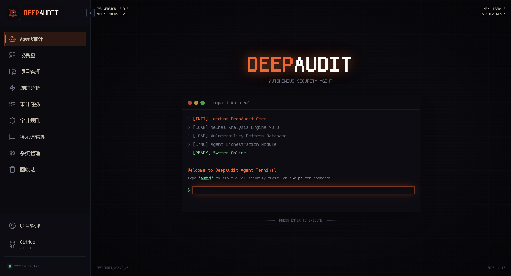
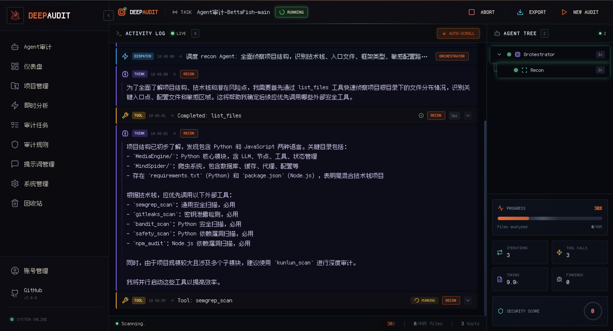
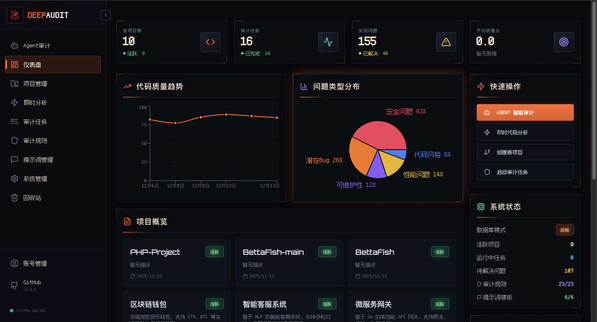
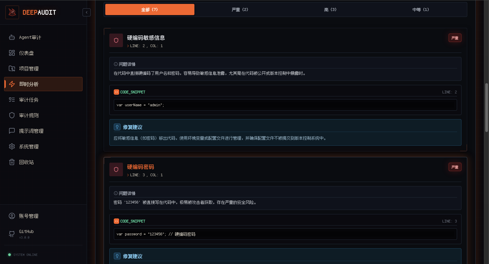
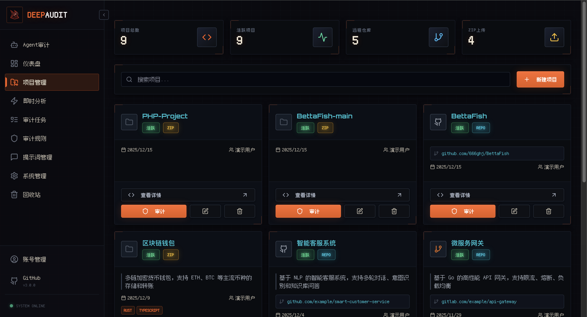
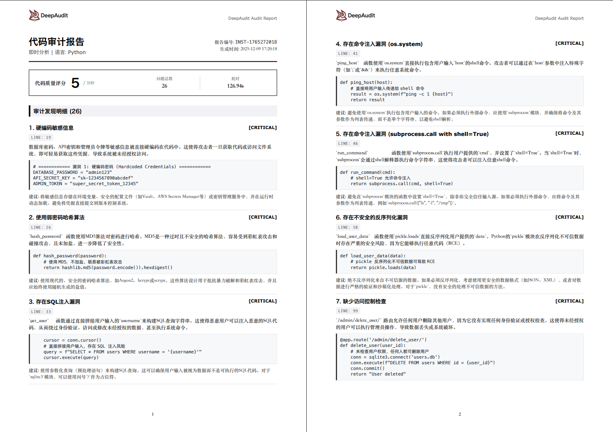
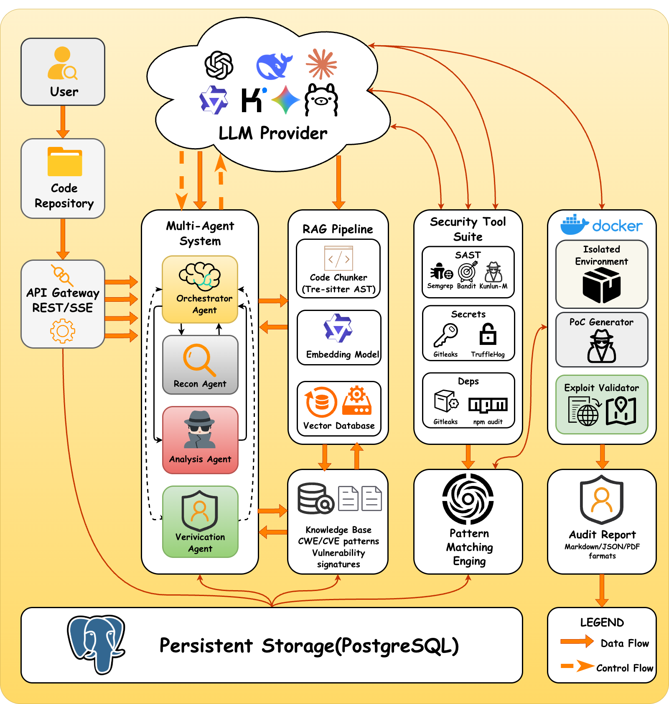

# DeepAudit - 誰もが持てる AI 監査チーム、脆弱性発見を身近に 🦸‍♂️

<div style="width: 100%; max-width: 600px; margin: 0 auto;">
  
</div>

<div align="center">

[](https://github.com/lintsinghua/DeepAudit/releases)
[](https://www.gnu.org/licenses/agpl-3.0)
[](https://reactjs.org/)
[](https://www.typescriptlang.org/)
[](https://fastapi.tiangolo.com/)
[](https://www.python.org/)
[](https://deepwiki.com/lintsinghua/DeepAudit)

[](https://github.com/lintsinghua/DeepAudit/stargazers)
[](https://github.com/lintsinghua/DeepAudit/network/members)

<a href="https://trendshift.io/repositories/15634" target="_blank"></a>

<p align="center">
  <a href="README.md">简体中文</a> | <a href="README_EN.md">English</a> | <strong>日本語</strong>
</p>

</div>

<div align="center">
  
</div>

---

## 📸 画面プレビュー

<div align="center">

### 🤖 Agent 監査エントリー



*ホームページから Multi-Agent ディープ監査へすばやくアクセス*

</div>

<table>
<tr>
<td width="50%" align="center">
<strong>📋 監査フローログ</strong><br/><br/>
<br/>
<em>Agent の思考と実行プロセスをリアルタイムで確認</em>
</td>
<td width="50%" align="center">
<strong>🎛️ スマートダッシュボード</strong><br/><br/>
<br/>
<em>プロジェクトのセキュリティ状況を一目で把握</em>
</td>
</tr>
<tr>
<td width="50%" align="center">
<strong>⚡ 即時分析</strong><br/><br/>
<br/>
<em>コード貼り付け / ファイルアップロードで、数秒で結果が出る</em>
</td>
<td width="50%" align="center">
<strong>🗂️ プロジェクト管理</strong><br/><br/>
<br/>
<em>GitHub/GitLab/Gitea からのインポート、複数プロジェクトの協調管理</em>
</td>
</tr>
</table>

<div align="center">

### 📊 プロフェッショナルレポート



*ワンクリックで PDF / Markdown / JSON をエクスポート*（図はクイックモードであり、Agent モードのレポートではありません）

</div>

---

## 🏆 CVE 脆弱性の発見実績

<div align="center">

### **DeepAudit（クローズドソース版）はすでに 49 件の CVE 番号 と 6 件の GHSA セキュリティアドバイザリを獲得🦞**
### **17 の著名なオープンソースプロジェクトが対象**
</div>

#### OpenClaw🦞 脆弱性発掘の成果

DeepAudit の内部テスト版は [OpenClaw](https://github.com/openclaw/openclaw) プロジェクトに対して深度セキュリティ監査を実施し、現時点で **6 件のセキュリティ脆弱性** を発見しました。いずれも公式に確認され、セキュリティアドバイザリ（GHSA）が公開されています。脆弱性の種類はコマンドインジェクション、署名検証バイパス、リモートコード実行、認証情報漏洩、リソース枯渇、機密情報漏洩をカバーし、その中には複数の High レベルの脆弱性が含まれています。さらなる脆弱性の発掘も継続中です。

| GHSA 番号 | プロジェクト | 人気度 | 脆弱性タイプ | 深刻度 |
|:---|:---|:---:|:---|:----:|
| [GHSA-g353-mgv3-8pcj](https://github.com/advisories/GHSA-g353-mgv3-8pcj) | OpenClaw | [](https://github.com/openclaw/openclaw/stargazers) | Signature Verification Bypass | 8.6 |
| [GHSA-99qw-6mr3-36qr](https://github.com/advisories/GHSA-99qw-6mr3-36qr) | OpenClaw | [](https://github.com/openclaw/openclaw/stargazers) | Code Execution | 8.5 |
| [GHSA-7h7g-x2px-94hj](https://github.com/advisories/GHSA-7h7g-x2px-94hj) | OpenClaw | [](https://github.com/openclaw/openclaw/stargazers) | Credential Exposure | 6.9 |
| [GHSA-g2f6-pwvx-r275](https://github.com/openclaw/openclaw/security/advisories/GHSA-g2f6-pwvx-r275) | OpenClaw | [](https://github.com/openclaw/openclaw/stargazers) | Command Injection | Medium |
| [GHSA-jq3f-vjww-8rq7](https://github.com/openclaw/openclaw/security/advisories/GHSA-jq3f-vjww-8rq7) | OpenClaw | [](https://github.com/openclaw/openclaw/stargazers) | Resource Exhaustion | High |
| [GHSA-xwcj-hwhf-h378](https://github.com/openclaw/openclaw/security/advisories/GHSA-xwcj-hwhf-h378) | OpenClaw | [](https://github.com/openclaw/openclaw/stargazers) | Information Disclosure | Medium |

| CVE 番号 | プロジェクト | 人気度 | 脆弱性タイプ | CVSS |
|:---|:---|:---:|:---|:----:|
| [CVE-2026-1884](https://nvd.nist.gov/vuln/detail/cve-2026-1884) | Zentao PMS | [](https://github.com/easysoft/zentaopms/stargazers) | SSRF | 5.1  |
| [CVE-2025-13789](https://nvd.nist.gov/vuln/detail/CVE-2025-13789) | Zentao PMS | [](https://github.com/easysoft/zentaopms/stargazers) | SSRF | 5.3  |
| [CVE-2025-13787](https://nvd.nist.gov/vuln/detail/CVE-2025-13787) | Zentao PMS | [](https://github.com/easysoft/zentaopms/stargazers) | Privilege Escalation | 9.1  |
| [CVE-2025-64428](https://nvd.nist.gov/vuln/detail/CVE-2025-64428) | Dataease | [](https://github.com/dataease/dataease/stargazers) | JNDI Injection | 9.8  |
| [CVE-2025-13246](https://nvd.nist.gov/vuln/detail/CVE-2025-13246) | Modulithshop | [](https://github.com/shsuishang/modulithshop/stargazers) | SQL Injection | 6.3  |
| [CVE-2025-64163](https://nvd.nist.gov/vuln/detail/CVE-2025-64163) | Dataease | [](https://github.com/dataease/dataease/stargazers) | SSRF | 9.8  |
| [CVE-2025-64164](https://nvd.nist.gov/vuln/detail/CVE-2025-64164) | Dataease | [](https://github.com/dataease/dataease/stargazers) | JNDI Injection | 9.8  |
| [CVE-2025-11581](https://nvd.nist.gov/vuln/detail/CVE-2025-11581) | PowerJob | [](https://github.com/PowerJob/PowerJob/stargazers) | Privilege Escalation | 7.5  |
| [CVE-2025-11580](https://nvd.nist.gov/vuln/detail/CVE-2025-11580) | PowerJob | [](https://github.com/PowerJob/PowerJob/stargazers) | Privilege Escalation | 5.3  |
| [CVE-2025-10771](https://nvd.nist.gov/vuln/detail/CVE-2025-10771) | Jimureport | [](https://github.com/jeecgboot/JimuReport/stargazers) | Deserialization | 9.8  |
| [CVE-2025-10770](https://nvd.nist.gov/vuln/detail/CVE-2025-10770) | Jimureport | [](https://github.com/jeecgboot/JimuReport/stargazers) | Deserialization | 6.5  |
| [CVE-2025-10769](https://nvd.nist.gov/vuln/detail/CVE-2025-10769) | H2o-3 | [](https://github.com/h2oai/h2o-3/stargazers) | Deserialization | 9.8  |
| [CVE-2025-10768](https://nvd.nist.gov/vuln/detail/CVE-2025-10768) | H2o-3 | [](https://github.com/h2oai/h2o-3/stargazers) | Deserialization | 9.8  |
| [CVE-2025-58045](https://nvd.nist.gov/vuln/detail/CVE-2025-58045) | Dataease | [](https://github.com/dataease/dataease/stargazers) | JNDI Injection | 9.8  |
| [CVE-2025-10423](https://nvd.nist.gov/vuln/detail/CVE-2025-10423) | Newbee-mall | [](https://github.com/newbee-ltd/newbee-mall/stargazers) | Guessable Captcha | 3.7  |
| [CVE-2025-10422](https://nvd.nist.gov/vuln/detail/CVE-2025-10422) | Newbee-mall | [](https://github.com/newbee-ltd/newbee-mall/stargazers) | Privilege Escalation | 4.3  |
| [CVE-2025-9835](https://nvd.nist.gov/vuln/detail/CVE-2025-9835) | Mall | [](https://github.com/macrozheng/mall/stargazers) | Privilege Escalation | 4.3  |
| [CVE-2025-9737](https://nvd.nist.gov/vuln/detail/CVE-2025-9737) | O2oa | [](https://github.com/o2oa/o2oa/stargazers) | XSS | 5.4  |
| [CVE-2025-9736](https://nvd.nist.gov/vuln/detail/CVE-2025-9736) | O2oa | [](https://github.com/o2oa/o2oa/stargazers) | XSS | 5.4  |
| [CVE-2025-9735](https://nvd.nist.gov/vuln/detail/CVE-2025-9735) | O2oa | [](https://github.com/o2oa/o2oa/stargazers) | XSS | 5.4  |
| [CVE-2025-9734](https://nvd.nist.gov/vuln/detail/CVE-2025-9734) | O2oa | [](https://github.com/o2oa/o2oa/stargazers) | XSS | 5.4  |
| [CVE-2025-9719](https://nvd.nist.gov/vuln/detail/CVE-2025-9719) | O2oa | [](https://github.com/o2oa/o2oa/stargazers) | XSS | 5.4  |
| [CVE-2025-9718](https://nvd.nist.gov/vuln/detail/CVE-2025-9718) | O2oa | [](https://github.com/o2oa/o2oa/stargazers) | XSS | 5.4  |
| [CVE-2025-9717](https://nvd.nist.gov/vuln/detail/CVE-2025-9717) | O2oa | [](https://github.com/o2oa/o2oa/stargazers) | XSS | 5.4  |
| [CVE-2025-9716](https://nvd.nist.gov/vuln/detail/CVE-2025-9716) | O2oa | [](https://github.com/o2oa/o2oa/stargazers) | XSS | 5.4  |
| [CVE-2025-9715](https://nvd.nist.gov/vuln/detail/CVE-2025-9715) | O2oa | [](https://github.com/o2oa/o2oa/stargazers) | XSS | 5.4  |
| [CVE-2025-9683](https://nvd.nist.gov/vuln/detail/CVE-2025-9683) | O2oa | [](https://github.com/o2oa/o2oa/stargazers) | XSS | 5.4  |
| [CVE-2025-9682](https://nvd.nist.gov/vuln/detail/CVE-2025-9682) | O2oa | [](https://github.com/o2oa/o2oa/stargazers) | XSS | 5.4  |
| [CVE-2025-9681](https://nvd.nist.gov/vuln/detail/CVE-2025-9681) | O2oa | [](https://github.com/o2oa/o2oa/stargazers) | XSS | 5.4  |
| [CVE-2025-9680](https://nvd.nist.gov/vuln/detail/CVE-2025-9680) | O2oa | [](https://github.com/o2oa/o2oa/stargazers) | XSS | 5.4  |
| [CVE-2025-9659](https://nvd.nist.gov/vuln/detail/CVE-2025-9659) | O2oa | [](https://github.com/o2oa/o2oa/stargazers) | XSS | 5.4  |
| [CVE-2025-9658](https://nvd.nist.gov/vuln/detail/CVE-2025-9658) | O2oa | [](https://github.com/o2oa/o2oa/stargazers) | XSS | 5.4  |
| [CVE-2025-9657](https://nvd.nist.gov/vuln/detail/CVE-2025-9657) | O2oa | [](https://github.com/o2oa/o2oa/stargazers) | XSS | 5.4  |
| [CVE-2025-9655](https://nvd.nist.gov/vuln/detail/CVE-2025-9655) | O2oa | [](https://github.com/o2oa/o2oa/stargazers) | XSS | 5.4  |
| [CVE-2025-9646](https://nvd.nist.gov/vuln/detail/CVE-2025-9646) | O2oa | [](https://github.com/o2oa/o2oa/stargazers) | XSS | 5.4  |
| [CVE-2025-9602](https://nvd.nist.gov/vuln/detail/CVE-2025-9602) | RockOA | [](https://github.com/rainrocka/xinhu/stargazers) | Database Backdoor | 6.5  |
| [CVE-2025-9514](https://nvd.nist.gov/vuln/detail/CVE-2025-9514) | Mall | [](https://github.com/macrozheng/mall/stargazers) | Privilege Escalation | 3.7  |
| [CVE-2025-9264](https://nvd.nist.gov/vuln/detail/CVE-2025-9264) | Xxl-job | [](https://github.com/xuxueli/xxl-job/stargazers) | Privilege Escalation | 5.4  |
| [CVE-2025-9263](https://nvd.nist.gov/vuln/detail/CVE-2025-9263) | Xxl-job | [](https://github.com/xuxueli/xxl-job/stargazers) | Privilege Escalation | 4.3  |
| [CVE-2025-9241](https://nvd.nist.gov/vuln/detail/CVE-2025-9241) | Eladmin | [](https://github.com/elunez/eladmin/stargazers) | CSV/XLSX Injection | 7.5  |
| [CVE-2025-9240](https://nvd.nist.gov/vuln/detail/CVE-2025-9240) | Eladmin | [](https://github.com/elunez/eladmin/stargazers) | Sensitive Information Disclosure | 4.3  |
| [CVE-2025-9239](https://nvd.nist.gov/vuln/detail/CVE-2025-9239) | Eladmin | [](https://github.com/elunez/eladmin/stargazers) | Hardcoded Credentials | 3.7  |
| [CVE-2025-8974](https://nvd.nist.gov/vuln/detail/CVE-2025-8974) | Litemall | [](https://github.com/linlinjava/litemall/stargazers) | Hardcoded Credentials | 9.8  |
| [CVE-2025-8852](https://nvd.nist.gov/vuln/detail/CVE-2025-8852) | Wukong CRM | [](https://github.com/WuKongOpenSource/WukongCRM-11.0-JAVA/stargazers) | Sensitive Information Disclosure | 4.3  |
| [CVE-2025-8840](https://nvd.nist.gov/vuln/detail/CVE-2025-8840) | Jsherp | [](https://github.com/jishenghua/jshERP/stargazers) | Privilege Escalation | 5.4  |
| [CVE-2025-8839](https://nvd.nist.gov/vuln/detail/CVE-2025-8839) | Jsherp | [](https://github.com/jishenghua/jshERP/stargazers) | Privilege Escalation | 8.8  |
| [CVE-2025-8764](https://nvd.nist.gov/vuln/detail/CVE-2025-8764) | Litemall | [](https://github.com/linlinjava/litemall/stargazers) | XSS | 5.4  |
| [CVE-2025-8753](https://nvd.nist.gov/vuln/detail/CVE-2025-8753) | Litemall | [](https://github.com/linlinjava/litemall/stargazers) | Arbitrary File Deletion | 5.4  |
| [CVE-2025-8708](https://nvd.nist.gov/vuln/detail/CVE-2025-8708) | White-Jotter | [](https://github.com/Antabot/White-Jotter/stargazers) | Deserialization | 7.5  |

👉 [完全な CVE リストの詳細を見る](CVEList.md)

> *上記の脆弱性は、DeepAudit チームメンバー [@lintsinghua](https://github.com/lintsinghua) [@ez-lbz](https://github.com/ez-lbz) が DeepAudit を使用して発見したものです*

> DeepAudit を使って脆弱性を発見された場合は、ぜひ [Issues](https://github.com/lintsinghua/DeepAudit/issues/135) にてフィードバックをお寄せください。皆さまの貢献がこの脆弱性リストを大いに充実させます。誠にありがとうございます！

---

## ⚡ プロジェクト概要

**DeepAudit** は、**Multi-Agent 協調アーキテクチャ**に基づく次世代コードセキュリティ監査プラットフォームです。単なる静的スキャンツールではなく、セキュリティ専門家の思考プロセスを模倣し、複数のエージェント（**Orchestrator**、**Recon**、**Analysis**、**Verification**）の自律的な協調によって、コードの深い理解、脆弱性の発掘、そして **自動化されたサンドボックス PoC 検証** を実現します。

私たちは、従来の SAST ツールが抱える三大課題の解決に取り組んでいます：
- **高い誤検知率** — 意味理解の欠如により、大量の誤検知が人手を消耗させる
- **ビジネスロジックの盲点** — ファイル横断の呼び出しや複雑なロジックを理解できない
- **検証手段の欠如** — 脆弱性が本当に悪用可能かどうか分からない

ユーザーはプロジェクトをインポートするだけで、DeepAudit が完全自動で動き出します：技術スタックの識別 → 潜在リスクの分析 → スクリプト生成 → サンドボックス検証 → レポート生成、そして最終的にプロフェッショナルな監査レポートを出力します。

> **コアコンセプト**: AI にハッカーのように攻撃させ、専門家のように防御させる。

## 💡 なぜ DeepAudit を選ぶのか？

<div align="center">

| 😫 従来の監査の課題 | 💡 DeepAudit のソリューション |
| :--- | :--- |
| **手動監査の効率が低い**<br>CI/CD のコード反復速度に追いつけず、リリースを遅延させる | **🤖 Multi-Agent 自律監査**<br>AI が監査戦略を自動編成し、24時間自動実行 |
| **従来ツールは誤検知が多い**<br>意味理解の欠如により、毎日ノイズの除去に大量の時間を費やす | **🧠 RAG 知識ベース強化**<br>コードの意味とコンテキストを組み合わせ、誤検知率を大幅に低減 |
| **データプライバシーの懸念**<br>コアソースコードがクラウド AI に漏れることを懸念し、コンプライアンス要件を満たせない | **🔒 Ollama ローカルデプロイ対応**<br>データは社内ネットワークから出ず、Llama3/DeepSeek などのローカルモデルに対応 |
| **真実性を確認できない**<br>外注プロジェクトは脆弱性が多く、どの脆弱性が実際に悪用可能か分からない | **💥 サンドボックス PoC 検証**<br>攻撃スクリプトを自動生成・実行し、脆弱性の実際の危険性を確認 |

</div>

---

## 🏗️ システムアーキテクチャ

### 全体アーキテクチャ図

DeepAudit はマイクロサービスアーキテクチャを採用し、コアは Multi-Agent エンジンによって駆動されます。

<div align="center">

</div>

### 🔄 監査ワークフロー

| ステップ | フェーズ | 担当 Agent | 主なアクション |
|:---:|:---:|:---:|:---|
| 1 | **戦略立案** | **Orchestrator** | 監査タスクを受け取り、プロジェクトタイプを分析し、監査計画を策定し、サブ Agent にタスクを配布 |
| 2 | **情報収集** | **Recon Agent** | プロジェクト構造をスキャンし、フレームワーク/ライブラリ/API を識別し、攻撃面（Entry Points）を抽出 |
| 3 | **脆弱性発掘** | **Analysis Agent** | RAG 知識ベースと AST 分析を組み合わせ、コードを深く精査し、潜在的な脆弱性を発見 |
| 4 | **PoC 検証** | **Verification Agent** | **(重要)** PoC スクリプトを作成し、Docker サンドボックス内で実行。失敗した場合は自己修正して再試行 |
| 5 | **レポート生成** | **Orchestrator** | すべての発見を集約し、誤検知と検証された脆弱性を除外し、最終レポートを生成 |

### 📂 プロジェクトコード構造

```text
DeepAudit/
├── backend/                        # Python FastAPI バックエンド
│   ├── app/
│   │   ├── agents/                 # Multi-Agent コアロジック
│   │   │   ├── orchestrator.py     # 総指揮：タスクオーケストレーション
│   │   │   ├── recon.py            # 偵察兵：アセット識別
│   │   │   ├── analysis.py         # アナリスト：脆弱性発掘
│   │   │   └── verification.py     # 検証者：サンドボックス PoC
│   │   ├── core/                   # コア設定とサンドボックスインターフェース
│   │   ├── models/                 # データベースモデル
│   │   └── services/               # RAG、LLM サービスのラッパー
│   └── tests/                      # ユニットテスト
├── frontend/                       # React + TypeScript フロントエンド
│   ├── src/
│   │   ├── components/             # UI コンポーネントライブラリ
│   │   ├── pages/                  # ページルーティング
│   │   └── stores/                 # Zustand 状態管理
├── docker/                         # Docker デプロイ設定
│   ├── sandbox/                    # セキュリティサンドボックスイメージのビルド
│   └── postgres/                   # データベース初期化
└── docs/                           # 詳細ドキュメント
```

---

## 🚀 クイックスタート

### 方法一：ワンライナーデプロイ（推奨）

ビルド済み Docker イメージを使用。コードのクローン不要、1 コマンドで起動できます：

```bash
curl -fsSL https://raw.githubusercontent.com/lintsinghua/DeepAudit/v3.0.0/docker-compose.prod.yml | docker compose -f - up -d
```

## 🇨🇳 中国国内向け高速デプロイ（作者実測で非常に高速）

南京大学ミラーサイトを使用して Docker イメージのプルを高速化（`ghcr.io` を `ghcr.nju.edu.cn` に置き換え）：

```bash
# 中国国内高速版 - 南京大学 GHCR ミラーサイトを使用
curl -fsSL https://raw.githubusercontent.com/lintsinghua/DeepAudit/v3.0.0/docker-compose.prod.cn.yml | docker compose -f - up -d
```
<details>
<summary>イメージを手動でプル（個別にプルする場合）（クリックで展開）</summary>

```bash
# フロントエンドイメージ
docker pull ghcr.nju.edu.cn/lintsinghua/deepaudit-frontend:latest

# バックエンドイメージ
docker pull ghcr.nju.edu.cn/lintsinghua/deepaudit-backend:latest

# サンドボックスイメージ
docker pull ghcr.nju.edu.cn/lintsinghua/deepaudit-sandbox:latest
```
</details>

> 💡 ミラーソースは [南京大学オープンソースミラーサイト](https://mirrors.nju.edu.cn/) によって提供されています

<details>
<summary>💡 Docker イメージアクセラレータの設定（オプション、プル速度をさらに向上）（クリックで展開）</summary>

イメージのプルがまだ遅い場合は、Docker イメージアクセラレータを設定できます。Docker 設定ファイルを編集し、以下のミラーソースを追加してください：

**Linux / macOS**：`/etc/docker/daemon.json` を編集

**Windows**：Docker Desktop アイコンを右クリック → Settings → Docker Engine

```json
{
  "registry-mirrors": [
    "https://docker.1ms.run",
    "https://dockerproxy.com",
    "https://hub.rat.dev"
  ]
}
```

保存後、Docker サービスを再起動します：

```bash
# Linux
sudo systemctl restart docker

# macOS / Windows
# Docker Desktop アプリを再起動
```

</details>

> 🎉 **起動成功！** http://localhost:3000 にアクセスして体験を始めましょう。

---

### 方法二：コードをクローンしてデプロイ

カスタム設定や二次開発が必要なユーザー向け：

```bash
# 1. プロジェクトをクローン
git clone https://github.com/lintsinghua/DeepAudit.git && cd DeepAudit

# 2. 環境変数を設定
cp backend/env.example backend/.env
# backend/.env を編集し、あなたの LLM API Key を入力

# 3. ワンクリック起動
docker compose up -d
```

> 初回起動時にサンドボックスイメージが自動でビルドされるため、数分かかる場合があります。

---

## 🔧 ソースコード開発ガイド

開発者による二次開発・デバッグ向け。

### 環境要件
- Python 3.11+
- Node.js 20+
- PostgreSQL 15+
- Docker（サンドボックス用）


### 1. データベースを手動で起動

```bash
docker compose up -d redis db adminer
```

### 2. バックエンドの起動

```bash
cd backend
# 環境設定
cp env.example .env

# uv で環境を管理（推奨）
uv sync
source .venv/bin/activate

# API サービスを起動
uvicorn app.main:app --reload
```

### 3. フロントエンドの起動

```bash
cd frontend
# 環境設定
cp .env.example .env

pnpm install
pnpm dev
```

### 3. サンドボックス環境

開発モードでは、ローカルの Docker でサンドボックスイメージをプルする必要があります：

```bash
# 標準プル
docker pull ghcr.io/lintsinghua/deepaudit-sandbox:latest

# 中国国内高速化（南京大学ミラーサイト）
docker pull ghcr.nju.edu.cn/lintsinghua/deepaudit-sandbox:latest
```

---

## 🤖 Multi-Agent インテリジェント監査

### 対応する脆弱性タイプ

<table>
<tr>
<td>

| 脆弱性タイプ | 説明 |
|---------|------|
| `sql_injection` | SQL インジェクション |
| `xss` | クロスサイトスクリプティング |
| `command_injection` | コマンドインジェクション |
| `path_traversal` | パストラバーサル |
| `ssrf` | サーバーサイドリクエストフォージェリ |
| `xxe` | XML 外部エンティティインジェクション |

</td>
<td>

| 脆弱性タイプ | 説明 |
|---------|------|
| `insecure_deserialization` | 安全でないデシリアライゼーション |
| `hardcoded_secret` | ハードコードされたシークレット |
| `weak_crypto` | 脆弱な暗号アルゴリズム |
| `authentication_bypass` | 認証バイパス |
| `authorization_bypass` | 認可バイパス |
| `idor` | 安全でない直接オブジェクト参照 |

</td>
</tr>
</table>

> 📖 詳細なドキュメントは **[Agent 監査ガイド](docs/AGENT_AUDIT.md)** をご覧ください

---

## 🔌 対応 LLM プラットフォーム

<table>
<tr>
<td align="center" width="33%">
<h3>🌍 国際プラットフォーム</h3>
<p>
OpenAI GPT-4o / GPT-4<br/>
Claude 3.5 Sonnet / Opus<br/>
Google Gemini Pro<br/>
DeepSeek V3
</p>
</td>
<td align="center" width="33%">
<h3>🇨🇳 中国国内プラットフォーム</h3>
<p>
通義千問 Qwen<br/>
智譜 GLM-4<br/>
Moonshot Kimi<br/>
文心一言 · MiniMax · 豆包
</p>
</td>
<td align="center" width="33%">
<h3>🏠 ローカルデプロイ</h3>
<p>
<strong>Ollama</strong><br/>
Llama3 · Qwen2.5 · CodeLlama<br/>
DeepSeek-Coder · Codestral<br/>
<em>コードは社内ネットワークから出ない</em>
</p>
</td>
</tr>
</table>

💡 API 中継サービスに対応し、ネットワークアクセスの問題を解決 | 詳細な設定 → [LLM プラットフォームサポート](docs/LLM_PROVIDERS.md)

---

## 🎯 機能マトリックス

| 機能 | 説明 | モード |
|------|------|------|
| 🤖 **Agent ディープ監査** | Multi-Agent 協調、監査戦略の自律的オーケストレーション | Agent |
| 🧠 **RAG 知識強化** | コードの意味理解、CWE/CVE 知識ベース検索 | Agent |
| 🔒 **サンドボックス PoC 検証** | Docker 隔離実行、脆弱性の有効性を検証 | Agent |
| 🗂️ **プロジェクト管理** | GitHub/GitLab/Gitea インポート、ZIP アップロード、10+ 言語対応 | 汎用 |
| ⚡ **即時分析** | コードスニペットを秒単位で分析、貼り付けるだけで使用可能 | 汎用 |
| 🔍 **五次元検出** | Bug · セキュリティ · パフォーマンス · スタイル · 保守性 | 汎用 |
| 💡 **What-Why-How** | 正確な位置特定 + 原因説明 + 修正提案 | 汎用 |
| 📋 **監査ルール** | OWASP Top 10 内蔵、カスタムルールセット対応 | 汎用 |
| 📝 **プロンプトテンプレート** | ビジュアル管理、中英バイリンガル対応 | 汎用 |
| 📊 **レポートエクスポート** | PDF / Markdown / JSON ワンクリックエクスポート | 汎用 |
| ⚙️ **ランタイム設定** | ブラウザで LLM を設定、サービスの再起動不要 | 汎用 |

## 🦖 ロードマップ

私たちは継続的に進化しており、今後さらに多くの言語とより強力な Agent 機能をサポートしていきます。

- [x] 基本的な静的分析、Semgrep の統合
- [x] RAG 知識ベースの導入、Docker セキュリティサンドボックス対応
- [x] **Multi-Agent 協調アーキテクチャ** (Current)
- [ ] よりリアルなシミュレーションサービス環境をサポートし、より現実的な脆弱性検証フローを実現
- [ ] サンドボックスを function_call から安定した MCP サービスへ最適化・統合
- [ ] **自動修復 (Auto-Fix)**: Agent が直接 PR を提出して脆弱性を修正
- [ ] **増分 PR 監査**: PR 変更を継続的に追跡し、脆弱性をインテリジェントに分析、CI/CD フローと統合
- [ ] **RAG の最適化**: カスタム知識ベースのサポート

---

## 🤝 コントリビューションとコミュニティ

### コントリビューションガイド
皆さまの貢献を心より歓迎します！Issue の提出、PR、ドキュメントの改善など、何でも大歓迎です。
詳細は [CONTRIBUTING.md](./CONTRIBUTING.md) をご覧ください。

### 📬 作者への連絡

<div align="center">

**ぜひ気軽に交流・議論しましょう！技術的な質問、機能提案、コラボレーションのご意向など、皆さまとのコミュニケーションを楽しみにしています~**
（プラットフォームのカスタマイズ、コード監査サービス、技術コンサルティング、提携のご相談などはメールにてご連絡ください）
| 連絡先 | |
|:---:|:---:|
| 📧 **メール** | **lintsinghua@qq.com** |
| 🐙 **GitHub** | [@lintsinghua](https://github.com/lintsinghua) |

</div>

## 📄 ライセンス

本プロジェクトは [AGPL-3.0 License](LICENSE) の下でオープンソース化されています。

## 📈 プロジェクトの人気度

<a href="https://star-history.com/#lintsinghua/DeepAudit&Date">
 <picture>
   <source media="(prefers-color-scheme: dark)" srcset="https://api.star-history.com/svg?repos=lintsinghua/DeepAudit&type=Date&theme=dark" />
   <source media="(prefers-color-scheme: light)" srcset="https://api.star-history.com/svg?repos=lintsinghua/DeepAudit&type=Date" />
   
 </picture>
</a>

---

<div align="center">
  <strong>Made with ❤️ by <a href="https://github.com/lintsinghua">lintsinghua</a></strong>
</div>

---

## 謝辞

以下のオープンソースプロジェクトのサポートに感謝します：

[FastAPI](https://fastapi.tiangolo.com/) · [LangChain](https://langchain.com/) · [LangGraph](https://langchain-ai.github.io/langgraph/) · [ChromaDB](https://www.trychroma.com/) · [LiteLLM](https://litellm.ai/) · [Tree-sitter](https://tree-sitter.github.io/) · [Kunlun-M](https://github.com/LoRexxar/Kunlun-M) · [Strix](https://github.com/usestrix/strix) · [React](https://react.dev/) · [Vite](https://vitejs.dev/) · [Radix UI](https://www.radix-ui.com/) · [TailwindCSS](https://tailwindcss.com/) · [shadcn/ui](https://ui.shadcn.com/)

---

## ⚠️ 重要なセキュリティ声明

### 法令遵守に関する声明
1. **許可のない脆弱性テスト、ペネトレーションテスト、セキュリティ評価** はいかなるものも禁止します
2. 本プロジェクトはサイバーセキュリティの学術研究、教育、学習目的でのみ使用できます
3. 本プロジェクトを違法な目的や許可のないセキュリティテストに使用することは固く禁じます

### 脆弱性報告の責任
1. セキュリティ脆弱性を発見した場合は、速やかに合法的なルートで報告してください
2. 発見した脆弱性を利用した違法行為は固く禁じます
3. 国のサイバーセキュリティ関連法令を遵守し、サイバー空間の安全を守ってください

### 使用制限
- 許可された環境において、教育および研究目的でのみ使用可能
- 許可のないシステムに対するセキュリティテストへの使用は禁止
- 使用者は自身の行為に対してすべての法的責任を負うものとします

### 免責事項
作者は、本プロジェクトの使用によって生じたいかなる直接的・間接的損失についても責任を負いません。使用者は自身の行為に対してすべての法的責任を負うものとします。

---

## 📖 詳細なセキュリティポリシー

インストールポリシー、免責事項、コードプライバシー、API 使用のセキュリティ、脆弱性報告に関する詳細は、[DISCLAIMER.md](DISCLAIMER.md) と [SECURITY.md](SECURITY.md) をご参照ください。

### クイックリファレンス
- **コードプライバシー警告**: あなたのコードは選択した LLM プロバイダーのサーバーに送信されます
- **機密コードの取り扱い**: 機密コードはローカルモデルで処理してください
- **コンプライアンス要件**: データ保護およびプライバシー関連法令を遵守してください
- **脆弱性報告**: セキュリティ問題を発見した場合は合法的なルートで報告してください
