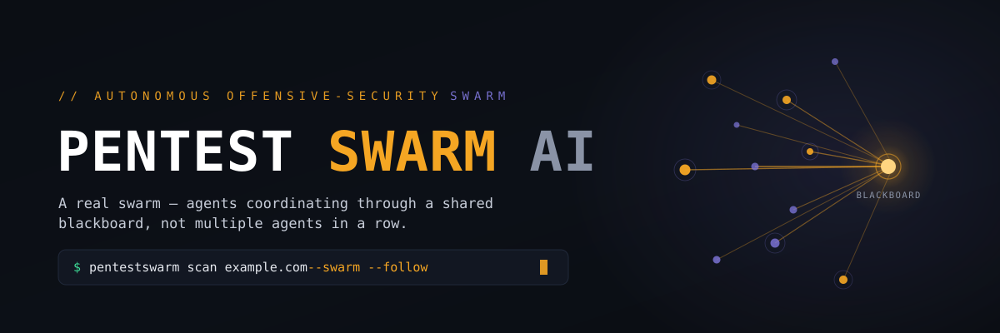
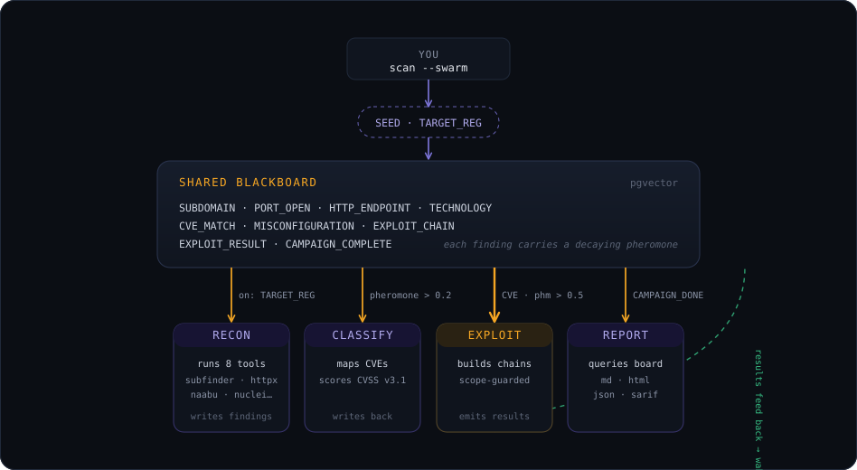
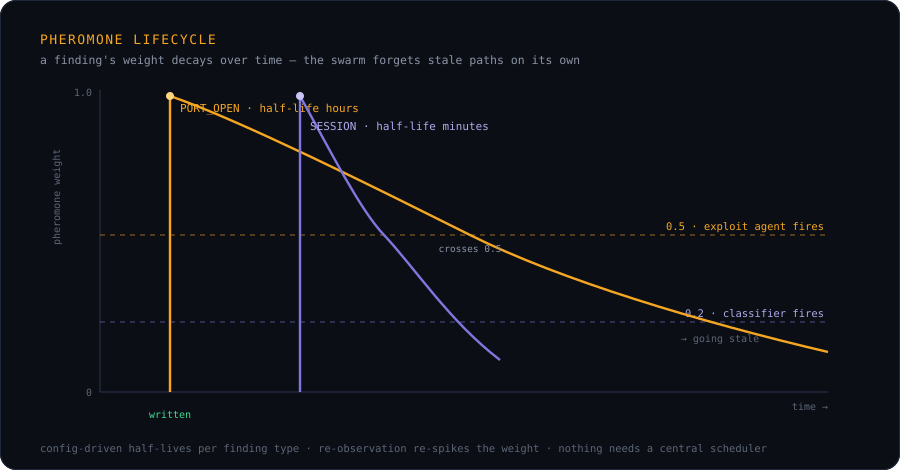
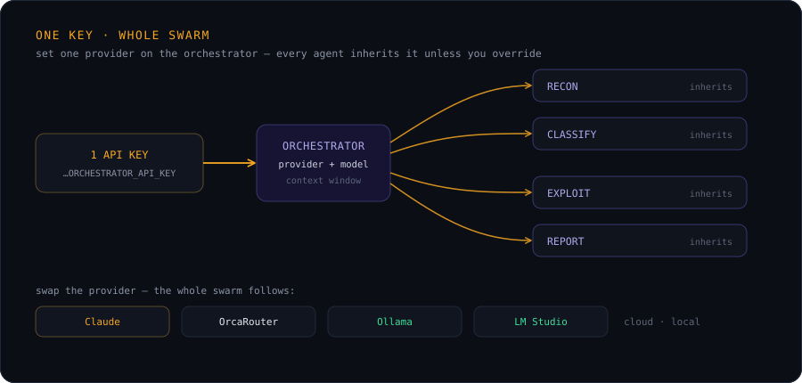

<p align="center">
  
</p>

<h1 align="center">The open-source XBOW alternative —<br>built on a real swarm.</h1>

<p align="center">
  <strong>Dozens of AI agents attack your target concurrently — and find real, proven vulnerabilities at machine speed.</strong>
</p>
<p align="center">
  <sub>Built for <strong>pentesters</strong> · <strong>bug bounty hunters</strong> · <strong>red teamers</strong> · <strong>security researchers</strong></sub>
</p>
<p align="center">
  <a href="https://armur-ai.github.io/Pentest-Swarm-AI/"><strong>📖 Documentation</strong></a> &middot;
  <a href="#quick-start">Quick Start</a> &middot;
  <a href="#pentest-swarm-vs-xbow">vs. XBOW</a> &middot;
  <a href="#what-makes-this-a-swarm">Swarm vs. Multi-Agent</a> &middot;
  <a href="#how-the-swarm-works">How It Works</a> &middot;
  <a href="ROADMAP.md">Roadmap</a>
</p>

<p align="center">
  <a href="https://discord.gg/6qtkhpW8tk"></a>
  
  
  
  
  
</p>

<!-- Once trendshift.io lists the repo, replace the numeric id below.
     PentAGI's badge (for reference): https://trendshift.io/repositories/15161
<p align="center">
  <a href="https://trendshift.io/repositories/__ID__" target="_blank">
    
  </a>
</p>
-->


<p align="center">
  
</p>

## Hack at machine speed.

> 📖 **New here? Start with the [documentation](https://armur-ai.github.io/Pentest-Swarm-AI/)** — quickstart, provider setup, CLI reference, and troubleshooting. (Or run `pentestswarm docs` to open it.)

**XBOW** proved a point: AI can top the bug-bounty leaderboards. But XBOW is a **closed, hosted SaaS** — one agent, on their cloud, on their model, at their price. We think the future of offense is **open, self-hosted, and a swarm** — so we built it.

### Pentest Swarm vs. XBOW

|  | **Pentest Swarm AI** | XBOW |
|---|:---:|:---:|
| **Open source** | ✅ AGPL, fork it | ❌ closed |
| **Self-hosted** | ✅ your infra, your model, $0 floor | ❌ their cloud, their bill |
| **A real swarm** | ✅ dozens of agents, concurrent | ❌ single agent |

Three structural wins — and the swarm is the one that compounds. This isn't a single planner LLM walking recon → classify → exploit → report down a fixed line. **Dozens of agents work your surface at once**, coordinating through a shared stigmergic blackboard: the instant a finding lands it wakes whichever agent it's relevant to, so a 1,000-subdomain target gets hit in parallel — **attacking at machine speed.** And unlike a scanner that spits out unverified "maybes," the swarm *exploits what it finds, proves it* with captured evidence, then writes the report.

**Who it's for:** pentesters covering a whole scope overnight · **bug bounty hunters** racing to first-blood on a fresh target · **red teamers** who need breadth fast · **researchers** pushing autonomous offense.

Run it on **any model** — Claude, anything OpenAI-compatible (incl. **Together AI**'s hosted Llama/Qwen/DeepSeek), the new **security-tuned open models** (Pentest-R1 and the wave behind it), or **fully local Ollama / LM Studio**. We don't compete with those models — **we're the harness that gives them hands**: real tools, swarm coordination, scope safety, and evidence-backed reports. Air-gapped, zero API cost, and not one byte of your data leaving your box.

*For **authorized testing only** — see the disclaimer below.*

---

> ### Credits & Inspiration
> This project stands on the shoulders of giants. We credit and thank these projects for pioneering AI-powered offensive security:
>
> - [**PentestGPT**](https://github.com/GreyDGL/PentestGPT) — the OG that proved LLMs can pentest
> - [**PentAGI**](https://github.com/vxcontrol/pentagi) — fully autonomous agent architecture
> - [**Strix**](https://github.com/usestrix/strix) — AI hackers that find and fix vulns
> - [**CAI**](https://github.com/aliasrobotics/cai) — cybersecurity AI framework, 3600x faster than humans
> - [**HackingBuddyGPT**](https://github.com/ipa-lab/hackingBuddyGPT) — LLM hacking in 50 lines of code
> - [**Shannon**](https://github.com/KeygraphHQ/shannon) — white-box AI pentester
> - [**BlacksmithAI**](https://github.com/fr0gger/BlacksmithAI) — multi-agent pentest framework
> - [**PentestAgent**](https://github.com/GH05TCREW/pentestagent) — black-box AI security testing
>
> Their open-source contributions made tools like this possible.

> **Legal Disclaimer:** Pentest Swarm AI is designed exclusively for **authorized security testing**, **bug bounty programs**, **CTF competitions**, and **educational research**. You must obtain explicit written permission from the target system owner before running any scan. Unauthorized access to computer systems is illegal under the Computer Fraud and Abuse Act (CFAA), the Computer Misuse Act, and equivalent laws worldwide. The authors and contributors of this project accept **no liability** for misuse, damage, or any illegal activity conducted with this tool. By using this software, you agree that you are solely responsible for ensuring your use complies with all applicable laws and regulations. **Do not use this tool against systems you do not own or have explicit authorization to test.**

---

## What makes this a swarm?

Most "multi-agent" pentesting tools are a single planner LLM dispatching to specialist agents in a fixed order — recon → classify → exploit → report. That's a **pipeline**, not a swarm.

Pentest Swarm AI is built around three swarm-intelligence primitives:

- **Stigmergy** — agents coordinate by reading and writing findings on a shared blackboard, not by a central planner telling them what to do. A finding's *pheromone weight* biases other agents toward it and decays over time, so stale paths die naturally.
- **Emergence** — attack chains appear that no single agent planned. A recon finding wakes the classifier; a high-severity classification wakes the exploit agent; exploit results feed back into the board and wake the report agent. Order isn't prescribed — it emerges from the blackboard state.
- **Decentralization** — each agent runs its own *trigger predicate*. Add a new agent with its own predicate and it joins the swarm without anyone rewriting the orchestrator.

We built this because the category was empty. Every tool marketed as "swarm" was actually a pipeline. If you find a counter-example, open an issue — we'll add them to the [comparison table](#comparison).

See the architecture diagrams in [`docs/`](docs) for stigmergy, pheromone decay, and the Postgres-backed blackboard. A deeper technical write-up is coming — ask in [Discord](https://discord.gg/6qtkhpW8tk).

---

## Quick Start

**One command to install. One command to run.** No API key, no cloud, no bill to start.

### 1 · Install (pick one)

```bash
npm install -g @armurai/pentestswarm                                       # npm (Node ≥16)
curl -fsSL https://raw.githubusercontent.com/Armur-Ai/Pentest-Swarm-AI/main/scripts/install.sh | sh   # any macOS/Linux
brew install Armur-Ai/tap/pentestswarm                                     # Homebrew
go install github.com/Armur-Ai/Pentest-Swarm-AI/cmd/pentestswarm@latest    # Go toolchain
docker run --rm ghcr.io/armur-ai/pentestswarm:latest --help                # Docker
```

### 2 · Run it

```bash
pentestswarm run
```

That's it. `run` opens the **interactive TUI launcher** — no flags to memorize:

- **Pick your AI provider** and paste a key right in the UI — **Together AI** (hosted Llama / Qwen / DeepSeek), Claude, OpenAI, Gemini, or **fully local Ollama / LM Studio** (no key at all).
- **Point it at a target** — a URL, or a **bundled vulnerable lab** (crAPI, Juice Shop, VAmPI, DVGA) that spins up, gets attacked, and tears down after. Legal, safe, zero setup.
- **Choose your live view** — a **web dashboard on `localhost:7777`** *and* a full-screen **terminal TUI** with live charts, a swarm-topology diagram, and a graded findings stream. Both, by default.
- Then **launch** and watch the swarm work at machine speed.

A readiness check runs right in the launcher (Go, Docker, tools, provider) — it never blocks; anything missing is shown as a note you can fix or ignore.

### Prefer flags? (scripting / CI)

`run` just wraps `scan`, so everything is scriptable too:

```bash
# watch it find a real vuln in ~2 min — bundled lab, local model, no key
pentestswarm scan --lab --lab-target crapi --provider ollama --swarm --tui

# a real target, cloud model for max quality
export PENTESTSWARM_ORCHESTRATOR_API_KEY=your-key-here
pentestswarm scan <authorized-target> --scope <target> --swarm --follow
```

New here? `pentestswarm demo` plays the whole campaign offline — that's the GIF above. Running inside GitHub Actions? See [`deploy/github-action/example-workflow.yml`](deploy/github-action/example-workflow.yml).

---

## How the swarm works

<p align="center">
  
</p>

Key behaviours:

1. **Agents are independent.** Any one of them can be removed, replaced, or added without rewiring the others.
2. **Pheromones decay per-finding-type.** A `PORT_OPEN` stays hot for hours; a `SESSION` for minutes. Config-driven half-lives.
3. **Scope is enforced at the tool layer and again at the executor.** Defence in depth — `--scope` is not bypassable.
4. **Cleanup is always registered before execution.** SIGINT, crashes, and budget exhaustion all trigger reverse-order cleanup. See `internal/pipeline/cleanup_memory.go` and `cleanup.go`.
5. **Prompt caching on Claude** cuts cost and latency on repeated system prompts (enabled by default for recon + classifier).

<p align="center">
  
</p>

---

## Comparison

How we position vs. the rest of the ecosystem. We'll ship real benchmark numbers in a future release (see the [benchmarks roadmap](ROADMAP.md)).

| Tool | Open / self-host | Architecture | Executes vs. suggests | Memory | Tools wired | MCP | Swarm? |
|---|---|---|---|---|---|---|---|
| **Pentest Swarm AI** | ✅ open, self-hosted | Stigmergic blackboard | Executes | pgvector + pheromones | 8 ProjectDiscovery + nmap; sqlmap / Burp MCP / Metasploit in roadmap | Yes | ✅ real |
| XBOW | ❌ closed SaaS | Autonomous agent (hosted) | Executes | Hosted | Managed | No public API | No |
| PentestGPT | ✅ open | Single-agent ReAct | Suggests | None | None native | No | No |
| HackingBuddyGPT | ✅ open | Single-agent | Executes | Run logs | Shell passthrough | No | No |
| PentAGI | ✅ open | 4 agents + planner | Executes | pgvector | 40+ via MCP/shell | Partial | Pipeline |
| Shannon | ✅ open | White-box + browser | Executes | Session state | Browser DOM | No | Pipeline |
| HexStrike | ✅ open | MCP tool wrapper | Delegates to client LLM | None (stateless) | 150+ via MCP | Yes | No |
| Pentest-R1 | ✅ open (model) | RL-tuned LLM | Executes | Trajectory | CTF-scope | No | No |

If any entry here is wrong or out of date, please open a PR — we want this table to stay honest.

---

## Feature status

Honesty labels: *stable* means shipped + tested, *beta* means works but rough edges, *alpha* means experimental, *planned* means in the [roadmap](ROADMAP.md).

| Feature | Status | Notes |
|---|---|---|
| Sequential 5-phase runner | **stable** | Default mode; battle-tested core |
| Stigmergic swarm scheduler | **alpha** | `--swarm` flag; memory-backed blackboard wired |
| ProjectDiscovery toolchain | **stable** | subfinder, httpx, nuclei, naabu, katana, dnsx, gau |
| `nmap` adapter | **stable** | XML parsed; scope-validated |
| Cleanup registry | **stable** | Always runs on SIGINT / exit / budget-cancel |
| Claude prompt caching | **stable** | Enabled for recon + classifier by default |
| `--strict` LLM mode | **stable** | Promotes LLM errors to fatal |
| CVSS v3.1 scoring | **stable** | FIRST spec |
| Postgres blackboard backend | **beta** | Migration shipped; runner uses memory-board for now |
| MCP server | **beta** | `pentestswarm mcp serve` |
| VS Code extension | **beta** | `deploy/vscode/` |
| GitHub Action | **beta** | `deploy/github-action/action.yml` with SARIF |
| Swarm playbooks (5) | **beta** | `playbooks/{bug-bounty,external-asm,ci-cd,internal-network,ctf-solver}.yaml` |
| Live dashboard | **alpha** | `web/`; UI built, wiring to live campaigns in progress |
| Burp MCP bridge | **planned** | Wave 2 |
| Metasploit / ZAP / sqlmap adapters | **planned** | Wave 2 |
| Fine-tuned Pentest-Swarm model | **planned** | Wave 3 (Pentest-R1 recipe) |
| Cybench / AutoPenBench benchmarks | **planned** | Wave 3 |

---

## CLI

```bash
pentestswarm run                                        # ⭐ Interactive TUI — pick options + target, no flags
pentestswarm scan <target> --scope <scope> --swarm      # Scriptable: stigmergic swarm scheduler
pentestswarm scan <target> --scope <scope> --tui        # Full-screen live TUI (charts + swarm topology)
pentestswarm scan --lab --lab-target crapi              # Attack a bundled vulnerable lab, no setup
pentestswarm playbook run <name> --target <t>           # Run a community playbook
pentestswarm doctor                                     # System health check
pentestswarm install-tools                              # Fetch the recon/exploit toolchain
pentestswarm mcp serve                                  # MCP server for Claude/Cursor
pentestswarm serve                                      # Start API server + dashboard
```

**`pentestswarm run` is the front door** — an interactive launcher (provider + key entry, target or bundled lab, live-view choice, readiness checks) so you never have to remember flags. The `scan` form stays fully scriptable for CI.

---

## LLM Providers

All agents inherit from a single provider config. Set one key, the entire swarm works.

**Bring your own model — we're the harness, not the model.** A new wave of open models is topping the cyber-offense benchmarks — **GLM (5.3)**, **Qwen (3.x)**, **DeepSeek**, and security-tuned fine-tunes like Pentest-R1. Pentest Swarm turns any of them — or a frontier model, or a fully-local one — into an *operating* pentester: real tools, swarm coordination, scope enforcement, and evidence-backed reports. The model does the reasoning; the swarm does the work.

**Together AI is first-class** — pick `together` (in `pentestswarm run` or `--provider together`) and just add your key; the endpoint is handled for you. Any other **OpenAI-API-compatible** endpoint (OpenAI, DeepSeek, Groq, …) works via `openai` + a base-URL, plus first-party **Gemini**. The only hard requirement is native tool/function calling, which GLM, Qwen, and DeepSeek all support.

<p align="center">
  
</p>

| Provider | `provider:` | Setup | Privacy | Best for |
|----------|-------------|-------|---------|----------|
| **Claude** (default) | `claude` | `export PENTESTSWARM_ORCHESTRATOR_API_KEY=...` | Cloud | Best quality, zero setup, prompt caching |
| **[Together AI](https://www.together.ai/models)** | `together` | Just set the key — endpoint auto-configured | Cloud | Open cyber-benchmark leaders: **GLM `zai-org/GLM-5.3`**, **Qwen `Qwen/...`**, DeepSeek, Kimi |
| **OpenAI-compatible** | `openai` | Set key + the vendor's `/v1` endpoint | Cloud | OpenAI, DeepSeek, Groq, or any Chat-Completions API |
| **Gemini** | `gemini` | `export PENTESTSWARM_ORCHESTRATOR_API_KEY=AIza...` | Cloud | Large context, [free tier](https://aistudio.google.com/apikey) |
| **Ollama** | `ollama` | Install Ollama + pull models | 100% local | Full privacy, air-gapped (GLM / Qwen builds available) |
| **LM Studio** | `lmstudio` | Load model, enable server | 100% local | GUI model management |
| **[OrcaRouter](https://www.orcarouter.ai)** | `orcarouter` | `export PENTESTSWARM_ORCHESTRATOR_API_KEY=sk-orca-...` | Cloud | One endpoint for Claude/GPT + other frontier models, gateway-level security |

**Together AI example** — run the whole swarm on GLM 5.3:

```yaml
orchestrator:
  provider: "together"             # first-class — endpoint defaults to Together's API
  model: "zai-org/GLM-5.3"        # or Qwen/..., deepseek-ai/..., etc. — see together.ai/models
  api_key: ""                      # or export PENTESTSWARM_ORCHESTRATOR_API_KEY
  context_window: 128000
```

---

## Tech Stack

| Component | Technology | Why |
|-----------|-----------|-----|
| Platform | **Go 1.24** | Single binary, goroutine concurrency, native security tools |
| CLI | **Cobra + bubbletea** | Beautiful TUI with multi-panel agent view |
| LLM | **Claude / Together AI (GLM · Qwen · DeepSeek) / Gemini / OrcaRouter / Ollama / LM Studio** | Best quality cloud + open cyber-bench leaders + full privacy local |
| Security Tools | **subfinder · httpx · nuclei · naabu · katana · dnsx · gau · nmap** | ProjectDiscovery Go libs + nmap subprocess |
| Blackboard | **Postgres 16 + pgvector** | Transactional writes, vector similarity, pheromone decay in SQL |
| Cache | **Redis 7** | Rate limiting, session state |
| Dashboard | **Next.js 15 + shadcn/ui + tremor** | Dark-first, chart-heavy |
| MCP | **JSON-RPC stdio** | Claude Desktop + Cursor integration |

---

## Development

```bash
git clone https://github.com/Armur-Ai/Pentest-Swarm-AI.git
cd Pentest-Swarm-AI
./scripts/setup.sh    # Install tools, start Postgres/Redis/Ollama
make build            # Compile binary
make test             # Run tests
make dev              # Hot-reload development
```

Regenerate the demo GIF after any CLI change:

```bash
brew install vhs      # one-off
vhs docs/demo-flashy.tape
```

---

## Roadmap

- **Wave 1** (in flight): real swarm architecture (done), dashboard wire-up, Burp MCP
- **Wave 2**: sqlmap / Metasploit / ZAP adapters, bug-bounty + ASM + CI/CD playbook polish, official GitHub Action in Marketplace
- **Wave 3**: fine-tuned Pentest-Swarm model (Pentest-R1 recipe), Cybench / AutoPenBench / CVE-Bench numbers, agent-memory poisoning hardening (MINJA / MemoryGraft defences)

### 🧠 The Adaptive Swarm — headline releases

Today the swarm reacts to findings and runs verified attack playbooks (BOLA/IDOR, mass assignment, NoSQL injection, excessive data exposure) end-to-end. Next, we make it *think* — three major capabilities, each shipping as its own release:

- **① Runtime reaction to discoveries** *(planned)* — stigmergic emergence: the swarm mines every response for object references (ids, UUIDs, emails), writes them to the blackboard, and other agents react by probing those objects across endpoints. Find one leaked id and the swarm turns it into cross-user BOLA/IDOR attacks nobody scripted.
- **② Self-correcting attacks** *(planned)* — closed-loop replanning: a failed step (401/403/415, an odd response body) feeds back into the planner, which adjusts the request and retries. Attacks heal themselves instead of dead-ending.
- **③ On-demand specialist sub-agents** *(planned)* — the swarm spawns purpose-built agents at runtime (an auth agent to hold a session, a fuzzing agent for a discovered parameter, a chain-builder for a specific API) and tears them down when done.

Together these turn a reactive swarm into an adaptive one — attack surface it has never seen, handled without anyone writing a plan. Generalization beyond curated targets and full LLM-driven chaining ride on top of these.

Follow the [GitHub Project board](https://github.com/orgs/Armur-Ai/projects/1) for live status.

---

## Why "Swarm"?

Single agents are tools. Pipelines dressed up as agents are slightly fancier tools. A **swarm** is different: agents share an environment, each agent's writes influence other agents' behaviour, and the useful work is emergent rather than prescribed. That's what lets a swarm handle a 1,000-subdomain target without anyone writing a plan for it.

**One agent is a tool. A swarm is a platform.**

---

## Community

### [Join the swarm on Discord →](https://discord.gg/6qtkhpW8tk) 🐝

We're building the first *real* open-source pentest swarm in the open — come build it with us. In [Discord](https://discord.gg/6qtkhpW8tk) you can share findings, request a tool adapter, argue about stigmergy and pheromone decay, get help running your first scan, or grab a [`good first issue`](https://github.com/Armur-Ai/Pentest-Swarm-AI/issues?q=is%3Aissue+is%3Aopen+label%3A%22good+first+issue%22) and ship a PR. Researchers, red-teamers, and the AI-security-curious all welcome.

> ⭐ **If a real open-source swarm is something you want to exist, drop a star.** Star velocity is the fuel that keeps this shipping — it's the single biggest thing you can do in ten seconds.

---

## Who's using Pentest Swarm?

Running Pentest Swarm — internally, on client engagements, in CI, or embedded in your own workflow? **[Add your org to ADOPTERS.md](ADOPTERS.md)** with a quick PR — it helps others trust the project and helps us prioritize what to build. Not ready to be listed publicly? A hello in [Discord](https://discord.gg/6qtkhpW8tk) still helps.

---

## Enterprise & Commercial Support

Pentest Swarm AI is free and open source (AGPL-3.0), and always will be. If your team wants a hand getting it into production, **[Armur AI](https://github.com/Armur-Ai)** — the team behind the project — offers commercial services:

- **Managed deployment** on your infrastructure — cloud, on-prem, or fully air-gapped (no data leaves your environment)
- **Integration & customization** — wire it into your SIEM, ticketing, and CI, or build custom tools and playbooks for your stack
- **Priority support & SLAs** — a direct line to the maintainers
- **Training & onboarding** — get your security team productive fast

Especially useful for startups and enterprises that want the control of self-hosting without doing the plumbing themselves.

📧 **[akhil@armur.ai](mailto:akhil@armur.ai)** — tell us your setup and what you're trying to do.

---

## License

**GNU Affero General Public License v3.0 (AGPL-3.0)** — see [LICENSE](LICENSE).

### What this means for you

| Use case | Allowed? |
|---|---|
| Run Pentest Swarm on your own infrastructure (CI, laptop, internal red team) | ✅ yes, no obligations |
| Use it on authorized bug-bounty programs / pentests | ✅ yes, no obligations |
| Fork it for your own private experiments | ✅ yes, no obligations |
| Distribute a modified binary | ✅ yes — must share your modifications under AGPL |
| Run a modified version as a **paid SaaS** or network service | ✅ yes — must share your modifications under AGPL |

The AGPL exists specifically to prevent the SaaS-fork loophole: anyone who improves Pentest Swarm and offers it commercially must share their improvements with the community. We made it open source; we want it to *stay* open source even as it scales.

If you have a use case the table doesn't cover, open an issue and ask.

Built by [Armur AI](https://github.com/Armur-Ai).
