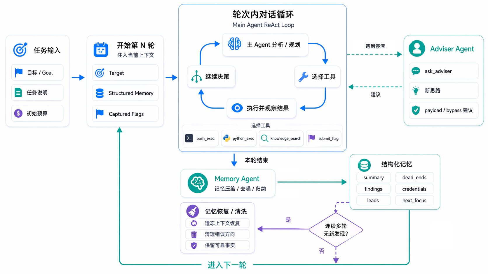

<p align="center">
  
</p>

# TPT Agent：**基于 Kali 沙箱的自主渗透任务引擎**

面向靶场、CTF 等场景的 LLM 编排式渗透测试工作流

本项目为第二届腾讯云智能渗透挑战赛参赛作品，并取得**第十九名**的成绩。仓库仅包含核心代码

<p align="center">
  
</p>

[概览](#overview-cn) · [特性亮点](#highlights-cn) · [快速开始](#quick-start-cn) · [设计思路](#design-cn) · [工作流程](#how-it-works-cn) · [项目结构](#project-layout-cn) · [部署说明](#deployment-notes-cn) · [许可证](#license-cn)

---

<a id="overview-cn"></a>

## 概览

TPT Agent 以“任务”为单位运行。用户在本地 Web UI 中创建任务后，系统会分配 Kali 沙箱，驱动 LLM 通过工具调用推进渗透，并在每轮结束后把有效信息压缩为结构化记忆。任务过程、执行事件和关键输出会持久化到 SQLite，便于复盘

项目主要针对单节点、黑盒 Web 渗透任务。重点关注控制长时间自主运行中的幻觉累积、上下文膨胀和错误路径重复等问题

<a id="highlights-cn"></a>

## 特性亮点

- **任务驱动的编排模型**：每个任务均有目标、任务说明、轮次上限、命令上限、状态等
- **原生工具调用循环**：主 Agent 通过少量核心工具执行命令以推进任务
- **跨轮结构化记忆**：JSON 化保存每轮对话的发现、凭证、失败点等信息，并支持多节点/拓扑信息
- **停滞恢复与上下文治理**：自动上下文压缩，检测停滞并进行记忆清洗
- **模型池与自动切换**：`config.yml` 可配置多个模型，支持优先级、并发上限，以及主模型连续失败后的自动切换
- **独立顾问角色**：加入顾问角色并支持单独配置，补全单一模型能力短板
- **多沙箱池支持**：单容器，以及多沙箱调度池支持，方便隔离环境
- **离线知识检索**：目录与 ZIP 中的 Markdown/RST 文档自动索引
- **任务时间线 UI**：本地 Web 页面展示实时事件流、轮次摘要、记忆快照、命令输出和任务控制功能
- **Linux 常驻部署辅助**：自带 `systemd` 单元模板和安装脚本，便于本机长期运行

<a id="quick-start-cn"></a>

## 快速开始

### 1. 环境要求

| 组件 | 建议版本 |
| --- | --- |
| Python | 3.11+ |
| Docker | Docker Engine / Docker Desktop + Compose |
| 宿主系统 | 推荐 Linux |
| 内存 | 8 GB+ |
| 磁盘 | 20 GB+ |

### 2. 构建沙箱镜像

```bash
docker build -f Dockerfile.sandbox -t tpt-kali-sandbox .
```

### 3. 启动沙箱容器

```bash
docker compose up -d
```

示例 [`docker-compose.yml`](./docker-compose.yml) 默认会拉起 3 个 Kali 沙箱：

- `tpt-sandbox-1`
- `tpt-sandbox-2`
- `tpt-sandbox-3`

也可以配置使用单容器

### 4. 安装 Python 依赖

```bash
pip install -r requirements.txt
```

### 5. 配置 `config.yml`

最小可用示例：

```yaml
model_pool:
  - id: main
    base_url: "https://api.openai.com/v1"
    api_key: "sk-your-key"
    model: "gpt-4o"
    thinking: false
    priority: 1
    max_concurrent: 5

advisor:
  base_url: ""
  api_key: ""
  model: ""
  thinking: false

compression:
  base_url: ""
  api_key: ""
  model: ""
  timeout_sec: 60

agent_defaults:
  initial_rounds: 4
  initial_commands: 64
  command_timeout_sec: 60
  llm_timeout_sec: 240
  knowledge_dir: "./knowledge"

sandbox:
  container: "tpt-sandbox-1"
  # containers:
  #   - "tpt-sandbox-1"
  #   - "tpt-sandbox-2"
  workdir: "/tmp/tpt-agent-workspace"
  public_ip: ""

web:
  host: "127.0.0.1"
  port: 8765
```

### 6. 启动服务

```bash
python -m tpt_agent
```

浏览器打开：

```text
http://127.0.0.1:8765
```

然后在 Web UI 中：

- 创建任务，填写目标、任务说明、轮次预算、命令预算、超时和 flag 数量
- 查看完整的执行轨迹
- 停止正在运行的任务
- 复盘事件历史
- 检查命令输出与每轮摘要

<a id="design-cn"></a>

## 设计思路

### 1. 分轮 ReAct

Agent 自主运行时间拉长后，模型很容易围绕一个错误假设持续试探，并把局部异常解释成有效线索。这个项目没有采用无限拉长上下文的做法，而是给**单轮 ReAct 设上限**。达到上限后，当前轮结束，进入记忆阶段，从而将错误方向尽量限制在单轮内

### 2. 结构化记忆压缩

每轮结束后做一次记忆压缩。记忆只保留后续还会用到的状态：

- 已确认发现
- 已验证失败的路径
- 已获得的凭据
- 下一步待验证的方向

下一轮只能读取到压缩后的内容，而非上一轮完整的推理过程。即使上一轮出现误判等 AI 幻觉，下一轮也会重新判断是否合理并有效清除幻觉

### 3. 记忆清洗机制

压缩后的记忆也可能被污染，因此会继续判断连续多轮是否有新增发现；检测到进入停滞状态后，会触发记忆清洗

清洗时的原则是：

- 尽量保留目标、端点、凭据、页面结构、响应特征等基础事实
- 清除没有被充分验证的漏洞判断和由此延伸出的错误方向

记忆清洗会将任务状态退回到仅包含可靠信息的状态，减少错误记忆带来的影响

### 4. 专家 Agent

整体是单主 Agent 架构，但加入了顾问角色。该角色只在主 Agent 卡住时介入，用来补主模型的思路盲区

该角色推荐配置与主 Agent 不同的模型，以补全单一模型的能力边界，提供额外的利用方向或思路等

### 5. 工具及执行

执行层仅保留两个核心工具用于执行命令：

- `bash_exec`
- `python_exec`

同时围绕这两个工具，进行了一定的优化：

- 每个任务都会分配独立工作目录，减少不同任务之间的环境污染
- Python 代码通过 base64 编码写入容器，减少引号和转义问题
- 每次执行结果都会明确提示这是本地沙箱执行结果，避免模型把本地输出误判为远端目标回显

### 6. 知识库

知识库设计目标是在离线情况下尽可能多地完成知识检索。

支持包含 Markdown 文件的目录以及包含 `.md` / `.rst` 的 ZIP 压缩包

一个典型目录结构如下：

```text
knowledge/
├── PayloadsAllTheThings.zip
├── hacktricks.zip
├── HowToHunt.zip
└── wiki/
    └── xxx.md
```

Agent 通过调用工具来检索知识库内容

### 示意图

<p align="center">
  
</p>

<a id="how-it-works-cn"></a>

## 工作流程

1. **启动阶段**
   程序加载配置、重置异常中断的历史任务、初始化 SQLite，并准备知识库索引
2. **创建任务**
   任务记录写入 SQLite，随后启动 worker 线程，并为任务分配沙箱
3. **环境检查**
   编排器准备工作目录，并执行一次 `env-info` 采集沙箱能力信息，供 prompt 注入使用
4. **工具驱动执行**
   编排器构造稳定系统提示词和任务描述内容，并绑定工具让模型持续调用工具推进任务
5. **实时日志**
   命令执行实时显示，包含命令以及执行结果
6. **记忆压缩**
   每轮结束后，memory Agent 把本轮日志压缩为结构化状态，重点保留 findings、dead ends、credentials 和 next focus，用于下一轮继续推进
7. **停滞处理**
   如果连续多轮没有新增发现，将会触发记忆清洗等机制
8. **完成与收尾**
   找齐全部 flag 后，任务标记为完成

<a id="project-layout-cn"></a>
## 项目结构

| 路径 | 作用 |
| --- | --- |
| [`tpt_agent/web_app.py`](./tpt_agent/web_app.py) | Flask 应用、HTTP 路由、运行时装配 |
| [`tpt_agent/orchestrator.py`](./tpt_agent/orchestrator.py) | 任务生命周期、工具循环、失败切换、停滞处理 |
| [`tpt_agent/tools.py`](./tpt_agent/tools.py) | LangChain 工具定义 |
| [`tpt_agent/llm_client.py`](./tpt_agent/llm_client.py) | 模型创建、provider 抽象、advisor/compression 角色 |
| [`tpt_agent/config.py`](./tpt_agent/config.py) | YAML / 环境变量加载、运行时配置模型 |
| [`tpt_agent/storage.py`](./tpt_agent/storage.py) | SQLite schema、持久化、FTS 与任务历史 |
| [`tpt_agent/knowledge.py`](./tpt_agent/knowledge.py) | 知识索引、ZIP 解析、CVE 索引加载 |
| [`tpt_agent/memory.py`](./tpt_agent/memory.py) | 记忆归一化、凭据提取、停滞检测 |
| [`tpt_agent/sandbox.py`](./tpt_agent/sandbox.py) | `docker exec` 执行器与 Python 运行包装层 |
| [`tpt_agent/prompts.py`](./tpt_agent/prompts.py) | system prompt、memory prompt、cleaning prompt 生成 |
| [`tpt_agent/static/`](./tpt_agent/static/) | 本地 Web UI 静态资源 |
| [`Dockerfile.sandbox`](./Dockerfile.sandbox) | 基于 Kali 的沙箱镜像定义 |
| [`docker-compose.yml`](./docker-compose.yml) | 多沙箱 Compose 示例 |
| [`scripts/sandbox-tools/env-info`](./scripts/sandbox-tools/env-info) | 沙箱能力快照脚本 |
| [`scripts/install-service.sh`](./scripts/install-service.sh) | `systemd` 安装辅助脚本 |
| [`scripts/tpt-agent.service`](./scripts/tpt-agent.service) | Linux 服务单元模板 |

<a id="deployment-notes-cn"></a>
## 部署说明

- **本地优先**：默认假设 UI、Python 进程、Docker 引擎和 SQLite 数据库都运行在同一台机器上
- **本地隔离环境运行**：当前 Flask 应用没有认证、隔离等权限操作，需要注意环境隔离
- **Linux 常驻支持**：在 Linux 上可以用 [`scripts/install-service.sh`](./scripts/install-service.sh) 安装 `tpt-agent` 的 `systemd` 服务和 `tpt` 管理命令
- **状态文件**：任务数据默认保存在 `.tpt_agent/state.sqlite3`

<a id="license-cn"></a>
## 许可证

[MIT](./LICENSE)
